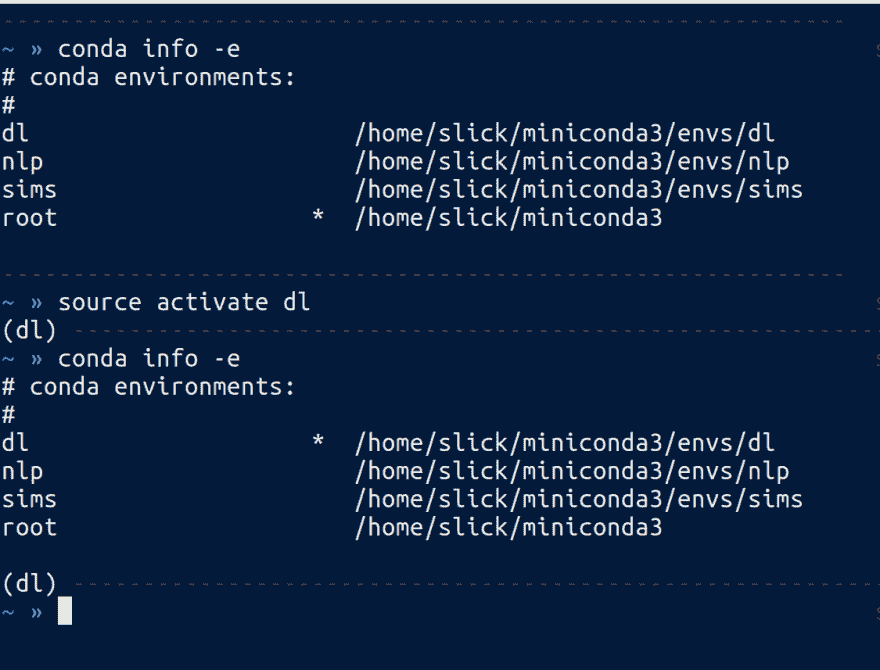

# 数据科学的简单 Python 环境🐍

> 原文：<https://dev.to/rgalbo/simple-python-environments-for-data-science--4pha>

对于数据科学家(或任何人)来说，Python 环境一直是 python 工作流中最令人困惑和讨厌的部分之一。最近，这条推文引起了我对环境缺乏清晰简明解释的注意:

虽然我不是 Jake VanderPlas，但我一直都在与 python 环境作斗争，并且明确地看到了对环境进行清晰而简明的解释的必要性。在这里，您可以找到一个简单的指南，解释什么是虚拟环境以及如何使它们工作。

### 目标

1.  解释 wtf 虚拟环境是❓
2.  解释如何创建和使用虚拟环境😆
3.  让 jupiter 笔记本在虚拟环境中运行

* * *

### WTF 是一个虚拟环境

Python 虚拟环境允许你费力地通过正在安装 python 包的 shitshow。有两个非常常见的 python 包管理器，数据科学领域的大多数人都使用`pip`和`conda`。

`pip`:从 python 包索引 [(PyPI](https://pypi.python.org/pypi) )安装包的 Python 工具

`conda`:anaconda python 发行版的包管理器，由于它的用户友好性，它已经迅速成为数据科学的事实(*免责声明:我使用 anaconda 作为我的 python 发行版*

用这些工具安装包可能很简单(有时),但我们都变得可怕和困惑。还有一个问题是包需要不同版本的相同依赖，或者包甚至不能与你正在使用的 python 版本一起工作。

这就是虚拟环境派上用场的地方。

**虚拟环境允许你创建不同版本的 python，并为你正在进行的每个项目提供特定的包**。当您创建一个新的虚拟环境时，您需要指定 python 的版本和软件包的版本，以防止那些我们都讨厌的可怕的导入错误。

### 创建和使用虚拟环境

现在，我们已经了解了虚拟环境，并认为它们非常重要，让我们来看两个创建和管理虚拟环境的工具。

#### [蟒蛇](https://www.anaconda.com/download/)

Anaconda 使用`conda`包管理器。有一个非常简单的 api 来创建环境。

```
$ conda create --name <environment_name> python=<version_of_python> 
```

这个命令将在 anaconda 目录`~/anaconda/envs/[environment name]/`中创建一个新环境。在创建 anaconda 环境时，您可以将包名作为参数:

```
$ conda create --name test_env --python=3 numpy pandas scikit-learn 
```

这将创建一个名为 test_env 的新环境，已经安装了包 numpy、pandas 和 sklearn。要使用您刚刚创建的全新环境，您只需运行:

**MAC/Linux:**T0】

**视窗:** `$ activate <environment name>`

在 conda 环境中，您可以`conda install`任何所需的软件包，或者如果这些软件包无法通过 conda 渠道获得，您也可以像平常一样`pip install`软件包。

要查看您当前环境中已安装的软件包，您可以运行`conda list`来打印软件包。

#### 我怎么知道自己在什么环境

要查看您的所有环境，请运行命令`conda info -e`，它将返回您的环境列表，并在当前环境旁边放置一个星号。当你激活你的虚拟环境时，它会改变你的提示，这样你的虚拟环境的名字就会出现在你的提示的开头。

[](https://res.cloudinary.com/practicaldev/image/fetch/s--Ni_8YGcN--/c_limit%2Cf_auto%2Cfl_progressive%2Cq_auto%2Cw_880/https://cdn-images-1.medium.com/max/1600/1%2A0chdhenef3K7qcAp7NDNUQ.png) 我在这里激活我的 conda 环境`dl`并运行 conda 信息

#### [Pipenv](https://docs.pipenv.org/)

如果你对权威开源有敌意，或者只是想使用简单的 PyPI 包，那么 pure python 中有一个新的选择。 **Pipenv** 是由 [Kenneth Reitz](https://twitter.com/kennethreitz) 提供的管理 python 虚拟环境的新酷小子。与面向科学计算的 Anaconda 不同，Pipenv 的构建考虑了 python 开发，特别是网络。这意味着它没有任何内置功能，但工作非常好，使用非常简单，而且它有一个非常漂亮的命令行界面。Pipenv 是为了替代`pip`和`virtualenv`而构建的，为 python 中的环境创建一个更简单的工作流。

创建环境非常简单:

```
$ pipenv install 
```

就是这样！这将创建一个虚拟环境并安装指定的软件包。这里需要注意一些事情，与在 anaconda 中创建环境不同，这里不需要设置名称。环境将只采用创建它的目录的名称。

要激活这个环境，你只需在项目目录中运行`pipenv shell` **，viola 就在你闪亮的新 Pipenv 中了。要将新的包安装到您的环境中，只需在项目活动时运行`pipenv install [package name]`。**

Pipenv 将包信息存储在一个名为`Pipfile`的文件中，看起来像这样:

```
$ pipenv install numpy pandas scikit-learn
```

```
$ cat pipfile
[[source]]
url = "https://pypi.python.org/simple"
verify_ssl = true
name = "pypi"

[packages]
numpy = "*"
pandas = "*"
scikit-learn = "*"
```

```
[dev-packages]
```

您还可以通过在活动环境中运行`pip list`来查看包信息。

### 安装和运行 Jupyter

现在，我们有了一些创建和管理虚拟环境的选项，我们将演示如何创建和使用这些环境来安装 jupyter 笔记本电脑，并为数据科学行动做好准备。

#### 巨蟒与蟒蛇

通过运行三个命令，我们可以让 jupyter 笔记本在一个准备就绪的环境中运行。

```
# create the environment
$ conda create -n jupyter_env python=3 jupyter
```

```
# activate the environment (mac/linux version)
$ source activate jupyter_env
```

```
# launch a notebook server in our env
$ jupyter notebook
```

仅此而已！超级简单，超级简洁，而且“管用”,这将为你在运行模型或制作漂亮的数据图片之前需要做的所有超级有趣的数据管理节省时间。现在，任何时候你想在 jupyter 笔记本上工作，你只需激活环境，并在你选择的项目中启动它。

#### Jupyter 与 Pipenv

与 anaconda 类似，我们可以非常简单地创建一个 Pipenv。

```
# create a project directory
$ mkdir jupyter_project
```

```
# change into the project directory
$ cd jupyter_project
```

```
# create your pipenv
$ pipenv install jupyter
```

```
# activate the environment
$ pipenv shell
```

```
# launch a notebook server in our env
$ jupyter notebook
```

只需再走两步，但这就是我们启动并运行 pipenv 所需的全部内容。pipenv 的好处是我们可以使用 pip 来安装它。

**注意-**Pipenv 最大的缺点是 cli 不允许全局环境访问，这意味着你不能从任何地方运行`$ pipenv shell`，它只能在项目文件夹内工作。然而，所有的环境都位于目录`~/.local/share/virtualenvs/`中，因此要从其他目录中激活它们，您只需运行:

```
# list the virtual environments
$ ls `~/.local/share/virtualenvs/`
```

```
# activate the environment from afar$ source ~/.local/share/virtualenvs/[environment_name]/bin/activate 
```

### 未来的岗位🔮

既然我们已经介绍了为数据科学设置简单环境的基础知识，那么还有一些其他重要的主题要介绍。其中之一是与他人共享您的环境，以便他们可以复制您的代码并与您的研究进行互动。另一个重要的工具是 jupyter 笔记本本身。Jupyter 笔记本有许多未被充分利用的功能，使机器学习项目变得更加简单。

* * *