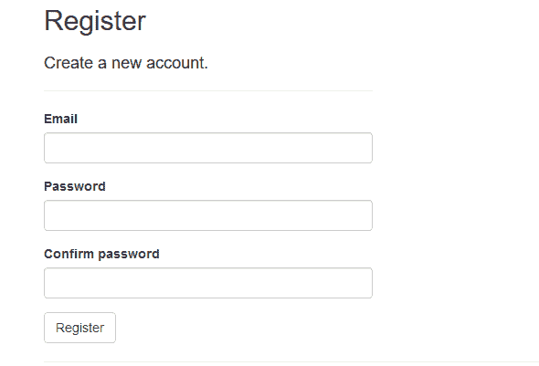

# SignalR 核心 python 客户端(II):身份验证

> 原文：<https://dev.to/mandrewcito/singlar-core-python-client-ii-authentication-3k59>

# [T1】简介](#intro)

正如我在[上一篇文章](https://dev.to/mandrewcito/singlar-core-python-client-58e7)中介绍的，我的库的下一步是在 SignalR 核心集线器上进行认证。这种认证的一个很好的指南和例子是: [aspnet docs](https://docs.microsoft.com/en-gb/aspnet/core/signalr/authn-and-authz?view=aspnetcore-2.2) 。你可以在他们的 [github](https://github.com/aspnet/Docs/tree/master/aspnetcore/signalr/authn-and-authz/sample) 上下载完整的工作示例。

介绍完了，我们去操场吧:

# 服务器端

## 快速修复，记忆数据库

在本例中，在磁盘上创建数据库...别管闲事

转到 Startup.cs，注释 UseSqlServer，添加 UseInMemoryDatabase

```
...
        public void ConfigureServices(IServiceCollection services)
        {
            services.AddDbContext<ApplicationDbContext>(options =>
               //  options.UseSqlServer(Configuration.GetConnectionString("DefaultConnection")
            options.UseInMemoryDatabase()   
        );
... 
```

Enter fullscreen mode Exit fullscreen mode

## 在 web 上创建用户

[](https://res.cloudinary.com/practicaldev/image/fetch/s--9tWBRXGK--/c_limit%2Cf_auto%2Cfl_progressive%2Cq_auto%2Cw_880/https://thepracticaldev.s3.amazonaws.com/i/2fa9q035n0n34e1u45if.PNG)

# 客户端

## 首先，获取 auth 令牌

这个例子的 Post 请求是一个表单数据，响应是一个 JSON。

```
def signalr_core_example_login(url, user, username_password):
    response = requests.post(url, data={"email": user, "password": username_password})
    return response.json()["token"] 
```

Enter fullscreen mode Exit fullscreen mode

## 建立连接并添加信号事件处理程序

```
token = signalr_core_example_login(login_url, username, password)
hub_connection = HubConnection(
    server_url,
    token=token,
    negotiate_headers={"Authorization": "Bearer " + token})

hub_connection.build()
hub_connection.on("ReceiveSystemMessage", print)
hub_connection.on("ReceiveChatMessage", print)
hub_connection.on("ReceiveDirectMessage", print)
hub_connection.start() 
```

Enter fullscreen mode Exit fullscreen mode

现在您已经初始化了连接，可以通过 signalr hubs 发送消息 auth 了。
[充分例证](https://github.com/mandrewcito/signalrcore/blob/master/test/chat_auth.py)

# 未来

*   信息包
*   Auth(现在仅通过 querystring negotiate 工作)

# 链接

[Github](https://github.com/mandrewcito/signalrcore)
[Pypi](https://pypi.org/project/signalrcore/)

我试图用最简单的方法建立这个库，所以如果你认为有更好的方法，请留下评论。我会尽快编辑 github 库贡献部分，所以任何贡献都是受欢迎的。有很多工作要做。流..

感谢您的阅读，并在:D 下面写下您的任何想法