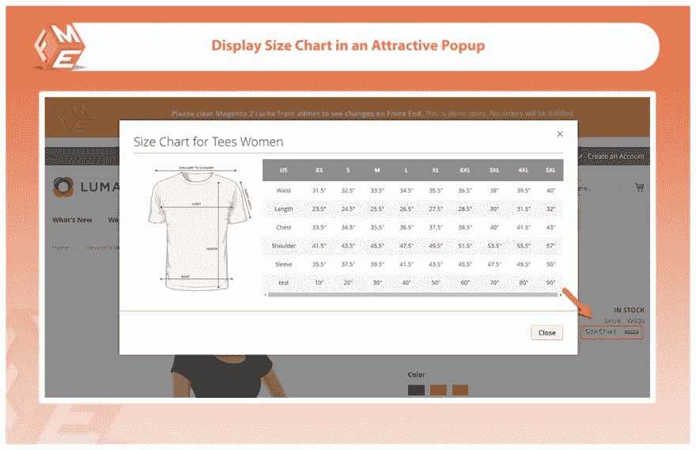
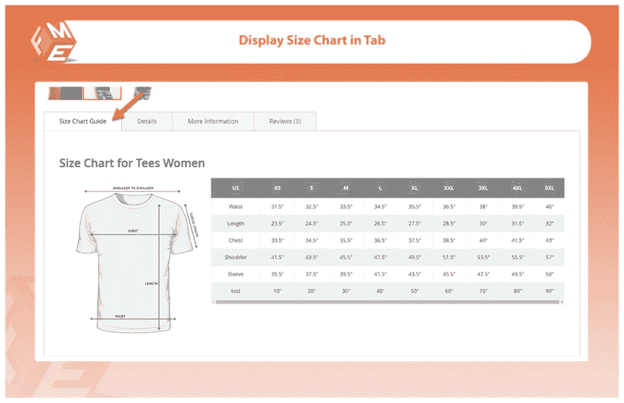
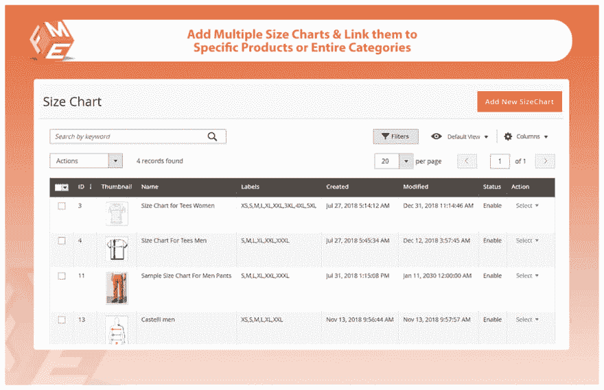
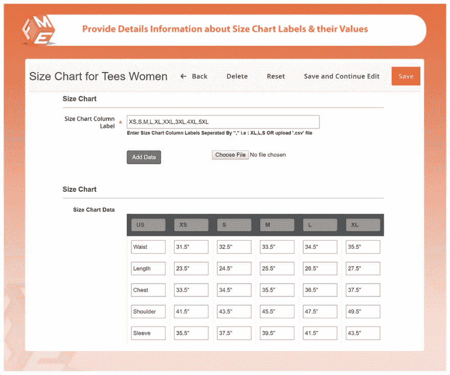
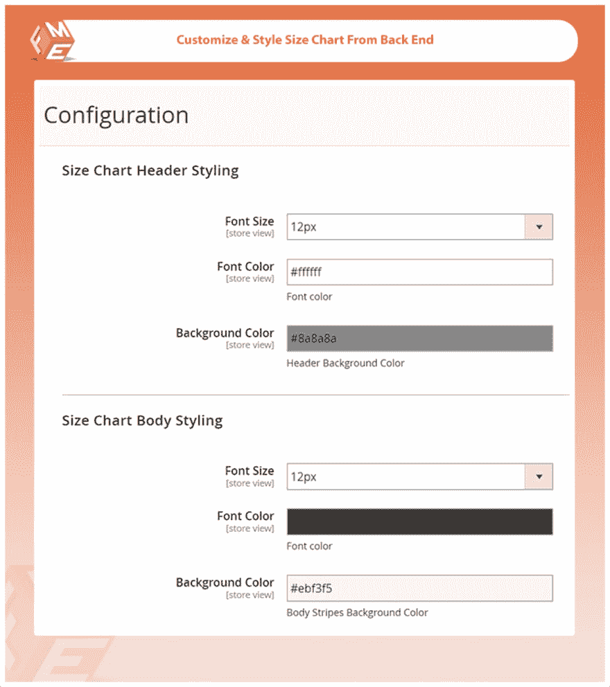

# Magento 2 的尺寸图表

> 原文：<https://dev.to/simonwalkerfme/size-charts-for-magento-2-2ipp>

帮助你的顾客购买他们想要的完美尺寸的产品。通过使用这个扩展，您可以自定义尺寸图表，将它们分配给特定的产品，限制它们存储和控制它们在特定产品上的显示。您可以显示弹出窗口或通过单独的产品选项卡。

您可以为类别、产品及其属性创建和自定义无限数量的大小图表。

### **主要特征**

1.  为产品创建和定制尺寸图表
2.  设置条件以将尺寸图表分配给特定产品
3.  上传尺寸指南图像并添加图表数据
4.  在选项卡或弹出窗口中显示尺寸图表
5.  限制图表大小以存储视图
6.  导入图表数据

#### **创建&定制产品尺寸图**

您可以创建和自定义大小调整指南正文的字体大小、字体颜色和背景颜色。您可以使用以下选项个性化图表。

*   添加新大小的聊天
*   指定图表名称大小
*   设定优先级
*   启用或禁用图表
*   上传尺寸图表的图像

#### **设置将尺寸图表分配给特定产品的条件**

选择与产品属性相关的条件。

#### **上传尺寸指南图片&添加图表数据**

您可以上传显示产品尺寸的图像，或者按行和列配置数据

#### **在选项卡或弹出窗口中显示尺寸图表**

通过使用此扩展，您可以帮助您的客户在弹出窗口或单独的产品标签中查看尺寸指南。

#### **限制图表大小以存储视图**

您可以对特定商店视图设置尺寸图表限制，您可以阻止其他地区的顾客查看您的产品尺寸指南。

#### **导入图表数据**

您可以通过 CVS 文件从另一个源导入每一行和每一列的数据，以便在您的商店中进行配置。

### **更**

*   45 天退款
*   免费终身升级
*   2 分钟安装
*   由 Magento 认证开发人员开发
*   免费终身支持

**欲了解完整详情，请访问**

**[magento 2 size chart](https://marketplace.magento.com/fme-size-chart.html)**

