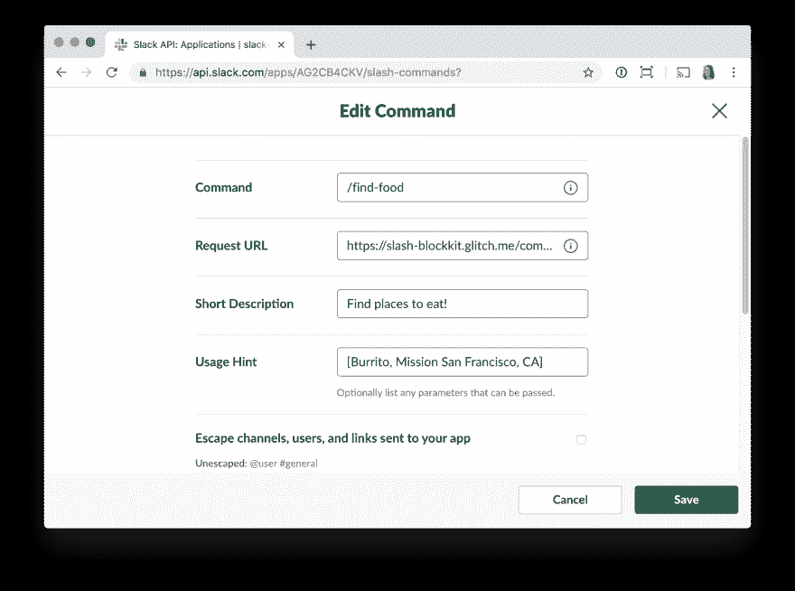
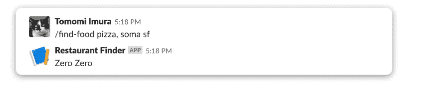
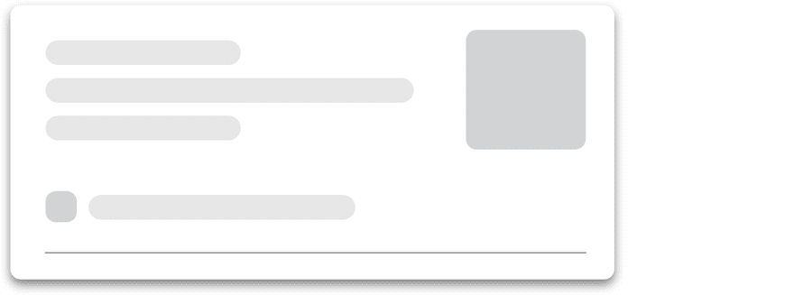
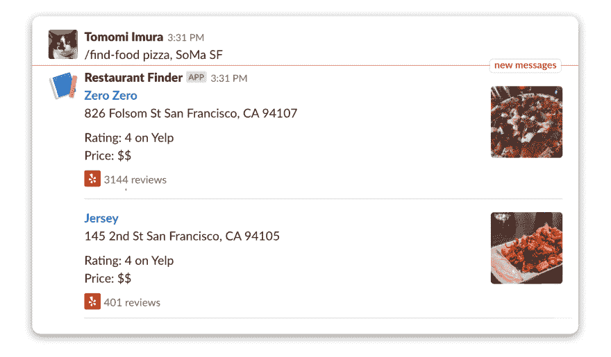

# [Slack API 教程]使用块工具包构建上下文餐馆搜索斜杠命令结果

> 原文：<https://dev.to/girlie_mac/slack-api-building-contextual-restaurant-search-slash-command-results-with-block-kit-6ob>

我们刚刚[发布了](https://medium.com/slack-developer-blog/block-party-d72c70a01911) Block Kit，这是一个 UI 框架，可以让你在 Slack 中构建丰富的交互式体验。这为您的应用程序提供了更多选项来显示每条消息中的信息，例如，任务或投票结果等列出的信息。

通过 Block Kit，您可以使用可视化工具 [Block Kit Builder](https://api.slack.com/tools/block-kit-builder) 构建原型，并使用该工具生成的 JSON 字符串实际构建应用程序发送的消息。

本教程将引导您使用 Block Kit 构建消息，以改善应用程序中搜索结果的用户体验。

### 先决条件

本指令使用 Node.js 向您展示如何构建一个斜杠命令，以丰富的消息格式显示结果。建议使用 JavaScript 或其他编程语言的基本编码经验来完成本教程。

您需要的源代码在 Glitch 上，您可以“重新混合”并运行它，而无需部署代码！

🎏🥫[毛刺上的源代码](https://glitch.com/edit/#!/slash-blockkit)

🎏🍴[重新混合(分叉)故障报告](https://glitch.com/edit/#!/remix/slash-blockkit)

此外，为了让示例应用程序更有趣，我们使用了 [Yelp API](https://www.yelp.com/developers) ，它要求您注册以获得 Yelp 客户端 ID 和 API 密钥。Yelp 的 API 的详细信息可以在[这里](https://www.yelp.com/developers)找到。

让我们从用户如何与该应用程序交互的演练开始:

用户发送斜线命令，`/find-food [a type of food], [location proximity]`(例如`/find-food burrito, Mission San Francisco` )
你的 app 响应命令，显示三个附近的餐厅结果。

## 响应斜线命令

在本练习中，我们将创建一个斜杠命令，用户可以发送`/find-food`命令来获得一些餐馆的列表作为结果。

### 设置应用程序

首先，进入 [Slack 应用配置页面](https://api.slack.com/apps)创建一个应用。然后添加斜杠命令特性并定义你的命令。对于这个教程，我们姑且称之为`/find-food`。用户可以通过命令传递的参数是食物类型和地点，用逗号分隔，如`/find-food bao, Chinatown NYC`。

您的请求 URL 应该是`https://your-server/route`。如果你在 Glitch 上[“重新混合”这个项目，你将得到一个由两个随机单词组成的项目名称，你的请求 URL 将类似于`https://sassy-shrimp.glich.me/command`](https://glitch.com/edit/#!/remix/slash-blockkit)

[](https://res.cloudinary.com/practicaldev/image/fetch/s--oBPxxdtN--/c_limit%2Cf_auto%2Cfl_progressive%2Cq_auto%2Cw_880/https://a.slack-edge.com/11d0a/img/api/articles/blockkit/config_edit_command.png)

然后，在**设置>基本信息**获取您的签名密钥。

密钥应该存储在**中。env** 文件，以及 Yelp 凭证。

```
SLACK_SIGNING_SECRET=fca39e3de...
YELP_CLIENT_ID=sIskJpLm5f...
YELP_API_KEY=ySz84qKNl... 
```

(如果您正在尝试重新混合 Glitch 示例，请将本报告中的. env.sample 重命名为**。env** ，用你的凭证填写！)

在 Node.js 代码中，包含依赖项并运行 Express 服务器，同时获取原始请求负载以验证您的签名秘密。(关于这个安全特性的更多细节，请参考前面教程中的[验证请求部分):](https://medium.com/slack-developer-blog/tutorial-developing-an-action-able-app-4d5455d585b6) 

```
const express = require('express');
const bodyParser = require('body-parser');
const axios = require('axios');
const signature = require('./verifySignature');

const app = express();

const rawBodyBuffer = (req, res, buf, encoding) => {
  if (buf && buf.length)  req.rawBody = buf.toString(encoding || 'utf8');
};

app.use(bodyParser.urlencoded({verify: rawBodyBuffer, extended: true }));
app.use(bodyParser.json({ verify: rawBodyBuffer }));

const server = app.listen(process.env.PORT || 5000); 
```

### 发送简单消息

接下来，使用 HTTP POST 方法路由创建一个端点来接收 slash 命令负载。一旦你收到一个有效载荷，检查请求是否来自 Slack(否则，你可能会受到一些恶意攻击！).如果这是一个有效且安全的请求，解析 user-send 参数以获得查询，在本例中是食物类型和位置。

然后，将查询传递给 Yelp API 以获得结果。

```
app.post('/command', async (req, res) => {

  if(!signature.isVerified(req)) {
    res.sendStatus(404);     
    return;

  } else {
    const query = req.body.text ? req.body.text : 'lunch, San Francisco';
    const queries = query.split(',');
    const term = queries.shift(); // "Pizza" 
    const location = queries; // "San Francisco, CA"
    const places = await getPlaces(query, location);
  }

  const message = { // will generate it }
  res.json(message);
} 
```

`getPlaces()`返回数组中的结果。(参见函数的源代码。)
从 Yelp REST API 返回的数组如下所示(注意:这里显示的结果是本教程的简化版):

```
[{ 
 name: 'Zero Zero',
 image_url:
  'https://s3-media2.fl.yelpcdn.com/bphoto/JB5XNOgdQHocE4nI9DHWkA/o.jpg',
 url:'https://www.yelp.com/biz/zero-zero-san-francisco',
 review_count: 3128,
 rating: 4,
 price: '$$',
 location:
  {
    display_address: [ '826 Folsom St', 'San Francisco, CA 94107' ] },
    phone: '+14153488800'
 }...
] 
```

用一个简单的消息公开回复用户，你只需要用一个简单的 JSON 发送一个 HTTP 200。例如，只需用结果数组中的一个餐馆名称进行响应:

```
const message = {
    response_type: 'in_channel',
    text: places[0].name,
}; 
res.json(message); 
```

这个 JSON 响应将显示如下消息:

[](https://res.cloudinary.com/practicaldev/image/fetch/s--7bEdlcVA--/c_limit%2Cf_auto%2Cfl_progressive%2Cq_auto%2Cw_880/https://a.slack-edge.com/11d0a/img/api/articles/blockkit/slack_message_simple.png)

## 屏蔽您的信息

现在，让我们利用新的 Block Kit 元素来发送一条更具上下文关系的消息。

积木套件由可堆叠积木组成，您可以混合搭配[布局积木和积木元素](https://api.slack.com/messaging/composing/layouts)来构建信息。

我们将使用 Block Kit 重新格式化我们刚刚创建的 JSON 消息，以将纯文本显示为这种富消息格式:

[](https://res.cloudinary.com/practicaldev/image/fetch/s--2lB1rI6x--/c_limit%2Cf_auto%2Cfl_progressive%2Cq_66%2Cw_880/https://a.slack-edge.com/11d0a/img/api/articles/blockkit/blockkit_message.gif)

您可以使用可视化原型沙盒 [Block Kit Builder](https://api.slack.com/block-kit-builder) 或通过在浏览器上挑选和排列所有可用的块来设计消息。

如果从左侧单击每个块，右侧会生成 JSON 数组供您在代码中使用:

[](https://res.cloudinary.com/practicaldev/image/fetch/s--7ZTA1Rhp--/c_limit%2Cf_auto%2Cfl_progressive%2Cq_66%2Cw_880/https://a.slack-edge.com/11d0a/img/api/articles/blockkit/blockkit_builder.gif)

让我们将 JSON 数组引入到您的`message`对象中来替换之前的数组。将显示`text: places[0].name`的行替换为块数组:

```
const message = {
  response_type: 'in_channel',   
  blocks: [
    // Result 1
    {
      type: 'section',
      text: {
        type: 'mrkdwn',
        text: `*<${places[0].url}|${places[0].name}>* \n${places[0].location.display_address.join('  ')} \n\nRating: ${places[0].rating} \nPrice: ${places[0].price}`
      },
      accessory: {
          type: 'image',
          image_url: `${places[0].image_url}`,
          alt_text: 'venue image'
        }
      },       
      {
        'type': 'context',
        'elements': [
          {
            'type': 'plain_text',
            'text': `${places[0].review_count} Yelp reviews`,
            'emoji': true
          }
         ]
      },
      {
        'type': 'divider'
      },
   }
  ]
}; 
```

当您将文本类型设置为`mrkdwn`时，您可以使用一些 markdown 功能来格式化您的文本，例如粗体和斜体文本以及超链接文本等。你可以在[消息撰写概述](https://api.slack.com/messaging/composing)中阅读更多关于文本格式的内容。

现在在 Slack 客户机上尝试 slash 命令，tada，现在您有了一个更好的、更有上下文的消息作为响应！

[](https://res.cloudinary.com/practicaldev/image/fetch/s--WljMzNvl--/c_limit%2Cf_auto%2Cfl_progressive%2Cq_auto%2Cw_880/https://a.slack-edge.com/2619f/img/api/articles/blockkit/slack_message_blockkit.png)

哒哒！现在 Yelp 结果显示得很好了！

### 还能怎么发丰富的消息？

现在您已经创建了一个丰富的消息作为对 slash 命令的响应，您可以使用各种方法发送消息，比如传入 webhooks，以及通过 WebAPI 使用`chat.postMessage`和`chat.postEphemeral`发送应用内消息，包括对消息操作和丰富交互的响应。

## 最佳实践

我们鼓励您使用 Block Kit Builder 构建富有创意和想象力的消息块，但是，您必须始终首先考虑您的用户。最重要的是，你的信息必须易于阅读。避免打乱对话，不要在一条信息中加入太多内容。此外，有效地使用交互式 UI 元素，如按钮和菜单。

首先，使用 Block Kit Builder 构建一个消息 UI 原型，尝试多种模式并在移动设备上进行测试。

* * *

我希望这篇教程能帮助你得到一些关于构建什么的想法，或者修改你现有的 Slack 应用！

如果你遇到任何麻烦，可以找我、 [@girlie_mac](https://www.twitter.com/girlie_mac) 或者 [@SlackAPI](https://www.twitter.com/slackapi) ，或者联系我们在[developers@slack.com](mailto:developers@slack.com)的开发者支持团队。快乐发展！🤖