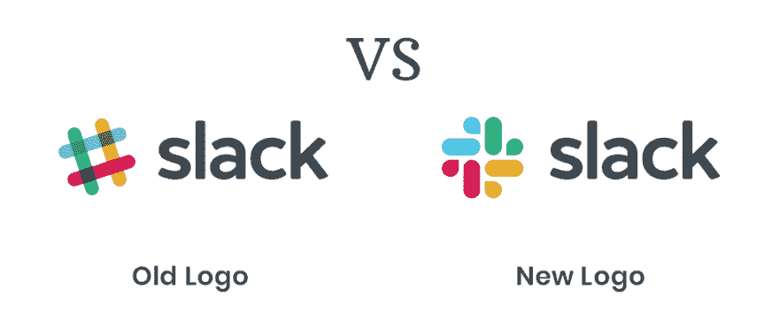

# 松弛标志:新与旧-你需要知道的一切:

> 原文：<https://dev.to/briannacastroa/slack-logo-new-vs-old-all-you-need-to-know-4hka>

## 流行团队协作:

 
[团队协作工具](https://www.troopmessenger.com/blogs/the-9-slack-alternatives-to-choose-from) Slack，最近换了官方 logo。随着应用程序在最近获得了大量的粉丝，新的 slack 标志已经成为网络空间的一个讨论话题。对新标志有各种各样的意见。虽然有些人认为它更加复杂和经典，但其他人则表示新标志非常普通。这导致了互联网分为旧的 slack 标志和新的 slack 标志。虽然可能会有不同的意见，但在考虑任何品牌的标志时，都必须考虑一些重要的事情。

# 对标志的影响:

### 容易识别:

一个标志不仅仅是任何品牌的一个符号或者一个必须和商标一起出现的图片。人们经常会误解一个标志在推广一个品牌中的重要性，尤其是在网络空间中。因此，对于任何标志来说，提供品牌和易于识别是很重要的。现在， **slack logo** 已经从哈希符号(左 logo)变成了同色组合的新符号(右 logo)。很明显，设计师一直在努力打造一个更时尚的标志。然而，在某个地方，原始标志的创意并没有反映到新的标志中。

### 独特的站立点:

除了要满足的许多参数，当我们谈论旧 slack 徽标与新 slack 徽标时，最重要的特征之一是它所包含的独特观点。人们立即爱上哈希标志的原因是它的简单性带来了一种现代感。新的标志，在某种程度上更花哨，不知不觉地模仿了许多其他更受欢迎的品牌，这些品牌的标志已经深入人心。举例来说，微软的标志有四种相同的颜色。甚至谷歌也使用类似风格的各种动画。现在，这些都是非常著名的品牌，因此，它们的受欢迎程度几乎没有什么不同。然而，slack 可能会因为试图变得更加复杂而陷入阴影。

### 人气:

一些专家质疑该品牌现在改变标识的决定。很明显，Slack 正走在一条通往流行的艰难道路上。这通常被认为是一个至关重要的阶段，品牌面貌的任何变化都会引起广泛的注意。经常有人建议，为了给用户一种新鲜感，把事情稍微改变一下。然而，在这种情况下， [slack 标志](https://slackhq.com/say-hello-new-logo)似乎与大多数追随者不太相关。千禧一代和当代人群构成了 slack 的大部分粉丝群。随着新标志的出现，这些成员无法与现代氛围相联系。因此，引入新 slack 标志的决定受到了广泛质疑。

互联网上的模因:

互联网是一个讽刺的地方，它用许多幽默迎接新的标志。这是一些令人捧腹的对新标志的回应，你必须阅读！
-有人将旧的 slack 标志与新的 slack 标志进行比较，好像从一个酷而古怪的东西变成了一个药店品牌的翻版。
另一条爆笑的推文称，这个标志看起来像一对缝在一起的鸭子！
——还有一个人称之为一系列色彩缤纷的喷水表情符号！或者异想天开的纳粹党徽！这些令人捧腹的回复和新的 slack 标志模因还在继续。伴随着这些咯咯的笑声，人们不禁会想，这个品牌是在重新考虑自己的决定，还是只是持保留态度！

Slack 对此有什么看法？

现在，当务之急是该品牌对其新标志的出现有什么看法。当被问及同样的问题时，该公司实际上给出了一个非常合理的答案。他们说旧标志是在公司正式成形之前设计的。因此，作为一种自然的事态，他们没有得到太多的时间来考虑与旧标志的所有方面。备受赞赏的旧徽标的颜色组合方案和设计实际上造成了在不同平台上不兼容的问题。俏皮古怪的 octothorpe 标志由 11 种不同的颜色组成，因此很难在各种色调上叠加。他们经常需要调整 logo，为不同的背景设计不同的版本，以增加可见性。这并不总是可取的，因为没有一致性，这正是标志的目的。当人们看到这些实际问题时，新 slack 标志的决定终于有了意义。
无论如何，尽管大多数来源的评论褒贬不一，但该标志已经推出，甚至得到了少数人的赞赏。如果它有助于品牌创造统一的状态，那么人们只能希望它尽力而为。围绕新标志的种种猜测，只有时间才能证明它是否能获得预期的好处。

* * *