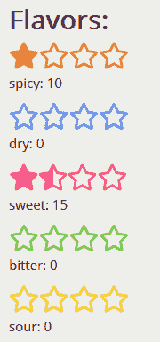
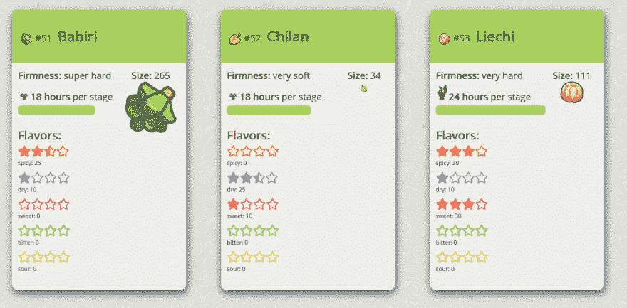

# 小项目反射:React、TypeScript 和 PokéAPI

> 原文：<https://dev.to/misnina/small-project-reflection-react-typescript-and-pokeapi-2gmk>

项目[在这里](https://misnina.github.io/berry-display/)

#### 100 天代码第 8 - 10 天

这是一篇个人反思文章，详细描述了我创建两天半项目的过程，这是一个使用 PokéAPI 的 Pokemon Berry 统计页面！快速说明一下，我是一名初级程序员，所以如果你认为我做了一些奇怪的事情，请告诉我。这篇反思文章是为了让我能够扩展我的思维过程，并尝试巩固我所学到的东西。

* * *

### 目标

*   使用 API 来收集和可视化显示数据
*   使用来自一个 API 的数据来查找另一个条目并获取数据
*   学习 TypeScript/用它来反应

### 计划好的功能

*   风味水平
*   相对尺寸标度
*   生长周期显示带计时？

### 虫子&感慨

*   Chrome 上没有显示一天中的增长时间
*   ~~setInterval 计时怪异？？~~让它与感觉像黑客一样的东西一起工作
*   没有拍摄过程中的截图
*   不使用 CSS 过渡/没有交互性

* * *

# 打字稿

这是我第一次没有直接按照教程来介绍一个概念或语言。我已经知道了 C#的基础，所以我只是找到了在 React 设置中使用的 TypeScript 的例子，并通过搜索我得到的错误来工作。这是我的理解。

在 TypeScript 中，必须键入所有变量。很简单。你需要知道有哪些类型的产品。嗯，这并不总是最容易的。当处理传递给州政府的大量数据以查找我的浆果时，它变得很麻烦，并且必须定义它的每个部分都有什么。也许我做错了，但是从我所看到的来看，我必须给事物下两次定义。一次在接口中，然后再一次在构造函数中给出初始值。我实话实说，我不知道界面更深层次的含义，只是需要有序的定义你的状态和道具。

生长周期成分:

```
import React, { Component } from 'react';

interface IProps {
  id: number,
  growth_time: number
}

interface IState {
  timer: any,
  stage: string,
  x: number
}

class Growth extends Component<IProps, IState> {
  constructor(props: IProps) {
    super(props);
    this.state = {
      stage: '/growth/AllTreeSeed.png',
      timer: setInterval(this.setTimer, 0),
      x: 1
    }
  }

  render() {
    const { stage } = this.state;
    return (
      
    )
  }

  setTimer = () => {
    if (this.props.growth_time != 0) {
      clearInterval(this.state.timer);
      this.setState({ timer: setInterval(this.changeDisplay, 1000 * this.props.growth_time) });
    }
  }

  changeDisplay = () => {
    if (this.state.x >= 5) {
      this.setState({ x: 0 });
    }
    switch (this.state.x) {
      case 0: this.setState({ stage: `${process.env.PUBLIC_URL}/growth/AllTreeSeed.png` }); break;
      case 1: this.setState({ stage: `${process.env.PUBLIC_URL}/growth/AllTreeSprout.png` }); break;
      case 2: this.setState({ stage: `${process.env.PUBLIC_URL}/growth/${this.props.id}Taller.png` }); break;
      case 3: this.setState({ stage: `${process.env.PUBLIC_URL}/growth/${this.props.id}Bloom.png` }); break;
      case 4: this.setState({ stage: `${process.env.PUBLIC_URL}/growth/${this.props.id}Berry.png` }); break;
    }
    this.setState({ x: this.state.x + 1 })
  }

  componentWillUnmount() {
    clearInterval(this.state.timer);
  }
}

export default Growth; 
```

Enter fullscreen mode Exit fullscreen mode

### 设置间隔&黑客

这样做的目的是根据生长所需的时间，生长周期图形更新得更慢。每个“小时”是 1 秒。

刚刚解决了我之前遇到的问题，当我写这篇文章的时候，我不能让它搁置。最初我将状态中的计时器设置为 5000 * this.props.growth_time，但问题是在我的包含组件中，当初始化我的值时，growth time 被设置为 0。因此，当组件开始时，间隔设置为每 0 毫秒更新一次，并且会疯狂地更新，直到我们清除那个计时器并启动一个新的计时器。这个问题以前一直存在，我需要在收到正确的属性后更新一个函数，但是 componentDidUpdate()现在允许我设置一个状态，因为它会导致一个递归，并且是默认的。同样，虽然它不会完全出错，但在 render 函数中调用 setTimer 会在每次渲染时警告您尝试更新内容。

解决方案，感觉像一个黑客，是继续调用 setInterval(因为原来的计时器被设置为 0)直到我们收到 growth_time 道具而不是 0，一旦它有了它的道具(或者说道具是我想要的)清除间隔，因为我知道即使我改变计时器状态，它也会继续运行，并为 changeDisplay 设置一个新的间隔。

* * *

# 数学

呃，数学。我会说我太蠢了，学不会数学，但这就是我对编码的看法，现在看看我在哪里！然而，我仍然在为许多事情的最佳解决方案而奋斗，即使是简单的事情，所以让我们一步一步来完成它。

[](https://res.cloudinary.com/practicaldev/image/fetch/s--WGEtduk7--/c_limit%2Cf_auto%2Cfl_progressive%2Cq_auto%2Cw_880/https://thepracticaldev.s3.amazonaws.com/i/gb1uek17jdwj2qx6n073.PNG)

从 API 中，我们得到一个数值为/40 的效价。对于每种口味的浆果，这个数字要么是 10，要么是 5，所以根据我们的表示，我们可以得到半颗星。我们将有一个值为 10 分的星星，所以我们取出效力，除以 10，得到 1 的位置，以及我们将有多少填充和半填充的星星，尽管被命名为 fullStars。星星是用 for 循环执行的，所以如果我们超过 0 . 5，我们仍然会创建另一个星星。

为了确定我们是否有一个半星形，我们使用模运算符来查看当除以 10 时，我们是否有余数？使用三元运算符(花哨的小 if 语句)如果余数为 0 (false)，我们说我们没有半颗星。如果余数是任何不为 0(真)的数，我们知道我们有一个半星。

我们用剩下的来计算空星，然后用另一个三元运算符来看看是否有半星。如果有，我们想用它来替换其中一颗完整的星星。

```
 let potency = this.props.potency;
    let fullStars: number = potency / 10;
    let halfStars: number = potency % 10 ? 0 : 1;
    let emptyStars: number = 4 - fullStars;
    halfStars ? null : fullStars--; 
```

Enter fullscreen mode Exit fullscreen mode

* * *

# 口袋 API

我已经使用了 [PokéAPI](https://pokeapi.co/) 来收集大部分的浆果数据。我手动保存了(200 多张)生长周期和大小比较的图像，但实际上我是通过用 axios 链接 get 请求来获得浆果图标的。浆果信息与浆果的商品列表是分开的，商品列表包含了它的商品图像的 url。

```
 fetchBerry() {
    axios.get(`https://pokeapi.co/api/v2/berry/${this.props.berryID}`)
      .then(res => {
        this.setState({ info: res.data });
        return axios.get(`${this.state.info.item.url}`)
      }).then(res => {
        this.setState({ item: res.data });
      })
  } 
```

Enter fullscreen mode Exit fullscreen mode

* * *

# 设计

[](https://res.cloudinary.com/practicaldev/image/fetch/s---0Q-Af9N--/c_limit%2Cf_auto%2Cfl_progressive%2Cq_auto%2Cw_880/https://thepracticaldev.s3.amazonaws.com/i/fuwwaoj0rsgjod2j6jgf.PNG)

我看到过一些争论，关于你是否应该把你的 CSS 嵌入到你的代码中，或者把它放在它自己的文件之外。我想我更喜欢在它自己的文件之外，但是我发现内联声明动态样式更方便。对于每个浆果的大小，我们给了一个数字，我直接把它转化为图像的高度，然后除以 3，这样一些最大的就不会破坏设计。您仍然会得到非常小的浆果，但是只要关系大小相同，我认为这是没问题的，只要我们有图标精灵来显示它的预期设计。

```
  
```

Enter fullscreen mode Exit fullscreen mode

* * *

# 接下来是什么？

我需要加强我的 CSS 动画技能，所以我需要一些互动的东西，但我还不确定是什么。我采用了在这里的评论中找到的一个建议的符号，所以我一直在跟踪我想学的东西和我或我的朋友有什么项目想法。我阅读了关于 VSCode 的 live share，并与我的好朋友/导师一起试用了它，对此我感到非常兴奋！

[](/lostintangent) [## Localhost 不再是本地的了

### 乔纳森·卡特 3 月 26 日 1915 分钟阅读

#webdev #javascript #beginners #productivity](/lostintangent/localhost-isnt-local-anymore-2ib6)

我们在没有它的情况下结对编程已经有一段时间了，但是我真的很想和她用这个做一些项目，我必须想出一个好主意！

[](https://res.cloudinary.com/practicaldev/image/fetch/s--vaM6R8mB--/c_limit%2Cf_auto%2Cfl_progressive%2Cq_auto%2Cw_880/https://thepracticaldev.s3.amazonaws.com/i/styyivk1dj830uialer3.PNG)