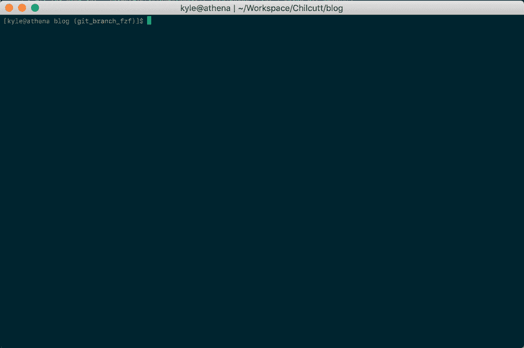

# 使用 fzf 实现更智能的 git 结账

> 原文：<https://dev.to/chilcutt/smarter-git-checkout-with-fzf-2k5n>

在我为一个项目工作了一段时间后，我倾向于有一个工作的多个分支的列表。当在一个项目的分支之间跳转时，我的工作流程通常是这样的:

1.  `git branch`
2.  找到我要跳转到的分支
3.  在终端中突出显示分支名称
4.  复制分支名称
5.  用`git checkout <paste>`检查分支

[](https://res.cloudinary.com/practicaldev/image/fetch/s--5T_XsFMJ--/c_limit%2Cf_auto%2Cfl_progressive%2Cq_66%2Cw_880/https://blog.chilcutt.com/assets/2019-05-30-fzf_git_branch/gitbranch.gif)

这还不算太糟，但还能更好吗？

* * *

我已经使用 [`fzf`](https://github.com/junegunn/fzf) 在命令行和 vim(作为 ctrlp 的替代品)中加速了我的工作流一段时间，但是最近我想到你也可以用[将`fzf`转换成一个命令](https://medium.com/@sidneyliebrand/how-fzf-and-ripgrep-improved-my-workflow-61c7ca212861)。

这非常有用，因为您可以使用它来创建一个特殊的 UI，以便在命令中进行选择。

* * *

`fzf`工具给了我们一些新的灵活性，现在我不需要用鼠标剪切和粘贴我想要的分支名称，我可以用`fzf`选择分支名称。

经过一点点的实验，我想到了:

```
$ git for-each-ref --format='%(refname:short)' refs/heads | fzf | xargs git checkout 
```

[](https://res.cloudinary.com/practicaldev/image/fetch/s--v-elHhOF--/c_limit%2Cf_auto%2Cfl_progressive%2Cq_66%2Cw_880/https://blog.chilcutt.com/assets/2019-05-30-fzf_git_branch/gitcof.gif)

这一行代码使用`for-each-ref`，一个用于脚本编写的低级命令，来获得存储库中所有本地分支的列表，没有任何修饰。结果通过管道传输到`fzf`，在那里我们可以选择我们想要的分支，最后结果通过`xargs`传递，这样我们就可以`git checkout`分支。

最后一步是将它封装在一个 git 中，这样我就可以从我的 gitconfig 中获得它。

```
$ git config --global alias.cof $'!git for-each-ref --format=\''%\(refname:short\)\'' refs/heads | fzf | xargs git checkout' 
```

在上面，我已经为“模糊结账”配置了`cof`,并且使用了 bash 转义字符，所以你不必这样做。