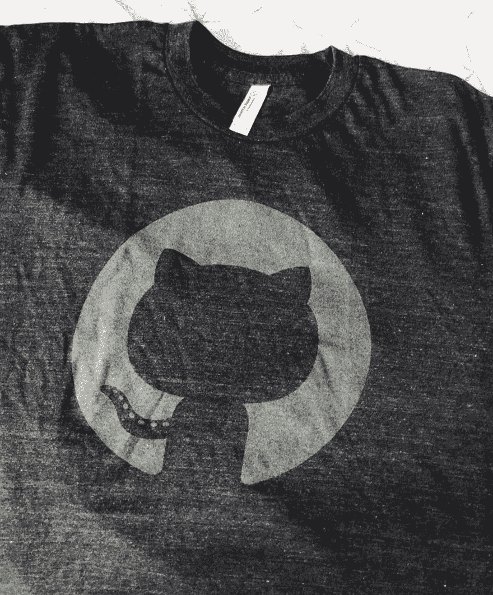

# 那么 GitHub 为什么要送我这件 t 恤呢？

> 原文：<https://dev.to/ketacode/so-why-did-github-send-me-this-t-shirt-l4p>

那么@github 为什么要给我发这件 t 恤呢？故事是这样的，为什么他们这么棒。

不久前，我创建了一个改进 GitHub 的 Chrome 扩展。他们已经看到了，也注意到我用他们的标志作为扩展的标志。

这是不允许的，他们已经伸出手，并要求我改变标志。我马上照做了，他们感谢了我，并从他们的商店里给我送了一份礼物。

其他公司可能会发一封停止信，但是 GitHub 知道如何把一个糟糕的局面变成一个成功的局面👏

。
。
。
顺便说一句。这里是回购[https://github.com/berzniz/github_pr_tree](https://github.com/berzniz/github_pr_tree)