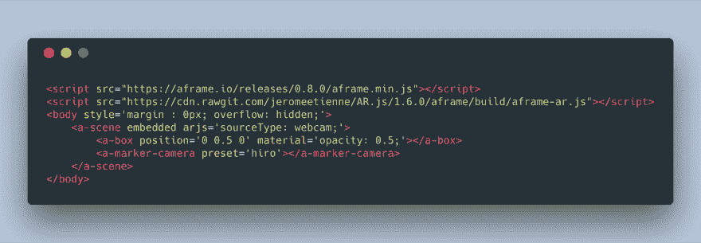
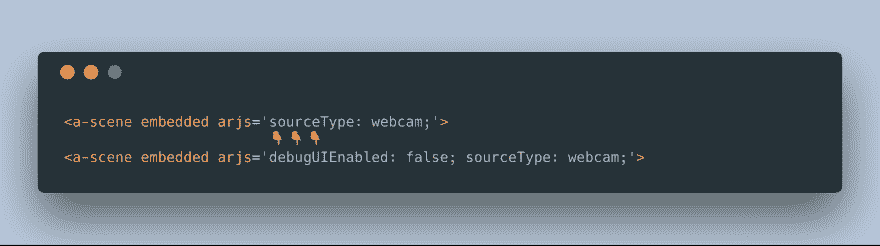
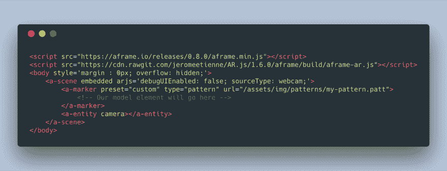
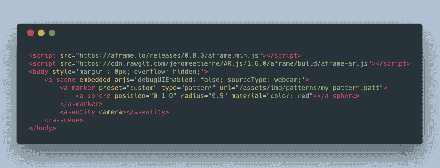
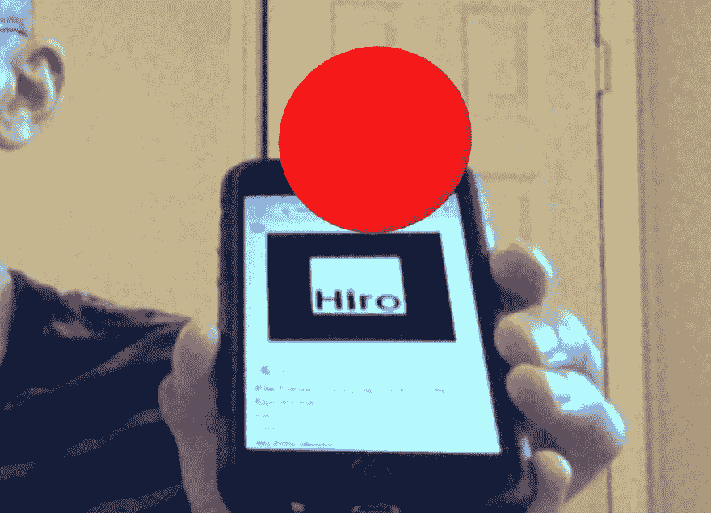
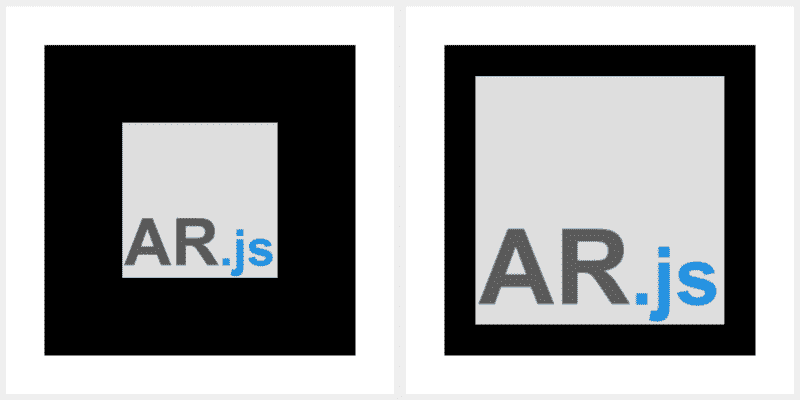
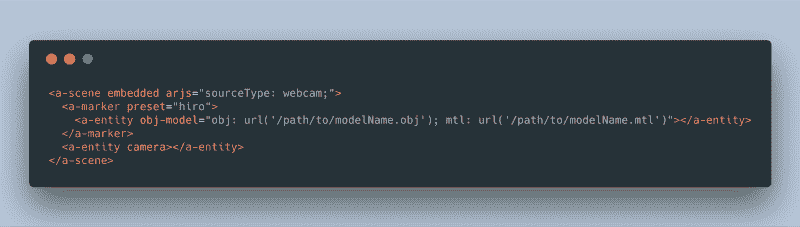
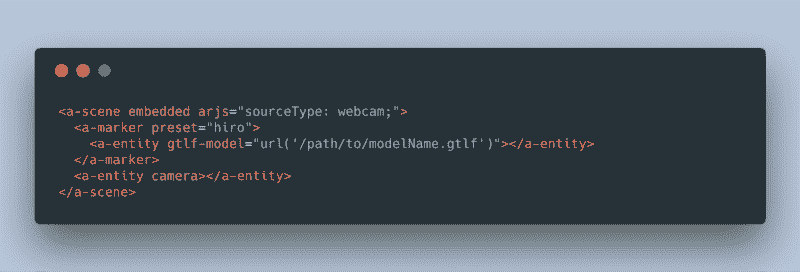
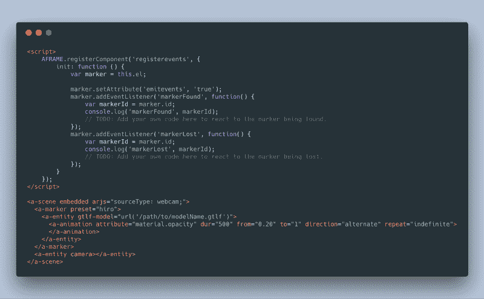

# 所以你想从 AR.js 开始

> 原文：<https://dev.to/aschmelyun/so-you-want-to-get-started-with-ar-js-22e2>

增强现实似乎在 2018 年无处不在。在 Snapchat 滤镜、谷歌贴纸、宜家的家具预览，以及现在 Shopify 的 [AR Quick Look](https://medium.com/shopify-vr/ar-shopping-gets-simpler-with-ar-quick-look-on-shopify-c2716593823f) 功能之间，将 3D 物体放入物理世界似乎比以往任何时候都更令人向往。

虽然增强现实功能可能很适合已建立的原生应用程序，但对于那些希望将增强现实用于营销目的的非应用程序业务来说，这有一个不利因素。例如，假设一家手袋公司希望在用户将相机对准包装盒上的标志时，在包装盒上方展示一个手袋的 3D 模型。传统上，他们必须:

*   使用 ARKit/ARCore/ARToolkit/etc 开发原生应用程序
*   支付所需费用，将其分发到 Google Play/App store
*   等待上述任一商店的批准
*   向您的潜在客户/用户推销应用程序
*   希望用户下载后使用该应用程序

所有这些都是为了(平均)2-5 分钟的时间来玩完成的应用程序。此外，如果是为了特定的营销活动或时间跨度，他们很可能不会与它互动超过几次。

解决办法？ **[AR.js](https://github.com/jeromeetienne/AR.js/blob/master/README.md)** ，直接在浏览器中简单增强现实，兼容所有现代移动设备。现在，让我们开始吧！

## 什么是 AR.js？

简而言之，它本质上是一个 Javascript 框架，充当 ARToolkit 的一个端口，同时利用其他包，如 [a-frame](https://aframe.io/) 和 [three.js](https://threejs.org/) 。目标是在不牺牲性能的情况下，在网络浏览器上直接实现增强现实功能。

就兼容性而言，它可以在任何支持 WebGL + WebRTC 的浏览器上运行。在本文发表时，这将是 Chrome、Firefox、Edge 和 Safari。然而，目前的 iOS 版 Chrome 还不支持。

## 获取项目设置

这假设您已经设置了一个(本地或其他)开发环境，并使用 SSL 证书进行保护。**为什么选择 SSL？** *Chrome 要求所有使用脚本调用摄像头访问的网站必须严格通过 https 交付。*

根据 Alexandra Etienne 的文章，我们可以用仅仅 8 行 HTML 代码来演示 AR.js。

把这个坏男孩放到你的开发环境中的一个 index.html 文件中，并在你选择的兼容浏览器中打开它。您将收到一个访问您的摄像头的请求，在获得批准后，您将看到来自您的设备的实时视频。打印/加载[默认 hiro 标记图像](https://github.com/jeromeetienne/AR.js/blob/master/daimg/hiro.png)，并将其指向视频输入。如果一切顺利，你应该看到一个半透明的白色立方体固定在标记上。

增强现实，在网络上！

想从视频显示中删除调试框吗？只需添加标志“debugUIEnabled:false；”到`a-scene`元素中的 arjs 属性。

## 使用自定义标记

老实说，这是我最初学习 AR.js 时最难正常工作的部分之一。有几个教程是关于如何让自定义标记工作的，但它们之间有一些相互冲突的信息。我会一步一步地列出最适合我的方法。

**第一步。决定你的标记图像。**为了获得最佳效果，这应该是一个简单的、高对比度的 PNG 图像，预先裁剪为至少 512x512 的正方形。这也必须是**旋转不对称**，这意味着它将永远看起来独一无二，无论它旋转到什么程度。以下是一些标记图像的好例子:

**第二步。将您的图像转换为. patt 文件和 AR.js 标记。**使用[这个标记训练器](https://jeromeetienne.github.io/AR.js/three.js/examples/marker-training/examples/generator.html)，上传你想用作标记的图像。如果你觉得不错，那就点击:

*   `Download Marker:` The。AR.js 用于识别标记和显示 3D 内容的 patt 文件。
*   `Download Image:`实际。带有适当黑色边框的 png 图像将用作物理标记。

**第三步。添加。patt 文件到您的网站。**只要应用程序可以访问，放在哪里真的不重要，我通常使用类似`/img/patterns/my-marker.patt`的结构把我的放在我的资产文件夹中。

**第四步。将标记添加到 AR.js 元素中。**使用 a 字架法，这很简单。您所需要做的就是添加一个类型属性为“pattern”的`a-marker`元素，并将模式文件的相对路径作为“url”属性。

使用这种方法，我们还需要包含一个`a-entity camera`，这样虚拟相机就包含在 3D 渲染环境中了。

* *第五步。最后，添加您想要显示的 3D 模型。为了完成这个，我们需要添加一个模型，当这个标记被发现时，这个模型就会显示出来。令人欣慰的是，a-frame 包含了一组基本的几何图形，我们可以使用一些简单的元素名轻松地将它们放入其中。

*   `<a-box></a-box>`
*   `<a-sphere></a-sphere>`
*   `<a-cylinder></a-cylinder>`
*   `<a-plane></a-plane>`

每一个都有一个可以调整的位置属性，允许您在 3D 空间中相对于标记位置移动它。这样，您的对象不需要直接放在标记上，而是可以浮在标记上方，或者放在旁边。在这个例子中，我将添加一个红色的球体，它稍微浮动在标记的上方。

**吊杆**💥

用新的自定义模式代码替换以前的样板文件，并向摄像机显示您下载的标记图像。您应该会看到一个红色的球体漂浮在标记图标的正上方！

这看起来很简单，但是当你考虑到我们只用了十几行 HTML 就做到了这一点，那么使用 AR.js 的能力和可能性就会大放异彩。

如果你的目标只是学习基础知识，你可以就此打住。
从现在开始，我将向您展示一些更高级的技巧和窍门，用于定制 AR.js 以满足各种需求。

## 缩小黑色标记边框的大小

就我个人而言，我认为默认的边框粗细在标记上看起来有点不协调，我也听到过其他一些使用 AR.js 的人重复同样的事情。然而，如果你使用的是最新版本的框架，那么根据自己的喜好调整边框大小会比以往任何时候都容易！

哪个更好看？左:0.5，右:0.8

我在上一篇文章中讨论了如何使用 [AR.js 标记训练工具](https://jeromeetienne.github.io/AR.js/three.js/examples/marker-training/examples/generator.html)生成标记及其图像。如果你访问这个链接，你会看到在左上角有一个**图案比例**的小滑块(提示:那是黑色边框的粗细)。您可以将其视为“实际标记图像占据的标记的百分比”。例如，如果模式比率设置为 0.75(我的首选值)，这意味着 75%的标记是您的图像在中心，其余 25%被黑色边框占据。

一旦你确定了你想要的图案比例，就可以为你的应用程序生成并保存你的标记图案和标记图像，如本文前面所述。回到你的应用程序，只需要一个小小的调整就可以了。在你的元素上，添加`patternRatio=0.75`(或者你想要的值)到 **arjs** 道具中。

## 使用自己的 3D 模型

当然，立方体、球体、平面和圆柱体都很酷，但大多数时候，你会希望在你创建的增强现实场景中利用和显示自定义的 3D 模型。幸运的是，AR.js 让这变得非常简单！

最简单的开始方式是确保你的模型是 **obj** 或者 **glTF** 格式。这些功能与 AR.js 和 a-frame 一起工作，不需要额外的设置或配置。你可以在 https://sketchfab.com 的[网站](https://sketchfab.com)上找到大量免费且负担得起的 obj 模型。

**注意:**在下面的例子中你会看到`<a-entity>`标签，这是对`<a-sphere>`等的通用替换，允许你指定你自己的几何图形/材料等，而不是使用预先组装的。

### 对于 obj 车型:

在我们的 a-entity 标签中，我们将使用`obj-model`属性，这将要求您指定到两个**的路径。obj** 模型文件和附带的**。mtl** 材料文件。最终结果应该是这样的:

### 对于 glTF 型号:

这条更简单，因为它只有一条路！替换掉`gtlf-model`的 obj-model 属性，并提供模型的路径作为值:

## 为标记创建事件监听器

为什么我们首先需要一个事件侦听器呢？我可以给你一个真实的例子:我的客户希望每当用户设备上的一个标记被激活时显示一个简单的内容块。每当没有当前活动的标记时，内容应该消失。为了实现这一点，我们需要添加一个事件侦听器，每当发现/丢失一个标记时，该事件侦听器就会触发，然后我们在主站点的 JavaScript 包中挂接该事件，并在事件触发时显示/隐藏内容。

要实现事件侦听器，您只需注册一个 aframe 组件，然后为 markerFound 和 markerLost 设置事件侦听器。在它们各自的回调函数中，编写任何你想要的 JS，当一个标记被发现或丢失时，它们将被触发:

**暂时就这样吧！**如果你对这篇文章或任何与 AR.js 相关的东西有任何问题/评论，请随时在[推特](https://twitter.com/aschmelyun)上给我留言🐦。