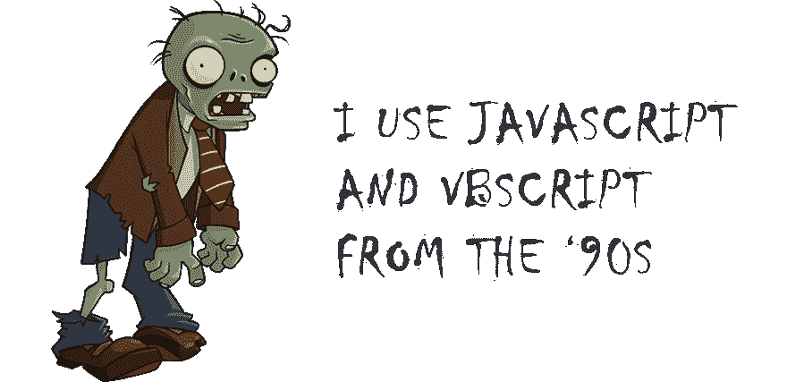
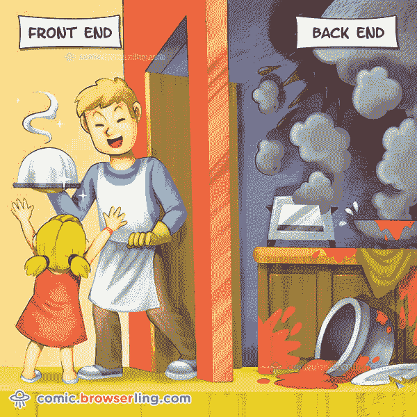
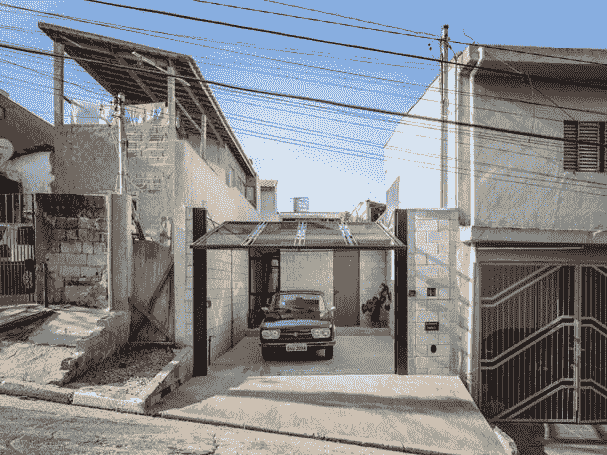

# 软件工程和软件架构仍然很重要。

> 原文：<https://dev.to/lleonardogr/software-enginnering-and-software-architecturing-still-matters-47d7>

文章原文为葡萄牙文，链接: [https://wp.me/paJQm5-32](https://wp.me/paJQm5-32)

> Software architecture is those decisions which are both important and hard to change. This means it includes things like the choice of programming language, something architects sometimes gloss over or dismiss. Both aspects land squarely on the economics of software development. Said another way, software architecture is those decisions which, if made poorly, will make a project either succeed or fail, in a needlessly expensive way.
> 
> 马丁·福勒

我在其他文章中说过，重要的是企业和人们要改变 T.I 是成本的想法，把它当作投资。这样想的话，工程和软件架构对你的投资来说是安全的，同时他们也是一个更有利可图的投资组合，因为他们可以节省成本，但是为什么我们在制作软件项目时忽略了这两个主题呢

## “完成比完美更好”

 来源:[https://pterneas.com/2014/08/04/the-developer-syndrome/](https://pterneas.com/2014/08/04/the-developer-syndrome/)

这是我不久前听到的一句话，我同意也不同意。根据我的研究，这个短语可能来自管理或专业教练领域。但是尽管这个短语在公司中被广泛应用，当我们谈论 T. I .时，这么说有一个很大的问题。

### 有许多事情我们要求完美

There are many products and services (Mainly services of T. I), which we wish it to work perfectly, after all you would feel confident in getting on a plane that was made by teams who think by the phrase above, or would feel confident in directing a Car that was conceived based on this phrase, would live in a house thought of like that, or I'd trust the doctor to do a surgery on your heart that said that kind of thing, probably not.

### T.I 的情况最终会非常不同

当我们谈论 T. I .时，最终的结果才是最重要的，或者说 makeup 如何说“结果证明了手段”，这在短期内最终甚至是值得的，但是每个程序员都知道，在某个时候，他交付软件的匆忙会在事后“困扰着他”。这就是为什么软件工程如此重要，帮助我们在更短的期限内创建对客户有价值的交付，随着时间的推移满足期望，而不会创建一个让其创造者头疼的怪物哈哈。

## 在巴西缺乏软件架构方面的资质

 我已经在其他文章中介绍过这一点，关于巴西缺乏 T.I 专业人员的资格，我说这个主要是关于软件架构。与此同时，有经验的经理更关心满足业务需求(正确地)而不是技术需求，程序员没有一个合格的导师，他知道如何应用良好的知识，如设计模式，DDD，固体，干燥，亲吻，微服务。优秀的程序员需要具备这种敏锐的知识，至少足以知道如何利用它们，以便我们可以减少返工。如图所示，作为程序员，提供好的服务和在厨房里生火是不好的。

## 软件工程和架构有助于节省长期

Source: [casavogue](https://casavogue.globo.com/Interiores/casas/noticia/2015/11/casa-vila-matilde-arquitetura-de-qualidade-e-acessivel.html)

这座房子在圣保罗，在 Vila Matilde 附近，它是一个建筑的极好例子，除了让你的项目更好，它还可以花费更少。例如，当我们看到隔壁的房子时，这种差异就很明显。在这栋房子的案例中，一群建筑师用有限的预算完成了一个房屋改造项目，结果非常出色。所以这是对公司的一个警告- **软件架构让你的项目更好更便宜，**当涉及到商业利益时，它是世界上最好的。

**【结论】:**我们仍在摆脱关于如何制作软件的陈旧概念，希望新的开发者明白，工程和软件架构的最大受益者是程序员自己，此外，公司也明白这些概念默认有助于一个大的商业目标——削减成本。从这种理解出发，我们可能会有更好的系统需要维护，更少的被烧毁的厨房或被制造的怪物，我们需要理解**好的程序员最终会成为好的架构师和软件工程师，而坏的程序员将会是冒名顶替者，他们会制造怪物让其他人去面对。对你来说，软件架构和工程仍然重要吗？**

 ****有用的链接**

*   https://kylecordes.com/2015/fowler-software-architecture
*   https://casaclaudia.abril.com.br/casas-apartamentos/casa-feita-com-r-150-mil-e-uma-das-melhores-construcoes-do-mundo/
*   https://www.huffpostbrasil.com/2014/04/07/7-sinais-de-que-voce-e-uma-das-vitimas-da-sindrome-do-impostor_a_21667908/**