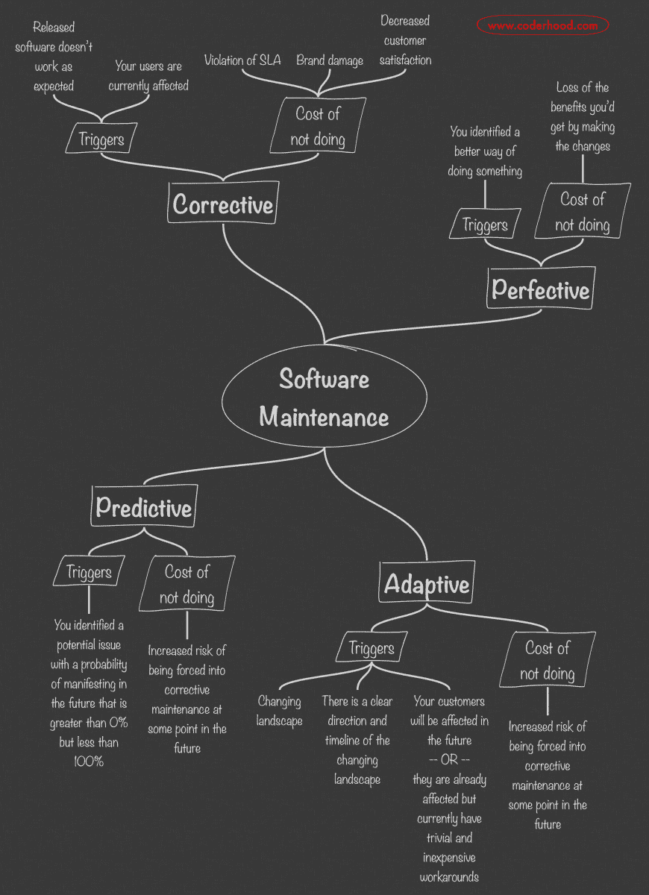

# 软件维护，了解 4 种类型

> 原文：<https://dev.to/lpasqualis/software-maintenance-understanding-the-4-types-53oo>

这篇文章最初是作为[软件维护，理解 4 种类型](https://www.coderhood.com/software-maintenance-understanding-the-4-types/)在 [CoderHood](https://coderhood.com) 上完整发表的。CoderHood 是一个致力于软件工程人类层面的博客。

* * *

软件系统是记录在存储设备上的位的集合。看起来，一旦一个软件应用程序工作了，只要它运行的硬件是正常的，它就应该永远工作下去。那么，为什么“软件维护”甚至是一个东西呢？没有物理磨损，也没有会腐烂或生锈的材料。软件系统不受大气、污染、天气的影响，也没有任何东西可以物理破坏。然而，这个论证没有考虑到一个重要的方面:语境。

虽然软件应用程序没有易受物理磨损的活动部件，但它们通常依赖于其工作环境。除了极少数例外，随着工作环境不可避免地发生变化，构建应用程序所基于的假设会崩溃。最终，应用程序停止工作或失去其价值。

### 上下文变化的例子

让我给你举几个可能导致软件系统失去价值或崩溃的上下文变化的例子:

*   当谷歌更改其认证协议时，允许用户使用谷歌认证登录的网站停止工作。(外部依赖关系改变)
*   当实现的数学天气模型变得过时时，天气预测软件系统也变得过时。(最新的知识变化)
*   当竞争对手发布的更新的导航软件产品明显更好时，汽车的导航软件就变得过时了。(市场预期变化)
*   金融机构中管理银行账户的软件必须在运行该软件的硬件出现故障时进行更新，而兼容的硬件已不再可用。(硬件变更)
*   当任何一个用过的第三方库需要更新到不向后兼容的新版本时，应用程序停止工作。(软件依赖性更改)
*   需要修改应用程序以符合新的法律和法规。(合规性变更)
*   一个应用程序需要被修复，因为闰年的定义改变了。(外部概念和定义发生变化)
*   一个应用程序需要与一个新的流行的第三方系统集成。(市场环境变化)
*   网站的流量正在增加，网站软件需要重新设计，以便能够适应新的流量水平。(使用模式发生变化)

所以，原则上来说，软件应用程序确实经受不住物理磨损。然而，如果不严格维护，非物理过程会导致软件应用程序老化和过期。

## 不同类型的软件维护

软件系统的维护有四种不同的风格:适应性的、纠正性的、完善性的和预防性的。请注意，我没有编造这些名字。如果我知道，我会选择不同的东西。例如，我觉得“完美”这个词有点拗口，但为了与标准行业术语兼容，我还是坚持使用它。

维护操作总是软件变更，但是它的分类取决于触发它的原因。下面我们来深入探讨一下四种保养，以及如何识别。

## 矫正软件维护

纠正性维护操作是您进行的软件更改，因为:

1.  有一个严重的问题阻碍了软件的正常运行
2.  问题是积极地影响用户，或者你怀疑它是。

例如，如果您发布了一个软件系统，而您的用户遇到了一个 bug，那么就需要一个纠正性的维护操作来修复它。请注意，如果用户从未受到 bug 的影响，并且您在任何人注意到它之前解决了它，那么维护操作就是预防性的或适应性的。但是，即使只有一个用户受到影响，解决问题也是一种纠正性的维护措施。

如果您将大部分时间花在处理纠正性维护任务上，那么您的工程团队正在以救火模式运行。请注意这种情况，因为您的测试实践、您预测问题的能力、您团队的资历和技能水平、您代码的质量或您的工程能力都可能有问题。

## 适应性软件维护

自适应维护是您在更改软件系统时需要做的事情，因为:

1.  您有明确的信息表明您的软件运行的环境正在发生变化(例如，市场、技术、法律等。)
2.  你对景观变化的方向和时间表有很好的理解
3.  您的客户将在未来的某个可预测的时间点受到影响，或者他们现在受到影响，但有琐碎且廉价的解决方法

例如，假设您正在运行一个网站，您发现它与 Apple 在开发人员专用测试版中预发布的新版本 Safari 不兼容。根据历史模式，你知道苹果将在未来几个月内发布 Safari 的不兼容版本。如果你在新版 Safari 成为主流之前解决了这个问题，那么你就是在执行一项适应性维护任务。这是因为:

1.  Safari 正在改变
2.  你猜得很准，它会在什么时候发布
3.  您的客户没有使用开发人员版本的 Safari 如果是的话，他们很可能意识到了风险，并可以切换到普遍可用的版本。

如果你等待新版本的 Safari 向公众发布，而你的客户遇到了问题，那么你必须采取纠正性的维护措施。故意推迟适应性维护，直到有必要执行纠正性维护时，成本高昂，应始终避免。

世界范围内大规模适应性维护热潮的一个非常著名的例子是由 20 世纪 90 年代末的“ [Y2K bug](https://www.nationalgeographic.org/encyclopedia/Y2K-bug/) ”引起的。日历年保证在 2000 年 1 月 1 日从 1999 年变为 2000 年。许多软件系统显然没有为此做好准备，但是这些系统的客户还没有受到影响。在 2000 年 1 月 1 日的午夜，任何没有投资于适应性维护工作来修复 Y2K 流程的软件制造商现在都在处理一个紧急的纠正性维护。

## 完善软件维护

当你改变一个软件系统时，你执行了完美的维护，因为你决定通过改进已经工作的东西来提高它的价值。完美的维护包括速度优化、UI 和可用性改进等。完美的维护通常由客户反馈发起，但并不总是如此。运行良好的软件组织仔细倾听他们的客户，并投资于完善的维护任务，直到他们达到收益递减点。

## 预防性软件维护

预防性维护是您为避免潜在(但不保证)未来问题而进行的软件更改。

适应性维护和预防性维护之间的区别有时是模糊的。一般来说，预防性维护并不局限于因环境条件变化而必然发生的趋势；相反，它与未来可能发生或可能不发生的事件相关联。例如，如果您担心由于不可预见和不可预测的未来情况而导致的流量高峰，并且您决定增强您的软件来处理它，那么您正在执行预防性维护。另一方面，如果您的流量增长模式在某种程度上是可预测的，并且您很清楚您的系统何时会开始出现可伸缩性问题，那么您为避免这些问题所做的任何更改都是适应性维护。

## 思维导图的关键概念

## 这个为什么重要？

每当您对软件系统进行更改时，确定您正在执行的维护类型是非常重要的。跟踪它可以让你对你的工程实践有很好的了解。例如，您在四种维护类型中的每一种上花费的时间百分比，可以让您了解您的软件工程组织的成熟度和技能水平。它还可以让你了解你的产品和代码库的成熟度。

您的工程团队应该在四种类型的维护中的每一种上花费多少时间取决于许多因素。例如，在一个版本发布之后，您不应该惊讶地看到纠正性维护工作的高峰。尽管你尽了最大努力来发布无错误的代码，但问题总是在发布后突然出现。没有硬性的规则，但有一些一般的考虑和原则要记住。

*   软件系统时代。维护是软件系统拥有成本的一部分。你可以在某种程度上控制它，但你无法避免它。
*   随着您的软件系统变得越来越大，越来越复杂，或者随着您的客户群的增长，所需的维护量也成比例地增加(但不是线性的)。如果没有增长(也就是更多的人)，那些不断向软件系统添加新特性，或者支持不断增长的客户群的工程团队，迟早会将他们 100%的时间花在维护任务上。我称之为“零增长”阶段，这不是一个好地方。你多快能到达那里取决于许多因素。
*   投资预防性维护就像赌博。要赢，你必须打赌，而且正确的次数要比错误的次数多。
*   不要让问题从“潜在的”变成“可预测的”，再变成“紧急的”大多数纠正性维护任务都非常昂贵，因为它们会影响您的品牌。如果您注意的话，通常可以通过不太昂贵的适应性或预测性维护工作来避免它们。下注，动作要快，不要忽略明确的信号。
*   如果您没有从事任何适应性的或者预防性的维护任务，您可能没有注意到您的软件运行的环境。
*   完美的维护任务有一个收益递减点。在苹果变得无用之前，你只能打磨它这么多。
*   软件系统中总会有你不想碰的部分。这未必是一件坏事；然而，你应该注意你在这些领域花了多少时间来解决问题。
*   有时，如何对维护工作进行分类并不是很明显，因为它似乎属于多个类别。没关系。尽你最大努力。你做得越多，就越容易。

### 如果你喜欢这篇文章，请保持联系！

*   在 CoderHood 上找到我所有的帖子。不要忘记订阅邮件来接收新帖子的通知。
*   在 LinkedIn 上加入我的职业网络。
*   在推特上关注我。
*   加入我的脸书主页。
*   最后，请在 dev.to 上关注我！