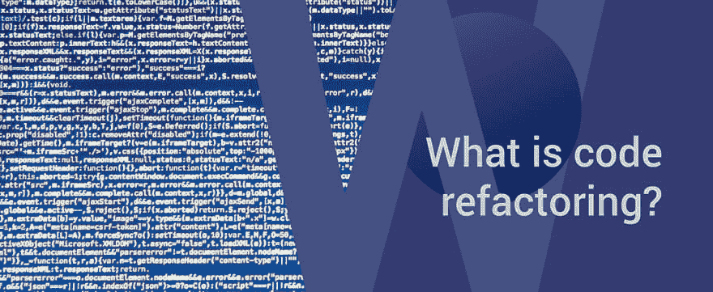

# 软件重构

> 原文：<https://dev.to/galyna_chekan/software-refactoring-2l6a>

软件[随时间](https://www.techopedia.com/definition/22202/software-rot)衰减。不像一个水果，从内部腐烂，但由于缺乏更新实施；IT 环境对所有居民的更新。这种现象也被称为软件老化，可以通过许多措施来预防，其中之一就是代码重构——今天文章的主题。

他们说除非坏了，否则不要修。我们说在它变旧之前更新它。 _

以下是方法:

## 什么是代码重构？

代码重构意味着重构你现有的代码，以一种改善内部结构但不改变外部行为的方式。这个复杂的过程旨在使软件现代化。它通常用于增加系统的可维护性、增强性能、可伸缩性、安全性等。如果执行得好，可以帮助开发者发现系统中一些隐藏的 bug 或漏洞。

通常，重构是一小步一小步完成的，称为微重构。这些步骤中的每一步通常都是对源代码的微小改变，而不改变系统的功能，它只是使代码更干净、更简单。如果你真的想改变代码的某些功能，用一个干净的重构代码会容易得多。

需要指出的是，代码重构并不意味着重写代码。这两个概念经常被混淆，但它们之间的区别非常简单:正如我们上面提到的，代码重构不是软件的行为，而重写代码则是。

代码重构的目的非常明确——保持代码干净、整洁和有序。你可能并不总能从它身上看到立竿见影的效果，但从长远来看，这是对你产品的一项值得的投资。

软件重构这个帖子最早出现在[软件开发公司完美](https://perfectial.com)上。