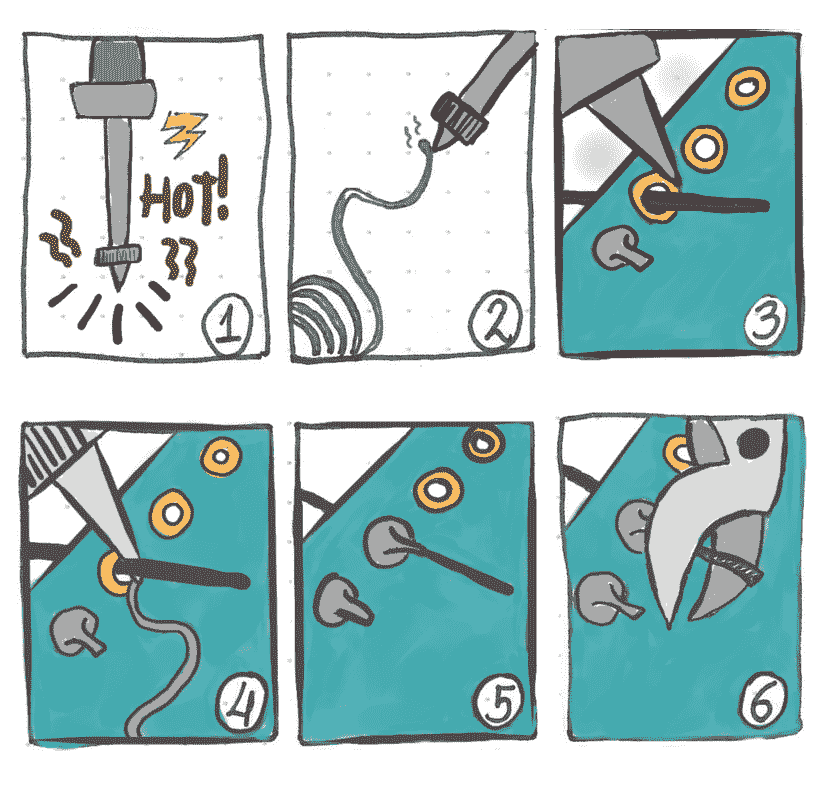

# 基本焊接:图解指南

> 原文：<https://dev.to/erikaheidi/soldering-basics-1ipm>

试验板是一个开始学习基本电子产品的好地方，但总有一天你会需要使用一些基本的焊接技术——无论是组装套件、完成原型还是修理电路板/玩具/小工具。

好消息是:焊接并不像看起来那么难。好的焊接需要实践，所以更好的学习方法是在烙铁周围摸索，做一些东西。我绝对推荐买一个有很多 led 的套件，有足够的练习空间！我就是这样学会焊接的。

## 焊接 101 -图解指南

以下分步指南演示了焊接的基本知识:

1.  不要害怕烙铁，但是要非常小心，因为它会变得非常热。
2.  用一点焊料来“测试”铁。当它融化的时候，就足够热了。在烙铁顶端留一点点焊料，这将有所帮助。
3.  将你要涂焊料的孔表面加热几秒钟。
4.  用焊料的尖端接触烙铁的尖端。焊料将“流动”并填充孔周围的区域。
5.  完成的作品应该像一座小“火山”。
6.  现在，您可以切断剩余的引线/电线。

另一个建议:说到焊料的用量，越少越好！使用足够的量将*引线/电线*熔入孔中。使用过多的焊料会产生斑点，要么不能很好地附着在电路板上，要么会干扰附近的其他元件。

现在，让我们来看看所有这些在行动中。下面的视频展示了在原型板上用单个 LED 进行基本焊接的简单示例:

[https://www.youtube.com/embed/d0G4rGd37RY](https://www.youtube.com/embed/d0G4rGd37RY)

接下来，我们来看一个更真实的例子。在下面的视频中，我正在 Arduino 防护罩上焊接一排 RGB LEDs。这是焊接套件的常见情况:空间狭小，需要组装和焊接大量组件。非常适合练习！

[https://www.youtube.com/embed/0RWUuWf6RBo](https://www.youtube.com/embed/0RWUuWf6RBo)

## 附加资源

如果你想了解更多关于焊接技术和设备的知识，我强烈推荐你阅读这篇[优秀焊接指南](https://learn.adafruit.com/adafruit-guide-excellent-soldering?view=all)。

他们有一个很棒的部分解释了[常见的焊接问题](https://learn.adafruit.com/adafruit-guide-excellent-soldering?view=all#common-problems)，比如冷焊接头和桥接。

## 接下来

现在我们已经解决了焊接问题，是时候转向更有趣的东西了。在本系列的下一个教程中，我们将开始在 Arduino 上使用 led。下周见！