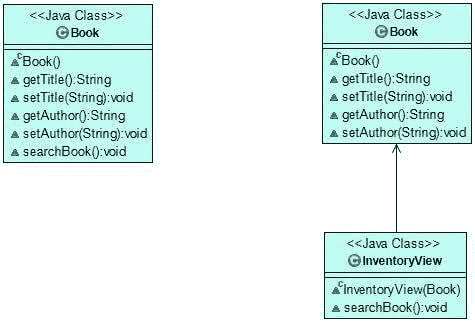
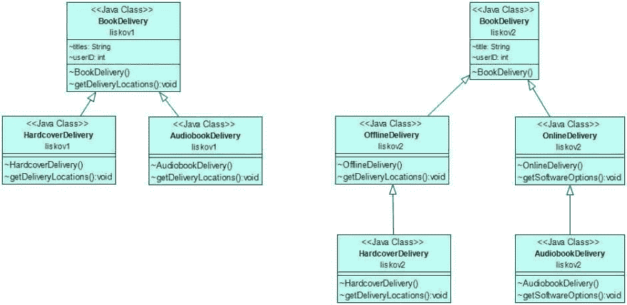
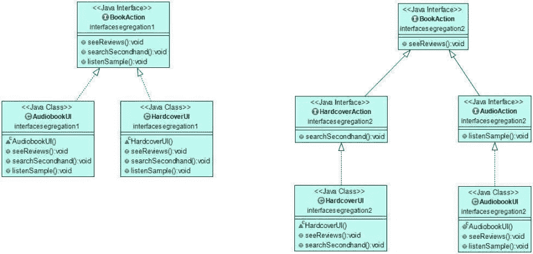
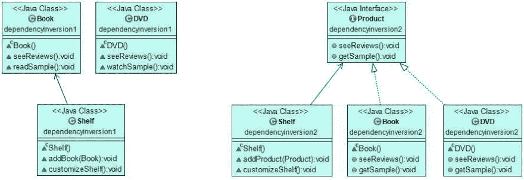

# 坚实的设计原则:构建稳定而灵活的系统

> 原文：<https://dev.to/azaleamollis/solid-design-principles-building-stable-and-flexible-systems--2ph7>

为了构建稳定而灵活的软件，我们需要牢记软件设计原则。拥有没有错误的代码是至关重要的。然而，设计良好的软件架构同样重要。

SOLID 是最著名的软件设计原则之一。它可以帮助您避免常见的陷阱，并从更高的层面考虑您的应用程序的架构。

## 什么是立体设计原则？

可靠的设计原则是五个软件设计原则，它们使您能够编写有效的面向对象代码。了解抽象、封装、继承和多态等面向对象的原则很重要，但是你如何在日常工作中使用它们呢？近年来，可靠的设计原则变得如此流行，因为它们以一种直截了当的方式回答了这个问题。

实体名称是一个助记首字母缩写词，其中每个字母代表一个软件设计原则，如下所示:

1.  代表单一责任原则
2.  o 代表开启/关闭原则
3.  l 为利斯科夫替代原理
4.  I 为界面分离原理
5.  d 表示依赖倒置原则

这五个原则到处重叠，程序员广泛使用它们。坚实的原则导致更灵活和稳定的软件架构，更容易维护和扩展，更不容易崩溃。

## 单一责任原则

[单一责任原则](https://www.oodesign.com/single-responsibility-principle.html)是第一个坚实的设计原则，由字母“S”代表，由[罗伯特·C·马丁](https://en.wikipedia.org/wiki/Robert_C._Martin)定义。它指出，在一个设计良好的应用程序中，每个类(微服务、代码模块)应该只有一个单一的职责。责任是指只有一个改变的理由。

当一个类处理多个职责时，对功能的任何更改都可能影响到其他功能。如果你有一个更小的应用程序，这已经够糟糕了，但是当你使用复杂的企业级软件时，这就变成了一场噩梦。通过确保每个模块只封装一个职责，您可以节省大量测试时间，并创建更易于维护的架构。

#### 单一责任原则的例子

让我们看一个例子。我将使用 Java，但是您也可以将可靠的设计原则应用于任何其他 OOP 语言。

比方说，我们正在为一家书店编写一个 Java 应用程序。我们创建了一个`Book`类，让用户获取并设置每本书的标题和作者，并在目录中搜索该书。

```
class Book {

    String title;
    String author;

    String getTitle() {
        return title;
    }
    void setTitle(String title) {
        this.title = title;
    }
    String getAuthor() {
        return author;
    }
    void setAuthor(String author) {
        this.author = author;
    }
    void searchBook() {...}

} 
```

Enter fullscreen mode Exit fullscreen mode

然而，上面的代码违反了单一责任原则，因为`Book`类有两个责任。首先，它设置与书籍相关的数据(`title`和`author`)。其次，它在清单中搜索图书。setter 方法改变了`Book`对象，当我们想在库存中搜索同一本书时，这可能会导致问题。

为了应用单一责任原则，我们需要分离这两种责任。在重构后的代码中，`Book`类将只负责获取和设置`Book`对象的数据。

```
class Book {

    String title;
    String author;

    String getTitle() {
        return title;
    }
    void setTitle(String title) {
        this.title = title;
    }
    String getAuthor() {
        return author;
    }
    void setAuthor(String author) {
        this.author = author;
    }

} 
```

Enter fullscreen mode Exit fullscreen mode

然后，我们创建另一个名为`InventoryView`的类，它将负责检查库存。我们在这里移动了`searchBook()`方法，并在构造函数中引用了`Book`类。

```
class InventoryView {

  Book book;

    InventoryView(Book book) {
        this.book = book;
    }

    void searchBook() {...}

} 
```

Enter fullscreen mode Exit fullscreen mode

在下面的 UML 图中，您可以看到在我们遵循单一责任原则重构代码之后，架构是如何变化的。我们将最初的有两个职责的`Book`类分成了两个类，每个类都有自己的一个职责。

[](https://res.cloudinary.com/practicaldev/image/fetch/s--g3AHYvXb--/c_limit%2Cf_auto%2Cfl_progressive%2Cq_auto%2Cw_880/https://raygun.com/blimg/solid-design-principles/01-singleresponsibility-example.jpg)

## 开/关原理

[开/关原则](https://www.oodesign.com/open-close-principle.html)是 SOLID 五大软件设计原则的“O”。是 [Bertrand Meyer](https://en.wikipedia.org/wiki/Bertrand_Meyer) 在他的书《面向对象软件构造》中创造了这个术语。开放/封闭原则规定，类、模块、微服务和其他代码单元应该对扩展开放，但对修改关闭。

因此，您应该能够使用 OOP 特性来扩展您现有的代码，比如通过子类和接口继承。但是，您不应该修改已经存在的类、接口和其他代码单元(尤其是当您在生产中使用它们时)，因为这可能导致意外的行为。如果您通过扩展代码而不是修改代码来添加新功能，那么您可以尽可能地将失败的风险降至最低。此外，你也不必对现有的功能进行单元测试。

### 开/关原理的例子

让我们继续我们的书店例子。现在，商店想在圣诞节前以折扣价分发食谱。我们已经遵循了单一责任原则，所以我们创建了两个独立的类:`CookbookDiscount`保存折扣的详细信息，而`DiscountManager`将折扣应用于价格。

```
class CookbookDiscount {

    String getCookbookDiscount() {

        String discount = "30% between Dec 1 and 24.";

        return discount;
    }

}

class DiscountManager {

    void processCookbookDiscount(CookbookDiscount discount) {...}

} 
```

Enter fullscreen mode Exit fullscreen mode

这段代码运行得很好，直到商店管理层通知我们，他们的食谱打折销售非常成功，他们想延长它。现在，他们想在每本传记的主人公生日当天，以 50%的折扣分发。为了添加新特性，我们创建了一个新的`BiographyDiscount`类:

```
class BiographyDiscount {

    String getBiographyDiscount() {

        String discount = "50% on the subject's birthday.";     

        return discount;

    }
} 
```

Enter fullscreen mode Exit fullscreen mode

为了处理新的折扣类型，我们也需要向`DiscountManager`类添加新的功能:

```
class DiscountManager {

    void processCookbookDiscount(CookbookDiscount discount) {...}

    void processBiographyDiscount(BiographyDiscount discount) {...}

} 
```

Enter fullscreen mode Exit fullscreen mode

然而，当我们改变现有的功能时，我们违反了开放/封闭原则。尽管上述代码工作正常，但它可能会给应用程序增加新的漏洞。我们不知道新添加的内容将如何与依赖于`DiscountManager`类的代码的其他部分交互。在真实的应用程序中，这意味着我们需要再次测试和部署整个应用程序。

但是，我们也可以选择通过添加一个额外的抽象层来重构我们的代码，这个抽象层代表所有类型的折扣。所以，让我们创建一个名为`BookDiscount`的新接口，由`CookbookDiscount`和`BiographyDiscount`类来实现。

```
public interface BookDiscount {

    String getBookDiscount();

}

class CookbookDiscount implements BookDiscount {

    @Override
    public String getBookDiscount() {
        String discount = "30% between Dec 1 and 24.";

        return discount;
    }

}

class BiographyDiscount implements BookDiscount {

    @Override
    public String getBookDiscount() {
        String discount = "50% on the subject's birthday.";

        return discount;
    }

} 
```

Enter fullscreen mode Exit fullscreen mode

现在，`DiscountManager`可以引用`BookDiscount`接口，而不是具体的类。当调用`processBookDiscount()`方法时，我们可以将`CookbookDiscount`和`BiographyDiscount`作为参数传递，因为它们都是`BookDiscount`接口的实现。

```
class DiscountManager {

    void processBookDiscount(BookDiscount discount) {...}
} 
```

Enter fullscreen mode Exit fullscreen mode

重构后的代码遵循开放/封闭原则，因为我们可以在不修改现有代码基础的情况下添加新的`CookbookDiscount`类。这也意味着在未来，我们可以用其他折扣类型来扩展我们的应用程序(例如，用`CrimebookDiscount`)。

下面的 UML 图显示了我们的示例代码在重构前后的样子。在左边，你可以看到`DiscountManager`依赖于`CookbookDiscount`和`BiographyDiscount`类。在右边，所有三个类都依赖于`BookDiscount`抽象层(`DiscountManager`引用它，而`CookbookDiscount`和`BiographyDiscount`实现它)。

[](https://res.cloudinary.com/practicaldev/image/fetch/s--CWQBeSYI--/c_limit%2Cf_auto%2Cfl_progressive%2Cq_auto%2Cw_880/https://raygun.com/blimg/solid-design-principles/02-openclosed-example.jpg)

## 利斯科夫替代原理

[利斯科夫替代原理](https://www.oodesign.com/liskov-s-substitution-principle.html)是固体的第三个原理，用字母“L”表示。是 [Barbara Liskov](https://en.wikipedia.org/wiki/Barbara_Liskov) 在 1987 年她的会议主题演讲“数据抽象”中介绍了这个原则。利斯科夫替代原则最初的措辞有点复杂，因为它断言:

> 在计算机程序中，如果 S 是 T 的子类型，则 T 类型的对象可以用 S 类型的对象替换(即，S 类型的对象可以替换 T 类型的对象)，而不改变该程序的任何期望的属性(正确性、执行的任务等)。)."

通俗地说，它指出超类的对象应该可以被其子类的对象替换，而不会在应用程序中引起问题。所以，子类不应该改变其父类的特征(比如参数列表和返回类型)。您可以通过注意正确的继承层次来实现 Liskov 替换原则。

#### 里斯科夫替代原理的例子

现在，书店要求我们在应用程序中添加新的交付功能。因此，我们创建了一个`BookDelivery`类，通知客户可以领取订单的地点数量:

```
class BookDelivery {
    String titles;
    int userID;

    void getDeliveryLocations() {...}
} 
```

Enter fullscreen mode Exit fullscreen mode

然而，这家商店也出售他们只想送到高街商店的精美精装书。因此，我们创建了一个新的`HardcoverDelivery`子类，它扩展了`BookDelivery`并用自己的功能覆盖了`getDeliveryLocations()`方法:

```
class HardcoverDelivery extends BookDelivery {

    @Override
    void getDeliveryLocations() {...}

} 
```

Enter fullscreen mode Exit fullscreen mode

后来，商店要求我们也为有声读物创建交付功能。现在，我们用一个`AudiobookDelivery`子类扩展现有的`BookDelivery`类。但是，当我们想要推翻`getDeliveryLocations()`方法时，我们意识到有声读物不能被送到实际的地点。

```
class AudiobookDelivery extends BookDelivery {

    @Override
    void getDeliveryLocations() {/* can't be implemented */}
} 
```

Enter fullscreen mode Exit fullscreen mode

我们可以改变`getDeliveryLocations()`方法的一些特征，然而，这将违反利斯科夫替代原理。修改之后，我们无法在不破坏应用程序的情况下用`AudiobookDelivery`子类替换`BookDelivery`超类。

要解决这个问题，我们需要修复继承层次结构。让我们引入一个额外的层来更好地区分图书交付类型。新的`OfflineDelivery`和`OnlineDelivery`类拆分了`BookDelivery`超类。我们还将`getDeliveryLocations()`方法移到了`OfflineDelivery`，并为`OnlineDelivery`类创建了一个新的`getSoftwareOptions()`方法(因为这更适合在线交付)。

```
class BookDelivery {

    String title;
    int userID;

}

class OfflineDelivery extends BookDelivery {

    void getDeliveryLocations() {...}

}

class OnlineDelivery extends BookDelivery {

    void getSoftwareOptions() {...}

} 
```

Enter fullscreen mode Exit fullscreen mode

在重构后的代码中，`HardcoverDelivery`将是`OfflineDelivery`的子类，它将用自己的功能覆盖`getDeliveryLocations()`方法。

`AudiobookDelivery`将成为`OnlineDelivery`的子类，这是个好消息，因为现在它不必处理`getDeliveryLocations()`方法。相反，它可以用自己的实现覆盖其父方法的`getSoftwareOptions()`(例如，通过列出和嵌入可用的音频播放器)。

```
class HardcoverDelivery extends OfflineDelivery {

    @Override
    void getDeliveryLocations() {...}

}

class AudiobookDelivery extends OnlineDelivery {

    @Override
    void getSoftwareOptions() {...}

} 
```

Enter fullscreen mode Exit fullscreen mode

重构之后，我们可以用任何子类代替它的超类，而不会破坏应用程序。

在下面的 UML 图上，您可以看到通过应用 Liskov 替换原则，我们向继承层次结构添加了一个额外的层。虽然新架构更复杂，但它为我们提供了更灵活的设计。

[](https://res.cloudinary.com/practicaldev/image/fetch/s--jtg113pL--/c_limit%2Cf_auto%2Cfl_progressive%2Cq_auto%2Cw_880/https://raygun.com/blimg/solid-design-principles/03-liskov-example.jpg)

## 界面偏析原理

[界面分离原则](https://www.oodesign.com/interface-segregation-principle.html)是首字母缩写中字母“I”代表的第四个立体设计原则。罗伯特·C·马丁首先定义了这个原则，他说“客户不应该被迫依赖他们不使用的方法。”对于客户端，他指的是实现接口的类。换句话说，界面不应该包含太多的功能。

违反接口分离原则会损害代码的可读性，并迫使程序员编写无用的伪方法。在设计良好的应用程序中，应该避免接口污染(也称为胖接口)。解决方案是创建更小的接口，以便更灵活地实现。

### 界面分离原理的例子

让我们向我们的在线书店添加一些用户操作，以便客户在购买之前可以与内容进行交互。为此，我们用三种方法创建了一个名为`BookAction`的接口:`seeReviews()`、`searchSecondHand()`和`listenSample()`。

```
public interface BookAction {

    void seeReviews();
    void searchSecondhand();
    void listenSample();

} 
```

Enter fullscreen mode Exit fullscreen mode

然后，我们创建两个类:`HardcoverUI`和一个`AudiobookUI`，它们用自己的功能实现了`BookAction`接口:

```
class HardcoverUI implements BookAction {

    @Override
    public void seeReviews() {...}

    @Override
    public void searchSecondhand() {...}

    @Override
    public void listenSample() {...}

}

class AudiobookUI implements BookAction {

    @Override
    public void seeReviews() {...}

    @Override
    public void searchSecondhand() {...}

    @Override
    public void listenSample() {...}

} 
```

Enter fullscreen mode Exit fullscreen mode

两个类都依赖于它们不使用的方法，所以我们违反了接口隔离原则。精装书是听不到的，所以`HardcoverUI`类不需要`listenSample()`方法。同样，有声读物没有二手拷贝，所以`AudiobookUI`班也不需要。

然而，由于`BookAction`接口包含这些方法，它的所有依赖类都必须实现它们。换句话说，`BookAction`是一个我们需要隔离的被污染的接口。让我们用两个更具体的子接口来扩展它:`HardcoverAction`和`AudioAction`。

```
public interface BookAction {

    void seeReviews();

}

public interface HardcoverAction extends BookAction {

    void searchSecondhand();

}

public interface AudioAction extends BookAction {

    void listenSample();

} 
```

Enter fullscreen mode Exit fullscreen mode

现在，`HardcoverUI`类可以实现`HardcoverAction`接口，`AudiobookUI`类可以实现`AudioAction`接口。

这样，两个类都可以实现`BookAction`超接口的`seeReviews()`方法。然而，`HardcoverUI`不必实现不相关的`listenSample()`方法，`AudioUI`也不必实现`searchSecondhand()`。

```
class HardcoverUI implements HardcoverAction {

    @Override
    public void seeReviews() {...}

    @Override
    public void searchSecondhand() {...}

}

class AudiobookUI implements AudioAction {

    @Override
    public void seeReviews() {...}

    @Override
    public void listenSample() {...}

} 
```

Enter fullscreen mode Exit fullscreen mode

重构后的代码遵循接口分离原则，因为两个类都不依赖它们不使用的方法。下面的 UML 图很好地显示了分离的接口导致更简单的类，这些类只实现它们真正需要的方法:

[](https://res.cloudinary.com/practicaldev/image/fetch/s--S3W8IYA_--/c_limit%2Cf_auto%2Cfl_progressive%2Cq_auto%2Cw_880/https://raygun.com/blimg/solid-design-principles/04-interface-segregation-example.jpg)

## 依存倒置原则

[依赖倒置原则](https://www.oodesign.com/dependency-inversion-principle.html)是以最后一个“D”为代表的第五个立体设计原则，由罗伯特·C·马丁(Robert C Martin)提出。依赖性反转原则的目标是避免紧密耦合的代码，因为它很容易破坏应用程序。该原则指出:

> “高层模块不应该依赖低层模块。两者都应该依赖于抽象。”
> 
> “抽象不应该依赖于细节。细节应该依赖于抽象。”

换句话说，您需要分离高级和低级类。高级类通常封装复杂的逻辑，而低级类包括数据或实用程序。一般来说，大多数人都希望高级类依赖于低级类。但是根据依赖倒置原则，你需要倒置依赖。否则，当低级类被替换时，高级类也会受到影响。

作为解决方案，您需要为低级类创建一个抽象层，这样高级类就可以依赖于抽象而不是具体的实现。

罗伯特·C·马丁还提到依存倒置原则是开/闭原则和利斯科夫替代原则的特定组合。

### 从属倒置原则的例子

现在，书店要求我们开发一个新功能，让顾客可以把他们喜欢的书放在书架上。

为了实现新的功能，我们创建了一个较低级别的`Book`类和一个较高级别的`Shelf`类。`Book`类将允许用户查看评论，并阅读他们放在书架上的每本书的样本。`Shelf`类将让他们在书架上添加一本书，并定制书架。

```
class Book {

    void seeReviews() {...}
    void readSample() {...}

}

class Shelf {

    Book book;

    void addBook(Book book) {...}
    void customizeShelf() {...}

} 
```

Enter fullscreen mode Exit fullscreen mode

一切看起来都很好，但是由于高级的`Shelf`类依赖于低级的`Book`，上面的代码违反了依赖倒置原则。当商店要求我们让顾客也能在货架上添加 DVD 时，这一点就变得很明显了。为了满足需求，我们创建了一个新的`DVD`类:

```
class DVD {

    void seeReviews() {...}
    void watchSample() {...}

} 
```

Enter fullscreen mode Exit fullscreen mode

现在，我们应该修改`Shelf`类，使它也可以接受 DVD。然而，这显然会破坏开/关原则。
解决方案是为底层类(`Book`和`DVD`)创建一个抽象层。我们将通过引入两个类都将实现的`Product`接口来做到这一点。

```
public interface Product {

    void seeReviews();
    void getSample();

}

class Book implements Product {

    @Override
    public void seeReviews() {...}

    @Override
    public void getSample() {...}

}

class DVD implements Product {

    @Override
    public void seeReviews() {...}

    @Override
    public void getSample() {...}

} 
```

Enter fullscreen mode Exit fullscreen mode

现在，`Shelf`可以引用`Product`接口而不是它的实现(`Book`和`DVD`)。重构后的代码还允许我们以后引入新的产品类型(例如，`Magazine`)，顾客也可以把它们放在货架上。

```
class Shelf {

    Product product;

    void addProduct(Product product) {...}

    void customizeShelf() {...}

} 
```

Enter fullscreen mode Exit fullscreen mode

上面的代码也遵循了利斯科夫替换原则，因为在不破坏程序的情况下，`Product`类型可以用它的两个子类型(`Book`和`DVD`)来替换。同时，我们还实现了依赖倒置原则，因为在重构的代码中，高级类也不依赖于低级类。

正如您在下面的 UML 图的左边所看到的，在重构之前，高级的`Shelf`类依赖于低级的`Book`。在不应用依赖倒置原则的情况下，我们应该让它也依赖于底层的`DVD`类。但是，重构之后，无论是高层类还是低层类，都依赖于抽象的`Product`接口(`Shelf`引用它，而`Book`和`DVD`实现它)。

[](https://res.cloudinary.com/practicaldev/image/fetch/s--uu2D25ky--/c_limit%2Cf_auto%2Cfl_progressive%2Cq_auto%2Cw_880/https://raygun.com/blimg/solid-design-principles/dependency-inversion.jpg)

## 你应该如何实施扎实的设计原则？

实现可靠的设计原则会增加代码库的整体复杂性，但会带来更灵活的设计。除了单片应用程序，您还可以将可靠的设计原则应用到[微服务](https://raygun.com/blog/what-are-microservices/)中，您可以将每个微服务视为独立的代码模块(就像上面示例中的类)。

当你打破一个固定的设计原则时，Java 和其他编译语言可能会抛出一个[异常](https://raygun.com/blog/java-exceptions-terminology/)，但这并不总是发生。软件架构问题很难检测，但是先进的诊断软件如 [APM 工具](https://raygun.com/platform/apm)可以给你提供许多有用的提示。