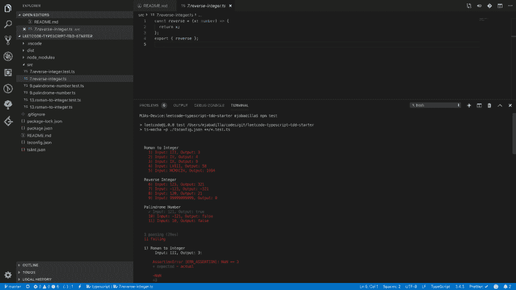
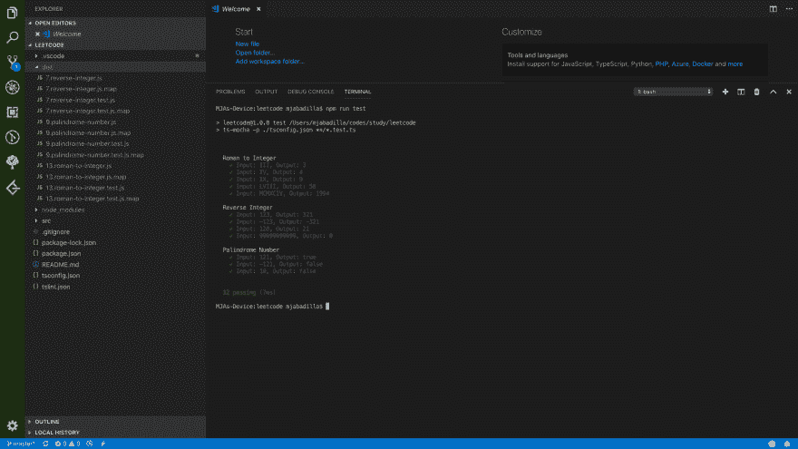

# 使用 Visual Studio 代码、TypeScript 和 TDD 解决 LeetCode 问题

> 原文：<https://dev.to/mjmaix/solve-leetcode-problems-using-visual-studio-code-typescript-and-tdd-ae4>

[用 TS / Mocha / TDD 写的 LeetCode 工作区](https://github.com/mjmaix/leetcode-typescript-tdd-starter)。

我鼓励初学者和爱好者使用这个项目。促使我建立这个项目的一些因素是:

```
1\. In line debugging. It's not every time that we can get the correct solution straight away and I'm not a fan of `console.log` debugging.
2\. Ability to use my favorite text editor (Visual Studio Code) with dark mode
3\. TDD style development. Solve fast but have the ability to re-factor my code with confidence in my (TDD).
4\. Version control your project. 
```

Enter fullscreen mode Exit fullscreen mode

额外的收获是，我将 3 个问题转化为测试案例。

我还想鼓励大家通过 [Pull Request](https://github.com/mjmaix/leetcode-typescript-tdd-starter/pulls) 分享他们的测试用例，尤其是失败提交的失败问题测试用例。

[](https://res.cloudinary.com/practicaldev/image/fetch/s--N28us4VT--/c_limit%2Cf_auto%2Cfl_progressive%2Cq_auto%2Cw_880/https://thepracticaldev.s3.amazonaws.com/i/loautuxk9zo9qw749yt7.png)

[](https://res.cloudinary.com/practicaldev/image/fetch/s--qBesizZ---/c_limit%2Cf_auto%2Cfl_progressive%2Cq_auto%2Cw_880/https://thepracticaldev.s3.amazonaws.com/i/du1za9qvhrio7gacla85.png)

祝你编码愉快！