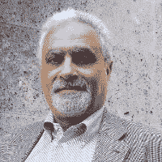

# 解决保护云的难题:首席技术官 Taher Elgamal 谈他在 Salesforce 的角色和密码学的未来

> 原文：<https://dev.to/salesforceeng/solving-puzzles-to-protect-the-cloud-cto-taher-elgamal-on-his-role-at-salesforce-and-the-future-of-cryptography-39b3>

*We caught up with our CTO of Security and chatted quantum computers, hieroglyphics, and web security. Elgamal is the recipient of this year’s [Marconi Prize](http://marconisociety.org/cryptographers-paul-kocher-and-taher-elgamal-awarded-the-2019-marconi-prize/), along with Paul Kocher, with whom he developed SSL3.0.*

Taher Elgamal was born in Egypt and received his undergraduate degree in electrical engineering, but says his first love was math. He came to the United States to pursue a PhD in EE at Stanford, where he met Professor Martin Hellman, the co-inventor of public key cryptography. Having taken more algebra and number theory classes than were strictly required for his degree, Elgamal was uniquely prepared to write his dissertation on cryptography, which he calls was the most beautiful use of math he had ever seen. Breaking code, he says, is like solving puzzles.

But Elgamal did not remain a pure scientist, instead moving into industry straight out of school. From 1995–1998 he worked at Netscape, developers of the first web browser, before leaving to start his own security company, which he eventually sold. From there, he became a consultant, advisor, and board member to around fifty companies over the span of fifteen years. Around 7 years ago, several connections alerted him to the CTO of Security position open at Salesforce, and he’s been here ever since. Working in industry and doing practical work that employed theoretical ideas opened his eyes to the often high cost of running cryptography — but it also underscored just how important it is to protect the data on the internet that is crucial to so many industry verticals.

In his role as CTO of Security, Elgamal’s early job was to determine what was missing at the then-smaller Salesforce in terms of security defenses and protection. As the company has grown, we’ve become a bigger target, but with trust as a top priority, Elgamal feels the security program he’s helped build can compete with any security program at any company, anywhere. Around 50% of his job these days is speaking at events and interacting with Salesforce customers and partners to advise on security matters. The other half of his time is spent acting as a security advisor to different teams internally.

Every year, he says, he’s gotten the opportunity to write a new [V2MOM](https://trailhead.salesforce.com/content/learn/modules/manage_the_sfdc_organizational_alignment_v2mom) — 7, so far — and each has been substantively different: different content, different projects, and even different focuses as the company and the security organization have changed. This is what Elgamal loves most about working at Salesforce. He doesn’t buy it when people in the industry say the cloud is not secure. It’s a natural evolution, he says, and Salesforce is way ahead.

To multiply his efforts, Elgamal is forming a crypto council inside Salesforce, a group that people can come to with questions and guidance on implementing security measures. Elgamal says even the smartest engineers need support when they’re first working on crypto, because there’s one right way and about a million wrong ways to do it.

Expanding that to the industry as a whole, Elgamal sees interesting challenges emerging in the next decade or so as quantum computing becomes a reality. He’s passionate about agility in cryptography, noting that, currently, when changes need to be made because an implementation has been shown to have weaknesses, it causes a big slowdown for security engineers. We can’t wait ten years, Elgamal says, to start the effort to protect against new technologies.

He’s not panicking, though. Every problem in the world has solutions, he says; it’s a matter of who you work with, because no one engineer can fix this on their own. That’s what winning the Marconi Prize this year means to Elgamal; he’s joining a cadre of past winners who have all had an impact on the industry and says the recognition is very satisfying. A technical person’s dream, he says, is that something you do becomes used everywhere, and that’s exactly what’s happened with the SSL/TSL protocol he and Kocher created.

Though he says he doesn’t understand the word “retire,” it’s not all work and no play for Elgamal. He has a wife and two children with whom he loves spending time, and he also reads widely across number theory and ancient history. In fact, he’s learning hieroglyphics so that he can read ancient texts in their original language. He says he enjoys the look on his airplane seatmate’s face when he cracks open a dense book on number theory for some reading in the air; a book of hieroglyphics might raise even more eyebrows!

In his studies, he’s found an Egyptian word, “ohan-ra,” that means extended family, likely connected in some way linguistically to one of our favorites at Salesforce, the Hawaiian word “ohana.” We’re thankful to have Taher Elgamal keeping his experienced eye on the security of our entire tech Ohana and want to extend another congratulations to him o receiving the Marconi Prize on May 17.

*[Originally published](https://engineering.salesforce.com/solving-puzzles-to-protect-the-cloud-cto-taher-elgamal-on-his-role-at-salesforce-and-the-future-of-94c469b9ec0e) by Salesforce Engineering on Medium*