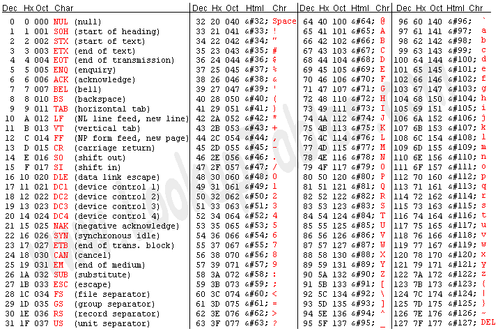

# 用高性能 JavaScript 解决难题

> 原文：<https://dev.to/healeycodes/solving-puzzles-with-high-performance-javascript-3o4k>

过早优化是万恶之源。也是本文的根本。

我喜欢编程拼图。我也喜欢走得*快*。我们将采取一些 LeetCode 问题，并解决它们几次，首先在广义上改善运行时的复杂性，然后寻找小的优化。我们在寻找这些美妙的词语:

> 超过 100.00%的 JavaScript 在线提交速度

我们针对的环境是`nodejs 10.15.0`和`--harmony` ( [来源](https://support.leetcode.com/hc/en-us/articles/360011833974-What-are-the-environments-for-the-programming-languages-))。据我所知，在线法官系统对测试案例使用相对较少的输入。

### 第一个问题

771。珠宝和宝石 ~ *你会得到代表宝石种类的字符串`J`，以及代表你拥有的宝石的字符串`S`。`S`中的每个角色都是你拥有的一种石头。你想知道你有多少宝石也是珠宝。*

一个简单的解决方案是循环遍历我们的宝石，循环遍历每一颗宝石。我们将在本文中使用标准 for 循环，因为它们通常是 JavaScript 中迭代数据的最快方式。

```
var numJewelsInStones = function(J, S) {
    let myJewels = 0;
    // Jewels
    for (var i = 0; i < J.length; i++) {
        // Stones
        for (var j = 0; j < S.length; j++) { // Nested!
            if (J[i] === S[j]) {
                myJewels++;
            }
        }
    }
    return myJewels;
}; 
```

运行时是二次的，`O(N^2)`。他们的在线法官实际上不会接受这个解决方案！我们得到一个大胖子**的时限超过了**。教训？应该尽可能避免嵌套的 for 循环。

让我们抓住一个[设置](https://developer.mozilla.org/en-US/docs/Web/JavaScript/Reference/Global_Objects/Set)来摆脱其中一个循环。将我们的运行时间降低到线性。在 JavaScript 中查一个集合是常数时间，`O(1)`。

```
var numJewelsInStones = function(J, S) {
    const jewels = new Set(J); // Set accepts an iterable object
    let myJewels = 0;
    for (var i = 0; i < S.length; i++) {
        if (jewels.has(S[i])) {
            myJewels++;
        }
    }
    return myJewels;
}; 
```

为此，我们获得了`faster than 97.84%`奖励。我对这段代码很满意。它是高效的和可读的。如果我需要更好的性能，我可能会使用不同于 JavaScript 的技术。我们必须至少走一遍两条绳子的长度，这是不可避免的。我们打不过`O(N)`但是可以优化。

宝石和珠宝被定义为字母。所以`a-z`和`A-Z`。这意味着我们的价值可以落入 52 个不同的桶中！我们可以用布尔数组代替集合。为了将字母转换成数字，我们将通过 [charCodeAt](https://developer.mozilla.org/en-US/docs/Web/JavaScript/Reference/Global_Objects/String/charCodeAt) 使用它的 ASCII 码点。我们将为`true`设置一个索引来代表一颗宝石。

然而，JavaScript 中没有布尔数组。我们可以使用一个标准数组，并将其初始化为长度`52`。或者我们可以使用 [Int8Array](https://developer.mozilla.org/en-US/docs/Web/JavaScript/Reference/Global_Objects/Int8Array) 并允许编译器进行额外的优化。当使用一系列随机字符`0-52`作为`J`和`S`进行基准测试时，类型化数组的速度提高了 6%。

你发现我们的长度错了吗？这是我在测试时忘记的。ASCII 码表上的`z`和`A`之间有 7 个字符，所以所需长度实际上是 59。

[](https://res.cloudinary.com/practicaldev/image/fetch/s--Eo0d2sKT--/c_limit%2Cf_auto%2Cfl_progressive%2Cq_auto%2Cw_880/https://thepracticaldev.s3.amazonaws.com/i/s749km08famo13rnqkwg.png)T3】

```
var numJewelsInStones = function(J, S) {
    const jewels = new Int8Array(59);
    for (var i = 0; i < J.length; i++) {
        jewels[J.charCodeAt(i)-65] = 1;
    }
    let myJewels = 0;
    for (var i = 0; i < S.length; i++) {
        if (jewels[S.charCodeAt(i)-65] === 1) {
            myJewels++;
        }
    }
    return myJewels;
}; 
```

瞧，我们的`100% fastest` [投稿](https://leetcode.com/submissions/detail/229804303/)。在我的测试中，这实际上是设置版本的两倍。我跳过测试的其他优化是缓存长度，使用 while 循环代替 for 循环，并将 incrementor 放在数字之前(`++myJewels` vs `myJewels++`)。

### 第二个问题

[345。反转一个字符串的元音字母](https://leetcode.com/problems/reverse-vowels-of-a-string/) ~ *写一个函数，以一个字符串为输入，只反转一个字符串的元音字母。*

一个简单的解决方案可能是遍历数组两次，在第二次循环时替换。让我们先试试。

```
var reverseVowels = function(s) {
    const vowels = new Set(['a','e','i','o','u', 'A', 'E', 'I', 'O', 'U']);
    const reversed = [];
    let vowelsFound = [];
    // Find any vowels
    for (var i = 0; i < s.length; i++) {
        if (vowels.has(s[i])) {
            vowelsFound.push(s[i]);
        }   
    }
    // Build the final string
    for (var i = 0; i < s.length; i++) {
        if (vowels.has(s[i])) {
            reversed.push(vowelsFound.pop());
        } else {
            reversed.push(s[i]);
        }
    }
    return reversed.join('');
}; 
```

这使我们陷入困境。运行时是线性的，`O(2N) -> O(N)`，它读起来很好，但我不禁认为我们正在比我们必须的多循环一次字符串。让我们试试两点方法。一步一步地从前面和后面同时走进去，交换我们看到的任何元音。如果有一个中间元音，我们就把它去掉。

```
var reverseVowels = function(s) {
    const vowels = new Set(['a','e','i','o','u', 'A', 'E', 'I', 'O', 'U']);
    s = s.split('');
    let front = 0;
    let back = s.length - 1;
    while (front < back) {
        if (!vowels.has(s[front])) {
            front++;
            continue;
        }
        if (!vowels.has(s[back])) {
            back--;
            continue;
        }
        let temp = s[front];
        s[front] = s[back];
        s[back] = temp;
        front++;
        back--;
    }
    return s.join('');
}; 
```

我们减少了一次完整的迭代！这让我们`faster than 98.89%`到了这一步，我们需要记住 LeetCode 的基准并不是决定性的，也不是一致的。对于他们来说，用混合的测试用例运行大量的迭代是不可行的。如果你在练习解谜，停在`97%`以上。但是这不是这篇文章的重点，而且，读者，我将为你得到那个`100%`。

首先我扔掉了那套。元音的数量是恒定的，我们不需要所有的哈希运算。我尝试了一个 switch 语句，但是发现一个链式 if 语句更快。我发现嵌入这个逻辑比嵌入一个函数要快。然后我把它简化成一个表达式。我想说的是:接下来的代码很恶心。这是近距离的谈话。但是..[是](https://leetcode.com/submissions/detail/229918811/) `faster than 100.00%`。

```
var reverseVowels = function(s) {
    s = s.split('');
    let front = 0;
    let back = s.length - 1;
    while (front < back) {
        if (s[front] !== 'a' &&
            s[front] !== 'e' &&
            s[front] !== 'i' &&
            s[front] !== 'o' &&
            s[front] !== 'u' &&
            s[front] !== 'A' &&
            s[front] !== 'E' &&
            s[front] !== 'I' &&
            s[front] !== 'O' &&
            s[front] !== 'U') {
            front++;
            continue;
        }
        if (s[back] !== 'a' &&
            s[back] !== 'e' &&
            s[back] !== 'i' &&
            s[back] !== 'o' &&
            s[back] !== 'u' &&
            s[back] !== 'A' &&
            s[back] !== 'E' &&
            s[back] !== 'I' &&
            s[back] !== 'O' &&
            s[back] !== 'U') {
            back--;
            continue;
        }
        let temp = s[front];
        s[front++] = s[back];
        s[back--] = temp;
    }
    return s.join('');
}; 
```

(不好意思)。

### 第三个问题

509。斐波那契数列 ~ *计算第 n 个斐波那契数列*。

这是一个常见的难题，也是最难改进的运行时，因为在最终的解决方案中几乎没有可移动的部分。我确信一些 RNG 人也参与了李特码的评分。让我们把幼稚的解决方法抛开。斐波那契数列经常被用来教授递归。然而，所使用的算法运行时间为`O(2^n)` ( *非常*慢)。

我实际上是在试图用这个函数计算第 50 项的时候崩溃了一个浏览器标签。

```
var fib = function(N) {
    if (N < 2) {
        return N;
    }
    return fib(N - 1) + fib(N - 2);
} 
```

这个答案我们得到`faster than 36.63%`。哎哟。在生产中，这种难题可以通过记忆化(缓存一些工作以备后用)来解决。这是最好的解决方案，因为我们只计算线性时间`O(N)`内我们需要的值，然后再次运行算法，在该限制下的一项是常数时间`O(1)`。

```
const memo = [0, 1];
var fib = function(N) {
    if (memo[N] !== undefined) {
        return memo[N];
    }
    const result = fib(N - 1) + fib(N - 2);
    memo[N] = result;
    return result
}; 
```

`faster than 94.25%`。LeetCode 不会在每次运行代码之间存储数据，所以我们必须尝试一些不同的方法。我们感兴趣的是计算*序列的一个*数仅仅*一次*。我想我们可以扔掉那个数组。我们来看迭代求解。

```
var fib = function(N) {
    if (N < 2) {
        return N;
    }
    let a = 1;
    let b = 1;
    for (let i = 3; i <= N; ++i) {
        a = a + b;
        b = a - b;
    }
    return a;
}; 
```

如果这看起来与您可能见过的其他迭代版本有一点不同，那是因为我避免了我们必须在 JavaScript 中使用的第三个临时变量来交换值(还有其他方法，但它们太慢了)。我做了一些基准测试，发现用算术代替[是](https://leetcode.com/submissions/detail/229923152/)..`faster than 100.00%`。

* * *

加入我的关于编程和个人成长的[时事通讯](https://buttondown.email/healeycodes)的 150 多人注册！

我发关于科技的微博。