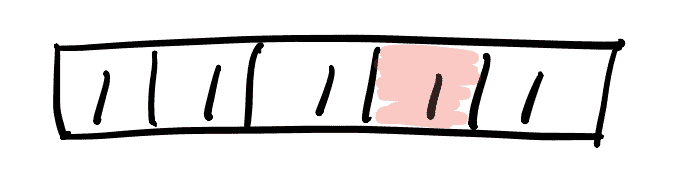
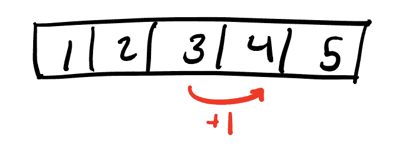

# 背包问题用动态规划法求解背包问题

> 原文：<https://dev.to/downey/solving-the-knapsack-problem-with-dynamic-programming-4hce>

## 什么是背包问题？

考虑一个可以承载一定重量的背包(或称“背包”)。你有一组物品供你使用，每一个都有不同的价值和重量。你想在背包里装满最有价值的物品组合，而又不至于负担过重，超出重量限制。这就是[背包问题](https://en.wikipedia.org/wiki/Knapsack_problem)。这是研究得最透彻的[组合优化](https://en.wikipedia.org/wiki/Combinatorial_optimization)问题之一，也是对[动态规划](https://dev.to/vaidehijoshi/less-repetition-more-dynamic-programming-fl)的通俗介绍。在本帖中，我们将解释背包问题的两种变体:

1.  项目可以重复选择(杂货店的变化)
2.  物品最多可以选择一次(博物馆版本)

不过，在我们深入讨论之前，让我们先简要地讨论一下动态编程需要什么。

## 弯路:动态编程简介

你可能在面试准备过程中听说过“动态编程”这个术语，或者在你过去上过的算法课上熟悉这个术语。在最基本的层面上，动态编程是一种算法设计技术，它包括识别整体问题中的子问题，并从最小的问题开始解决它们。较小子问题的结果被[存储](https://en.wikipedia.org/wiki/Memoization)，或者被存储以备后续较大子问题使用。考虑下面这个阵，*一*:

[](https://res.cloudinary.com/practicaldev/image/fetch/s--YxjtCNpg--/c_limit%2Cf_auto%2Cfl_progressive%2Cq_auto%2Cw_880/https://thepracticaldev.s3.amazonaws.com/i/9y7m98z4pohtvqf9usi9.png)

假设我们想对整个数组进行前缀求和，我们对元素 4(用红色突出显示)特别感兴趣。很简单，只需循环并累加之前的值。现在假设我们想知道元素 5 的前缀 sum。元素 2 呢？我们需要对每一个都循环一遍吗？使用动态编程，我们可以通过使用一个额外的数组 *T* 来记忆中间值，从而更有效地做到这一点。

设 *T[i]* 为元素 *i* 处的前缀和。然后我们可以说 **T[i] = T[i-1] + A[i]** 。这里 *T[i-1]* 表示一个更小的子问题——当前索引之前的所有索引。现在看看下面的数组 *T* 来帮助形象化这一点:

[](https://res.cloudinary.com/practicaldev/image/fetch/s--mjt0iJ9F--/c_limit%2Cf_auto%2Cfl_progressive%2Cq_auto%2Cw_880/https://thepracticaldev.s3.amazonaws.com/i/zzqbnvd9l887x2uyb416.png)

这是一个非常简单的动态编程的例子，但是我们将使用同样的思维过程和技术来解决背包问题。现在回到我们定期安排的节目...

* * *

## 背包问题重述

这次让我们更正式地重述一下这个问题。我们有以下内容:

*   一个能装下总重量 *W* 的背包
*   可供选择的 *n* 个项目的集合
*   这些 *n* 项中的每一项都有一个权重 *w* ，可以从数组 *w <sub>1</sub> 中选择...w<sub>n</sub>T9】*
*   这些 *n* 项中的每一项都有一个值 *v* ，可以从数组 *v <sub>1</sub> 中选择...v<sub>n</sub>T9】*

我们希望从中选择物品的最佳组合，以便在不超过最大重量限制 *W* 的情况下，最大化物品的总价值。

### 我们的背包和物品

为了下面的问题，我们将考虑下面的背包和物品集合:

**背包:***W*= 15
T5】物品:

| **项目** | **重量** | **值** |
| --- | --- | --- |
| one | Two | one |
| Two | Ten | Twenty |
| three | three | three |
| four | six | Fourteen |
| five | Eighteen | One hundred |

* * *

## 重复选择(杂货店变式)

背包问题的第一个变体允许我们重复选择相同的物品并将其放入包中。我称之为“杂货店”的变体，因为我喜欢把它想象成类似于[超市大扫荡](https://en.wikipedia.org/wiki/Supermarket_Sweep)，参与者们争先恐后地往购物车里装满可能价值最高的商品。因为杂货店有很多存货，所以多次挑选同样的商品也没关系。

### 定义我们的子问题

首先让我们定义我们的子问题。让 *w* 的重量小于我们的最大重量 *W* 。或者换句话说， **0 ≤ *w* ≤ *W*** 。鉴于此，我们可以将子问题定义为:

**K( *w* ) =总重量≤*w*T5 时可达到的最大值**

所以基本上，每个子问题将在一个越来越小的重量限制下运行，我们将在这个更小的限制下尝试我们可用的项目。

### 定义我们的循环

**基例:** **K(0) = 0**
**递归:****K(*w*)= max(for(*I*...*n*){ K(*w*-*w<sub>I</sub>)+*v<sub>I</sub>*，if*w<sub>I</sub>*≤*w*})***

我们在这里做的是尝试增加物品的所有可能性，同时考虑该物品导致的重量减少。我们使用 *max()* 函数来确保我们选择产生最高值的子问题参数。我们的基本情况是 **K(0)** 产生值 0，因为没有项目的权重≤ 0。

### 记忆化表格结构

对于这个问题，我们应该能够使用长度从*W<sub>1</sub>T3】到 *W* 的简单一维表格(数组)。在该表的每个索引中，我们将存储在该子权重下可获得的最大值，因为我们能够多次选择相同的项目，所以我们不需要存储关于所选项目的任何信息。*

### Python 实现

下面是 Python 中的一个示例实现。随意调整项目和 *W* 的值，看看会发生什么！

[https://repl.it/@tcdowney/knapsack-repetition?lite=true](https://repl.it/@tcdowney/knapsack-repetition?lite=true)

### 运行时分析

让我们看看上面代码中复杂的部分，并确定它是 Big O 上界。

```
for w in range(1, W + 1):
  max_sub_result = 0
  for i in range(1, n):
    wi = item_weights[i]
    vi = item_values[i]
    if wi <= w:
      subproblem_value = K[w - wi] + vi
      if subproblem_value > max_sub_result:
        max_sub_result = subproblem_value 
  K[w] = max_sub_result 
```

Enter fullscreen mode Exit fullscreen mode

在权重为 *W* 的外部循环中，我们对 *n* 项进行了嵌套循环。在这些循环中，从 **K[]** 开始的比较和查找需要恒定的时间。这意味着我们的算法是由嵌套循环支配的，所以它在时间复杂度上是 O(nW) 。

* * *

## 单选(博物馆变型)

背包问题的第一个变体允许我们最多选择一个物品一次。我称之为“博物馆”变体，因为你可以把这些物品想象成独一无二的艺术品。这里每种物品只有一个，所以即使有一个物品重 1 磅，价值最高，我们也只能把它放在背包里一次。

### 定义我们的子问题

我们这里的方法将非常类似于“重复选择”变体，只是我们现在必须跟踪我们已经使用过的项目。因此，让我们在定义子问题时考虑到这一点！

设 *i* 为我们 *n* 项中的一项，使得 **0 ≤ *i* ≤ *n*** 。
此外，如前所述，让 *w* 的重量小于我们的最大重量 *W* 。或者换句话说，**0≤*W*≤*W***。

给定这些条件，我们可以将子问题定义为:

**K( *i* ，*w*)= 1，...， *i* 总重量≤*w*T9】**

### 定义我们的循环

**基础案例 1:** **K(0， *w* ) = 0**
**基础案例 2:** **K( *i* ，0) = 0**
**递归:**

如果***w<sub>I</sub>*≤*w***:
**K(*I*，*w*)= max(K(*I*-1，*w*-*w<sub>I</sub>【T21)+*v<sub>I</sub>*，K( *i****

这个递归比上一个要复杂一点，我们花点时间来解构一下。我们的基本情况是，当我们处于项目 0 时，它代表项目的空集，或者当我们处于权重 0 时，我们不能再向背包中添加任何项目。因为在这两种情况下都不能添加任何东西，所以我们的最大值是 0。

现在，对于递归，我们首先必须检查我们是否有空间将所讨论的项目添加到背包中。如果我们确实有空间，那么我们尝试两种可能性:

1.  我们将当前物品添加到背包中: **K( *i* - 1，*w*-*w<sub>I</sub>*)+*v<sub>I</sub>***
2.  我们不添加当前项: **K( *i* - 1，*w*-*w<sub>I</sub>*)**

我们通过 *max()* 取这两个场景的最大值。

如果物品不适合放在背包中(即***w<sub>I</sub>*>*w***)，那么考虑我们可能从中获得什么价值就没有意义，我们只是简单地遵循 **K( *i* - 1，*w*-*w<sub>I</sub>*)**路径。

### 记忆化表格结构

由于我们的问题定义 **K( *i* ， *w* )** 采用两个参数，简单的一维数组是不够的。我们将需要一个维度为 0 的二维表... *n* 和 0... *W* 。在该表的每个索引中，我们将存储在子权重 *w* 下每个项目 *i* 可获得的最大值。

剧透，但是对于上面的问题这个表的最终版本会是这样的:

|  | Zero | one | Two | three | four | five | six | seven | eight | nine | Ten | Eleven | Twelve | Thirteen | Fourteen | Fifteen |
| --- | --- | --- | --- | --- | --- | --- | --- | --- | --- | --- | --- | --- | --- | --- | --- | --- |
| Zero | Zero | Zero | Zero | Zero | Zero | Zero | Zero | Zero | Zero | Zero | Zero | Zero | Zero | Zero | Zero | Zero |
| one | Zero | Zero | one | one | one | one | one | one | one | one | one | one | one | one | one | one |
| Two | Zero | Zero | one | one | one | one | one | one | one | one | Twenty | Twenty | Twenty-one | Twenty-one | Twenty-one | Twenty-one |
| three | Zero | Zero | one | three | three | four | four | four | four | four | Twenty | Twenty | Twenty-one | Twenty-three | Twenty-three | Twenty-four |
| four | Zero | Zero | one | three | three | four | Fourteen | Fourteen | Fifteen | Seventeen | Twenty | Twenty | Twenty-one | Twenty-three | Twenty-three | Twenty-four |
| five | Zero | Zero | one | three | three | four | Fourteen | Fourteen | Fifteen | Seventeen | Twenty | Twenty | Twenty-one | Twenty-three | Twenty-three | Twenty-four |

### Python 实现

下面是 Python 中的一个示例实现。取消注释并运行底部的熊猫代码，查看可视化的 2D 表。

[https://repl.it/@tcdowney/knapsack-no-repeat?lite=true](https://repl.it/@tcdowney/knapsack-no-repeat?lite=true)

### 运行时分析

让我们看看上面代码中复杂的部分，并确定它是 Big O 上界。

```
for i in range(1, n):
  for w in range(1, W + 1):
    wi = item_weights[i]
    vi = item_values[i]

    if wi <= w:
      K[i][w] = max([K[i - 1][w - wi] + vi, K[i - 1][w]])
    else:
      K[i][w] = K[i - 1][w] 
```

Enter fullscreen mode Exit fullscreen mode

对这个问题的分析与我们之前所做的非常相似。在 *n* 物品上的外环包含在 *W* 重物上的内环..在这些循环中，比较、*、max()* 和从 **K[][]** 开始的查找需要恒定的时间。这意味着我们的算法是由嵌套循环支配的，所以它在时间复杂度上是 O(nW) 。

* * *

## 总结

这就是背包问题的两个变种，基于表格的动态规划解决方案。希望这篇文章对你有所帮助。如果没有，我至少发现写出来对自己有帮助！

* * *

**封面图片鸣谢:**
*[米切尔·格里斯特](https://unsplash.com/@griestprojects)的《Fjallraven 网格》于 [Unsplash](https://unsplash.com/)*

我觉得这张照片很好地诠释了背包和记忆桌子的概念。😂