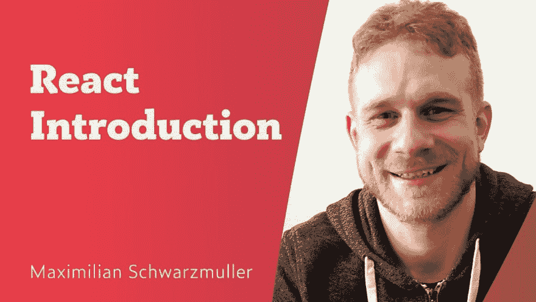
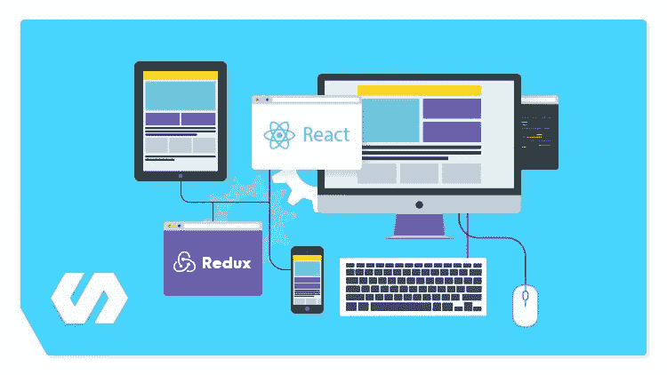

# 学习 React.js 的一些好方法

> 原文：<https://dev.to/realabbas/some-good-ways-to-learn-react-js-55gc>

React.js 是由脸书开发的用于构建用户界面的开源 JavaScript 库。

有很多资源可以用来理解 Reactjs 的基本和高级版本。

作为一名 **MERN 栈开发者**，我已经养成了寻找越来越多 javascript 框架资源的习惯，无论是在 **Pirple、Coursera、Udemy、Udacity** 上的讲座，还是在**Medium.com**上关于任何 js 框架的帖子。

**基础资源:**

[https://www.youtube.com/watch?v=UtIOMUQ7nWM](https://www.youtube.com/watch?v=UtIOMUQ7nWM)

1.  向 Udemy 的顶级导师学习反应技巧- Maximilian Schwarzmuller

1.  **Learn React.js -初学者全教程-由** [提供的教程通过免费的在线课程、编程项目和开发人员工作的面试准备来学习编码。](http://freeCodeCamp.org)

如果你耐心地通读这些讲座，你将在 9 个小时内掌握 Reactjs 基础知识。

**高级资源:**

有一个叫 Mosh Hamedani 的老师，他在 youtube 上上传了一个 React.js 的免费速成班

但是，如果你仔细阅读描述，你会发现他还创建了一整套从初级到高级的 ReactJS 课程。 [**掌握反应**](https://programmingwithmosh.com/courses/react)

2.**Udemy:**【**摩登 React with Redux【2019 更新】| Udemy**

我一直关注斯蒂芬·格里德，顺便说一下，他也是这门课的老师，他的概念非常清晰。

他会教你如何用 React 路由器、Webpack、Create-React-App 来掌握 React v16.6.3 和 Redux。包括所有挂钩。

3.有可用的开源项目，浏览它们的代码和文件结构，它们是如何组织的。你可能只掌握了代码中所写内容的 10%,但是不要担心，很快你也会在 Github 上上传你自己的大项目，其他人也会阅读你的代码来学习很多东西。

4.最后，最重要的资源是框架本身的文档。在我迄今为止的编码和开发生涯中，无论我对这些框架和库的理解是什么，无论你去哪里，无论你将创建什么，你都将在文档的附近，所以要养成反复阅读的习惯。

如果你遇到任何**错误**，在谷歌上搜索一下。你最终会在 **StackOverflow、GitHub issues** 或者最有可能是 **reddit 上找到它。**

调试你的代码，尝试如何解决错误，尽可能多地阅读[媒体上的帖子——这是一个阅读和撰写重要想法和重要故事的地方](http://medium.com)和开源帖子社区。

对于开源的 REACT。学习 JS 项目，请访问 [ReactJS 示例、演示、代码](https://react.rocks/)

来源:[阿里·里兹维博客](https://www.realabbas.com)