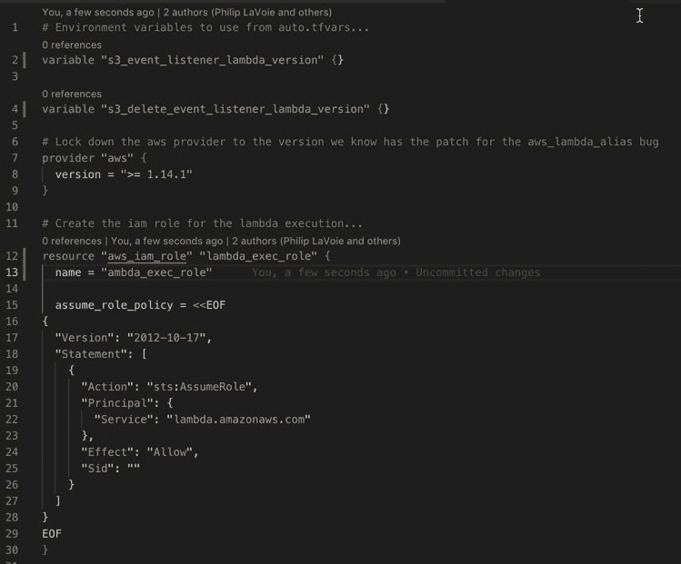
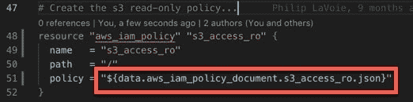
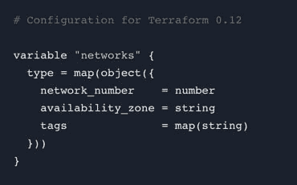
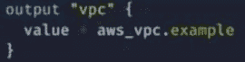
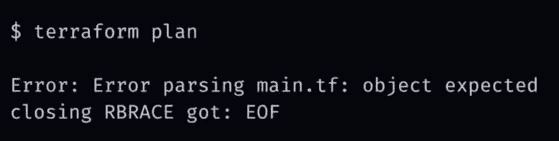
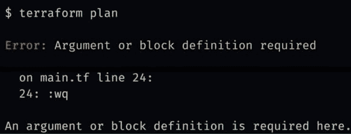
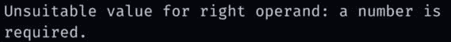
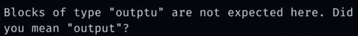

# HashiCorp 的 Terraform 0.12 预览版中的一些简洁的增强

> 原文：<https://dev.to/philiplavoie/some-neat-enhancements-in-hashicorps-terraform-012-preview-1fa>

你好世界，

随着发布日期的临近，我一直在挖掘更多的东西，只是想分享一些我对 Terraform 0.12 预览版感到兴奋的事情。

首先，让我们快速回顾一下 0.11 中的 Terraform 配置语言，为我们讨论新的好东西做好准备...

0.11 中的 Terraform 配置语言由几个不同的部分组成:

1.  HCL - [HashiCorp 配置语言](https://www.terraform.io/docs/configuration/syntax.html) -块和属性语法
2.  HIL - [HashiCorp 解释语言](https://www.terraform.io/docs/configuration/interpolation.html) -允许我们将表达式嵌入到 HCL 字符串中
    *   这包括 Terraform 原生变量和函数——terra form 附带了内置变量和函数。
        *   使用语法名(arg，arg2，...).例如，读取一个文件:${file("path.txt")}。

因此，Terraform 0.12 引入了 HCL 2，这是对底层配置语言的彻底重写。它通过以下方式增强了 HCL:

*   它合并了氯化氢和 HIL
*   它引入了一个健壮的类型系统
*   它包含了社区一直要求的大量特性请求和增强功能。

这些只是即将到来的一些变化:

*   可靠的 JSON 语法
*   For 和 For-Each 表达式
*   广义 Splat 算子
*   一流的表达
*   条件运算符改进和条件省略参数
*   模块输入和输出丰富的值类型
*   模板语法
*   动态块
*   改进的错误消息

尽管这个列表已经变得很棒，但这些是我真正感到兴奋的一些 HCL 增强...

1.  [一级表达式](https://www.hashicorp.com/blog/terraform-0-12-preview-first-class-expressions):以前这些表达式必须用双引号括在插值序列中，比如“${var.foo}”。这在 0.12 预览版中有所改变，表达式现在是语言的一部分，可以像在其他编程语言中一样与原始点符号一起使用。

    *   示例:
        *   foo =有。foo
        *   ami = var.ami[1]
2.  [模块输入和输出丰富值类型](https://www.hashicorp.com/blog/terraform-0-12-rich-value-types) : Terraform 从 Terraform 0.7 开始就支持基本列表和映射作为输入/输出，但元素仅限于简单值。Terraform 0.12 允许任何输入和输出的任意复杂的列表和映射，这包括使用模块。

    *   Terraform 0.12 现在可以表示复杂对象的各个类型。这在 Terraform 的早期版本中是不可能的。下面的示例显示了一个类型规范，对象也可以作为输入和输出在模块之间传递。您可能还会注意到另一个不同之处，即类型没有被引用...类型现在是 Terraform 0.12 中的一级值，可以直接使用。
    *   与之相关的是，您现在也可以从模块中输出整个资源。这消除了与模块创建者/维护者之间的往返，从而将其他值作为输出公开给消费者:
3.  **改进的错误消息**:这无疑是我最喜欢的，原因如下...

    *   这是一条 Terraform 0.11 错误消息。main.tf 可能有数千行长，我们不知道丢失了什么右括号。这是没有帮助的，我们大多数人花时间注释掉大块的代码，直到一些编辑器语法高亮扩展变得可用。
    *   所以在 0.12 中，他们加强了游戏。这是一个 Terraform 0.12 的错误信息。HCL2 解析器保留了关于任何语法元素或标记的位置的详细信息，所以您现在不仅可以得到这个错误来自哪个文件，我们还可以得到一个行号并打印出有问题的那一行！
    *   他们展示的另一个例子是，当试图向字符串中添加数字时，类型检查强制会引发错误。好的 Ol 类型不匹配让我们知道问题是什么，它会告诉我们确切的文件和行。
    *   我对他们演示的最后一个感到♥️的是信息的 git 感觉！是的，我就是这个意思，谢谢你照顾我们！

这是我最喜欢的三个特征。但是老实说，整个增强集使得这不仅仅是一个温和的升级，我期待着实现它。

请随意阅读哈希公司 Terraform 博客上的更多内容:[https://www.hashicorp.com/blog/category/terraform](https://www.hashicorp.com/blog/category/terraform)

大多数都带有前缀*“hashi corp Terraform 0.12 预览版:*，随着发布日期的临近，他们会发布更多内容。

编码快乐！