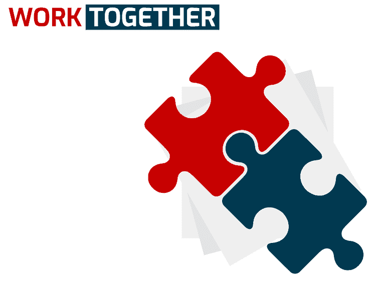

# 软件开发人员在代码之外的一些挣扎

> 原文：<https://dev.to/duranenmanuel/some-of-the-struggles-of-a-software-developer-outside-of-the-code-291c>

*最初发布于[英文脚本](https://enmascript.com/articles/2019/02/21/the-struggles-of-a-software-engineer-outside-of-the-code-editor)T3】*

作为开发人员，我们总是期待着优化代码，尽可能编写最好的、最具性能的、可读的算法，以便拥有一个可理解和可扩展的干净的代码库，我们并不总是在第一次尝试中就成功完成这项任务，但是我们会不断地发展和学习，以便达到一个良好的一致点，在那里我们会感到舒适，然而，作为一名软件开发人员*比仅仅编写代码和优化算法要复杂得多*， 有时这可能会令人不知所措，并不是我们所做的一切都在代码编辑器中，在这篇文章中，我将谈论一些代码之外的*体验，以及作为专业人员，我们如何才能在整体上做得更好，并处理我们工作环境中无法用算法解决的情况。*

### 有非常好的想法？不要强行带入团队，以身作则，用行动说明

我们不断发现自己在寻找改进的地方，由于我们以前的经验，我们有很大的潜力来帮助和避免犯我们或我们的团队过去犯过的错误，这很好，你开始提出想法并与正确的人分享，但有时没有人真正倾听，因为你不是经理，你真的没有能力以简单的方式将这些想法变成现实，如果我们没有被倾听，我们该怎么办？

#### 以身作则

不要试图将你的想法强加/强加给团队，相反，用你的行动展示你的语言没有展示的东西，保持一致，不要强迫任何人按照你的方式做事，也就是说，如果你的想法是工作流程中的一个改进，在日常工作中应用它，但不要吹嘘它，然后在稍后有人会问你为什么这样做，这是解释的正确时机。 如果你没有被问到这个问题，那么你可以采取这一步，和你的经理谈谈，解释你一直在做的事情，并用结果证明为什么这是一个好主意，通常(大多数时候)证明某事有效的最好方法是有*可展示的结果*，你甚至可以准备一个演示或一些设置来帮助用事实解释你的想法。

### 明白你的想法不会永远是最好的，准备好回答问题，坦然接受错误和新观点

**想象一下这个场景:**
团队必须实现这个伟大的新功能，你正在进行头脑风暴，你有了一个如何实现它的惊人想法，
你必须做的第一件事是问自己关于它的问题并找到缺点，然后，当你觉得准备好了，你就举手开始谈论并解释它， 人们会开始同意你，当你认为你的想法会被选中时，另一个伟大的开发者来了，问了一个复杂的问题，你知道有道理，但你以前没有考虑过，所以你不知道答案，*这将发生*，你意识到你的想法可能终究不是正确的，但你已经非常接近了，你不想放弃，你可以做两件事:

#### 1。回嘴希望对方开发者同意你只是因为他不想争论。

这有很多不好的原因...首先，记住和你一起工作的人不是哑巴，他们会注意到你的不对，但他们中的一些人会很友好，喜欢保持沉默，什么也不说。其他人会反驳，你必须回答更复杂的问题，当时一个复杂的问题，你可以继续假装，最后，你会看到人们累了，不再问了，你认为你做得很好吗？你认为你赢了吗？

不...！

你只是在你和你的同事之间创造了一个不健康的环境，他们现在对你有了信任问题，他们不再想进行辩论，提出想法，甚至问问题，只是因为你太傲慢了，不接受你的提议并不完美，它需要一点帮助。

#### 2。诚实地说，你不知道，但要明确表示你愿意接受想法，愿意学习

这是你能做的最好的事情，如果你被问到一个你不知道答案的问题**只要诚实并让人们帮助**，你会一起构建一个更好的解决方案，解决一个问题，你会从你的队友那里得到帮助，如果有人想看起来像聪明的开发者，让你看起来像什么都不知道，你会得到你的团队的支持，诚实并谦逊*永远*，因为你现在知道有更重要的事情。

这里真的没有什么可说的了，诚实地承认不知道是你能做的最健康的事情，每个人都知道你不是完美的，每次你决定承认你不知道一些事情而不是撒谎，这表明你是一个值得信任的人，你不会撒谎来保护自己，让你成为一个不可靠的人。

### 及早沟通，避免事后修补

如果你正在处理一项任务，并且意识到有一个决定你无法独自做出(可能是产品/业务决定)，不要想当然地给出肯定的答案**不要等到最后一刻才问**，在你开始处理任务之前或者在你发现问题的那一刻就做，时间是宝贵的，如果你早点问，你会:

1.  给予更多时间来解决可能出现的意外问题。
2.  把责任交给正确的人。
3.  提高对潜在受影响的开发时间的认识，并帮助您的团队提前重新安排工作和时间。
4.  避免可能的技术补丁或重构。

### 避免误解对你的任务和工作来说，这是真理的源泉

这是一件非常简单但又非常重要的事情，在您的实现中工作时，保持一个可跟踪的真实来源是必不可少的，它不仅对作为开发人员的您有用，而且对产品管理和公司也有用，这将帮助您将所有感兴趣的部分与当前目标保持一致，并确保正在进行的工作是指定的工作，如果其中一个部分要求一些最初没有在标签中捕获的内容，这也将避免误解。

永远善良、尊重、乐于接受帮助并乐于帮助他人！

你有什么经验或建议想分享吗？

好了，从未来读到这篇文章的开发者们，我想现在就这样了。如果你喜欢这篇文章，一定要留下评论并与你的朋友/同事分享...记得你可以在推特上找到我

再见！