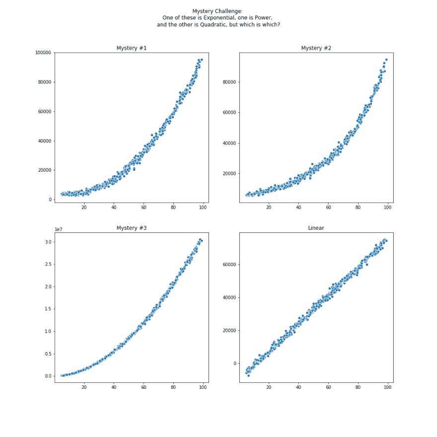
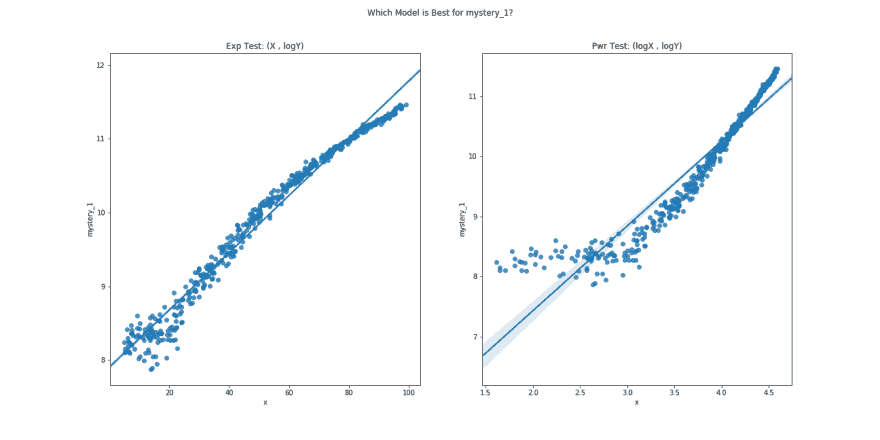
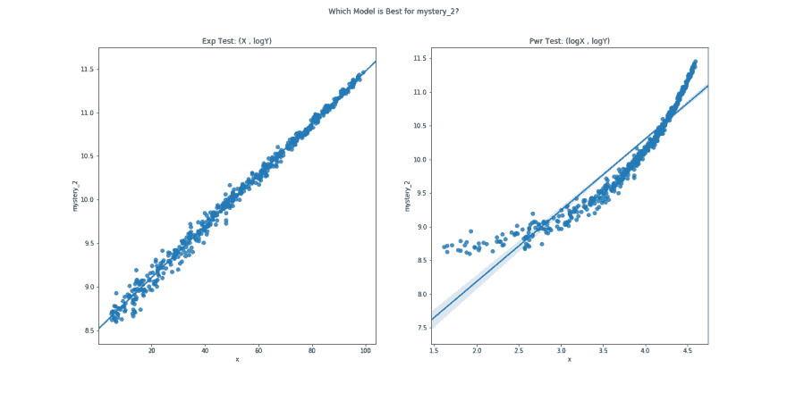
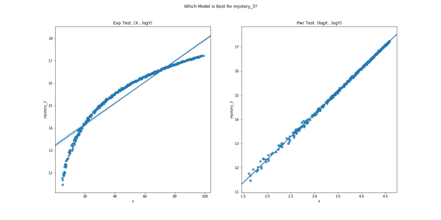

# 有东西在生长，而且生长得非常快，但是有多快呢？

> 原文：<https://dev.to/upwardtrajectory/something-is-growing-and-it-s-growing-very-fast-but-how-fast-1li6>

上周，我谈到了从您已经拥有的列中设计新功能(我使用了哈弗辛公式作为例子)。本周，我想讨论如何使用对数变换来测试数据中的潜在模式是由指数行为引起的:`y=A*B^x`还是一个幂模型:`y=A*x^n`。注意:这是关于使用对数转换来帮助标准化数据的*而不是*，为此，你需要查看这里的[和这里的](https://dev.to/rokaandy/logarithmic-transformation-in-linear-regression-models-why-when-3a7c)或。这个话题离我很近，对我来说很重要，因为我就是这样遇到了我的第一位辅导客户，这位客户十多年来一直影响着我自己的生意。我在一所学校工作，我的一位同事老师(她专门研究化学生物，但在高中阶段经常帮助学习数学)正在兼职做一些辅导，她遇到了一个专注于这个主题的小组项目。她感觉不太自信，知道我那天晚上什么也没做，因为那天早些时候我们刚刚谈过这件事。所以她打电话给我，向我寻求帮助，她付给我 100%她在那个小时从家里赚的钱。后来，她搬走了，并“赐予”我一个推荐，让我去同一个家庭工作。

一晃 10 年过去了，我不再是一名家庭教师，但我决定发挥我的数学专长，转向计算机，特别是数据科学。让我们把它们绑在一起。想象一下，我们已经对熊猫的几个栏目做了一些基本的分析，我们正试图在一个栏目一个栏目的基础上决定哪种增长模式在起作用。让我们从必要的导入开始:

```
import pandas as pd
import numpy as np
import matplotlib.pyplot as plt
import seaborn as sns    # Sidenote: if you haven't tried using the Seaborn library, it's wonderful! I highly recommend that you give it a try. from scipy import stats
from exp_or_poly import mystery_scatter  # Secret function I wrote, don't cheat and look! %matplotlib inline 
```

下面是一些假想的数据。这个函数返回一个熊猫数据帧，我们将把它保存为`df`

```
df = mystery_scatter(n=500, random=False)
df.describe() 
```

[](https://res.cloudinary.com/practicaldev/image/fetch/s--OAaCcpdW--/c_limit%2Cf_auto%2Cfl_progressive%2Cq_auto%2Cw_880/https://github.com/UpwardTrajectory/to_log_or_not_to_log/blob/master/mystery_growth.png%3Fraw%3Dtrue)

|  | x | 谜团 _1 | 神秘 _2 | 神秘 _3 | 线性的 |
| --- | --- | --- | --- | --- | --- |
| 数数 | 500.000000 | 500.000000 | 500.000000 | 5.000000e+02 | 500.000000 |
| 意思是 | 51.595384 | 31372.948633 | 30654.424502 | 1.098368e+07 | 34111.441777 |
| 标准 | 26.416814 | 25954.487664 | 22727.902144 | 8.786530e+06 | 22607.290150 |
| 部 | 5.019101 | 2622.068494 | 5451.400236 | 9.498159e+04 | -7483.112617 |
| 25% | 29.494955 | 8308.838700 | 11995.912686 | 3.070432e+06 | 14698.430889 |
| 50% | 51.622231 | 24277.069057 | 23841.307039 | 9.079029e+06 | 34205.683607 |
| 75% | 73.700855 | 49624.805802 | 43976.822005 | 1.776408e+07 | 52997.927645 |
| 最大 | 98.925990 | 95455.331996 | 94890.894987 | 3.056593e+07 | 75247.568169 |

神秘事件#1、#2 和#3 看起来都很相似，当然#4 看起来是线性的。我们可以对第 1、2 和 3 列运行一系列不同的回归模型，并跟踪 R <sup>2</sup> 值，然后选择最佳值。理论上，这应该是可行的(计算能力如此便宜，这当然不是一个坏主意)，但我想给我们一个更精确的方法来决定，而不是“猎枪”的方法，你只是尝试所有可能的模型。为什么下面的策略起作用的数学是相当优雅的，因为它涉及到将复杂的方程转化为简单的线性形式。我们不会在这里深究代数，[但是你可以去这里代替](https://mathbench.umd.edu/modules/misc_scaling/page11.htm)。现在，我们将练习如何用 Python 实现这一切。

基本思想如下:当观察随着 x 变量增加而向上弯曲的数据时，我们可以绘制两个不同的散点图，并测试它们的线性。无论哪个散点图最接近直线，都会告诉我们显示的是哪种潜在的增长模式。如果`log(x) vs log(y)`变成线性，那么潜在模式来自幂模型增长，但是如果`x vs log(y)`给出更线性的散点图，那么原始数据可能来自指数模型。

首先，让我们把数据框限制在曲线上:

```
curved_data = df.drop('linear', axis=1) 
```

现在，我们将构建一个可以并排显示图形的函数，以便进行比较。

```
def linearity_test(df, x=0):
    '''Take in a dataframe, and the index for data along the x-axis. Then, for each column, 
       display a scatterplot of the (x, log(y)) and also (log(x), log(y))'''
    df_x = df.iloc[:, x].copy()
    df_y = df.drop(df.columns[x], axis=1)

    for col in df_y.columns:
        plt.figure(figsize=(18, 9), )
        # Is it exponential? 
        plt.subplot(1,2,1)
        plt.title('Exp Test: (X , logY)')
        sns.regplot(df_x, np.log(df[col]))
        # Is it power?
        plt.subplot(1,2,2)
        plt.title('Pwr Test: (logX , logY)')
        sns.regplot(np.log(df_x), np.log(df[col]))

        plt.suptitle(f'Which Model is Best for {col}?')
        plt.show()
        plt.savefig(col+'.png')
        plt.close()
        print('')

linearity_test(curved_data) 
```

[](https://res.cloudinary.com/practicaldev/image/fetch/s--ToS7yDqD--/c_limit%2Cf_auto%2Cfl_progressive%2Cq_auto%2Cw_880/https://github.com/UpwardTrajectory/to_log_or_not_to_log/blob/master/mystery_1.png%3Fraw%3Dtrue)

[](https://res.cloudinary.com/practicaldev/image/fetch/s--MaZhnOrG--/c_limit%2Cf_auto%2Cfl_progressive%2Cq_auto%2Cw_880/https://github.com/UpwardTrajectory/to_log_or_not_to_log/blob/master/mystery_2.png%3Fraw%3Dtrue)

[](https://res.cloudinary.com/practicaldev/image/fetch/s--IE1fdY1k--/c_limit%2Cf_auto%2Cfl_progressive%2Cq_auto%2Cw_880/https://github.com/UpwardTrajectory/to_log_or_not_to_log/blob/master/mystery_3.png%3Fraw%3Dtrue)

嗯，`mystery_1`看起来有点不确定，我们稍后再来讨论这个问题。`mystery_2`在 Exp 测试中当然看起来是线性关系，但在功效测试中不是，这意味着该列的增长模式是由指数增长引起的，而`mystery_3`则相反，它在 Pwr 测试中非常明显是线性的，但在 Exp 测试中不是。让我们先来看看我用来构建这些数据的函数:

```
import numpy as np
import matplotlib.pyplot as plt
import seaborn as sns
import pandas as pd

def mystery_scatter(n=100, var=200, random=False):

    '''Randomly generate data, one of which is quadratic, another is exponential,
       and a third is linear.
       Plot all sets of data side-by-side, then return a pandas dataframe'''

    if random == False:
        np.random.seed(7182818)

    '''Generate some data, not much rhyme or reason to these numbers, just wanted everything 
       to be on the same scale and the two curved datasets should be hard to tell apart'''

    x = np.random.uniform(5, 100, n)
    y1 = 11.45 * x ** 2 - 234.15 * x + 5000 + np.random.normal(0, var, n) * np.sqrt(x)
    y2 = 5000 * 1.03 ** x + np.random.normal(0, var, n) * np.sqrt(x)
    y3 = 5000 * x ** 1.9 + np.random.normal(0, 20 * var, n) * x
    y4 = 856.16 * x - 10107.3 + np.random.normal(0, 6 * var, n)

    '''Graph the plots'''

    plt.figure(figsize=(14, 14), )

    plt.subplot(2,2,1)
    sns.scatterplot(x, y1)
    plt.title('Mystery #1')

    plt.subplot(2,2,2)
    sns.scatterplot(x, y2)
    plt.title('Mystery #2')

    plt.subplot(2,2,3)
    sns.scatterplot(x, y3)
    plt.title('Mystery #3')

    plt.subplot(2,2,4)
    sns.scatterplot(x, y4)
    plt.title('Linear')

    plt.suptitle('Mystery Challenge: \nOne of these is Exponential, one is Power, \nand the other is Quadratic, but which is which?')
    plt.show()
    plt.close()

    df = pd.DataFrame([x, y1, y2, y3, y4]).T
    df.columns = ['x', 'mystery_1', 'mystery_2', 'mystery_3', 'linear']
    df.sort_values('x', inplace=True)
    df.reset_index(drop=True, inplace=True)
    return df 
```

特别是，看看数据是如何生成的:

```
x = np.random.uniform(5, 100, n)
y1 = 11.45 * x ** 2 - 234.15 * x + 5000 + np.random.normal(0, var, n) * np.sqrt(x)
y2 = 5000 * 1.03 ** x + np.random.normal(0, var, n) * np.sqrt(x)
y3 = 5000 * x ** 1.9 + np.random.normal(0, 20 * var, n) * x
y4 = 856.16 * x - 10107.3 + np.random.normal(0, 6 * var, n) 
```

因此，我们关于指数增长导致的`mystery_2`(与 y2 相同)是正确的，它是`y2 = 5000*1.03^x`。

同时，`mystery_1`是`y1 = 11.45*x^2 - 234.15*x + 5000`，肯定是从一个二次方程建立起来的，有点像幂模型，但不完全一样。从技术上来说，`log(x) vs log(y)`测试只强制功率模型的线性。为了找到这个问题的精确解，我们将首先排除指数增长和幂增长，然后开始应用“重复公共差异”策略来确定多项式的次数，但我们不会在这里讨论这个问题。

再次关注动力增长:看起来`mystery_3`是由`y3 = 5000*x^1.9`产生的，这绝对是一个动力模型。

附言:如果你想知道这些线条后面的额外的`np.random.normal(...)`是干什么的，它只是添加了一些随机噪声，这样散点图就不会太“完美”了。