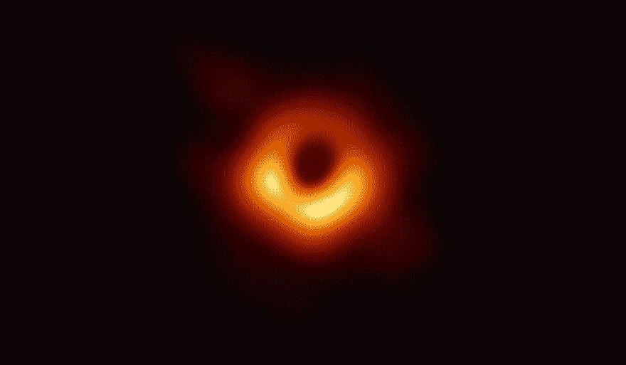

# 声音字节 390:水晶

> 原文：<https://dev.to/pietvandongen/soundbyte-390-crystalline-2dfk>

每当我期待已久的事情结束时，我都会感到悲伤和空虚。事件越大，感觉越差。我清楚地记得在我第一次生日迪斯科舞会结束，我最后一个朋友离开后，我掉进了黑洞。我只是希望它不要结束，我希望快乐和自由永远持续下去。

本周，这种感觉又一次袭击了我，两次。过去几周，我一直在为我女儿的学校夏令营排练一部戏剧，上周四我们进行了演出。和其他家长聚在一起，期待着表演的场景，最后在表演时看到所有小脸上的表情，这是如此有趣。但是之后的悲伤，我真的不需要它。

尽管如此，涨跌不止弥补了下跌，我不会错过它的世界。毫不夸张地说，因为那个星期四也标志着我们的第五届 Luminis DevCon。幸运的是，我带着手机，所以我可以问我的朋友我错过了什么。很多好东西，所以他们都告诉我了。

我尤其为我的同事萨姆·范·盖因感到骄傲，他讲述了他超级有趣的荷兰说唱发生器 T2。萨姆去年还是一名学生，现在他已经在一个真实的现场观众面前做了一次演讲，里面有真实的人。我的几个朋友后来告诉我，这是一次很好的谈话。我可以写一整篇关于我喜欢山姆和他的演讲的帖子，我可能以后会写。

DevCon 本身也是如此。我喜欢我们有一个关于软件工程艺术的年度活动(不仅仅是编程！)，而且几乎所有事情都是我们自己做的。从写论文到创建高质量的项目，从头脑风暴到组织一天的工作，这些都是由我们每天一起工作的同事们完成的。它表明，游客的反馈总是非常积极的。这一点我还可以继续说下去，但我不会。

我想在我开始这篇文章的大事件后回到那种悲伤的感觉。你看，本周我的个人新闻泡沫充满了同样的画面:

我正在观看事件视界望远镜新闻发布会，当他们最终展示出全世界似乎已经等待多年的图像时，我又有了那种感觉。我想，就是这样，这些人把他们的心和灵魂倾注到这个项目中，现在它结束了，完成了，结束了。他们现在到底是什么感觉？不知何故，这个想法伴随了我整整一周。

然后今天早上，我看了一个两岁小孩的演讲，由 Katie Bouman 讲解软件如何帮助她的团队捕捉黑洞的图像:

[https://www.youtube.com/embed/BIvezCVcsYs](https://www.youtube.com/embed/BIvezCVcsYs)

不知为什么，看着它让我如此开心。我想，这太棒了。这些人梦想制造一个地球大小的望远镜，这样他们就可以拍下一百多年前爱因斯坦梦想的东西的照片。然后他们真的去做了！你怎么会为那个 T1 难过呢？太棒了。

我在工作中也有同样的感觉，真的。我真的不太关心我正在编写的软件。不要误解我的意思，我为我的代码感到骄傲，但是我所产生的东西在它的上下文之外没有任何价值。价值来自于参与我们工作的所有其他人:拥有天马行空的想象力和前瞻性思维的董事和客户，设计师和他们对看似不可能的问题的创造性解决方案，关注奖项的项目经理和 Scrum masters，以及确保我们构建人们不知道他们需要的东西的所有其他利益相关者。

从大的范围来看，视界望远镜项目的成就就是一个例子。没有人能独自想象出黑洞，更不用说给它拍照了。但是整个人类肯定可以。突破界限是团队的努力。

现在来听音乐。在本周关于凯蒂·布曼作品的[低劣争议之后](https://www.theverge.com/2019/4/13/18308652/katie-bouman-black-hole-science-internet)，我想起了 2015 年《干草叉》采访中引用的 bjrk 的话:

> 我想支持现在 20 多岁的年轻女孩，并告诉她们:你不只是在胡思乱想。很艰难。一个男人说一次的话，你必须说五次。

所以让我同时做五个女人的工作:比约克是对的。做点什么吧。从她以空间和自然为主题的专辑*中的歌曲*crystal*开始，并从那里开始工作。光是结尾就值得一听。*

[https://www.youtube.com/embed/2PNzytx9EV0](https://www.youtube.com/embed/2PNzytx9EV0)

祝你一周愉快！