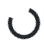
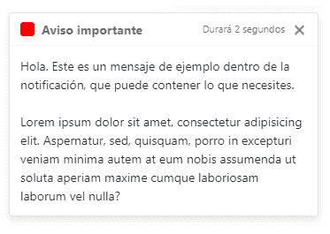
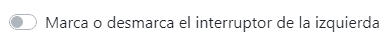

# Bootstrap 4.2 -纺丝器、烤面包通知、开关和其他新功能

> [https://dev . to/campus MVP/bootstrap-42---纺丝器-通知-烤面包开关-y-其他新功能-l0f](https://dev.to/campusmvp/bootstrap-42---spinners-notificaciones-toast-interruptores-y-otras-novedades-l0f)

> 何塞·曼努埃尔·阿拉尔孔在 [campusMVP](https://www.campusmvp.es/recursos/post/bootstrap-spinners-notificaciones-toast-e-interruptores.aspx)

从 4.2 版的[自举](https://getbootstrap.com)开始，对现有的一些控制和增强功能有一些有趣的了解。让我们来看看：

## 纺纱机或负荷和进度指标

在许多情况下，可能需要一段时间才能完成某些进程:加载页面的一部分，甚至加载整个页面；在后台通过 AJAX 进行调用-我...。这种事。在这种情况下，为了让用户觉得某物正在工作，必须等待，通常是*提供某种形式的*反馈*视觉与动画。而这正是 4.2 版中发布的第一个组件的作用所在:“T4”微调器“T5”。*

产生两种不同类型动画的*纺丝器*:

*   **旋转边缘**:显示了一个旋转的圆圈。

[](https://res.cloudinary.com/practicaldev/image/fetch/s--uMUO415y--/c_limit%2Cf_auto%2Cfl_progressive%2Cq_66%2Cw_880/https://www.campusmvp.es/recursos/image.axd%3Fpicture%3D/2019/1T/bootstrap42/bootstrap42-spinner-border.gif)

*   **增长点**:它使用了一个从无到有逐渐增长的点。

[](https://res.cloudinary.com/practicaldev/image/fetch/s--eK2YSPcE--/c_limit%2Cf_auto%2Cfl_progressive%2Cq_66%2Cw_880/https://www.campusmvp.es/recursos/image.axd%3Fpicture%3D/2019/1T/bootstrap42/bootstrap42-spinner-grow.gif)

向页面中添加一个确实很简单:只需将类“`.spinner-border`”或“`.spinner-grow`”分别分配给任何容器元素(如“
”)，其中最简单的表达式如下所示:

```
<span class="spinner-border"></span> 
```

这将创建一个具有默认大小和颜色的旋转边缘类型的*微调器，如上一个动画中的大小和颜色。*

可以通过使用预定义的[引导颜色类](https://getbootstrap.com/docs/4.2/utilities/colors/)来控制其颜色，即`text-primary`、`text-success`等-我...。例如，要有一个红色的递增点作为指标将是:

```
<span class="spinner-grow text-danger"></span> 
```

它们有两种预定义大小:一种是默认大小，另一种是通过将后缀“`-sm`”添加到类名称(“small”)并同时应用两者(“T1”、“T2”和“size”)来实现的较小大小，如下所示:

```
<span class="spinner-border spinner-border-sm"></span> 
```

例如，这对于将它们放入按钮和类似元素中非常有用，这使我们能够在生成某些后台操作(如 AJAX 调用)时产生非常低级的效果，例如:

```
<button class="btn btn-primary text-nowrap" type="button">
  <span class="spinner-border spinner-border-sm mr-2"></span>
  Enviando datos...
</button> 
```

我们的算法是这样的:

[](https://res.cloudinary.com/practicaldev/image/fetch/s--OcXThzA---/c_limit%2Cf_auto%2Cfl_progressive%2Cq_66%2Cw_880/https://www.campusmvp.es/recursos/image.axd%3Fpicture%3D/2019/1T/bootstrap42/bootstrap42-spinner-boton.gif)

请注意，要创建这种类型的*纺丝机，*在 CSS 动画下面使用，而不是 JavaScript。在这两种情况下，所做的工作都是将圆边放置在圆边上，如果圆边是旋转的，则将其放置在四个透明边中的一个上。

这有两个重要的含义:

1.  不需要包括`bootstrap.js`即可运行。
2.  如果将这些类应用于非空元素，则会影响该元素中的所有内容。例如，如果在包含文字的元素中使用`.spinner-border`，则会将所有内容转换为圆形元素并旋转。例如，如果我们有这样的:

```
<div class="spinner-border text-danger">
    <div>Girando!!</div>
</div> 
```

我们将在屏幕上看到这样的动画:

[](https://res.cloudinary.com/practicaldev/image/fetch/s--EMFuIEES--/c_limit%2Cf_auto%2Cfl_progressive%2Cq_66%2Cw_880/https://www.campusmvp.es/recursos/image.axd%3Fpicture%3D/2019/1T/bootstrap42/bootstrap42-spinner-contenido.gif)

在这种情况下，这是一个有点“chuckle”，但它会给你一个机会。

使用 JavaScript，我们可以通过简单地放置或删除相应的类来启动和停止它们。所以它没有什么神秘之处，而且非常容易使用。

### 【纺丝机】的无障碍性

 *为了使屏幕阅读器能够访问这些元素，我们应该做两件事:

*   用类似`role`的空气属性标记它们
*   包含仅在萤幕阅读程式中显示的文字，指出文字的用途

例如这样:

```
<div class="spinner-border text-primary" role="status">
    <span class="sr-only">Procesando...</span>
</div> 
```

在这种情况下，`role="status"`属性表示这个*微调*的功能只是明显的:状态指标。所包含文本的“`sr-only`”类是一种引导辅助功能类，表示它只对屏幕阅读器可见(“T4”屏幕阅读器“”，因此带有前缀)。这样就够了。

## 类型的通知“吐司”

Bootstrap 4.2.0 中包括的另一个新组件使我们能够管理“Toast”通知，当我们希望在几秒钟内发送消息时会显示这些通知。

要构建它们，我们需要使用三个特定的 CSS 类:

*   **`.toast`** :用于封闭通知内容的容器元素。
*   **`.toast-header`** :用于通知的标题。
*   **`.toast-body`** :用于身体。

因此，我们至少需要 3 个要素来建造它，但我们建议增加一些要素，以使它看起来更舒适。通知的基本结构如下:

```
<div class="toast">
    <div class="toast-header">
        Título de la notificación
    </div>
    <div class="toast-body">
        Cuerpo de la notificación
    </div>
</div> 
```

这将带来，但有趣的是，从静态和功能的角度来看，还包括一些其他要素，例如:

```
<div class="toast">
    <div class="toast-header">
        <div class="rounded mr-2" style="height: 16px;width: 16px;background-color: red;"></div>
        <strong class="mr-auto">Título de la notificación</strong>
        <small>Hace 2 segundos</small>
        <button type="button" class="ml-2 mb-1 close" data-dismiss="toast">
          <span aria-hidden="true">&times;</span>
        </button>
    </div>
    <div class="toast-body">
        Cuerpo de la notificación
    </div>
</div> 
```

在这种情况下，我们在标题中加入了一个带有网上风格的小‘t0’，它所做的只是创建一个红色正方形，给人一种更美丽的审美感觉。接下来是标题，这次是粗体，右边有自动边距(类别`.mr-auto`)，我们用小文字表示显示后的时间长度(为示例而手动输入)，最后是用引号(`&times;`表示 HTML 中的 x 乘)来结束通知的项目。

> **注意**:点击引号时关闭通知的效果是通过用 Bootstrap 识别的属性`data-dimiss="toast"`装饰包含引号的元素(按钮)自动实现的，并自动添加此动作。

这将是这一基本通知的内容:

[](https://res.cloudinary.com/practicaldev/image/fetch/s--rJEIs7xb--/c_limit%2Cf_auto%2Cfl_progressive%2Cq_auto%2Cw_880/https://www.campusmvp.es/recursos/image.axd%3Fpicture%3D/2019/1T/bootstrap42/bootstrap4.2-notificacion.png)

但是如果你把上面的代码放在一页上，你就什么也看不见了。默认情况下，通知是隐藏的(准确地说，**具有 A0**的不透明度，因此它们是透明的，并对它们下面的内容产生模糊效果)。

**要使通知**出现，必须使用一点 JavaScript。具体来说，我们要做的就是找到、初始化和显示它们。为此，我们将使用 jQuery，如您所知，jquery 是一个具有引导功能的设备。会是这样的:T2]

```
//Durante la inicialización de la página
$('.toast').toast();

....

//Cuando la queramos mostrar
$('.toast').toast('show'); 
```

`.toast()`方法有多个开销，用于初始化通知以及显示和隐藏通知。默认情况下，在初始化时，它们会应用不透明度动画以显示并在半秒后自动关闭。如果要更改此行为，可以在初始化期间将 JSON 格式的对象更改为`toast()`方法，该对象具有三个可能的属性:

*   **`animation`** :默认情况下为`true`，但如果放入`false`，会立即显示而不显示动画。
*   **`autohide`** :决定是否要自动隐藏。如果我们不想让他躲起来，我们就传给他`false`。
*   **`delay`** :以上设置为默认值或`true`时自动隐藏的时间(以毫秒为单位)。

所以，举例来说，如果我们想让他们自己躲起来，但在 2 秒钟后，而不是半秒钟后，我们可以把:

```
$('.toast').toast({ delay: 2000 }); 
```

和其它属性一样，用逗号分隔它们在我们传递给它的文字对象中。

然后他们还调用同样的方法，但传递字符串`'show'`。如果我们想隐藏它们，我们会把链传给你`'hide'`。我们可以通过链`'dispose'`，它也将隐藏并留在礼物中，但即使我们呼叫`.toast('show');`，也能防止同一通知再次出现。

> **注**:如果要让它们出现在屏幕顶部而不是页面的礼物流中，我们必须使用 CSS 自己定位它们。在通知本身中，使用的显示样式是 Flexbox，因此您可以使用其任何特性(或相应的引导实用程序)来定位和对齐页眉或正文中的子元素。

`toast()`方法是异步的。这意味着，您一打电话给他，他就会回来，即使还没有显示通知，下面的代码也会继续执行。考虑一下吧。

此类元素的 javascript para 还定义了四个事件:

*   **`show.bs.toast`** :调用`toast()`显示元素时跳跃。
*   **`shown.bs.toast`** 在刚刚显示通知时通知，动画后(如果有的话)。
*   **`hide.bs.toast`** :何时开始隐瞒通知。
*   **`hiden.bs.toast`** :当您完成隐藏通知并完全从屏幕上消失后。

## 中断时间估计

表格中通常包含勾选方块，以标记「是」或「否」选项。默认情况下，它们是非常阳极的正方形，您可以选中或取消选中它们，但在配置选项方面，您会发现苹果在其 iPhone 上设置的那种时尚开关更为常见。就像这样:

[](https://res.cloudinary.com/practicaldev/image/fetch/s--jEuLjufk--/c_limit%2Cf_auto%2Cfl_progressive%2Cq_66%2Cw_880/https://www.campusmvp.es/recursos/image.axd%3Fpicture%3D/2019/1T/bootstrap42/bootstrap42-interruptor.gif)

boostrap 通过使用名为“`.custom-switch`”的自定义控制类来定义这些开关，因此必须向其添加此开关以及通用的“`.custom-control`”。此外，还需要在`check`类型的`input`控件和带有相应消息的标签中包含。类似这样的东西:

```
<div class="custom-control custom-switch">
  <input type="checkbox" class="custom-control-input" id="opcion1">
  <label class="custom-control-label" for="opcion1">
    Marca o desmarca el interruptor de la izquierda
  </label>
</div> 
```

从而获得上一个动画中所见的效果。

> 此控制项不需要 JavaScript 即可运作，只需配合 Bootstrap 4 样式表即可。

他所做的下面是隐藏原有的*并把新的元素放入标签的伪元素`::before`，它根据控件的伪类`:checked`改变状态，因此很难改变其外观。*

 *## 引导程序的其他新功能 4.2

除了我刚才解释的内容之外，本版本还有一些新的发展，其中包括:

*   支援转盘上的触控事件，因此除了使用控制项之外，在行动装置上，我们只需用手指拖曳即可变更显示内容。
*   正在验证的表格栏位会显示新的状态图示:`:valid`和`:invalid`。
*   “工具提示”和“*poper”*类型的下拉列表现在与 ShadowDOM 一起工作以获得更高的性能。
*   为外观添加了一些新样式:`.font-weight-lighter`、`.font-weight-bolder`和`.text-decoration-none`。

你可以在这里看到完整的清单。

这里我给你留一个 ZIP 文件 (37.3Kb)，上面有我做的例子，这样你就可以看到它们在行动中并加以测试。

并且，如果你想学习自举，我建议你从校园 MVP 上在线课程[【多设备 web 合成，自举，Flexbox 和 CSS 网格】](https://www.campusmvp.es/recursos/catalogo/Product-Maquetacion-web-multi-dispositivo-con-Bootstrap-Flexbox-y-CSS-Grid_212.aspx) ，我是其中的共同作者和导师。你不仅会在第 3 版和第 4 版中学习自举，而且还会掌握响应性 Web 设计，除了 Flexbox 和 CSS Grid 等最新的 CSS 技术之外，只使用 CSS。

直到结果出来！

> **贴吧原文**:[https://www . campus MVP . es/Recursos/Post/bootstrap-spinners-notifaciones-toast-e-interruptores . aspx](https://www.campusmvp.es/recursos/post/bootstrap-spinners-notificaciones-toast-e-interruptores.aspx)**