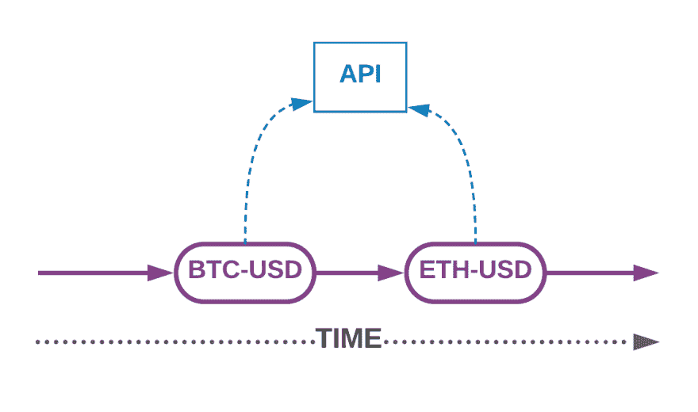
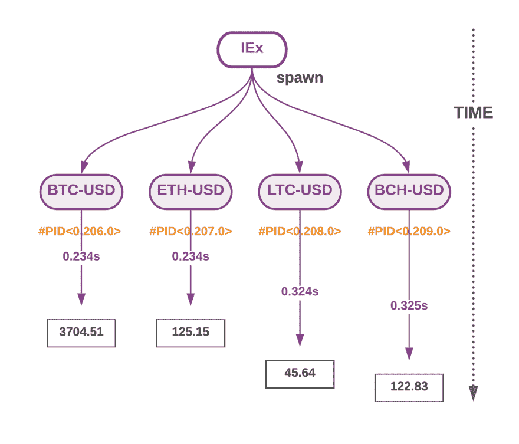

# 在 Elixir 中生成进程，这是对并发性的一个温和介绍

> 原文：<https://dev.to/alvisesus/spawning-processes-in-elixir-a-gentle-introduction-to-concurrency-7g0>

你对仙丹和凤凰有热情吗？订阅 Poeticoding 时事通讯，加入快乐的普通读者，通过电子邮件接收新帖子。

## [T1】简介](#intro)

除了[模式匹配](https://www.poeticoding.com/the-beauty-of-pattern-matching-in-elixir/)，Erlang 和 Elixir 中最酷的事情之一是[他们基于 Actor 模型的并发实现](https://en.wikipedia.org/wiki/Actor_model)。在本文中，我将介绍并发性，并展示我们如何开始使用进程使我们的代码在 Elixir 中并发。

## 并发和 Erlang 进程

我们可以把并发看作是处理同时发生和进行的多件事情。

不要将并发性与并行性相混淆。它们是两个不同的概念，有时像同义词一样使用。我们可以在一个 CPU(或内核)上同时运行多个东西；它们共同进步，但不是并行执行的。

引用罗布·派克的话

> **并发性**是独立执行的事物的组合，通常是功能
> 
> **并行**是同时执行多件事情，可能相关，也可能不相关

[抢派克——并发不是并行](https://vimeo.com/49718712)

一旦我们能够将问题分解成子任务，并使其并发，我们就能够利用多个内核，并行运行不同的子任务。

(关于这一点的更多信息，请订阅邮件列表，以便更新)

## 二郎腿

为了让我们的代码在 Elixir 中并发，我们使用了 [Erlang 进程](http://erlang.org/doc/reference_manual/processes.html)。

如果您来自 Ruby、Python 或 Java 等编程语言，您可能已经使用线程使您的代码并发。

我用 Ruby on Rails framework 开发了很多年，我真的很喜欢 Ruby，他们都以开发服务为乐。在过去的五年里，我也相当广泛地使用了 Python，尤其是利用 Python 社区拥有的奇妙的机器学习库。

但是如果你是用这两种语言中的一种开发的，你可能知道他们有一种叫做 GIL(全局解释器锁)的东西。简而言之，GIL 确保一次只有一个线程可以访问共享内存。不要误解我的意思，GIL 让编写线程安全代码变得更加容易，但也让编写能够在多个内核上并行扩展的代码变得非常困难。

这些语言不是以并发性为主要目标而构建的。并发不仅仅是横向扩展的问题，它是为了模拟真实世界，主要是并发的。Erlang 和 Elixir 并发模型带来了隔离、容错以及协调和分布进程的好方法。

Erlang 进程不是线程。它们甚至不是操作系统进程。Erlang 进程比线程轻，它们占用的内存非常少，上下文切换也快得多。

> 【乔·阿姆斯特朗】@ joeerlErlang 进程在 Erlang VM 中被模拟，就像绿色线程一样——我们喜欢它们，因为这简化了许多问题——其他语言更喜欢效率——我们想要像动态代码升级这样的东西，这对于本地线程来说是很困难的。[twitter.com/pankajdoharey/…](https://t.co/HJCS00yceb)2018 年 6 月 23 日上午 11:33(identity '[:pankaj:λ])@ pankajdoharey@ joeerl 是 Erlang 进程绿色线程？如果是这样，为什么每个 VM 社区都试图放弃它们(例如 Java ),而 Erlang 却拥抱它们？[](https://twitter.com/intent/tweet?in_reply_to=1010485913393254401)[](https://twitter.com/intent/retweet?tweet_id=1010485913393254401)29[T32】97](https://twitter.com/intent/like?tweet_id=1010485913393254401)

Erlang 和 Elixir 是高度并发的，因为进程非常便宜，可以很容易地生成数千个进程，而不需要使用所有的内存。

由于 [web Phoenix 框架](https://phoenixframework.org/)是用 Elixir 构建的，它继承了其高度并发的特性。[几年前，凤凰核心团队进行了一项测试，展示了他们如何在一台 40 个核心、128GB ram 的机器上获得**200 万个**T5】活动 WebSocket 连接。](https://phoenixframework.org/blog/the-road-to-2-million-websocket-connections)

那么，既然一个 Erlang 进程比一个线程和一个 OS 进程要轻，为什么还要叫它*进程*？

> 术语“进程”通常在
> 执行的线程彼此不共享数据时使用，术语“线程”
> 在它们以某种方式共享数据时使用。Erlang
> 中的执行线程不共享数据，这就是它们被称为进程的原因。http://erlang.org/doc/getting_started/conc_prog.html

让我们看看实践中的一些东西。

## 使 HTTP API 调用并发

让我们考虑这个例子。我们有一个简单的`get_price`函数，它发出 HTTP 请求，从[比特币基地 API](https://docs.pro.coinbase.com/#get-product-ticker) 获取加密货币的价格。

```
defmodule Coinbase do
  @coinbase_url "https://api.pro.coinbase.com"

  def get_price(product_id) do
    url = "#{@coinbase_url}/products/#{product_id}/ticker"

    %{"price" => price} =
      HTTPoison.get!(url).body
      |> Jason.decode!()

    price
  end
end 
```

该函数使用[httposin](https://hex.pm/packages/httpoison)和 [Jason](https://hex.pm/packages/jason) 来获得给定`product_id`的价格。

我们还向模块
添加了第二个函数

```
def print_price(product_id) do
    start = System.monotonic_time(:millisecond)

    price = get_price(product_id)

    stop = System.monotonic_time(:millisecond)
    time = (stop - start) / 1000
    IO.puts("#{product_id}: #{price}\ttime: #{time}s")
end 
```

`print_price(product_id)`帮助我们了解`get_price(product_id)`向 API 请求价格并返回结果需要多少时间。我们简单地用一个`start`和`stop`时间戳将函数括起来，然后计算两者之差，得到经过的秒数。

```
start = System.monotonic_time(:millisecond)
...
stop = System.monotonic_time(:millisecond) 
```

因为我们的两个函数都接受一个`product_id`，所以我们可以用它们来获得多种产品的价格。比如对于比特币(BTC-美元)、以太坊(ETH-美元)、莱特币(LTC-美元)、比特币现金(BCH-美元)。

```
Coinbase.print_price "BTC-USD"
Coinbase.print_price "ETH-USD"
Coinbase.print_price "LTC-USD"
Coinbase.print_price "BCH-USD" 
```

或者以一种更好的功能方式

```
["BTC-USD", "ETH-USD", "LTC-USD", "BCH-USD"]
|> Enum.each( &Coinbase.print_price/1 ) 
```

运行这些请求，我们得到更新的价格以及完成每个请求所需的时间。

```
BTC-USD: 3708.29000000  time: 0.125s
ETH-USD: 125.44000000   time: 0.171s
LTC-USD: 45.71000000    time: 0.481s
BCH-USD: 122.91000000   time: 0.187s 
```

每个产品都是按顺序申请的。我们首先请求 BTC 美元并等待响应，然后请求瑞士法郎美元，依此类推...

[](https://res.cloudinary.com/practicaldev/image/fetch/s--BebcsGre--/c_limit%2Cf_auto%2Cfl_progressive%2Cq_auto%2Cw_880/https://1o6jjh24p1t92lcqci49qg8a-wpengine.netdna-ssl.com/wp-content/uploads/2019/03/sequential_requests-1.png)

一个接一个地发出请求的问题是，在这种情况下，没有太多的计算发生，我们的计算机大部分时间都是空闲的，只是在等待服务器的响应。

那么，我们如何一起请求四个价格，而不需要每个请求都必须等待前一个请求完成？

## 产卵二郎腿

使用`spawn/1`函数，我们可以很容易地使前面的请求并发，因此每个请求都是同时发出和执行的。

`spawn(func)`函数创建一个 Erlang 进程，返回一个 PID(一个惟一的进程 ID ),并在这个新进程中运行传递的函数。

```
pid = spawn fn ->
  # our code
end 
```

我们使用 PID 来获取关于进程的信息，进行交互，最重要的是与它进行通信(这是我们将在下一篇文章中看到的)

因此，让我们使我们的请求并发，在自己的进程中运行每个请求。

```
pid_btc = spawn fn -> 
  Coinbase.print_price("BTC-USD")
end

pid_eth = spawn fn -> 
  Coinbase.print_price("ETH-USD")
End
... 
```

或者像我们之前做的那样，我们可以使用一种更简洁的方式来枚举加密货币，并将它们传递给我们希望在不同进程中运行的函数

```
iex> ["BTC-USD", "ETH-USD", "LTC-USD", "BCH-USD"] \
|> Enum.map(fn product_id->  
    spawn(fn -> Coinbase.print_price(product_id) end)
end)

[#PID<0.206.0>, #PID<0.207.0>, #PID<0.208.0>, #PID<0.209.0>]
BTC-USD: 3704.51000000  time: 0.234s
ETH-USD: 125.15000000   time: 0.234s
LTC-USD: 45.64000000    time: 0.324s
BCH-USD: 122.83000000   time: 0.325s 
```

[](https://res.cloudinary.com/practicaldev/image/fetch/s--zt4mdSv_--/c_limit%2Cf_auto%2Cfl_progressive%2Cq_auto%2Cw_880/https://1o6jjh24p1t92lcqci49qg8a-wpengine.netdna-ssl.com/wp-content/uploads/2019/03/concurrent_requests.png)

这一次，每个请求都是同时提出的。`Enum.map`函数枚举产品列表，并为列表中的每个产品生成一个新进程，在其中运行`Coinbase.print_price(product_id)`函数。结果是一个 PID 列表。

# 总结起来

我们看到了产生进程并使我们的代码并发是多么容易。但这仅仅是开始。我们必须打印结果，因为`spawn/1`函数会立即返回一个 PID，而我们无法以传统方式获得结果。为了与流程协调并与它们通信，我们仍然需要检查这个难题的一个重要部分:消息传递，这将在下一篇文章中讨论。

[你对仙丹和凤凰有热情吗？订阅 Poeticoding 简讯，加入快乐的定期读者，通过电子邮件接收新帖子。](https://poeticoding.us19.list-manage.com/subscribe?u=7248ef4d8af185afbbb995cd4&id=b6dcedacc5)