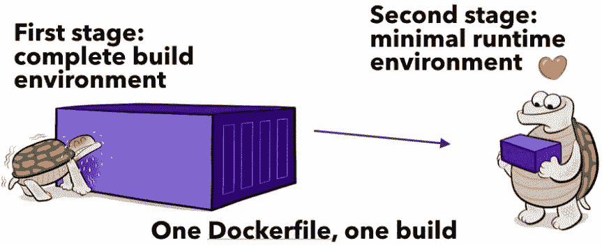
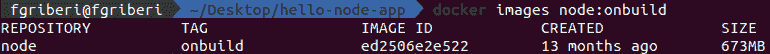
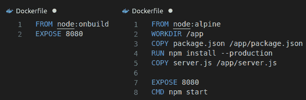
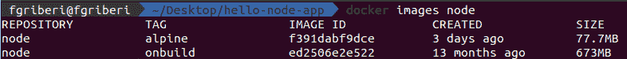
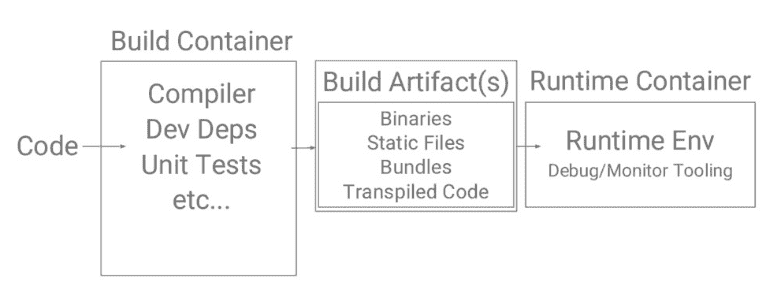
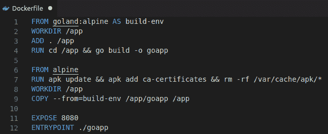
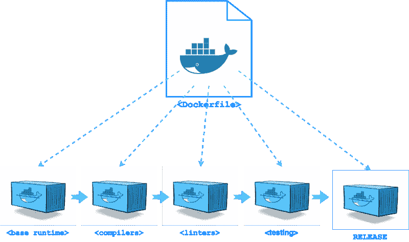

# 通过多阶段构建加速您的 Docker 映像

> 原文：<https://dev.to/fgriberi/speedup-your-docker-images-with-multi-stage-builds-1ipd>

在本帖中，您将了解如何使用[多阶段 docker 构建](https://docs.docker.com/develop/develop-images/multistage-build/)功能，仅使用一个 docker 文件来创建小而安全的容器映像。3

[](https://res.cloudinary.com/practicaldev/image/fetch/s--JcqnAoTY--/c_limit%2Cf_auto%2Cfl_progressive%2Cq_auto%2Cw_880/https://thepracticaldev.s3.amazonaws.com/i/t840a3g5wqc23poza60t.png)

有了 docker，创建映像变得前所未有的简单，你只需要将一个标准的 Docker 文件放入你的源文件夹，指定一个基本映像，添加你的代码，运行 Docker 的“build”命令构建你的映像🏄！您的容器映像已经构建完成！。这太棒了，我们甚至可以用一种更简单的方式来对接遗留应用程序，而无需重新架构。

这种简单的缺点是很容易构建巨大的容器，里面装满了你实际上并不需要的东西。大多数 Docker 镜像使用 Debian 或 Ubuntu 作为基础镜像。虽然这对于兼容性和易上手性很好，但是这些基本映像会增加容器的开销。例如，Node.js 中一个简单的 hello world 应用程序几乎有 700MB，您可能已经知道这个示例只有几 MB 大小。因此，额外的开销是浪费空间，也是安全漏洞和错误的绝佳场所。

[](https://res.cloudinary.com/practicaldev/image/fetch/s--08leilcS--/c_limit%2Cf_auto%2Cfl_progressive%2Cq_auto%2Cw_880/https://thepracticaldev.s3.amazonaws.com/i/2yvqo6vdntg2q9syludt.png)

根据您使用的是解释语言还是编译语言，创建图像的过程会有所不同。所以，让我们开始吧！

如你所知**解释语言**通过直接运行代码的解释器发送源代码。这给了你跳过编译步骤的好处，但是它的缺点是要求你将解释器和代码一起发送。幸运的是，这些语言中的大多数都提供了预构建的 Docker 映像，其中包括一个轻量级环境，允许您运行小得多的容器。

让我们以这个 [Node.js](https://github.com/GoogleCloudPlatform/nodejs-docs-samples/tree/master/containerengine/hello-world) 应用程序为例，不使用*“node:onbuild”*Docker 基础映像，而是使用更小的*“node:alpine”*版本。此版本删除了许多文件和程序，仅保留运行应用程序所需的内容。Alpine Linux 是一个小型轻量级的 Linux 发行版，非常受 Docker 用户的欢迎，因为它兼容许多应用程序，同时仍然保持容器较小。为什么阿尔卑斯山的图像如此之小，以及它们的其他优点，在这里[详细解释](https://thenewstack.io/alpine-linux-heart-docker/)。

[](https://res.cloudinary.com/practicaldev/image/fetch/s--F3J1wY19--/c_limit%2Cf_auto%2Cfl_progressive%2Cq_auto%2Cw_880/https://thepracticaldev.s3.amazonaws.com/i/jsnf7duwflsq1u10sh99.png)

[](https://res.cloudinary.com/practicaldev/image/fetch/s--9pWBVtd_--/c_limit%2Cf_auto%2Cfl_progressive%2Cq_auto%2Cw_880/https://thepracticaldev.s3.amazonaws.com/i/d4zhdoxmtc0keolcd62e.png)

正如您所看到的，从默认的节点映像到较小的基础映像(如 Alpine ),可以显著地将容器的大小缩减 10 倍。

现在想想**静态编译语言**，事先把源代码变成编译代码。因此，编译步骤通常需要运行代码实际上并不需要的工具。然后，结果图像的大小比运行我们的应用程序所需的大小大 4-10 倍，更不用说构建会花费很长时间。

[](https://res.cloudinary.com/practicaldev/image/fetch/s--dySKRP-x--/c_limit%2Cf_auto%2Cfl_progressive%2Cq_auto%2Cw_880/https://thepracticaldev.s3.amazonaws.com/i/cdh1t35fx62ug02oy5ns.png)

一种常见的解决方法是使用构建器模式。它包括使用两个或多个 Docker 图像。在第一个容器(开发、构建工具)中构建代码，然后将编译后的代码打包在最终的容器(生产、运行时)中，不需要编译代码所需的所有编译器和工具。缺点是，您应该维护 2 个以上的 docker 文件，尽管这并不理想，并且您需要使用额外的工具(如 bash 脚本或 YAML 文件)对其进行编排。

*在 [DockerCon 2017](https://www.linkedin.com/pulse/dockercon-2017-highlights-future-girish-shilamkar/) 上，Docker(17.05 或更高版本)推出了一项名为多阶段构建的新功能，该功能有助于从同一 Docker 文件创建多个中间映像。这个概念给了我们构建器模式的好处，而没有维护单独文件的麻烦。*

通过多阶段，您可以在 docker 文件中使用多个 FROM 语句。每个 FROM 指令可以使用不同的映像库，并且每个指令都开始构建的新阶段。您可以使用“复制”命令有选择地将工件从一个阶段复制到另一个阶段，在最终图像中留下您不想要的任何东西。

这非常有用，例如，在最终映像中不包括应用程序构建依赖项，从而允许您拥有一个更小的映像。你可以在这里阅读更多关于多阶段构建的信息。一些好处是:

*   一份文件
*   一个需要学习的语法
*   相同的构建(开发和生产)
*   在本地机器和 CI 服务器上工作
*   可以创建多级管道

因此，让我们以 Go Dockerfile 文件为例:

[](https://res.cloudinary.com/practicaldev/image/fetch/s--D2iI5HJl--/c_limit%2Cf_auto%2Cfl_progressive%2Cq_auto%2Cw_880/https://thepracticaldev.s3.amazonaws.com/i/kjd7oxm7tlqy7tfkto7d.png)

如您所见，命名构建阶段然后引用它们是可能的。默认情况下，阶段是不命名的，您应该使用从 0 开始的数字作为第一个 FROM 指令。您并不局限于从之前在 docker 文件中创建的阶段进行复制。您可以使用 COPY-from 指令从单独的映像进行复制，可以使用本地映像名称、本地或 Docker 注册表上可用的标记或 ID 标记。

```
$ COPY — from=sampleapp:latest …/config.json app/config.json 
```

在生产映像中有一个二进制文件很好，但是开发呢？您可能需要您的构建依赖项，并且建议生产和开发使用相同的 docker 文件。诀窍是使用 build 命令的 target 标志，它允许您指定希望在哪个阶段停止构建。例如，下面的命令假设您正在使用前面的 Dockerfile，但是在名为 build-env 的阶段停止:

```
$ docker build — target build-env -t <image:version> . 
```

这对于调试特定的构建阶段非常有用，我们甚至可以创建这样的管道:

[](https://res.cloudinary.com/practicaldev/image/fetch/s--uyeCyVux--/c_limit%2Cf_auto%2Cfl_progressive%2Cq_auto%2Cw_880/https://thepracticaldev.s3.amazonaws.com/i/grwh1170bp1uibtkjw25.png)

现在，小容器真的有明显的优势吗？答案是肯定的。要弄清楚这一点，可以看看小容器的两个亮点:性能和安全性。谈到性能，您可以考虑构建的时间，将其推送到注册表中，然后从注册表中将其拉下来。为了实现安全改进，你可以使用谷歌漏洞扫描来检查你的容器。

## 包装完毕

在 docker 17.05 之前，构建器模式作为一种变通方法是有效的，但是从这个 docker 版本开始，多阶段构建是创建小图像的一种很好的方式。使用 docker 多阶段构建，我们还可以创建高级管道。从[这里的](https://cloud.google.com/blog/products/gcp/kubernetes-best-practices-how-and-why-to-build-small-container-images)检索主要信息。如果你也想玩多阶段在线游戏，你可以使用[这个](https://www.katacoda.com/courses/docker/multi-stage-builds)。

如果你有任何问题，担心或者你只是想添加你的想法，欢迎你在下面的评论框中这样做。你也可以通过 LinkedIn 联系我😊