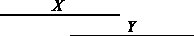

# 拼写

> 原文：<https://dev.to/korenmiklos/spells-221a>

我经常在数据中使用时间符咒。例如，一家公司[可能由不同的经理在不同的时间段管理](https://github.com/korenmiklos/expat-analysis)。gyn yi 于 1996 年 12 月 31 日离开公司，Gábor 于 1997 年 1 月 1 日开始工作。

```
 firm    manager   valid_from    valid_to  
 -------- --------- ------------ ------------   
  123456   Gyöngyi   1992-01-01   1996-12-31    
  123456   Gábor     1997-01-01   1999-12-31 
```

标准的计量经济学工具箱不太适合时间法术。通常，经济学家做的第一件事就是将这些数据转换成他们熟悉的格式:年度面板。(或者每月，或者每周，同样的想法。)

#### 可以通过**时间采样**摆脱时间法术

取若干时间*实例*并选择在该实例有效的观察值。以 1997 年 6 月 21 日在公司的所有经理为例。这就把时间维度降低到了时间戳，更容易研究。

> 为什么是 6 月 21 日？
> 
> 您可能想在 1 月 1 日或 12 月 31 日这样的日期采集数据。由于公司和数据输入用户更喜欢报告四舍五入的日期，这是有潜在危险的。SolidWork 和 Co .可能会在 12 月 31 日报告其所有变更，Hungover Ltd .可能会将报告推迟到 1 月 1 日。如果你在 12 月 31 日取样，你会得到 SolidWork Co .的正确数据，但去年的数据是 Hungover Ltd！为了避免这种围绕圆形日期的聚集，我们在 CEU 微数据公司的标准操作程序是选择一年中的中间一天，而不是圆形:6 月 21 日。这也正好是仲夏。

[](https://res.cloudinary.com/practicaldev/image/fetch/s--UJoYKmG4--/c_limit%2Cf_auto%2Cfl_progressive%2Cq_auto%2Cw_880/https://cdn-images-1.medium.com/max/1600/0%2ATAb4NRUD0n2Iv3kw) 
照片由[罗布森·初夜摩根](https://unsplash.com/@robsonhmorgan?utm_source=medium&utm_medium=referral)在 [Unsplash](https://unsplash.com?utm_source=medium&utm_medium=referral)

这将产生以下数据。

```
firm    manager   year    
 -------- --------- ------   
  123456   Gyöngyi   1992    
  123456   Gyöngyi   1993    
  123456   Gyöngyi   1994    
  123456   Gyöngyi   1995    
  123456   Gyöngyi   1996    
  123456   Gábor     1997    
  123456   Gábor     1998  
  123456   Gábor     1999 
```

#### 这是怎么了？

首先，我们在重复观察。以前是两行现在是八行。这浪费了存储空间，并且严重违反了[干燥原则](https://en.wikipedia.org/wiki/Don%27t_repeat_yourself)。

更糟糕的是，尽管我们的数据集占用了更多的空间，但它包含的信息却更少。我们不知道 gyn yi 于 1992 年开始工作的确切时间，也不知道 Gábor 何时接管。我们甚至不知道他们是否在公司共事过。也许是 1996 年 12 月的大雪？(我们知道 6 月 21 日加博尔还不在那里。)

> 如果你认为这些都是愚蠢的论点，那你就错了。严肃的学术血液已经洒在这上面。我们花了十多年才意识到一家公司的第一年只是一个不完整的年份。

我们忍受所有这些混乱，因为音程会变得棘手。你知道时间间隔之间有 13 种不同的关系吗？ **X** 可能*发生在* **Y** 之前，它们可能*重叠*，可能*结束* **Y** 等等。艾伦的[区间代数](https://en.wikipedia.org/wiki/Allen%27s_interval_algebra)正式捕捉了这些关系。

[](https://res.cloudinary.com/practicaldev/image/fetch/s--1OLGEucA--/c_limit%2Cf_auto%2Cfl_progressive%2Cq_auto%2Cw_880/https://cdn-images-1.medium.com/max/1600/1%2APsE5eMfe79Bxy1Wdmewcrg.png) 
抄送维基媒体

这是令人困惑的，但你不太可能需要所有这些可能的关系。您需要测量哪个间隔更早(例如，排列间隔的开始时间)，并测量重叠。例如，gyn yi 和 Gábor 是否同时在该事务所任职？这是一个*重叠*的问题。gyn yi 可以负责雇佣 Gábor 吗？她比他早到吗？这是一个*优先*的问题。

#### 如果您不想丢失信息，您如何着手对您的数据进行建模？

时间法术有统计模型:它们被称为[生存或危险模型](https://en.wikipedia.org/wiki/Survival_analysis)。你可以对经理的任期进行建模:是什么让一些经理比其他人呆得更久？或者你可以模拟在任职期间*发生的某个事件:女性经理比男性经理更有可能开始出口吗？这里很重要的一点是，有些咒语比其他咒语更长。gyn yi 有五年时间开始出口，Gábor 只有三年时间。*

可以肯定的是，风险模型比线性面板模型更难，但从什么时候开始，困难会阻止你呢？

> 找到适合您的数据的模型。不要折磨你的数据来符合你所知道的模型。

作为一个实际的考虑，许多数据库管理工具实现了所谓的[时态数据库](https://en.wikipedia.org/wiki/Temporal_database)，捕捉实体或关系有效的时间。这使得像上面的例子这样的时态查询变得更加容易。