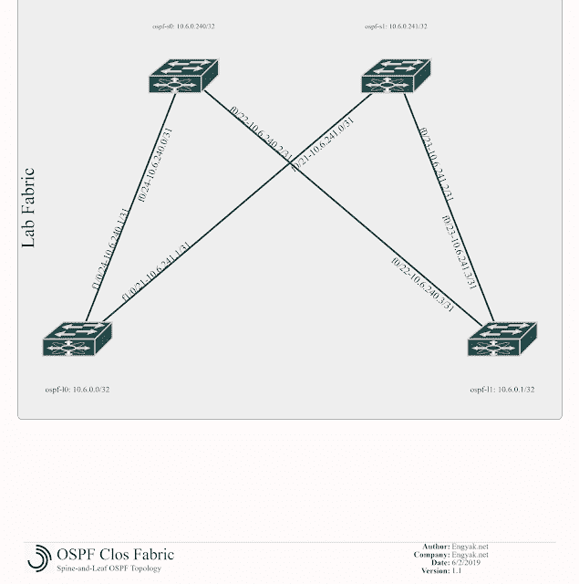
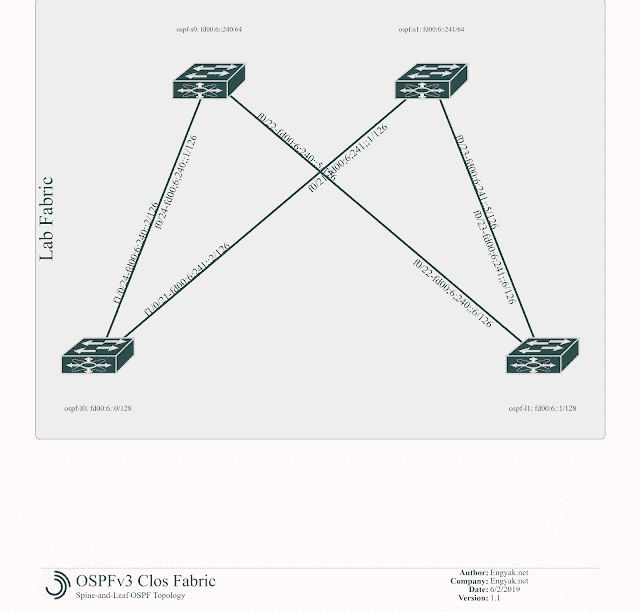

# OSPF 书脊和树叶的实际应用

> 原文：<https://dev.to/ngschmidt/spine-and-leaf-practical-applications-ospf-2lfp>

正如在[上一篇文章中提到的，](https://dev.to/ngschmidt/spine-and-leaf-practical-applications-ripv2-457g-temp-slug-7341634)脊叶织物的基本配置实际上非常简单。这将是相当短的，但我们将涵盖以前建立的结构到 OSPF 的转换。

这是更新后的图表:( [YAML](https://raw.githubusercontent.com/ngschmidt/labfabric-diagram/master/ospf-clos-fabric.yml) )。随着我们转向更成熟的实施，我们将采用双栈技术。

[](https://1.bp.blogspot.com/-geCqFiLDT-0/XPQP8KmfelI/AAAAAAAAAnI/o2Tgr5m_mr02RMShg0ItvGivWR_G2s8fQCLcBGAs/s1600/OSPF%2BClos%2BFabric.png)

对此的清理如下:

```
no router rip 
```

在这里，我们可以在所有设备上配置路由器语句。因为总结是在规划网络时进行的，所以所有网络都是一样的。

```
router ospf 1 ispf log-adjacency-changes nsf cisco network 10.6.0.0 0.0.0.255 area 0 network 10.6.240.0 0.0.1.255 area 0 
```

在生产环境中，如果 ToR 不与任何子节点对等动态路由，您应该在 leafs 上添加*被动接口默认值*。

不出所料，这很管用。现在，设置 IPv6！

```
ospf-s0#conf tEnter configuration commands, one per line. End with CNTL/Z.ospf-s0(config)#ipv6?% Unrecognized command 
```

嗯，看起来 IPv6 要到 IOS 12.2.55 才可用。让我们通过将一台 TFTP 服务器连接到 leaf-1:
来升级这个网络

```
interface FastEthernet0/14 no switchport ip address 10.66.0.1 255.255.255.0!router ospf 1 network 10.66.0.1 0.0.0.0 area 0 
```

我们测试从另一片叶子的可达性——这是一条完全的第 3 层交换路径:

```
ospf-l0#ping 10.66.0.180Type escape sequence to abort.Sending 5, 100-byte ICMP Echos to 10.66.0.180, timeout is 2 seconds:!!!!!Success rate is 100 percent (5/5), round-trip min/avg/max = 1/2/8 ms 
```

然后我们把它复制到 TFTP:

```
ospf-s1#copy tftp flash:Address or name of remote host []? 10.66.0.180Source filename []? c3560-ipservicesk9-mz.122-55.SE6.binDestination filename [c3560-ipservicesk9-mz.122-55.SE6.bin]?Accessing tftp://10.66.0.180/c3560-ipservicesk9-mz.122-55.SE6.bin...Loading c3560-ipservicesk9-mz.122-55.SE6.bin from 10.66.0.180 (via FastEthernet0/23): !!!!!!!!!!!!!!!!!!!!!!!!!!!!!!!!!!!!!!!!!!!!!!!!!!!!!!!!!!!!!!!!!!!!!!!!!!!!!!!!!!!!!!!!!!!!!!!!!!!!!!!!!!!!!!!!!!!!!!!!!!!!!!!!!!!!!!!!!!!!!!!!!!!!!!!!!!!!!!!!!!!!!!!!!!!!!!!!!!!!!!!!!!!!!!!!!!!!!!!!!!!!!!!!!!!!!!!!!!!!!!!!!!!!!!!!!!!!!!!!!!!!!!!!!!!!!!!!!!!!!!!!!!!!!!!!!!!!!!!!!!!!!!!!!!!!!!!!!!!!!!!!!!!!!!!!!!!!!!!!!!!!!!!!!!!!!!!!!!!!!!!!!!!!!!!!!!!!!!!!!!!!!!!!!!!!!!!!!!!!!!!!!!!!!!!!!!!!!!!!!!!!!!!!!!!!!!!!!!!!!!!!!!!!!!!!!!!!!!!!!!!!!!!!!!!!!!!!!!!!!!!!!!!!!!!!!!!!!!!!!!!!!!!!!!!!!!!!!!!!!!!!!!!!!!!!!!!!!!!!!!!!!!!!!!!!!!!!!!!!!!!!!!!!!!!!!!!!!!!!!!!!!!!!!!!!!!!!!!!!!!!!!!!!!!!!!!!!!!!!!!!!!!!!!!!!!!!!!!!!!!!!!!!!!!!!!!!!!!!!!!!!!!!!!!!!!!!!!!!!!!!!!!!!!!!!!!!!!!!!!!!!!!!!!!!!!!!!!!!!!!!!!!!!!!!!!!!!!!!!!!!!!!!!!!!!!!!!!!!!!!!!!!!!!!!!!!!!!!!!!!!!!!!!!!!!!!!!!!!!!!!!!!!!!!!!!!!!!!!!!!!!!!!!!!!!!!!!!!!!!!!!!!!!!!!!!!!!!!!!!!!!!!!!!!!!!!!!!!!!!!!!!!!!!!!!!!!!!!!!!!!!!!!!!!!!!!!!!!!!!!!!!!!!!!!!!!!!!!!!!!!!!!!!!!!!!!!!!!!!!!!!!!!!!!!!!!!!!!!!!!!!!!!!!!!!!!!!!!!!!!!!!!!!!!!!!!!!!!!!!!!!!!!!!!!!!!!!!!!!!!!!!!!!!!!!!!!!!!!!!!!!!!!!!!!!!!!!!!!!!!!!!!!!!!!!!!!!!!!!!!!!!!!!!!!!!!!!!!!!!!!!!!!!!!!!!!!!!!!!!!!!!!!!!!!!!!!!!!!!!!!!!!!!!!!!!!!!!!!!!!!!!!!!!!!!!!!!!!!!!!!!!!!!!!!!!!!!!!!!!!!!!!!!!!!!!!!!!!!!!!!!!!!!!!!!!!!!!!!!!!!!!!!!!!!!!!!!!!!!!!!!!!!!!!!!!!!!!!!!!!!!!!!!!!!!!!!!!!!!!!!!!!!!!!!!!!!!!!!!!!!!!!!!!!!!!!!!!!!!!!!!!!!!!!!!!!!!!!!!!!!!!!!!!!!!!!!!!!!!!!!!!!!!!!!!!!!!!!!!!!!!!!!!!!!!!!!!!!!!!!!!!!!!!!!!!!!!!!!!!!!!!!!!!!!!!!!!!!!!!!!!!!!!!!!!!!!!!!!!!!!!!!!!!!!!!!!!!!!!!!!!!!!!!!!!!!!!!!!!!!!!!!!!!!!!!!!!!!!!!!!!!!!!!!!!!!!!!!!!!!!!!!!!!!!!!!!!!!!!!!!!!!!!!!!!!!!!!!!!!!!!!!!!!!!!!!!!!!!!!!!!!!!!!!!!!!!!!!!!!!!!!!!!!!!!!!!!!!!!!!!!!!!!!!!!!!!!!!!!!!!!!!!!!!!!!!!!!!!!!!!!!!!!!!!!!!!!!!!!!!!!!!!!!!!!!!!!!!!!!!!!!!!!!!!!!!!!!!!!!!!!!!!!!!!!!!!!!!!!!!!!!!!!!!!!!!!!!!!!!!!!!!!!!!!!!!!!!!!!!!!!!!!!!!!!!!!!!!!!!!!!!!!!!!!!!!!!!!!!!!!!!!!!!!!!!!!!!!!!!!!!!!!!!!!!!!!!!!!!!!!!!!!!!!!!!!!!!!!!!!!!!!!!!!!!!!!!!!!!!!!!!!!!!!!!!!!!!!!!!!!!!!!!!!!!!!!!!!!!!!!!!!!!!!!!!!!!!!!!!!!!!!!!!!!!!!!!!!!!!!!!!!!!!!!!!!!!!!!!!!!!!!!!!!!!!!!!!!!!!!!!!!!!!!!!!!!!!!!!!!!!!!!!!!!!!!!!!!!!!!!!!!!!!!!!!!!!!!!!!!!!!!!!!!!!!!!!!!!!!!!!!!!!!!!!!!!!!!!!!!!!!!!!!!!!!!!!!!!!!!!!!!!!!!!!!!!!!!!!!!!!!!!!!!!!!!!!!!!!!!!!!!!!!!!!!!!!!!!!!!!!!!!!!!!!!!!!!!!!!!!!!!!!!!!!!!!!!!!!!!!!!!!!!!!!!!!!!!!!!!!!!!!!!!!!!!!!!!!!!!!!!!!!!!!!!!!!!!!!!!!!!!!!!!!!!!!!!!!!!!!!!!!!!!!!!!!!!!!!!!!!!!!!!!!!!!!!!!!!!!!!!!!!!!!!!!!!!!!!!!!!!!!!!!!!!!!!!!!!!!!!!!!!!!!!!!!!!!!!!!!!!!!!!!!!!!!!!!!!!!!!!!!!!!![OK - 12752912 bytes]12752912 bytes copied in 201.133 secs (63405 bytes/sec) 
```

请注意，这虽然是一个实际应用，但仍然是非冗余的。

**升级加剧**

现在实现 IPv6 如下:( [YAML](https://raw.githubusercontent.com/ngschmidt/labfabric-diagram/master/ospfv3-clos-fabric.yml) )

[](https://1.bp.blogspot.com/-ce0iOBjtAXk/XPQSEvpNH8I/AAAAAAAAAnc/7-UTzFD68x0bOIR0DDTAEsWKryOGBhohgCLcBGAs/s1600/OSPFv3%2BClos%2BFabric%2B%25281%2529.png)

注:我们用了；而不是:由于 drawthe.net 的功能问题。我们使用/126 前缀，因为这是在旧设备上，可能不可靠地支持/127 前缀。

在所有设备上，我们需要启用 ipv6 路由/ OSPFv3:

```
ipv6 unicast-routingipv6 router ospf 2 log-adjacency-changes 
```

然后我们配置每个设备:

```
ospf-l0# configure terminalinterface Loopback0 ip address 10.6.0.0 255.255.255.255 ipv6 address FD00:6::/128 ipv6 ospf 2 area 0interface FastEthernet1/0/21 no switchport ip address 10.6.241.1 255.255.255.254 ipv6 address FD00:6:241::2/126 ipv6 enable ipv6 ospf 2 area 0interface FastEthernet1/0/24 no switchport ip address 10.6.240.1 255.255.255.254 ipv6 address FD00:6:240::2/126 ipv6 enable ipv6 ospf 2 area 0ospf-l1# configure terminalinterface Loopback0 ip address 10.6.0.1 255.255.255.255 ipv6 address FD00:6::1/128 ipv6 ospf 2 area 0interface FastEthernet0/22 no switchport ip address 10.6.240.3 255.255.255.254 ipv6 address FD00:6:240::6/126 ipv6 enable ipv6 ospf 2 area 0interface FastEthernet0/23 no switchport ip address 10.6.241.3 255.255.255.254 ipv6 address FD00:6:241::6/126 ipv6 enable ipv6 ospf 2 area 0ospf-s0# configure terminalinterface Loopback0 ip address 10.6.0.240 255.255.255.255 ipv6 address FD00:6::240/128 ipv6 ospf 2 area 0interface FastEthernet0/22 no switchport ip address 10.6.240.2 255.255.255.254 ipv6 address FD00:6:241::1/126 ipv6 enable ipv6 ospf 2 area 0interface FastEthernet0/24 no switchport ip address 10.6.240.0 255.255.255.254 ipv6 address FD00:6:240::1/126 ipv6 enable ipv6 ospf 2 area 0ospf-s1# configure terminalinterface Loopback0 ip address 10.6.0.241 255.255.255.255 ipv6 address FD00:6::241/128 ipv6 ospf 2 area 0interface FastEthernet0/21 no switchport ip address 10.6.241.0 255.255.255.254 ipv6 address FD00:6:241::1/126 ipv6 enable ipv6 ospf 2 area 0interface FastEthernet0/23 no switchport ip address 10.6.241.2 255.255.255.254 ipv6 address FD00:6:241::5/126 ipv6 enable ipv6 ospf 2 area 0 
```

在这里，我们通过启动从 Leaf-1 上的对向网络到 Leaf-0 的流量，并检查路由表来进行测试:

```
ospf-l1#ping ipv6 fd00:6::Type escape sequence to abort.Sending 5, 100-byte ICMP Echos to FD00:6::, timeout is 2 seconds:!!!!!Success rate is 100 percent (5/5), round-trip min/avg/max = 0/1/8 msospf-l1#show ip routeCodes: C - connected, S - static, R - RIP, M - mobile, B - BGP D - EIGRP, EX - EIGRP external, O - OSPF, IA - OSPF inter area N1 - OSPF NSSA external type 1, N2 - OSPF NSSA external type 2 E1 - OSPF external type 1, E2 - OSPF external type 2 i - IS-IS, su - IS-IS summary, L1 - IS-IS level-1, L2 - IS-IS level-2 ia - IS-IS inter area, * - candidate default, U - per-user static route o - ODR, P - periodic downloaded static routeGateway of last resort is not set 10.0.0.0/8 is variably subnetted, 8 subnets, 2 masksO 10.6.0.0/32 [110/3] via 10.6.241.2, 00:03:58, FastEthernet0/23 [110/3] via 10.6.240.2, 00:03:58, FastEthernet0/22C 10.6.0.1/32 is directly connected, Loopback0O 10.6.240.0/31 [110/2] via 10.6.240.2, 00:03:58, FastEthernet0/22O 10.6.0.240/32 [110/2] via 10.6.240.2, 00:03:58, FastEthernet0/22O 10.6.241.0/31 [110/2] via 10.6.241.2, 00:03:58, FastEthernet0/23O 10.6.0.241/32 [110/2] via 10.6.241.2, 00:03:58, FastEthernet0/23C 10.6.240.2/31 is directly connected, FastEthernet0/22C 10.6.241.2/31 is directly connected, FastEthernet0/23ospf-l1#show ipv6 routeIPv6 Routing Table - Default - 11 entriesCodes: C - Connected, L - Local, S - Static, U - Per-user Static route B - BGP, R - RIP, D - EIGRP, EX - EIGRP external ND - Neighbor Discovery O - OSPF Intra, OI - OSPF Inter, OE1 - OSPF ext 1, OE2 - OSPF ext 2 ON1 - OSPF NSSA ext 1, ON2 - OSPF NSSA ext 2O FD00:6::/128 [110/2] via FE80::216:C8FF:FE04:4741, FastEthernet0/22 via FE80::223:4FF:FE42:F3C2, FastEthernet0/23LC FD00:6::1/128 [0/0] via Loopback0, receiveO FD00:6::240/128 [110/1] via FE80::216:C8FF:FE04:4741, FastEthernet0/22O FD00:6::241/128 [110/1] via FE80::223:4FF:FE42:F3C2, FastEthernet0/23O FD00:6:240::/126 [110/2] via FE80::216:C8FF:FE04:4741, FastEthernet0/22C FD00:6:240::4/126 [0/0] via FastEthernet0/22, directly connectedL FD00:6:240::6/128 [0/0] via FastEthernet0/22, receiveO FD00:6:241::/126 [110/1] via FastEthernet0/22, directly connectedC FD00:6:241::4/126 [0/0] via FastEthernet0/23, directly connectedL FD00:6:241::6/128 [0/0] via FastEthernet0/23, receiveL FF00::/8 [0/0] via Null0, receive 
```

注意:从技术上讲，我们不必用 OSPFv3/RIP-ng/EIGRP 对 IPv6 中的叶-脊-叶链路进行编号，但这是我的个人偏好，以便与未来的设计保持一致，并便于故障排除。

与往常一样，这里是示例配置[。](https://github.com/ngschmidt/lab-clos-fabric-configs/tree/master/OSPFv2-3-Configs)