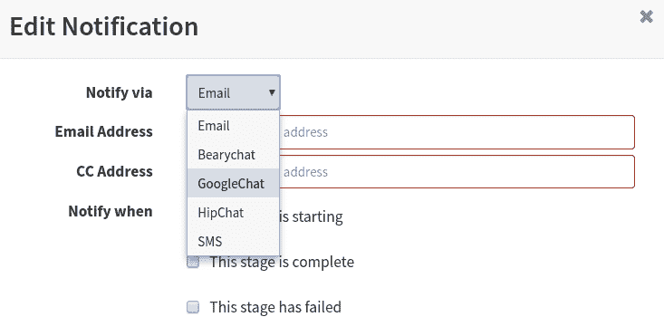
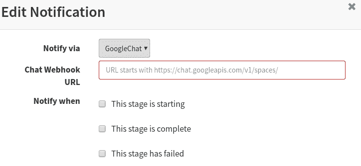
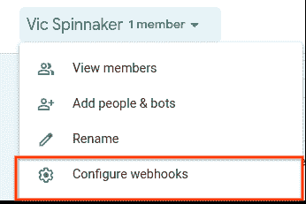
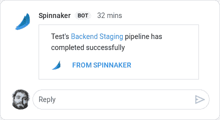

# Google Hangouts 聊天中的 Spinnaker 通知

> 原文：<https://dev.to/vicnastea/spinnaker-notifications-in-google-hangouts-chat-5bg8>

几周前，我开始构建一些 Spinnaker 管道，我想确保在它们由于某种原因失败时引起我的注意。当在 Spinnaker 下拉列表中寻找可能的通知时，我惊喜地看到 [Google Hangouts 聊天](https://gsuite.google.com/products/chat/)作为一个选项，因为它是我工作时间的主要聊天内容。

[](https://res.cloudinary.com/practicaldev/image/fetch/s--avyQOGx2--/c_limit%2Cf_auto%2Cfl_progressive%2Cq_auto%2Cw_880/https://thepracticaldev.s3.amazonaws.com/i/otf9zpa2dh1lwcf1c1b8.png)

虽然我已经能够发送电子邮件通知，但我对将通知发送到 Google Hangouts Chat 感兴趣，这样我就可以将它们发送到我们的一个房间，而不是邮件列表或个人。

接下来，我试图弄清楚我需要配置什么来触发这些通知。我查看了 Spinnaker 文档，但是没有找到任何与此集成相关的内容。在仔细阅读负责通知的 Spinnaker 组件 [echo](https://github.com/spinnaker/echo) 的代码时，我偶然发现了需要设置的[属性](https://github.com/spinnaker/echo/blob/0c19f490bb10ea235e4e557340a1640c18e2cffa/echo-notifications/src/main/groovy/com/netflix/spinnaker/echo/config/GoogleChatConfig.groovy#L34)。我四处寻找可以配置该属性的位置。

我的 Spinnaker 安装是由 [Halyard](https://www.spinnaker.io/reference/halyard/) 设置的，它是管理 Spinnaker 安装的实际工具。不幸的是，Halyard 还没有我需要的命令来启用 Google Hangouts 聊天集成，所以我不得不深入配置文件来手动编辑它们。

我查看了[定制配置文档](https://www.spinnaker.io/reference/halyard/custom/#custom-service-settings)，提醒自己哪里需要添加我的更改。然后，我用以下内容创建了我的`echo-local.yaml`文件:

```
googlechat:
  enabled: true 
```

在用这个改变更新我的安装之后，聊天被启用了，但是还没有完全配置好。我需要告诉 Spinnaker 何时何地发送通知。

我去了我最喜欢的管道，找出我需要为它配置什么来发送通知到一个特定的聊天室。我看到了以下设置:

[](https://res.cloudinary.com/practicaldev/image/fetch/s--485ixCc_--/c_limit%2Cf_auto%2Cfl_progressive%2Cq_auto%2Cw_880/https://thepracticaldev.s3.amazonaws.com/i/2tx9zw7cqwro763qbzi1.png)

我唯一需要提供的是我的“聊天网站链接”的链接。要找到它，我需要去我创建的房间，然后点击“配置 webhooks”:

[](https://res.cloudinary.com/practicaldev/image/fetch/s--xi0NL7Ox--/c_limit%2Cf_auto%2Cfl_progressive%2Cq_auto%2Cw_880/https://thepracticaldev.s3.amazonaws.com/i/lnlz7y5sg4sur5etdvwp.png)

然后，我可以用创建一个新的 webhook，然后将我的 Webhook URL 复制到 Spinnaker 通知对话框中。配置完成后，我开始收到如下通知:

[](https://res.cloudinary.com/practicaldev/image/fetch/s--VIfELeR7--/c_limit%2Cf_auto%2Cfl_progressive%2Cq_auto%2Cw_880/https://thepracticaldev.s3.amazonaws.com/i/4p3mcxhramxw3524yxvl.png)

接下来，向 Spinnaker 文档提交 PR。