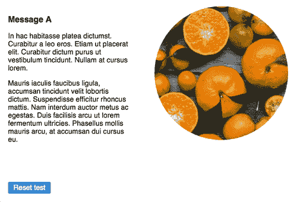
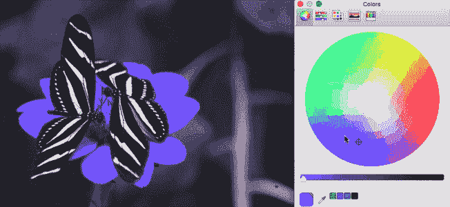
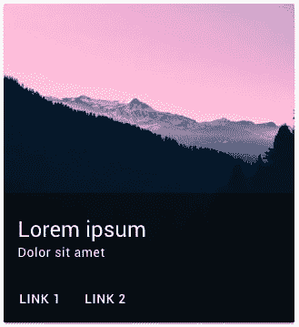
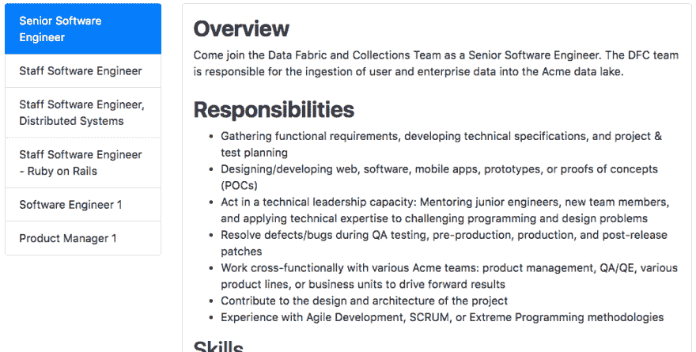

# 分割测试、图像色调变化、弹出表单及更多|模块星期一 30

> 原文：<https://dev.to/tyrw/split-testing-image-hue-change-popup-form--module-monday-30-2a9l>

## 5 个你可以在任何地方使用的开源网站模块

下面的一切都是开源的，可以在你选择的任何项目中免费使用。Anymod 可让您快速向任何网站或网络应用添加功能。

单击一个 mod 来查看它的运行及其源代码。

## 分割测试

为任何平台创建定制的分割测试。

[视图对](https://anymod.com/mod/mllmnd?v=20)视图

 [
T4】](https://anymod.com/mod/mllmnd?v=20)

## 图片休变

点按以更改图像的色调。

[视图对](https://anymod.com/mod/dkklrn?h1=33&h2=100&v=35)视图

 [
T4】](https://anymod.com/mod/dkklrn?h1=33&h2=100&v=35)

## 弹出表格

按下按钮时向上滑动的材料设计表单。

[视图对](https://anymod.com/mod/mllmnm?v=20)视图

 [
T4】](https://anymod.com/mod/mllmnm?v=20)

## 带链接的材料设计卡片

漂亮的卡片，随时可用。

[视图对](https://anymod.com/mod/kbolm?v=32)视图

 [
T4】](https://anymod.com/mod/kbolm?v=32)

## 职务公告板

向任何页面添加作业并轻松编辑它们。

[视图对](https://anymod.com/mod/onmmk?v=20)视图

 [
T4】](https://anymod.com/mod/onmmk?v=20)

* * *

我每周一都会在这里发布新的模块，希望你会觉得有用！

快乐编码✌️