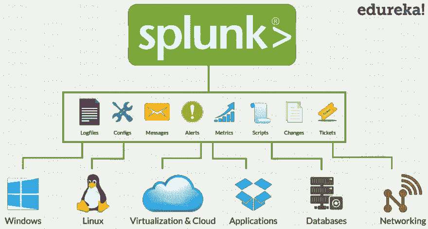
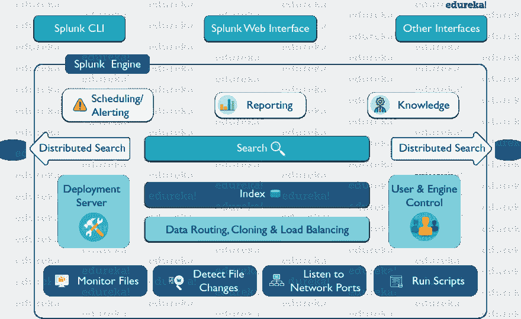
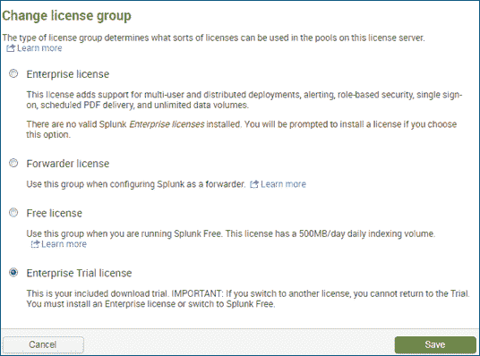

# Splunk 初学者教程:使用 Splunk 探索机器数据

> 原文：<https://dev.to/aayushi94/splunk-tutorial-for-beginners-explore-machine-data-with-splunk-3g18>

在这篇博客中，我将谈论最流行的分析工具之一 Splunk，它正在大数据和运营智能领域赢得人心。它是一项横向技术，用于应用程序管理、安全性和合规性，以及业务和 Web 分析，对接受 Splunk 认证培训的专业人员有巨大的市场需求。Splunk 是一个完整的解决方案，有助于搜索、分析和可视化从不同机器生成的日志。通过本 Splunk 教程，我将向您介绍 Splunk 的各个方面，并帮助您了解一切是如何结合在一起的，以便从中获得真知灼见。

但在我开始之前，让我列出我将讨论的主题:

Splunk 及其优势
架构
Splunk 定价
配置文件

## Splunk 简介

在开始使用 Splunk 之前，您是否意识到非结构化数据和实时日志带来的挑战？例如，实时客户查询、不断增加的日志数量，通过这些日志，数据集的大小每分钟都在波动。如何解决所有这些问题？在这里，Splunk 来了。

Splunk 是一站式解决方案，因为它自动从各种来源提取数据，并接受任何格式的数据，例如。csv、json、配置文件等。此外，Splunk 是最容易安装的工具，支持搜索、分析、报告以及可视化机器数据等功能。它在 It 基础设施和业务方面有着巨大的市场。业内许多大公司都在使用 Splunk，如多米诺、Adobe、博世、沃达丰、可口可乐等。

如上图所示，Splunk 有一些非常酷的优势:

-Splunk 从多个系统实时收集数据
-它接受任何形式的数据，例如日志文件。csv、json、config 等。
-Splunk 可以从数据库、云和任何其他操作系统中提取数据
-它分析和可视化数据以获得更好的性能
-Splunk 发出警报/事件通知
-提供实时可见性
-它满足行业需求，如横向可扩展性(并行使用多个系统)

## Splunk 架构

Splunk 的架构由各种组件及其功能组成。请参考下图，该图给出了流程中涉及的组件的综合视图:

如上图所示，splunk CLI/ splunk web 界面或任何其他界面都会与搜索头进行交互。这种通信通过 Rest API 进行。然后，您可以使用 search head 进行分布式搜索，为运营智能设置知识对象，执行计划/警报，以及创建可视化报告或仪表板。您还可以运行脚本来自动将数据从远程 Splunk 转发器转发到预定义的网络端口。之后，您可以实时监控即将到来的文件，分析是否有任何异常，并相应地设置警报/提醒。在将数据存储到索引器之前，您还可以对来自转发器的数据执行路由、克隆和负载平衡。您还可以创建多个用户来对索引数据执行各种操作。

## Splunk 定价

在索引数据时，首先会出现的问题是“这要花多少钱？”。这完全取决于您要索引的卷。所以，简而言之:

“索引数据越多，付费越少”

Splunk 主要有两个版本:

-在 Splunk 免费版中，您每天可以收集和索引高达 500 MB 的数据。它只能由一个用户使用，您可以在其中搜索、分析和可视化数据。
-Splunk 企业版每月起价 225 美元。对用户没有限制，每天可以扩展无限量的数据。您可以获得企业级支持，也可以在自己的云中进行内部部署，或者使用 Splunk 云服务。您可以执行无限制的搜索，并相应地对其进行监控。企业版有很多这样的优势。

我们有不同类型的许可证，参考下面的截图。

-企业试用许可证:您可以每天索引 500MB，但此许可证的有效期仅为 60 天。您已经启用了所有功能，如警报、多用户访问、分布式搜索、集群等。现在 60 天后，它会将此许可证转换为免费许可证。免费许可证:在免费许可证中，你将没有任何用户访问控制，它将只适用于一个用户(管理员)。将不会有任何用户帐户可用，集群，分布式搜索，甚至警报将被禁用。因此，它仅用于执行日志收集&日志分析。
-转发器许可证:无论何时设置重型转发器，您都应该在其上安装转发器许可证，然后只有 Splunk 实例会变成重型转发器。

## Splunk 教程:配置文件

配置文件在 Splunk 环境的运行中起着非常重要的作用。这些配置文件包含 Splunk 系统设置、配置设置和应用程序配置设置。您可以编辑这些文件，相应的更改将反映在您的 Splunk 环境中。但是，只有重新启动 Splunk 实例，对配置文件所做的更改才会生效。

这些配置文件可以在以下位置找到:

$ SPLUNK _ HOME/etc/system/default
$ SPLUNK _ HOME/etc/system/local
$ SPLUNK _ HOME/etc/apps/

存储这些配置文件的路径在所有操作系统中都是一致的。它们总是存储在安装 SPLUNK 的目录 SPLUNK _ HOME 中。还有另一个存储配置文件的路径:$SPLUNK_HOME/etc/users。在此文件夹中，将存储用户界面中的用户特定设置、用户特定配置和首选项。作为管理员，您还可以存储多个 Splunk 用户的用户特定设置。

您在 UI 中看到的一切都可以通过配置文件进行配置/修改。事实上，有许多选项不能通过用户界面编辑，但可以通过 CLI 或直接编辑配置文件来编辑。继续 splunk 教程，让我们了解并讨论这些配置文件的结构。

**配置文件结构**

每个配置文件由一个或多个节组成。每个节都以方括号中的节头开始，后面是文件设置。每个设置都是一个属性值对，其中属性区分大小写。下面是包含多个节的配置文件的基本模式。

[1 号房]
=

**例如:**

[SSL]
服务器证书=
密码=

在这篇 Splunk 教程博客的最后一节，我将讨论 Splunk 中最常见的配置文件:

inputs . conf
outputs . conf
props . conf
saved searches . conf
indexes . conf
authentic ation . conf
authorize . conf

Splunk 教程博客到此结束。我敢肯定，到现在为止，你们中的大多数人已经理解了 Splunk 的基本原理，所以你们可以开始索引数据并从中获得见解。

来源: [Edureka](https://www.edureka.co/blog/splunk-tutorial)