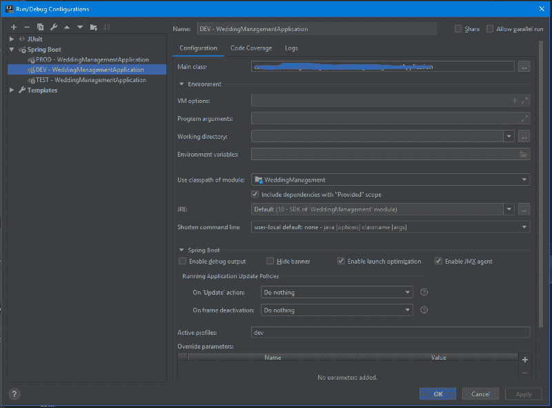
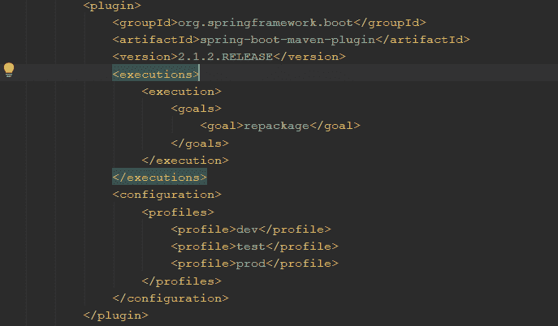
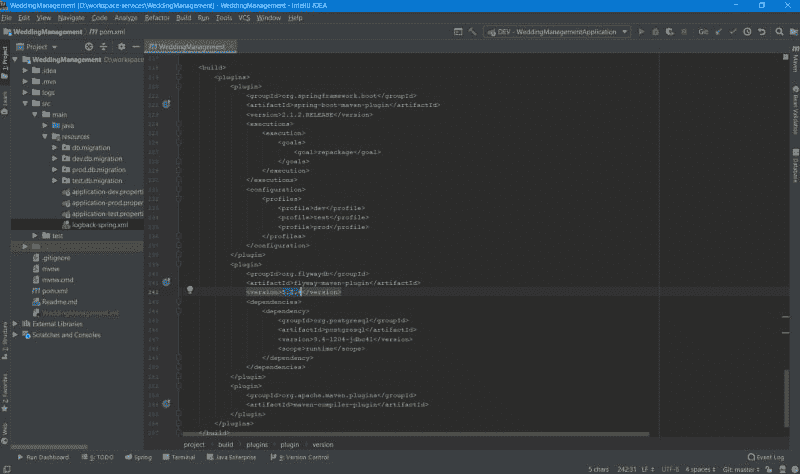
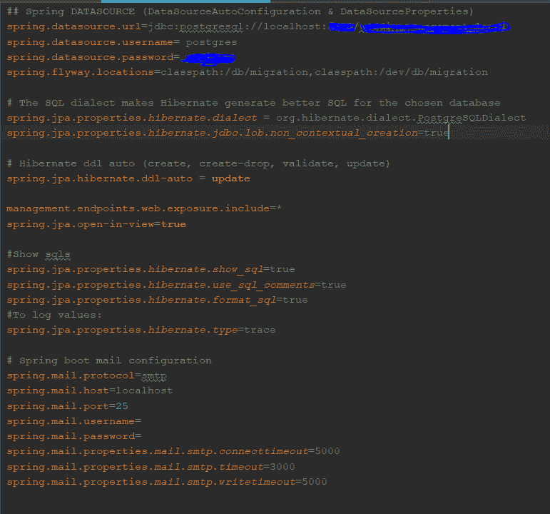
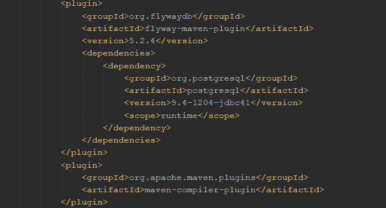

# 如何在 SpringBoot 项目中配置 Flyway 数据库迁移

> 原文：<https://dev.to/gabriela/spring-boot-rest-api-and-flyway-migrations-a3a>

[](https://res.cloudinary.com/practicaldev/image/fetch/s--qEBl6F1g--/c_limit%2Cf_auto%2Cfl_progressive%2Cq_auto%2Cw_880/https://thepracticaldev.s3.amazonaws.com/i/cuqvz1c9cp6rmu6kh3qu.png)

大家好，在这篇文章中，我将讲述我自己的最新经验，用 Spring Boot 实现了一个 REST API 项目，利用 Flyway 进行数据库迁移，并处理所有需要的配置。

**项目栈:** Java 10，Maven，Spring Boot 2.1.2，Spring Security，PostgreSql 42.2.5，Flyway 5.2.4，React，Redux，Bootstrap，JUnit 4.12，Model Mapper，Lombok。

作为项目的一部分，我使用 Spring Boot 实现了一个 REST API 项目，在客户端我有一个 React web 应用程序，我选择了 PostgreSql for database 和 Flyway 来帮助初始化、迁移和填充一个新的数据库实例。

Flyway 很棒，因为它通过自动处理项目的这一部分，帮助避免了处理数据库脚本和版本时的许多人为错误。这消除了记住团队命名约定和手动部署的繁琐任务。

使用 Flyway 的另一个原因是，它在自动创建的表中保存了所有成功或失败的脚本的列表:flyway_schema_history。这是一个即插即用的特性，充当数据库迁移的版本控制。默认情况下，所有东西都被捆绑到一个事务中，这对我的项目非常有用。

**1。Spring Boot 配置**

首先，您需要创建应用程序概要文件。对于我的项目，我创建了三种类型的配置文件:

**测试** -运行集成测试
**开发** -实际实施阶段
**生产** -什么是稳定的并推向生产

[](https://res.cloudinary.com/practicaldev/image/fetch/s--5GHR0zdq--/c_limit%2Cf_auto%2Cfl_progressive%2Cq_auto%2Cw_880/https://thepracticaldev.s3.amazonaws.com/i/iuyttlrbzz9en9eabl6r.png)

也在 pom.xml 中配置配置文件:

[](https://res.cloudinary.com/practicaldev/image/fetch/s--Acde4sVS--/c_limit%2Cf_auto%2Cfl_progressive%2Cq_auto%2Cw_880/https://thepracticaldev.s3.amazonaws.com/i/kb1zcf459fgfaswnvqw2.png)

**2。飞行路线配置**

您需要在 pom.xml 中配置 Flyway-Maven 插件，如下所示:

[](https://res.cloudinary.com/practicaldev/image/fetch/s--pI7P5eEh--/c_limit%2Cf_auto%2Cfl_progressive%2Cq_auto%2Cw_880/https://thepracticaldev.s3.amazonaws.com/i/36o4w5x39gkpzjg4za2t.png)

飞行路线属性和脚本位于应用程序的“src/main/resources”文件夹中。在这里，您可以根据需要添加任意多的配置详细信息。
每个概要文件都有自己的属性文件和包，使用这个名称模式:" db/{ name _ here } "
application-dev . properties 的配置示例:

[](https://res.cloudinary.com/practicaldev/image/fetch/s--hCKUo1fG--/c_limit%2Cf_auto%2Cfl_progressive%2Cq_auto%2Cw_880/https://thepracticaldev.s3.amazonaws.com/i/14d26iolckxorrp4v0cu.png)

让我们深入了解更多细节:
“db/migration”——包含每次编译的所有版本。Flyway 在这里解释了你必须使用的名字模式:V*_ **。sql
示例:V1* _InitDatabase.sql

应用程序启动时，将运行此处的最后一个数字版本脚本。如果脚本已经运行，不要担心它不会再次执行。如果您在编译和启动应用程序时查看 stacktrace，您可以发现这个步骤发生在以下步骤之后:

*初始化 Spring embedded WebApplicationContext*

如果版本是旧的(已经运行过),什么都不会发生。

*模式“public”是最新的。不需要迁移。*

**"test/db/migration"** -在这里，您可以添加将运行或跳过的所有数据库迁移脚本，但仅限于概要文件测试。您可以在这里添加端到端测试所需的数据。

**"dev/db/migration"** -您可以在这里添加所有将要运行或将要跳过的数据库迁移脚本，但只能在概要文件 dev 上运行。我选择添加一些 insert SQLs 来填充我的数据库。

**“生产/数据库/迁移”** -您可以在此添加所有将运行或跳过的数据库迁移脚本，但只能在配置文件生产(生产)上运行。

重要的是，如果你保持你的数据库是独立的，你可以控制你的数据，在你的开发数据库中没有测试数据，当然生产数据库也是干净的。

在 pom.xml 中配置 Flyway 的插件:

[](https://res.cloudinary.com/practicaldev/image/fetch/s--wnJP21DI--/c_limit%2Cf_auto%2Cfl_progressive%2Cq_auto%2Cw_880/https://thepracticaldev.s3.amazonaws.com/i/vldb2abp553w7gmet80a.png)

**3。集成测试仅在测试配置文件上运行**

测试很重要。这些天我经常提醒自己。Spring 中的集成测试既简单又快速。下面是一个登录测试的例子，实际代码只是修改了路径。

```
 @RunWith(SpringRunner.class)
    @SpringBootTest(classes = WeddingManagementApplication.class, webEnvironment =     SpringBootTest.WebEnvironment.RANDOM_PORT)
    @ActiveProfiles("test")
    public class LoginControllerTest {

        @Autowired
        private TestRestTemplate restTemplate;

        @LocalServerPort
        private int port;

        private String getRootUrl() {
            return "http://localhost:" + port + "/api/v1";
        }

        @Test
        public void testLogin() throws Exception {
            User user = new User("gabriela", "admisnadmin", "admin@gmail.com", Role.ADMIN);
            ResponseEntity<User> postResponse = restTemplate.postForEntity(getRootUrl() + "/login", user, User.class);
            assertNotNull(postResponse);
            assertNotNull(postResponse.getBody());
        }
    } 
```

Enter fullscreen mode Exit fullscreen mode

* * *

这将在测试概要文件上运行，而“开发概要文件”保持不变。太好了。如果你正在运行持久层测试，清理数据库会很棒，但是我还没有在项目中看到过这种情况，可能是因为它很难维护？

* * *

Flyway 中的回调非常有用。有很多选项可以使用，在我的项目中，在这一点上，我只使用了一个回调 afterMigrate，但是查看他们的官方文档可以获得更多的细节。

* * *

这就是我在这一点上使用 Flyway 的方式，我喜欢它。如果你知道更多的技巧和提示，请在下面留下评论，让我们一起学习。

如果你想读更多的东西，可以看看我的博客: [https://gabriela.codes](https://gabriela.codes)