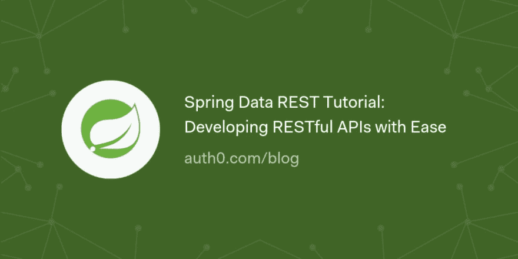

# Spring Data REST 教程:轻松开发 RESTful APIs

> 原文：<https://dev.to/auth0/spring-data-rest-tutorial-developing-restful-apis-with-ease-1d9a>

在本文中，您将学习如何通过结合使用 Spring Data REST 和 Spring Boot 来轻松开发 REST APIs。

在整篇文章中，您将搭建一个新的 Spring Boot 应用程序，创建一个 JPA 实体，并使用 Spring Data REST 在其上提供一些基本操作。

[读下去🍃](https://auth0.com/blog/spring-data-rest-tutorial-developing-rest-apis-with-ease/?utm_source=dev&utm_medium=sc&utm_campaign=spring_devapis)

