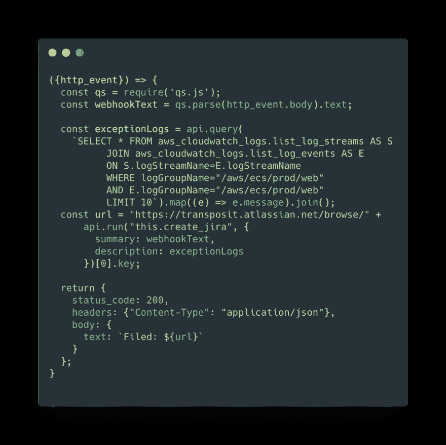
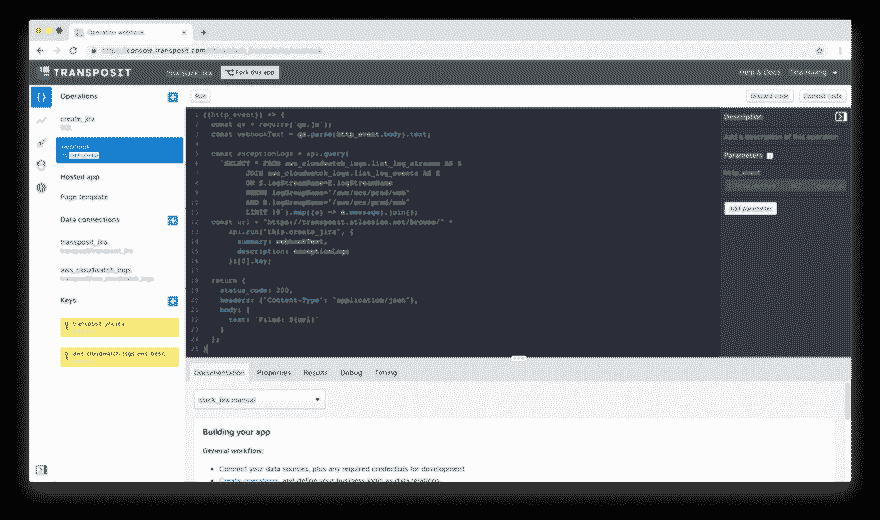

# API 混乱的 SQL 顺序

> 原文：<https://dev.to/transposit/sql-order-from-api-chaos-3eik>

作者:Tina Huang @kmonkeyjam

在一个由 SaaS 驱动的世界中开发任何应用程序都需要使用和迎合大量的 API。情况并非总是如此。

当我第一次在苹果公司担任应用程序框架工程师时，人们构建的组件将从单一数据源呈现，几乎总是本地数据库。但是当我在 2009 年加入 Twitter 的工程团队时，世界已经转向了 API 驱动的生态系统。在 Twitter，我们使用 API 进行内部微服务通信，并向外部开发人员公布数据。必须将所有这些内部和外部的 API 粘合在一起，这纯粹是一件苦差事，会产生大量杂乱无章的代码。为过去十年没有使用过 API 的开发人员编写 API 可能会非常复杂。

很难相信 API 组合的问题没有一个好的解决方案。有很多平台可以帮助你找到 API，建立初始连接，甚至调用一个 API。但是没有一个专门的平台来帮助以一种简化的方式将来自 API 的数据编织在一起，同时处理现代 API 所需的大量操作杂务，如身份验证、分页、重试等等。

### 介绍转座

这是一个需要存在的层，在过去的两年里，[我们一直在构建 Transposit 来解决这个问题](https://www.transposit.com/)。

Transposit 是一个零运营平台，它将关系数据库的强大功能带到了 API 生态系统中。我们的关系引擎能够编写 SQL 和 JavaScript 来查询和转换您的数据，就好像每个数据连接都是单个关系数据库中的虚拟表一样。

虽然数据库可以不受限制地访问磁盘上的原始数据，但 API 通过身份验证来保护您的数据。为了使关系引擎在这种新的数据环境中工作，我们不仅为访问您自己的数据的开发人员，而且为您的应用程序的所有用户及其数据源建立了身份验证管理。结果是一种无缝的方式来查询数据，无论它位于何处。

Transposit 抽象出特定 API 机制的细节，让您专注于使您的应用程序独一无二的代码。它允许您用更高级的连接和过滤器语言轻松地表达您的意图，然后将该意图转化为大量优化的 API 调用。它处理与现代 API 通信的所有方面，例如重试、重新授权和分页。它实现了安全最佳实践，因此您不必这样做。在构建应用程序时，UI 为您提供了一种交互式的、有趣的方式来浏览数据。例如，团队经常使用 Slack 来交流和分类生产事故中发生的问题。假设您想让在吉拉提交一个 bug 并附加一些存储在 AWS Cloudwatch 中的生产日志变得容易，所有这些都来自您的 Slack triage 通道。

<figure> 

<figcaption>用 Cloudwatch 日志</figcaption>

</figure>

在吉拉提交问题的转置 webhook 操作

要在不换位的情况下做到这一点，您需要学习吉拉、AWS 和 Slack APIs 的复杂性。您还需要托管一个服务器来接收 Slack webhook，安全地存储凭证，并实现一系列繁琐的逻辑。所有这些工作使它太令人生畏，太令人沮丧，以至于无法建造——尽管在实际事故中这将是一个惊人的时间节省器。

输入 Transposit:现在您有能力跨多个 API 快速组合逻辑，而不必处理任何 API 复杂性。您可以快速构建一个应用程序，并让 Transposit 管理所有的部署细节。Transposit 的乐趣在于，将您的想法转化为应用程序既快速又有趣，而且还易于调试、改进和与他人分享。

<figure> 

<figcaption>动作中的换位 UI</figcaption>

</figure>

今天，我们为 Transposit 开放了一个公测版。[我们还筹集了 1220 万美元的首轮融资](http://www.prweb.com/releases/transposit_raises_12_2m_from_sutter_hill_ventures_and_signalfire_for_the_industrys_first_api_composition_platform_for_developers/prweb16149393.htm)，这为我们提供了发展和参与社区活动所需的资源。

告诉我们你希望用 API 构建什么，是什么阻碍了你。你要应对的最烦人的挑战是什么？API 苦差事是如何阻碍你的创造力的？我们希望你能注册我们的测试版，修改一下，并让我们知道你的想法和你的成果！

[报名](https://www.transposit.com)

* * *