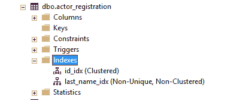
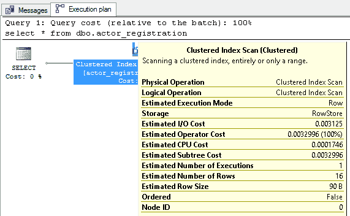

# 使用索引加快查询速度

> 原文：<https://dev.to/helenanders26/sql-series-speed-up-your-queries-with-indexes-3c83>

指数的经典类比是...数据库就像图书馆。

桌子就像图书馆里存放的书。

行存储在书的页面上。

一页一页地翻阅教科书寻找你需要的那一页是需要时间的。同样，扫描数百万行也将是耗时且乏味的。这就是索引发挥作用的地方。

[](https://res.cloudinary.com/practicaldev/image/fetch/s--ATQVZqfV--/c_limit%2Cf_auto%2Cfl_progressive%2Cq_auto%2Cw_880/https://thepracticaldev.s3.amazonaws.com/i/jh2n2aceo82aoovd63du.jpg)

* * *

> 为什么我需要一个索引？
> [有不同类型的指数吗？](#chapter-2)
> [我的索引一旦创建，在哪里可以找到它？](#chapter-3)
> [有哪些好的索引候选？](#chapter-4)
> [以后不能这样了吗？我需要这样做吗？](#chapter-5)
> [多少个指标太多？](#chapter-7)
> [这对我没有好处，我用甲骨文](#chapter-8)
> [你为什么不解释*一切*关于 b 树的事情？](#chapter-9)
> [这是我所有性能问题的答案吗？](#chapter-10)

* * *

## 我为什么需要索引？

索引通过对磁盘上的数据进行排序来提高性能，这样可以更快地找到结果，或者告诉 SQL 引擎在哪里可以找到数据。如果不应用索引，SQL 引擎将逐个扫描每一行。

虽然这不一定是件坏事，但随着数据库的增长，速度可能会变慢。

* * *

## 有不同类型的指数吗？

SQL Server 中有两种主要类型:

### 聚集索引-目录页

*   以更快访问的方式在磁盘上物理排列数据。
*   每个表只能应用一个，因为数据只能单向排序。

[](https://res.cloudinary.com/practicaldev/image/fetch/s--SzOdC3Hp--/c_limit%2Cf_auto%2Cfl_progressive%2Cq_auto%2Cw_880/https://thepracticaldev.s3.amazonaws.com/i/y7yo2tivweq1dsu763ie.PNG)T3】

```
create clustered index [id_idx] --name of the index
on [dbo].[actor_registration](actor_id) 
```

Enter fullscreen mode Exit fullscreen mode

### 非聚簇索引——一本书后面的索引。

*   这些创建了一个指向数据位置的查找。
*   您可以创建多达 999 个索引，但是由于每个索引都需要开销和维护，您可能希望只创建几个。

[](https://res.cloudinary.com/practicaldev/image/fetch/s--lBIoytMy--/c_limit%2Cf_auto%2Cfl_progressive%2Cq_auto%2Cw_880/https://thepracticaldev.s3.amazonaws.com/i/cn0p49zsmec3x1zenlf5.PNG)T3】

```
create nonclustered index [last_name_idx] --name of the index
on [dbo].[actor_registration](last_name) 
```

Enter fullscreen mode Exit fullscreen mode

* * *

## 创建索引后，在哪里可以找到它？

通过展开索引所在的表，然后展开索引，可以找到表上的索引。

[](https://res.cloudinary.com/practicaldev/image/fetch/s--_WZ4awWh--/c_limit%2Cf_auto%2Cfl_progressive%2Cq_auto%2Cw_880/https://thepracticaldev.s3.amazonaws.com/i/bnvbvta15csu679nfmnt.PNG)

这也是您可以使用向导创建索引的地方。在下面的示例中，聚集索引选项现在是灰色的，因为我们已经在这个表上有了一个。

[](https://res.cloudinary.com/practicaldev/image/fetch/s--euCM24fe--/c_limit%2Cf_auto%2Cfl_progressive%2Cq_auto%2Cw_880/https://thepracticaldev.s3.amazonaws.com/i/s2ku9x02dpd9tdlr4lzx.PNG)

* * *

## 有哪些好的索引候选？

ID 栏，姓名，帐号和其他有很多变化。理想情况下，您在选择和连接中经常使用的是唯一的、顺序的。

* * *

## 以后这样不行吗？

当然，没问题。有时，掌握如何查询数据并在以后添加它们是很好的。

如果您的表上没有索引，数据将按照它出现的顺序存储。这被称为*堆积存储*，实际上是一种存储电子表格的昂贵方式。

请注意，应用索引需要时间如果您的表很大，那么在您完成此任务时，可能需要一些时间。

* * *

## 我需要这样做吗？

没有规定说你应该或不应该。不添加索引的优点是插入和更新会更快，并且数据库在物理上也会更小。

如果您确实注意到事情变得很慢，请查看执行计划以获得任何建议和更多关于在哪里执行查询的信息。

[](https://res.cloudinary.com/practicaldev/image/fetch/s--h6iYAXGs--/c_limit%2Cf_auto%2Cfl_progressive%2Cq_auto%2Cw_880/https://thepracticaldev.s3.amazonaws.com/i/8wjs3ln893ce719u89ed.PNG)

* * *

## 多少个指标才算多？

一如既往，视情况而定。过多的索引可能会降低性能。一旦为主键和惟一键创建了索引，接下来该做什么就取决于您、执行计划，也许还有友好的 DBA。

* * *

## 这对我没有好处，我用甲骨文

幸运的是，在 Dev.to 上有一个[很棒的资源](https://dev.to/databasestar/a-guide-to-indexes-in-oracle)给你

* * *

## 你为什么不解释*关于 b 树的一切*？

因为在 Dev.to 上已经有一些关于这个主题的优秀内容，我希望提供一个初学者的概述。

* * *

## 这是我所有性能问题的答案吗？

索引需要维护。它们最初可能会提高性能，但随着数据库的增长，需要对其进行检查、更新和维护。它们不是“一劳永逸”的灵丹妙药，应该随着您的需求变化而被审查和删除。

首先，您最好使用**执行计划**来查看它的建议，或者向您友好的 DBA 寻求帮助。

* * *

让我知道你认为对完全初学者和初级数据分析师有用的其他关键概念。

* * *

## 阅读更多

[](/helenanders26) [## 从头到尾的 SQL 概念

### 海伦·安德森 2 月 6 日 1914 分钟阅读

#data #database #sql #beginners](/helenanders26/sql-series-from-a-to-z-2pk9)

* * *

这篇文章最初出现在[helenanderson.co.nz](http://www.helenanderson.co.nz/sql-indexes/)