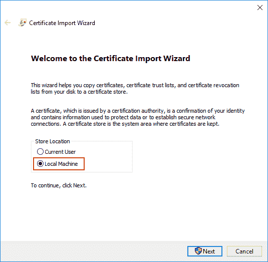
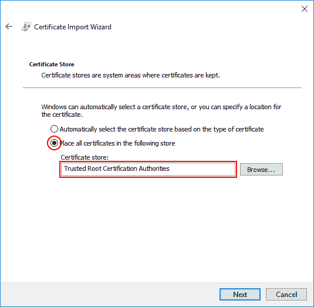

# 开发中的 SSL 证书

> 原文：<https://dev.to/jimbuck/ssl-certificates-in-development-4g71>

[](https://res.cloudinary.com/practicaldev/image/fetch/s--FIHoM4iC--/c_limit%2Cf_auto%2Cfl_progressive%2Cq_auto%2Cw_880/https://images.unsplash.com/photo-1531417666976-ed2bdbeb043b%3Fixlib%3Drb-1.2.1%26q%3D80%26fm%3Djpg%26crop%3Dentropy%26cs%3Dtinysrgb%26w%3D1080%26fit%3Dmax%26ixid%3DeyJhcHBfaWQiOjExNzczfQ)

最近我一直在处理多个多应用服务器和它们的 SSL 证书。一旦启动并运行了两到三个以上的环境，从每个实例中寻找和争论证书就变得有点棘手了。值得庆幸的是，我发现了一些超级技巧，当您在不太理想的系统设置中工作时，这些技巧在解决证书问题时节省了大量时间。

### 提示 1:找到并摧毁

我发现有时候我的电脑上的开发人员会失控。清理它们的第一步是移除旧的。如果你想查看一个特定的证书，微软管理控制台的[证书管理单元](https://docs.microsoft.com/en-us/dotnet/framework/wcf/feature-details/how-to-view-certificates-with-the-mmc-snap-in)是一个不错的工具。只需选择左边的文件夹，你就可以很容易地找到你需要的证书。但是，当您在寻找一个或多个可能的证书时，请尝试下面的 Powershell 代码片段:

```
ls Cert:\ -Recurse | where { $_.Issuer -like "*Jim Buck*" } 
```

这个代码片段将递归搜索所有已安装的证书，但只显示那些符合标准的证书(在这种情况下，`Issuer`必须包含`Jim Buck`)。您可以根据以下任何字段进行筛选:

1.  `Subject` -文本(可能是通用的或与发行人相同)
2.  `Issuer` -文本(通常非常可靠的过滤方式)
3.  `Thumbprint` -哈希(每个证书唯一)
4.  `FriendlyName` -字符串(有时为空)
5.  `NotBefore` - Datetime
6.  `NotAfter` - Datetime
7.  `Extensions`-`Oid`对象列表(它们有`FriendlyName`和`Value`属性)。

在开发过程的早期，您可能会向您的商店添加相当多的证书。运行相同的命令，但是将它连接到`rm`命令，您可以轻松地删除所有讨厌的旧证书:

```
ls Cert:\ -Recurse | where { $_.Issuer -like "*Jim Buck*" } | rm 
```

不过，我不建议过于频繁地清理凭证。理想情况下，您只需要在安装“好的”证书之前做这件事。一旦你有了一个干净的证书库，添加新的好的证书就可以安装了。

### 提示 2:信任 CA 根证书

我们的应用程序依赖于内部数据服务。在安装该服务的过程中，它为服务器的 [FQDN](https://en.wikipedia.org/wiki/Fully_qualified_domain_name) 生成一个 CA 根证书和一个最终用户证书(由生成的 CA 根签名)。我们不能修改服务的安装逻辑，所以我们必须使用它产生的证书。最好的方法是简单地从每个实例下载 CA 根证书，并将其安装在我们本地机器的可信根目录中。

[](https://res.cloudinary.com/practicaldev/image/fetch/s--fDozoENT--/c_limit%2Cf_auto%2Cfl_progressive%2Cq_auto%2Cw_880/https://jimbuck.io/conteimg/2019/04/cert-install-guide-01.png)

<figure>

[](https://res.cloudinary.com/practicaldev/image/fetch/s--mP-3yzn2--/c_limit%2Cf_auto%2Cfl_progressive%2Cq_auto%2Cw_880/https://jimbuck.io/conteimg/2019/04/cert-install-guide-02.png)

<figcaption>I typically select "Local Machine" (just in case) and manually select "Trusted Root Certification Authorities".</figcaption>

</figure>

不要被愚弄，相同名称(但不同指纹)的证书可以并行安装。只需记得重启你的浏览器/客户端应用程序，这样它们就能获得新的证书。

### 提示 3:使用共享的 CA 根证书

到目前为止，最好的方法是简单地让您的证书生成使用共享的 CA 根。这将允许一个项目甚至整个部门使用一个公共根证书来签署所有特定于服务器的开发/测试证书。不再需要下载可信任的证书，不再需要忽略证书错误。不用再在每个环境中翻箱倒柜，试图更新要使用哪个证书的所有引用。只需一个共享证书，就能保证开发人员、测试人员、管理人员和产品所有者的安全。

我目前正在完成一个脚本，以帮助创建(仅限开发人员)CA 根和 SSL 证书。一旦我能对它进行更多的测试并尽可能简单地使用它，我会写一篇关于它的特别文章。