# 轻松开始构建 React 应用程序

> 原文：<https://dev.to/rleija_/start-building-react-applications-with-ease-2l6n>

*原帖@ [Linguine 博客](https://linguinecode.com/post/get-started-with-react)T3】*

React 是 JavaScript 社区中闪亮的新玩具，大多数行业都倾向于使用这项技术。

[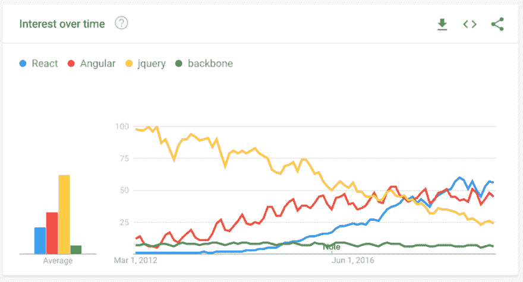](https://res.cloudinary.com/practicaldev/image/fetch/s--TU508BAx--/c_limit%2Cf_auto%2Cfl_progressive%2Cq_auto%2Cw_880/https://s3.amazonaws.com/linguine-code-cdn/media/js-framework-trends.png)

您可能来自 Angular、jQuery，甚至是 Backbone，学习一种新工具可能听起来令人生畏，甚至令人害怕。

不用担心，在本文中，我将介绍一些简单的方法，让 React 应用程序在几分钟内启动。

但是在我们开始之前，为什么要做出反应呢？

## 为什么选择 React

选择 React 的理由#1，它只是一个 UI 构建器。

像 Angular 和 Ember 这样的工具是成熟的 JavaScript 框架，需要你按照它们的方式去做。

这没关系，但是 React 不会对您的应用程序做任何假设。它不会强迫你重写整个应用程序。

选择 React 的第二个原因是因为它是基于组件的。

React 将所有 CSS、UI、状态和事件封装在一个文件或目录中。

这使得工程师很容易消化一个大的代码库，因为它是在更小的块中。

选择 React 的第三个原因是因为它是声明性的。

它允许您编写声明性视图，这使得维护和调试变得容易。

## 从 CDN 链接开始

*源到 CDN 链接:*

 *这是最简单的入门方法。

只需要通过脚本<mark>标签</mark>导入 React 和 React DOM 即可。

[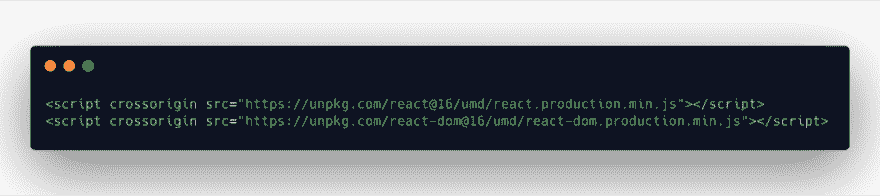](https://res.cloudinary.com/practicaldev/image/fetch/s--C8NSiHDO--/c_limit%2Cf_auto%2Cfl_progressive%2Cq_auto%2Cw_880/https://s3.amazonaws.com/linguine-code-cdn/media/react-cdn-links-1.png)

然后可以创建一个 JavaScript 文件，开始用普通 JavaScript 创建第一个 React 组件。

[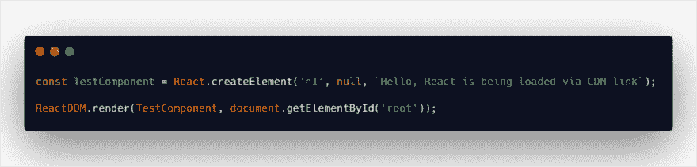](https://res.cloudinary.com/practicaldev/image/fetch/s--Nj1WavAZ--/c_limit%2Cf_auto%2Cfl_progressive%2Cq_auto%2Cw_880/https://s3.amazonaws.com/linguine-code-cdn/media/react-plain-js.png)

输出应该如下所示

[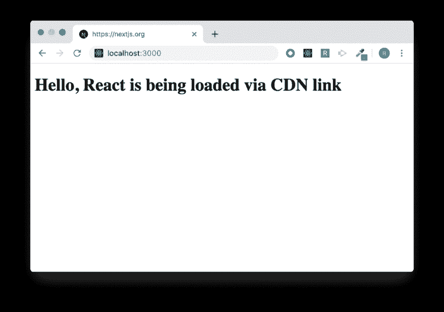](https://res.cloudinary.com/practicaldev/image/fetch/s--ayxlfEim--/c_limit%2Cf_auto%2Cfl_progressive%2Cq_auto%2Cw_880/https://s3.amazonaws.com/linguine-code-cdn/media/react-plain-js-output.png)

接下来的几个方法要求您在机器上安装 [Node.js](https://nodejs.org/en/) 。

一旦安装，NPM 命令客户端工具将在终端可用。

## 从创建 React App 开始

这是启动并运行新项目的最简单的方法之一。

运行下面的命令。

[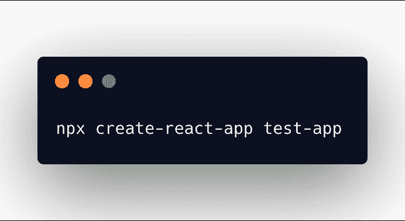](https://res.cloudinary.com/practicaldev/image/fetch/s--XpOpdC64--/c_limit%2Cf_auto%2Cfl_progressive%2Cq_auto%2Cw_880/https://s3.amazonaws.com/linguine-code-cdn/media/create-react-app-terminal.png)

*NPX 自带 NPM 5.2+。NPX 允许你不在你的机器上安装 Create React 应用程序。*

我调用 Create React App 在名为 <mark>test-app</mark> 的目录中创建我们的项目。

Create React App 将下载它附带的所有依赖项。

*以上视频来自 [create react app](https://github.com/facebook/create-react-app) 。*

一旦 Create React App 完成了依赖项的安装，它将要求您进入项目目录(通过终端)并执行以下命令。

通过运行 <mark>npm start</mark> ，Create React App development 将会启动并打开你

Create React App 不只是安装几个节点模块依赖项，它还提供以下功能:

*   JSX、ES6 和类型脚本支持
*   自动前缀 CSS
*   开发用热重装
*   捆绑 JavaScript、CSS 和图像的构建脚本
*   渐进式网络应用就绪

[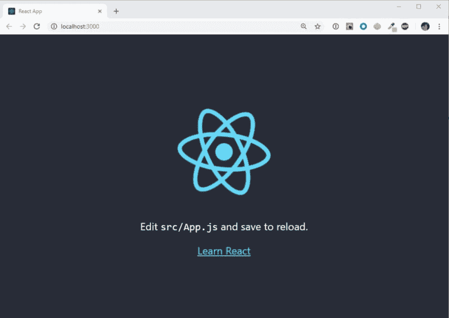](https://res.cloudinary.com/practicaldev/image/fetch/s--YKxz2_M4--/c_limit%2Cf_auto%2Cfl_progressive%2Cq_auto%2Cw_880/https://s3.amazonaws.com/linguine-code-cdn/media/create-react-app-example-1.jpg)

从 Create React App 开始非常简单，但归根结底这只是一个 JavaScript 站点。

如果你想建立自己的个人网站，应该使用 Create React App 吗？

可能不会，因为 JavaScript 站点在 SEO 上对你没有好处。

你需要一些东西，让你用 React 构建你的网站的 UI，并用 Node.js 之类的服务器语言渲染它。

现在我们可以手动设置，但是为什么呢？

有很多优秀的开源工具可以帮我们做到这一点。

## 从 Next.js 开始

*资源链接:[next . js](https://github.com/zeit/next.js/tree/master)T3】*

Next.js 是我创建服务器端渲染 React 应用程序或站点的首选框架。

Next.js 是轻量级的、渐进的 web 应用程序，最重要的是，SEO 友好。

顺便说一下，你正在阅读的这个网站([blog.linguinecode.com](https://blog.linguinecode.com))正在使用 Next.js 来驱动前端！

Next.js 确实需要更多的步骤，但这并不难。我会带你走一遍。

[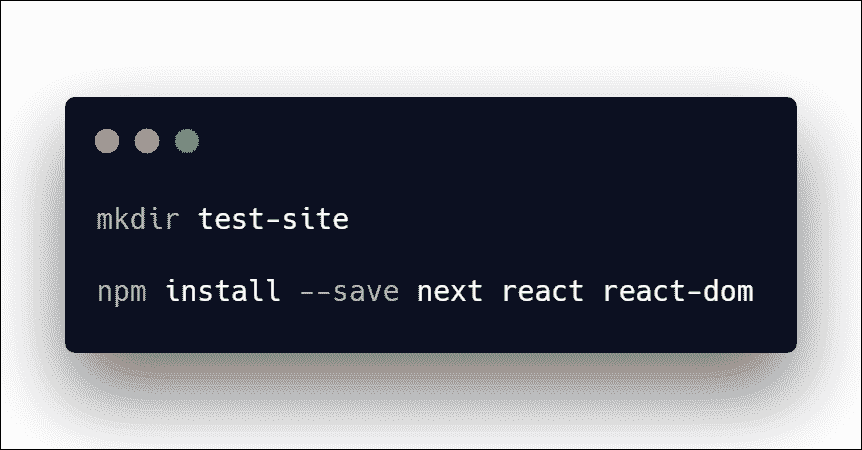](https://res.cloudinary.com/practicaldev/image/fetch/s--RxImS10J--/c_limit%2Cf_auto%2Cfl_progressive%2Cq_auto%2Cw_880/https://s3.amazonaws.com/linguine-code-cdn/media/installing-next.png)

首先，我为我的站点创建了一个新目录，并将其命名为 <mark>test-site</mark> 。

下一步是安装 3 个节点模块依赖项。

*   然后
*   反应
*   反应 DOM

我们在本文前面简要地讨论了 React 和 React DOM。

这两个库将帮助我创建 React 代码并将其转储到 DOM。

我安装的下一个依赖项是 next。

接下来将帮助我弥合 Node.js 和 React 之间的差距。

Next.js 负责首先通过服务器代码为您的站点提供服务，并让 JavaScript aka 在用户导航时处理站点其余部分的加载。

JavaScript 一旦加载就很快，所以我们通过让 Node.js 进行站点的第一次加载来提高加载速度。

下一步是创建 package.json 文件，并添加以下代码行。

[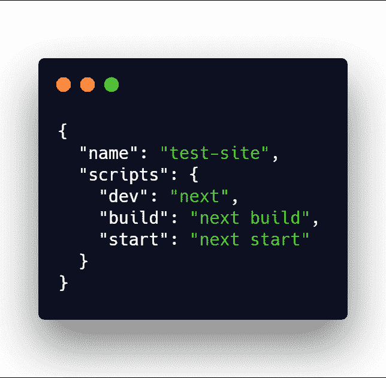](https://res.cloudinary.com/practicaldev/image/fetch/s--FtsYrsN---/c_limit%2Cf_auto%2Cfl_progressive%2Cq_auto%2Cw_880/https://s3.amazonaws.com/linguine-code-cdn/media/next-package-json.png)

重要的行在脚本对象中。

运行 <mark>npm 运行开发</mark>将加速开发模式。

运行 <mark>npm 运行构建</mark>将构建并优化用于生产的站点或应用程序。

运行 <mark>npm run start</mark> 将运行您的生产构建。

相当简单，但现在我要开始添加几页。

[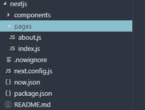](https://res.cloudinary.com/practicaldev/image/fetch/s--83nfdYbM--/c_limit%2Cf_auto%2Cfl_progressive%2Cq_auto%2Cw_880/https://s3.amazonaws.com/linguine-code-cdn/media/nextjs-structure.jpg)

这是典型的 Next.js 项目结构的样子。

目录<mark>页</mark>，在使用这个框架时极其重要。

这是因为 Next.js 将查找该目录中的每个文件，并根据文件名创建路径。

因此 index.js 将代表网站/应用程序的首页

[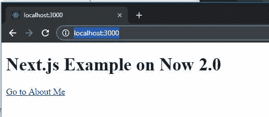](https://res.cloudinary.com/practicaldev/image/fetch/s--ioR3Nbcd--/c_limit%2Cf_auto%2Cfl_progressive%2Cq_auto%2Cw_880/https://s3.amazonaws.com/linguine-code-cdn/media/nextjs-home-page.jpg)

about.js 看起来会像这样:

[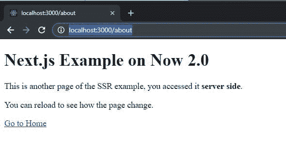](https://res.cloudinary.com/practicaldev/image/fetch/s--dwFHOOQi--/c_limit%2Cf_auto%2Cfl_progressive%2Cq_auto%2Cw_880/https://s3.amazonaws.com/linguine-code-cdn/media/nextjs-about-page.jpg)

这很好，但是每个页面中的代码是什么样子的呢？！

这是一个很好的问题，它只是一个反应组件。

[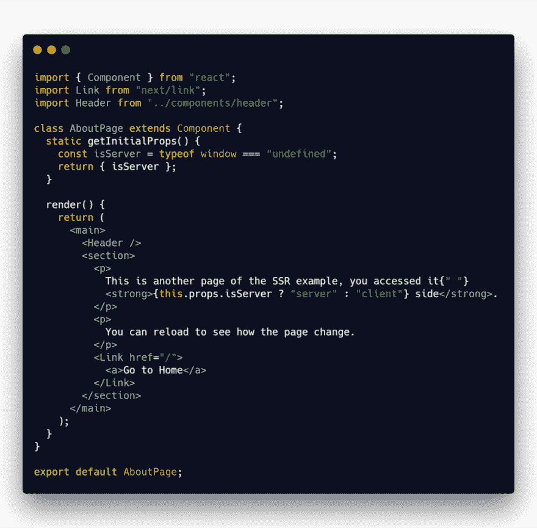](https://res.cloudinary.com/practicaldev/image/fetch/s--edWxTMpP--/c_limit%2Cf_auto%2Cfl_progressive%2Cq_auto%2Cw_880/https://s3.amazonaws.com/linguine-code-cdn/media/nextjs-about-page-code.png)

这是一件美好的事情，因为 Next.js 只是让你专注于你的网站或应用程序的 UI。

Next.js 为开发人员提供了另一个简洁的小特性。

Next.js 为 React 组件提供了一个名为 <mark>getInitialProps</mark> 的静态方法。

这个静态方法只在 pages 目录中的 React 组件中提供。没有子组件可以访问这个静态方法。

<mark>getentialprops</mark>运行在应用程序/站点的服务器端和客户端。

这就是你可以错误地调用 API 的地方。这将有助于确保页面在提供给用户之前已经填充了内容。

在上面的例子中，我只是返回提供的 <mark>isServer</mark> 变量。

它让我的站点知道页面是在服务器端还是客户端被访问的。

## 结论

在本文中，我将介绍一些初始化和正确编写 React 应用程序的最简单的方法。

开始使用 React 可能看起来有些棘手和复杂。但是有了社区的大量支持，启动一个 React 应用程序可能只是几分钟的事情。*