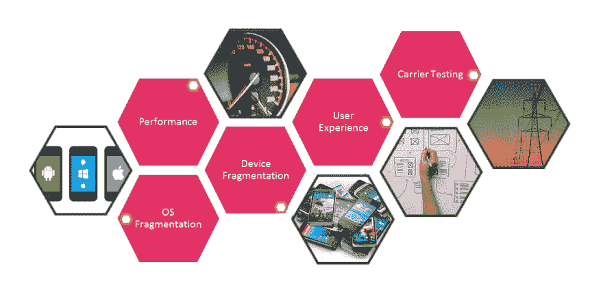

# 移动应用测试的全程指南

> 原文：<https://dev.to/pcloudy/start-to-end-guide-for-mobile-app-testing-eec>

移动应用程序测试涉及许多错综复杂的问题，在这个系列的博客中，我们将从基础开始探索这个领域。这篇博客中涉及的主题将在以后的博客中详细阐述。在不久的将来，当我们发布这些主题的时候，我会更新这个页面的链接。请继续关注此空间，了解与移动应用测试相关的更多信息。现在让我们从基础开始。

**什么是移动 app 测试，为什么需要测试？**

如今，移动电话不仅仅是用来打电话或接电话，而是一种必不可少的多功能设备。移动技术发展迅速，移动应用程序开发人员需要在短时间内提供性能最佳的应用程序。为了在给定的时间框架内交付最好的应用，自动化团队需要保持警觉。测试人员在应用程序的质量和交付中扮演着关键的角色。此外，市场非常分散，这使得测试更加复杂。移动应用程序必须在不同的平台、网络和操作系统组合上进行测试。

**移动应用的类型:**

有三种类型的移动应用:
原生应用:这些应用是为单个移动操作系统开发的，因此它是特定平台或设备的原生应用。例如，Android 应用程序将无法在 iOS 应用程序上运行。

Web 应用程序:这些是在移动 web 浏览器上呈现/交付页面的移动 web 应用程序。这些应用程序可以在不同的操作系统上运行，因为它们是在网络浏览器上启动的。

混合应用:这些应用具有跨平台兼容性，但仍然可以访问手机硬件。

**移动应用测试的挑战**

所有的操作系统，像 Android，iOS，Windows 都有不同的用户界面和功能。在市场上发布应用程序时，会验证元素的使用和布局。不遵守指导方针会延迟发布过程，从而增加开发成本。无法使用设备也是一个大问题。两个或更多的测试者可能同时需要相同的设备。其中一个测试者被遗漏，等待另一个测试者完成他们的工作。采购多种设备会增加成本并耗费时间。如果测试人员分布在不同的国家，这将是一个大问题。

**手机应用测试的类型**

要开发一个高效的移动应用，你需要确保应用的质量、可用性和安全性都达到标准。你可以通过严格的测试来提高你的应用评级和客户满意度，这将带来更多的下载。

移动应用测试方法如下:

1.  兼容性测试
2.  安装测试
3.  中断测试
4.  本地化测试
5.  性能试验
6.  可用性测试
7.  一致性测试

**手机应用测试策略**

移动应用测试策略，确保您的质量保证活动符合客户期望、业务目标和行业最佳实践。在设计全面的移动应用测试策略时，测试团队必须考虑以下步骤:

UI 测试:一个 UI 友好的应用程序比一个开发得最好但 UI 糟糕的应用程序卖得更多。如果一个应用程序在一个设备上有一个完美的 UI，但是在另一个设备上却完全扭曲了，仅仅因为它有不同的大小或不同的操作系统，那么它将会留下非常糟糕的印象。应用程序的商业成功将受到严重影响。

安全测试:人们总是非常担心数据的安全性。黑客有可能获得个人数据，无论是您的社交网站凭据还是您的银行帐户凭据。因此，这些应用程序的安全性对于任何公司的业务都变得至关重要。这进而产生了对所有移动应用程序进行安全测试的需求，因此被认为是应用程序测试人员进行的重要测试。

手动 vs 自动化测试:[自动化测试](https://www.pcloudy.com/automated-app-testing-with-bots/)的速度和可靠性有助于回归测试和执行耗时的测试用例。大多数自动化测试是可重用的，但是在敏捷环境中，自动化测试脚本必须重新编写。随着移动应用的发展，产品流程会发生变化，用户界面需求和特定功能也会发生变化。因此，每一个变化都需要更新自动化测试脚本。维护自动化测试脚本通常会导致项目在 sprint 周期中落后，除非您牢牢地控制住局面。对于较大的移动应用程序来说，它具有可扩展性和更高的成本效益。我们可以同时进行多项测试。但不适合测试用户体验因素。手动测试复制了真实的用户体验，对于小项目来说更快更划算。手动测试更容易识别和处理应用崩溃。手动测试处理更复杂的用例场景。

设备选择:随着移动技术的快速发展，每天都有新版本的移动设备出现。每个型号在操作系统、屏幕尺寸和其他方面都有其独特的特点。你不仅要考虑设备的操作系统，还要考虑操作系统的版本。选择正确的设备数量和类型来测试您的移动应用程序至关重要。确定受目标人群欢迎的设备非常重要。您需要确定能够让您在操作系统、型号和品牌方面获得最广泛覆盖的[设备组合]( %0Ahttps://www.pcloudy.com/how-compatible-is-your-app-on-various-devices-we-help-you-find-out/)。在选择测试设备时，你需要考虑它的屏幕尺寸、分辨率、PPI &以及其他可能影响应用性能的硬件特性。您还需要考虑网络的影响和位置带来的不同条件。

**性能测试:**

在负载条件下测试您的应用，以确保数千用户使用时的高性能。构建真实的用户流，并在真实的移动设备上进行测试。在不同的[应用性能](https://www.pcloudy.com/why-mobile-app-performance-is-critical-for-successful-mobile-testing/)生命体征之间建立关联。模拟移动用户特有的移动场景和快速环境变化。

**云 vs 内部:**

云解决方案提供了一种构建移动开发和测试实验室的即时方式。这些解决方案的最大好处是，您不必设置任何服务器硬件或连接任何物理移动设备，就可以在开发过程中无缝地使用它们。与云服务相关的大部分成本都包含在服务的许可费(价格)中。你甚至很少需要购买其他软件来使用这些服务。

与当今基于云的软件解决方案相比，[内部解决方案](https://www.pcloudy.com/on-premise-cloud/)更加传统。通常情况下，在购买内部解决方案并投入使用之初，会涉及更多费用，因为您需要购买许可证并部署硬件基础设施(例如服务器、设备)。运营费用也是如此，您需要负责系统维护、软件(有时甚至是硬件)更新、修复和解决系统问题，以及可能的许多其他较小的任务，这些最终会增加财务负担。

**网络连接:**

无线网络的不可预测性对应用的功能、性能和用户体验有着巨大的影响。这也是为什么只有当 app 在某个网络或者某个特定地点运行时，我们才会经常看到某些功能缺陷，性能缺陷，有时还会崩溃的原因。此外，移动应用程序有望在从出色的 Wi-Fi 连接到 3G/4G 连接的所有东西上发挥作用。

这些应用程序可以安装在真实的设备上，并可以在 VoLTE、GPRS、UMTS、LTE、CDMA 等各种网络上进行测试。但使用真实网络进行应用测试的过程缓慢、繁琐，而且大多提供不准确的结果。使用模拟实验室网络，测试人员只需选择并应用要使用的网络配置文件类型，就可以轻松测试他们的移动应用。他们还可以通过简单地改变上行链路带宽、下行链路带宽、延迟、丢失百分比、数据包损坏等参数来创建和定制不同的网络配置文件。

**结论**

在移动应用领域，测试挑战随着移动技术的发展而出现。5G 和可折叠屏幕等新技术的兴起将推动开发人员和测试人员寻找新的方法来测试他们的应用。在持续的测试和开发中，重点应该是优化 [app 性能](https://www.pcloudy.com/mobile-app-performance-monitoring-basics-to-advanced/)
在下一篇博客中，我们将详细谈论 Android 和 iOS。

原始来源: [pCloudy](https://www.pcloudy.com/mobile-app-performance-monitoring-basics-to-advanced/)