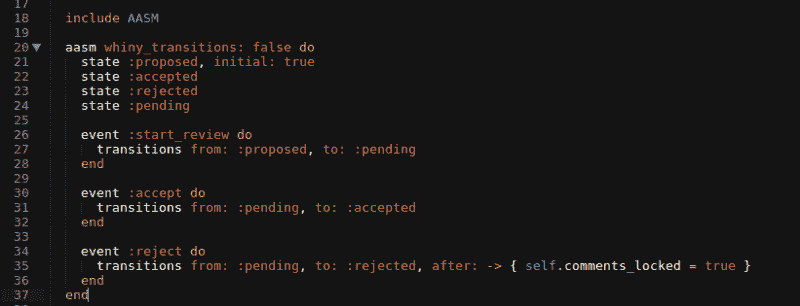

# 简言之，状态机

> 原文：<https://dev.to/juuh42dias/state-machine-in-a-nutshell-13o2>

当我们想要修改一个对象的状态时，有时我们需要应用一个状态。一个基本的例子是水的状态:气态、液态和固态，以及导致其变化的事件:

```
Object: Water
Event: Fusion
States: From solid to liquid
Event: Evaporation
States: From liquid to gaseous
Event: Condensation
States: From gaseous to liquid
Event: Solidification
States: From liquid to solid 
```

把这个看做一个发生在我们身边的简单例子。正如在许多其他情况下，我们可以在编程中使用称为状态机的东西来应用它。

[](https://res.cloudinary.com/practicaldev/image/fetch/s--BXppr4Ej--/c_limit%2Cf_auto%2Cfl_progressive%2Cq_auto%2Cw_880/https://thepracticaldev.s3.amazonaws.com/i/s7enneflko6syr2zp99a.png)

在上面的例子中，我们有不同的状态和负责改变这些状态的事件。`Proposed`、`accepted`、`rejected`和`pending`是对象的可能状态，并且当事件发生时，对象的状态可以改变。很像水州的例子，对吧？