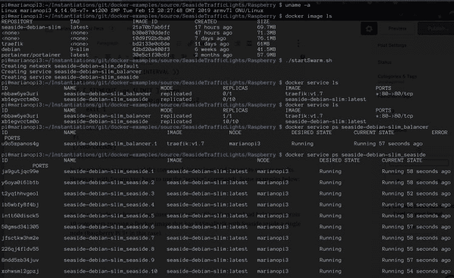
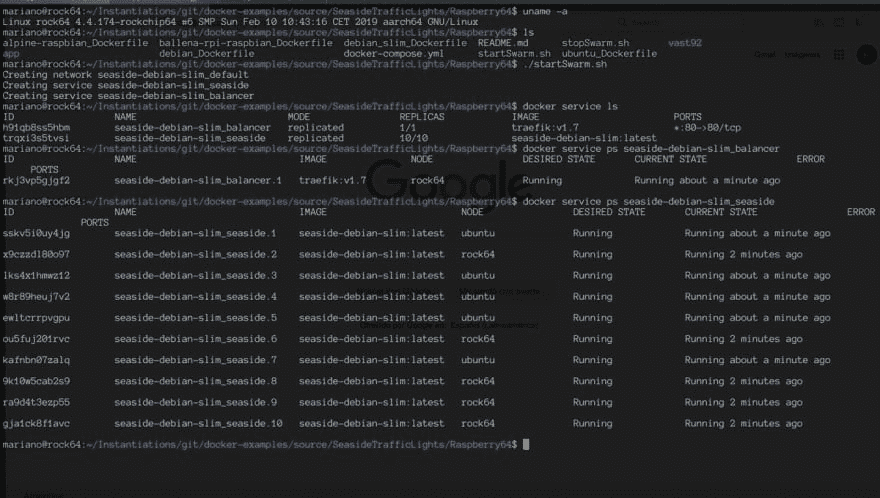

# 步骤 2:单节点 Docker Swarm 和 Smalltalk

> 原文：<https://dev.to/martinezpeck/step-2-single-node-docker-swarm-and-smalltalk-46i0>

## 以前…

在之前的一篇文章中，我们看到了对 Docker 和 Linux 容器的介绍，以及 Smalltalk 的一种可能的用法。我们看到了如何为在 [VASmalltalk](https://www.instantiations.com/products/vasmalltalk/index.html) 中开发和运行的 Seaside web 应用程序创建 Docker 文件，构建 Docker 映像，最后用它运行一个容器。

然而，这篇文章的一个结论是，使用普通的`docker`命令，我们一次只能运行一个容器，并且只能在 docker 运行的节点中运行。所以，在这篇文章中，我想给你介绍一下 Docker Swarm，它可以让我们做到这一点。但是，为了便于理解，在这篇文章中，我们将看到一个单节点的例子(但是有多个容器)。

顺便说一句，非常感谢朱利安·马斯特里和诺贝特·施莱默的帮助！

## 码头工和码头工-化合物

Docker 可以在“群模式”下运行，这基本上允许您创建一个 docker 引擎集群。这样，您可以在 Y 个节点中运行 X 个容器。当然， [Docker Swarm](https://docs.docker.com/engine/swarm/) 附带了很多工具来简化集群的管理。

docker-compose 是另一个介于普通 docker(只有一个容器运行)和 Swarm 之间的工具。据我所知，它允许你运行多个容器，但只能在那个节点内运行。正因为如此，我认为不值得花太多的时间去解释/学习这一点，而只是移动到 Swarm。

## 让我们开始为我们的 Smalltalk 应用程序使用 Docker Swarm

我们将继续上一篇文章中的[同一个例子](https://github.com/vasmalltalk/docker-examples/tree/master/source/SeasideTrafficLights/Raspberry)，这是在 Raspberry Pi 3 上运行的交通灯海边演示。

液体错误:内部

重要的是要注意，运行 Swarm 你不需要任何额外的包或任何东西，它只需要正常的 Docker 安装。

同样，Docker 文件是定义 Docker 映像的最重要的文件，`docker-compose.yml`是一个群体的文件。在这里，您可以定义集群中需要哪些服务、它们的“实例”数量以及所有可能的配置。下面是我们的例子:

```
# To start it up.
# ./startSwarm.sh

# To stop it
# ./stopSwarm.sh

version: '3'
services:
  seaside:
    image: seaside-debian-slim
    deploy:
      replicas: 10
      labels:
        traefik.port: 7777
        traefik.frontend.rule: "HostRegexp:{catchall:.*}"
        traefik.backend.loadbalancer.stickiness: "true"
  balancer:
    image: traefik:v1.7
    deploy:
      placement:
        # The webserver should only load on manager nodes
        constraints: [node.role == manager]
    # To see all available  command line options: docker run --rm traefik:v1.7 --help | less
    command: --docker --docker.swarmmode --retry --loglevel=WARN
    ports:
      - "80:80"
    volumes:
      # Required because of docker backend, so traefik can get docker data.
      - /var/run/docker.sock:/var/run/docker.sock:ro 
```

Enter fullscreen mode Exit fullscreen mode

需要注意的重要事项:

*   我定义了两个服务`seaside`和`balancer`
*   对于服务`balancer`,没有什么额外的事情要做，因为`traefik:v1.7`应该可以从已知的在线仓库(比如 dockerhub)中找到并下载
*   相反，对于服务`seaside`,我使用了一个名为`seaside-debian-slim`的图像，它是公共存储库中的**而不是**。所以你有三个选择:
    1.  在每个节点中构建图像:`docker build -f ./debian_slim_Dockerfile -t seaside-debian-slim .`(在本例中我们将使用这个节点)
    2.  只需构建一次映像，将其导出到. tar 并导入。其余节点中的 tar(您可以为此使用`docker export`和`docker import`命令)
    3.  使用内部注册表/存储库。如果有很多节点，这显然是最好的选择。
*   注意，我为`seaside`服务指定了 10 个副本。这意味着我将有 10 个容器运行`seaside-debian-slim`图像。
*   所有海边集装箱将共享同一个港口 7777。这怎么可能呢？为什么不弄个`Error: Address already in use`？Docker 虚拟化魔法。这个端口没有暴露，我认为即使你有副本也做不到。
*   `HostRegexp:{catchall:.\*}`只是 Traefik web 服务器中的一个规则，用于将所有内容重定向到底层服务(在我们的例子中是 Seaside)
*   因为 Seaside 框架是有状态的，我们需要会话关联。
*   我们通过 80 号港口对外服务。

## 现在怎么跑虫群？

首先让我们得到这个例子并构建图像:

```
cd $HOME
git clone https://github.com/vasmalltalk/docker-examples.git
cd docker-examples/source/SeasideTrafficLights/Raspberry/
docker build -f ./debian_slim_Dockerfile -t seaside-debian-slim . 
```

Enter fullscreen mode Exit fullscreen mode

然后你需要初始化蜂群。由于这将是一个单节点集群，您唯一需要执行的是:

```
docker swarm init 
```

Enter fullscreen mode Exit fullscreen mode

最后，你要做的就是使用我提供的`startSwarm.sh` :
开始 Swarm

```
#!/bin/bash docker stack deploy --compose-file docker-compose.yml seaside-debian-slim 
```

Enter fullscreen mode Exit fullscreen mode

您可以看到 docker 命令使用`docker-compose.yml`并将其命名为`seaside-debian-slim`来部署一组服务。

要验证一切正常，您应该使用 web 浏览器并通过端口 80 进入主机。例子[http://marianopi3.local/trafficlight](http://marianopi3.local/trafficlight)或者[http://192 . 168 . 7 . 91/traffic light](http://192.168.7.91/trafficlight)。这将显示我们到目前为止在示例中看到的海边交通灯示例。

然后你可以用`stopSwarm.sh`停止蜂群，它有一些魔力，以便等待网络正确关闭…否则一旦你试图再次启动它就会失败:

```
#!/bin/bash

readonly STACK_NAME=seaside-debian-slim

docker stack rm $STACK_NAME
declare TIMEOUT=0
readonly WAIT_INTERVAL=1
readonly LIMIT=120

echo -n 'waiting for network to shutdown'
while [ "$(docker network ls | grep --count "$STACK_NAME")" -gt 0 ] && [ $TIMEOUT -lt $LIMIT ]; do echo -n .
    sleep $WAIT_INTERVAL
    (( TIMEOUT+=WAIT_INTERVAL ))
done
if [ $TIMEOUT -ge $LIMIT ]; then echo ' failed' 1>&2
    exit 1
else echo ' ok'
fi 
```

Enter fullscreen mode Exit fullscreen mode

在前一篇文章中，我们使用了命令`container`和`image`来查看我们的结果。然而，使用 Swarm 你必须使用`service`命令。以下是一些例子:

[](https://res.cloudinary.com/practicaldev/image/fetch/s--QTu3vF4d--/c_limit%2Cf_auto%2Cfl_progressive%2Cq_auto%2Cw_880/https://marianopeck.files.wordpress.com/2019/05/screen-shot-2019-05-08-at-4.36.29-pm.png%3Fw%3D748)

总之，我们有 1 个容器运行 Traefik web 服务器负载平衡，10 个容器运行 Docker 映像，该映像在单个节点内具有 VASmalltalk 和 Seaside(在本例中为 Raspberry Pi 3+)。

## 有趣的提示

运行`docker service logs seaside-debian-slim_seaside`可以非常方便地查看服务日志。

另一个神奇的事情是容器自动重启的默认策略。杀死其中一个容器……用 kill -9 或别的什么……看看 Docker 是如何神奇地启动一个新容器来提供那个倒下的容器，并满足所需的副本(本例中是 10 个)。

[](https://res.cloudinary.com/practicaldev/image/fetch/s--JFnGldXZ--/c_limit%2Cf_auto%2Cfl_progressive%2Cq_auto%2Cw_880/https://marianopeck.files.wordpress.com/2019/05/screen-shot-2019-05-08-at-4.44.10-pm.png%3Fw%3D748)

看到海滨集装箱 2 号和 7 号了吗？我杀了他们，Docker 自动为我重新开始:)

## 接下来是什么？

显然，下一步是让 Swarm 与多个节点一起工作:)所以这是下一篇文章的预告片:

> 马里亚诺马丁内斯佩克[@马丁内斯佩克](https://dev.to/martinezpeck)2019 年 5 月 08 日下午 15 点 15 分[](https://twitter.com/intent/tweet?in_reply_to=1126143505095700480)[](https://twitter.com/intent/retweet?tweet_id=1126143505095700480)[](https://twitter.com/intent/like?tweet_id=1126143505095700480)

## [更新:关于这个话题请看下篇帖子！](https://dev.to/martinezpeck/docker-swarm-cloud-on-a-arm64-diy-sbc-cluster-running-a-smalltalk-webapp-9l1)