# 循序渐进:Azure 机器学习入门

> 原文：<https://dev.to/wirelesslife/step-by-step-getting-started-with-azure-machine-learning-513b>

人工智能(AI)的研究和使用正在兴起。支持人工智能的工具正变得越来越容易获得，越来越容易使用和实现。更重要的是，人工智能本身的定义已经被分解为*成分*，当这些成分后来被应用到一个配方(或过程)中时，可以提供多种期望的结果。大多数食谱中使用的一个更重要的成分是机器学习。机器学习本质上是一种教会计算机根据提供的数据提供更准确预测的方法。这些预测还可以通过提供建议作为数据的结果，使应用程序和设备更加智能。

为了使道路更加安全，丰田加拿大公司一直在从丰田加拿大公司所有 300 家经销商的机械师那里收集他们所维修车辆的数据。过去，维修数据是从丰田加拿大公司的服务应用程序中手动提取的，并存储在本地的数据库中，以便以后进行分析。虽然部分分析过程是自动化的，但整个过程需要超过 6 个月的时间来处理大量数据，以提供部件更换建议。

丰田加拿大公司希望减少处理时间，因此与微软接洽，在一次机器学习黑客大会上合作提出一个解决方案。虽然我们无法详细描述丰田加拿大公司和微软公司在黑客大会期间完成的确切过程，但这篇文章将通过完成类似练习的步骤来进一步了解机器学习过程。下面详细介绍的步骤将建立特定车辆的定价预测。让我们开始吧。

_ _

#### 第一步:访问机器学习工作室

要开始这项练习，请导航至[https://studio.azureml.net](https://studio.azureml.net/)并选择**在此注册。**接下来，在免费和付费选项中进行选择，完成本练习。**注意:**如果您之前已经完成了一个机器学习实验，并简单地输入您的凭证，请选择**登录**。 [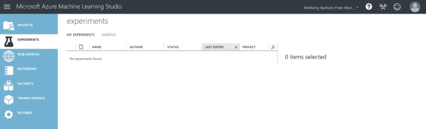](https://res.cloudinary.com/practicaldev/image/fetch/s--ZmOUDRbI--/c_limit%2Cf_auto%2Cfl_progressive%2Cq_auto%2Cw_880/https://msdnshared.blob.core.windows.net/media/2017/04/Machine_Learning_Toyota_001-1024x309.png) 一旦能够访问微软 Azure Machine Learning Studio，就可以开始练习了。

#### 第二步:获取数据进行分析

接下来，您需要获取数据进行分析。Machine Learning Studio 有许多样本数据集可供选择，或者您甚至可以从几乎任何来源导入自己的数据集。为了与汽车主题保持一致，本练习将使用**汽车价格数据(原始)**数据集。该数据集提供了各种汽车的数据，包括品牌、型号、价格和规格。执行机器学习首先需要的是数据。Machine Learning Studio 提供了几个示例数据集供您使用，或者您可以从许多来源导入数据。对于这个例子，我们将使用示例数据集，**汽车价格数据(原始数据)**，它包含在您的工作区中。该数据集包括各种单个汽车的条目，包括诸如品牌、型号、技术规格和价格等信息。**注意:**本练习中使用的所有数据都是人为的，并不代表当前的汽车市场。现在，让我们捕获这个实验的数据集。

1.  点击位于 Machine Learning Studio 窗口底部的 **+NEW** 创建一个新实验
2.  选择**实验**T4**空白实验**
3.  通过选择并替换顶部的文字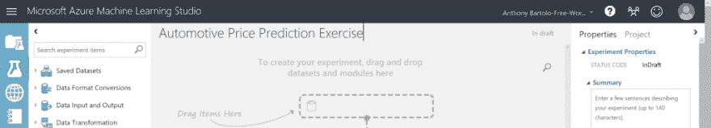，命名实验**汽车价格预测练习**
4.  在位于左上方的搜索框中，输入**汽车**找到标签为**汽车价格数据(原始)**的数据集
5.  将数据集拖到实验画布上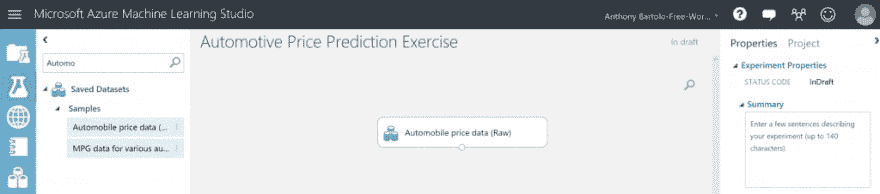 **注意:**点击汽车数据集底部的输出端口，然后选择**可视化**查看汽车数据集的样子

#### 第三步:数据准备

需要对数据集进行预处理，以确保在运行预测练习之前解决缺失值。正如在新添加的汽车数据集中指出的那样，*归一化损失*列缺少许多值，因此必须将其排除以提供更好的预测。

1.  在位于左上方的搜索框中，输入 select columns 并找到数据集模块中的[选择列](https://msdn.microsoft.com/library/azure/1ec722fa-b623-4e26-a44e-a50c6d726223/)
2.  将该模块拖到新创建的实验画布上**注意:**该模块允许选择在本练习中包含或排除的数据列
3.  将**汽车价格数据(原始)**数据集的输出端口连接到数据集模块中选择列的输入端口
4.  选择“选择数据集中的列”模块
5.  在**属性**窗格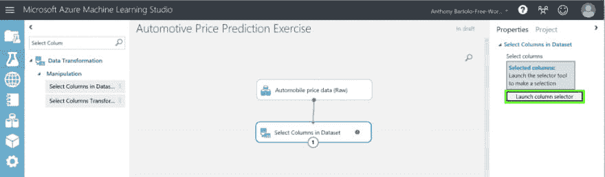中点击**启动列选择器**
6.  点击左侧带有规则的
***   在**下从**开始，点击**所有列**。这将指示数据集中的 Select 列通过所有列(除了我们要排除的那些列)。*   从下拉列表中选择**排除**和**列名**，然后在文本框内单击。将显示列列表。选择**归一化损耗**，它被添加到文本框中。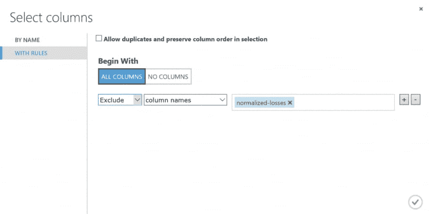*   点击*复选标记*关闭列选择器**注意:**选择数据集中的**列的属性窗格现在显示数据集中的所有列都将通过，除了**归一化损失*****   将 [Clean Missing Data](https://msdn.microsoft.com/library/azure/d2c5ca2f-7323-41a3-9b7e-da917c99f0c4/) 模块拖到实验画布上，并将其连接到 Dataset 模块中的 Select 列*   在**属性**窗格中，选择**清理模式**下的**移除整行****注:* *这将指示清理缺失数据，通过移除有任何缺失值的行来清理数据。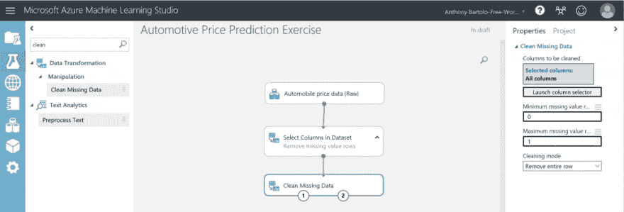*   双击模块并输入注释*删除丢失的值行**   点击页面底部的**运行****

 **#### 第四步:定义特征

机器学习特征是感兴趣的单个可测量属性。在汽车价格数据集中，每一行代表一辆汽车，每一列是该汽车一个特性。为了找到一组好的特征来创建预测模型，需要进行实验并了解您想要解决的问题。该实验将构建一个模型，该模型使用汽车数据集中的一部分功能。这些功能包括:`make, body-style, wheel-base, engine-size, horsepower, peak-rpm, highway-mpg, price` 

1.  找到数据集模块中的另一个选择列，并将其拖到实验画布上
2.  将“清除丢失的数据”模块的左侧输出端口连接到“选择数据集内的列”模块的输入端
3.  双击模块并键入*选择用于预测的特征*
4.  在**属性**窗格中点击**启动列选择器**
5.  用规则点击
***   点击**无栏目** u **以**开头*   选择**在过滤行中包含**和**列名***   在文本框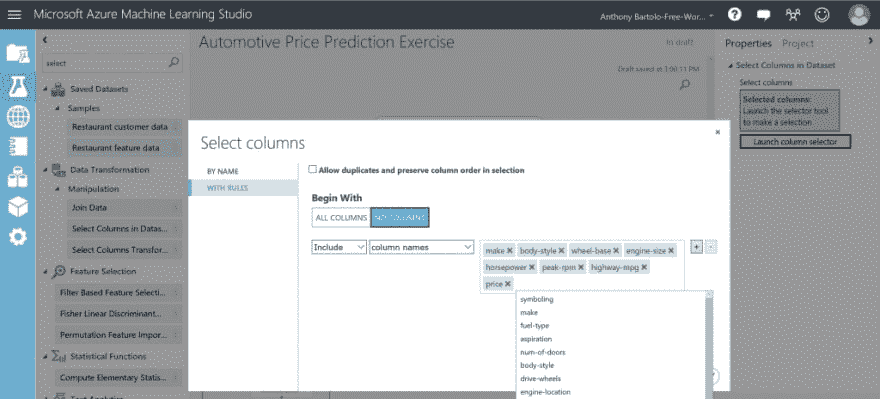中选择列名列表(如第 3 步开始前所列)*   单击复选标记按钮确认选择**

 ****步骤 5:选择和应用学习算法**现在，适当的数据已经修复，预测模型的训练和测试现在可以开始。这些数据现在将用于训练模型和测试模型，以查看价格预测。对于这个实验，将使用*回归*机器学习算法。回归用于预测在预测价格时将会出现的数字。更具体地说，这个实验将使用简单的*线性回归*模型。数据本身将用于训练模型和测试。这是通过将数据分成单独的训练和测试数据集来完成的。

1.  找到、选择并拖动分割数据模块到实验画布上
2.  将拆分数据模块连接到数据集模块中的最后一个*选择列*
3.  单击拆分数据模块
4.  在画布右侧的**属性**窗格中，找到第一个输出数据集()中行的**分数，并将其设置为 0.75 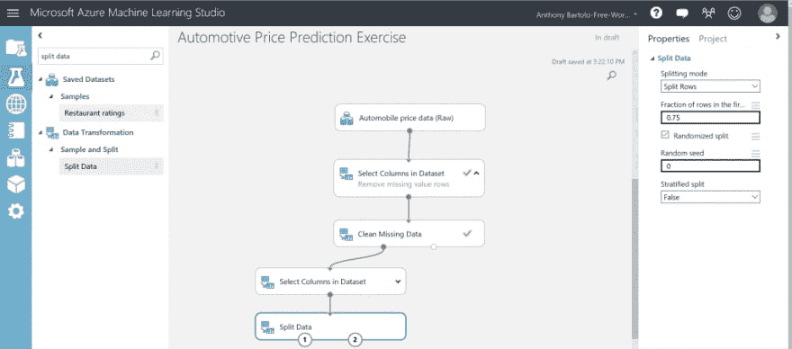**
5.  进行实验
6.  在画布左侧的模块调板中展开**机器学习**类别，选择学习算法
7.  展开**初始化模型** **注意:**这显示了几类可以用于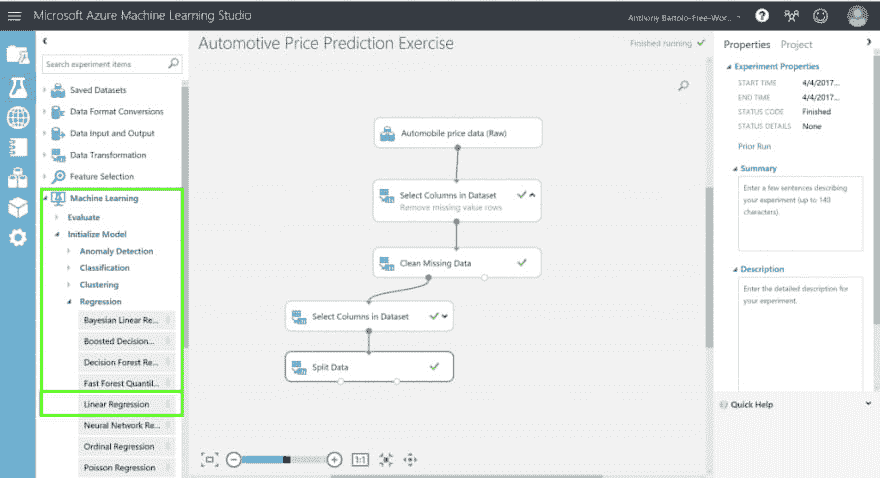初始化机器学习算法的模块
8.  选择**回归**类别下的线性回归模块，拖动到实验画布
9.  找到*火车模型*模块并将其拖到实验画布上
10.  将线性回归模块的输出连接到训练模型模块的左输入，将分离数据模块的训练数据输出(左端口)连接到训练模型模块的右输入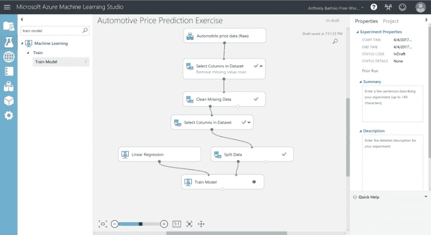 **注意:**请注意使用的端口，如果连接错误，实验将无法进行
11.  单击火车模型模块
12.  在**属性**窗格中选择**启动列选择器**
13.  选择**价格**列，并将其移动到**所选列**列表中(这是实验将要预测的值)
14.  单击复选标记按钮确认选择
15.  进行实验

#### 第六步:预测新车定价

该实验现在可以对 25%的数据进行评分，以了解模型如何在另外 75%的数据上进行训练。

1.  找到乐谱模型模块并将其拖到实验画布上
2.  将训练模型模块的输出连接到得分模型的左侧输入端口
3.  将分割数据模块的测试数据输出(右端口)连接到评分模型的右输入端口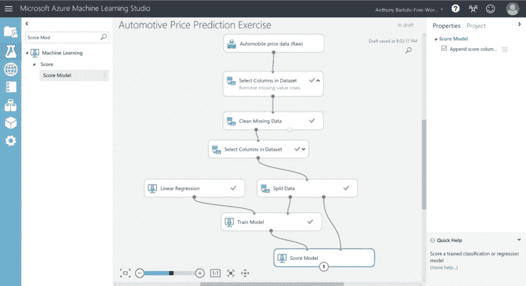
4.  进行实验
5.  点击评分模型输出端口，选择**可视化**查看评分模型模块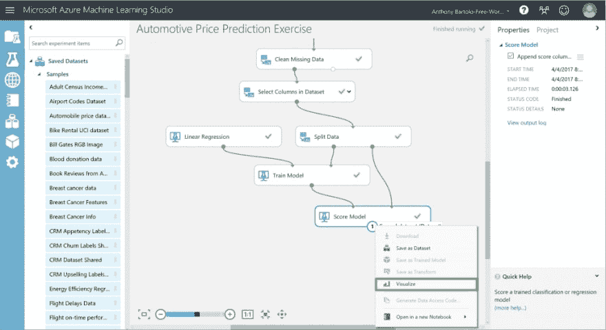的输出**注意:**输出显示价格的预测值和测试数据的已知值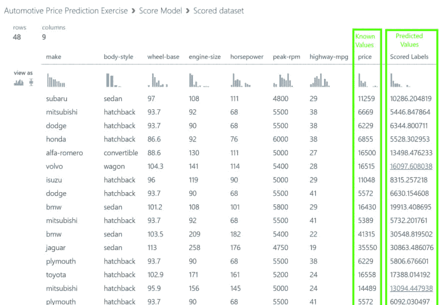

祝贺你，因为你已经完成了你的第一个机器学习实验。下一步将是尝试改进预测，然后将其部署为预测性 web 服务。通过添加多种机器学习算法、修改线性回归算法的属性或尝试不同的算法来进一步试验。****