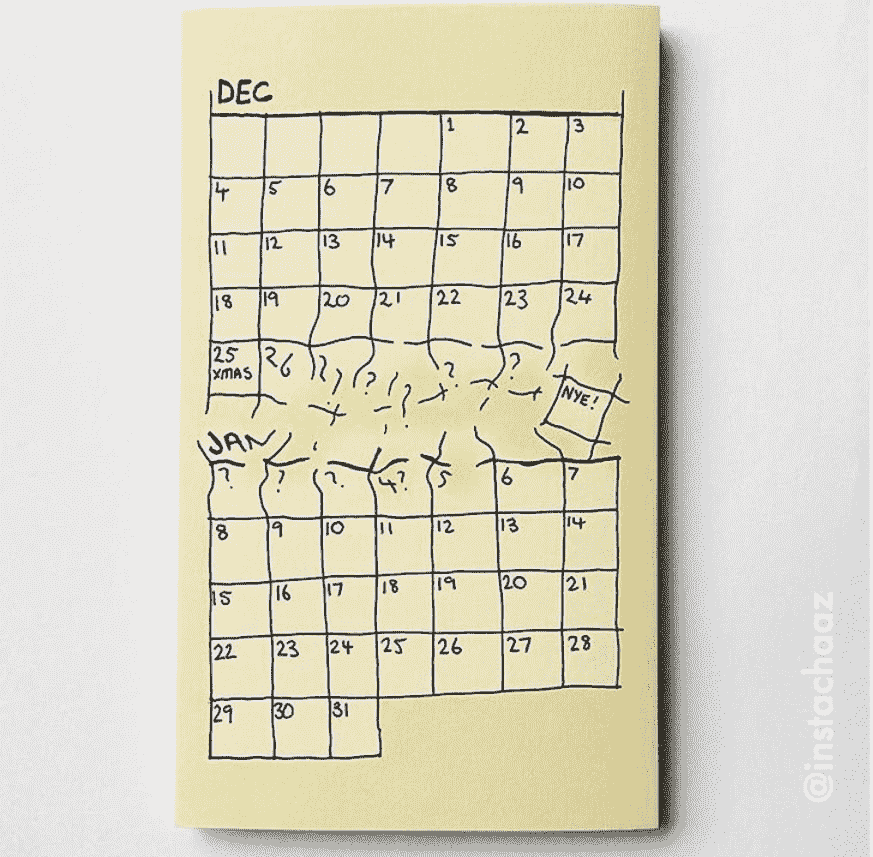

# 不要把标准视为理所当然

> 原文：<https://dev.to/solacedevs/stop-taking-standards-for-granted-1bfg>

一个愤怒的米其林星级厨师与标准和多云有什么关系？让我解释一下…

想象一下这个场景:在圣诞节和新年之间的一段模糊的时间里，你知道日历上有几天，但是你不确定在哪里发生了什么，或者现在是哪一天。

 

<figcaption>在 Instagram 上做退房@ instachaaz</figcaption>

有很多家人过来，我们都处于食物昏迷的不同阶段。

我的姐夫突然让我吃惊:

> “哦，我看了你上一篇[博客](https://dev.to/solacedevs/alibaba-cloud-a-data-driven-analysis-41ci)(在阿里云上)，很有趣。”

这是一个惊喜，因为他的职业是药剂师，并不认为自己真的有技术倾向。也就是说，首先不是我的目标读者。

原来他最近一直失眠，所以阅读随机话题的文章是为了寻找他逃避的睡眠。现在我可能会生气。我的意思是我写作不是为了帮助失眠者入睡！唉，我是一个半满杯子的人，所以事实上，这足以让他在第二天早上还记得我的博客，我把这当成一个胜利。

> “这种多云理念，不就是标准吗？”

这是这个非技术读者向我提出的问题。我想每个人都可以理解为什么多云具有优势，无论您是否在该领域。我只是在解释为什么不是每个人都这样做的时候被难住了。

在试图解释这种情况时，我决定将重点放在单词*标准*上。不是问题中提出的单词的形容词含义，而是名词:

> [**标准**T3【标准】](https://www.dictionary.com/browse/standard)
> 
> 名词:
> 
> “被权威或普遍同意作为比较基础的东西；认可的模式。”
> 
> 形容词:
> 
> 通常的、普通的或习惯的

### 进入愤怒的厨师……

“想象一下，一个厨师在一家非常繁忙的米其林星级餐厅”，我开始…

食客很多，服务员接受订单，厨房里一片繁忙。但是突然有点不对劲。房屋的煤气供应中断了。整个厨房停滞不前。我们想象中的厨师现在非常生气，因为不能为饥饿的食客提供食物。

无论厨师或企业在他们所做的事情上多么熟练，他们的职能中一个根本上至关重要的元素是缺失的，并且没有办法绕过它。煤气服务是一种公用事业，当它存在时，人们认为这是理所当然的，但当它不存在时，灾难就会降临。

幸运的是，餐馆转向了另一家更可靠的供应商，服务得以恢复。由于有了标准，他们能够很容易地做到这一点。标准意味着无论供应商是谁，气体就是气体。不管是谁提供的，它的操作和行为都是一样的。工业作为一个整体可以独立地同意什么样的碳氢化合物气体混合物是可接受的，通过管道和厨房用具可以被设计成以那些期望运行。(失眠者，点击[这里](https://www.ofgem.gov.uk/gas/wholesale-market/gas-quality)获得更多关于气体标准的阅读！)

#### 如果没有标准会怎样？

我们愤怒的厨师和餐厅决定放弃目前的供应商，选择另一家。另一家公司很乐意接受他们的业务。

> “哦，但是…我们的气体不同…”

*   它的质量不同。所以你需要更换你的厨房设备。
*   它也会达到不同的压力。所以你需要安装新的管道。
*   它也在更高的温度下燃烧。所以你需要调整你的食谱。

我们假设的厨师现在有多生气？

### 云计算中的标准在哪里？

我解释了为什么多重云不是标准方法的原因是因为没有被广泛接受的标准来帮助用户。

目前在许多层面都需要标准。从如何发现和使用云中的资源，到如何在提供商之间部署和移动应用程序。

遗憾的是，这个领域还不够成熟，无法为用户带来更大的好处。或者也许我们中没有足够的人需要它们。

至少我可以提供一个安慰:所有的应用程序都需要相互通信。不受限制的数据移动是那些工作时被认为是理所当然的基本工具之一，但一旦发生故障，那将是一场灾难。

由 Solace [PubSub+](https://solace.com/get-started) 支持的 [Event-Mesh](https://solace.com/what-is-an-event-mesh) 架构允许根据开放标准构建应用程序，该标准提供保护，以便在需要时轻松切换。

当然，这只是一个更大拼图中的一小块，但这是一个开始。

说完，希望我给了姐夫足够的安心，终于可以睡个好觉了！

* * *