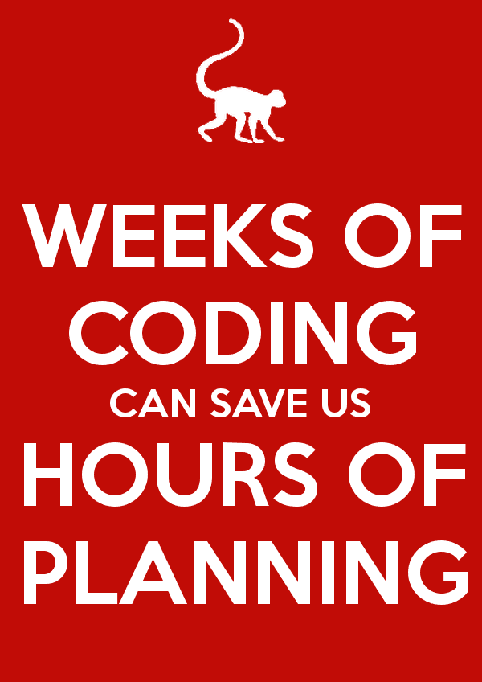

# 停下来，思考，代码迭代

> 原文：<https://dev.to/dvddpl/stop-think-code-iterate-4d56>

我们是开发商。我们喜欢编码。我们喜欢建造东西。我们喜欢立即形成我们的想法，并看到我们的[诗歌](https://twitter.com/poetry_code/status/878153129694572545)的结果。

这就是为什么很难真正花费合理的时间来规划和设计我们功能的实现。

过去，我经常使用 UML 来表示我们 OOP 设计的架构。
在这个更加函数式编程方法和无服务器事物的时代，我发现自己使用了更多的**思维导图和流程图**来展示不同部分/服务之间的关系，并且我非常依赖**测试驱动开发**。

由于一切都被分割成更小的部分和微小的方法来完成简单的任务，不依赖于外部状态也不改变外部变量，然后被组合来完成更大更复杂的任务， **TDD 更容易**。
甚至更重要的是**，因为它给你提供了你正在做的事情的即时反馈——并且你可以及时纠正。**

测试设置和拆卸太复杂了，因为我们的方法中需要大量的参数？也许我们在这方面做得太多了。
嘲讽繁琐又过于精细？可能我们的函数中有太多的外部依赖。

我将在未来写更多关于 TDD 的东西——实际上我正在准备一个关于它的演讲，有时我会在一次聚会上发表(公开演讲是我 2019 年的目标),也许我可以发布脚本或录音。

我在这里真正想指出的是在匆忙编码之前**停下来思考是多么重要。**

我们需要记住这一点(无论是低年级还是高年级)，我们需要经常这样做。重新评估我们正在以正确的方式实施正确的事情。
我们需要意识到这一点，并强迫自己，使自己不要犯冲进流程的错误，只看到几个小时或几个星期后，我们实施了错误的事情——或者我们过度工程化了——或者我们专注于我们对需求的错误假设。

你是否相信 10X 开发者并不重要。

> 一个好的开发者用正确的方式做正确的事情。他/她是高效的和有效的。

花费大量时间编写经过 100%单元测试，但不符合验收标准的高性能代码是非常无用的(也是愚蠢的)。

不幸的是——在我的职业生涯中，我看到了许多案例，我们只是在 sprint 结束时才意识到我们失败了，因为**开发人员太害羞——或者傲慢——或者害怕批评**——组织一次代码设计会议，或者只是太“好”或者懒于用进一步的问题来打扰涉众以更好地理解需求。

所以在编码之前:停止-思考-迭代(以及一路上的 Aks 问题和 TDD)

* * *

马太·亨利在 Unsplash 上的照片