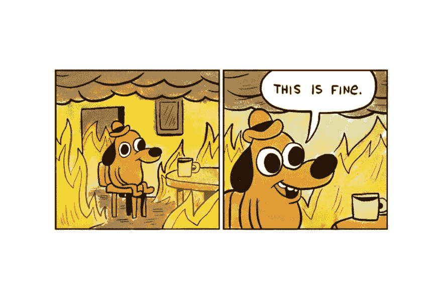

# 阻止世界末日:关于监控的讨论

> 原文：<https://dev.to/nathanenglert/stopping-armageddon-a-discussion-on-monitoring-4m9p>

这不是一篇关于如何设置特定工具的帖子。更多的是讨论在开发和实现过程中应该考虑的概念和过程。这可能会成为一个系列，我会更深入地研究其中的每一点。

我们不写防弹代码。有时很难承认这一点，骄傲会妨碍我们。即使你认为你已经解决了所有的问题，所有的错误..在某个地方会有一些东西..一些会困扰你的边缘案件。那么，我们该如何为那一刻做准备呢？我们如何确保在世界末日开始之前，我们已经准备好了所有的东西来阻止它？记录和监控。

> 知道事情何时出错是被动的。而知道事情何时出错是主动的。
> *- [凯尔·加尔布雷斯](https://dev.to/kylegalbraith/introduction-to-monitoring-and-logging-how-to-know-when-things-go-wrong-535j)*

对于我们大多数人来说，日志和监控是我们在项目结束时考虑的事情。焦点总是在我们如何完成摆在我们面前的问题，而不是我们如何监控它的发展。我们需要改变这种思路。在项目开始时考虑该功能的操作方面，可以让我们从头到尾编织这些变化，而不是在结束时将它们粘在一起。

你可能会问，'这些都是很好的话，内森，但我们实际上应该做什么？'我们需要做的第一件事是定义我们的关键指标。

## 定义

答案不是一直监控所有的事情。说起来不错，但实际上几乎不可能做到。不，我们实际上需要做的是识别代表我们的应用程序成功或失败的东西。项目的目标是什么，我们如何量化它的成功？

监控异常率、请求持续时间等。，是一个很好的起点。然而，我们还需要考虑非技术指标。请求持续时间可能降低了 10%,但是这真的会影响全局吗？同样，我们正在进行的项目试图解决某种问题。我们如何衡量呢？

例如，如果您正在构建一个电子商务网站，您可能希望监控客户注册和订单。如果这是一个忠诚度计划，也许你应该看看注册，活动记录和奖励兑换。如果它是一个产品评论 API，你的度量可能是写的评论。关键是，你从事的每个项目都应该有一些可衡量的东西，显示它是否完成了目标。这是你的关键指标。

## 日志

我们已经确定了关键指标，现在做什么呢？

仅仅能够查询某个数据库中的指标来获得当前值是不够的。我们需要查看随时间记录的指标，以便我们可以建立基线并了解趋势。有很多工具可以帮助你做到这一点；Grafana、Application Insights 和 Geckoboard 等等。或者…可以简单到在数据库中创建一个新表来汇总一段时间内的指标。挑选一些东西，并确保它经常更新。

很好，现在我们可以知道什么时候一切都失控了。然而，如果我们找不到原因，这对我们没有任何好处。

在完成您的开发任务时，请确保您记住了这些关键指标。当捕获异常时，记录足够的细节和上下文，以便以后帮助自己。例如，如果例外与特定的客户帐户相关，请确保包含该帐户的 ID 或其他标识符。不要害怕记录更多的错误。只要您恰当地使用您的[日志级别](https://reflectoring.io/logging-levels/)，您通常可以过滤掉较低的级别，直到需要为止。存储便宜，信息越多越好。

## 监视器

此时，我们已经定义了度量标准，并且记录了一些支持消息。下一步是什么？剩下要做的就是指定专人持续查询这些数据，并在出现任何问题时通知团队。

…

不，我们现在需要做的是设置一些警报。这可以说是这个过程中最重要的部分。没有适当的提醒，你仍然处于被动状态。直到有人破门而入，你才会知道发生了什么。

还记得您之前设置的那些指标趋势吗？使用这些来计算指标应该落入的阈值。在 5 分钟的时间内，您通常会看到 30 - 50 个客户注册和 15 - 20 个订单。如果这个数字低于这个数字，你应该得到通知。想一个你能接受的阈值，并设置一个警报，当它超出安全区域时就触发。

传达警报也可能是一件棘手的事情。大多数地方默认将所有事情记录到电子邮件中。然而，在一个到处都有垃圾邮件的世界里，东西很容易丢失。如果你只有电子邮件，只要确保你在收件箱里设置了适当的规则/过滤来处理它。电子邮件绝对是最容易上手的。

最重要的是，我真的鼓励看看你的团队用于日常交流的工具(请不要说电子邮件)。也许你用 Slack 或者微软团队..Hipchat..网络电话..AOL？不管是什么，我的建议是在应用程序中为这些警报设置一个位置。反正你整天都在那个工具里，有道理。

另一个选择(可能除此之外)是短信。如果你走这条路，我强烈建议只在紧急情况下/必要时使用它。没有人希望他们的手机不断被警告“网站性能下降 5%”的声音打爆。

## 总结

会有错误，会有生产中发生的问题。这就是技术的本质。然而，通过改变一些习惯，我们可以更好地为这些问题做准备。通过提前开始讨论，我们可以确保我们对我们开发的每个新功能的监控部分都考虑周全。

我错过了什么吗？也许你讨厌我说的一切，什么都不想听？请在评论中畅所欲言，我很乐意听到你的意见。👇