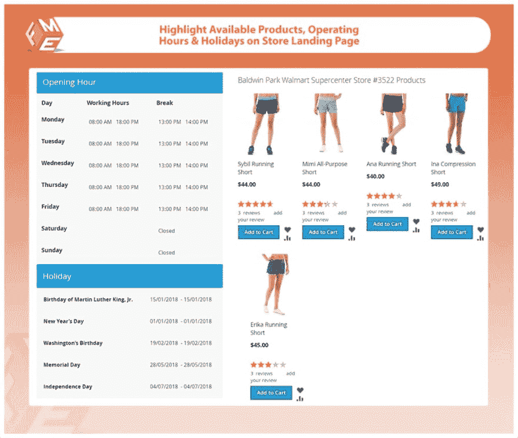
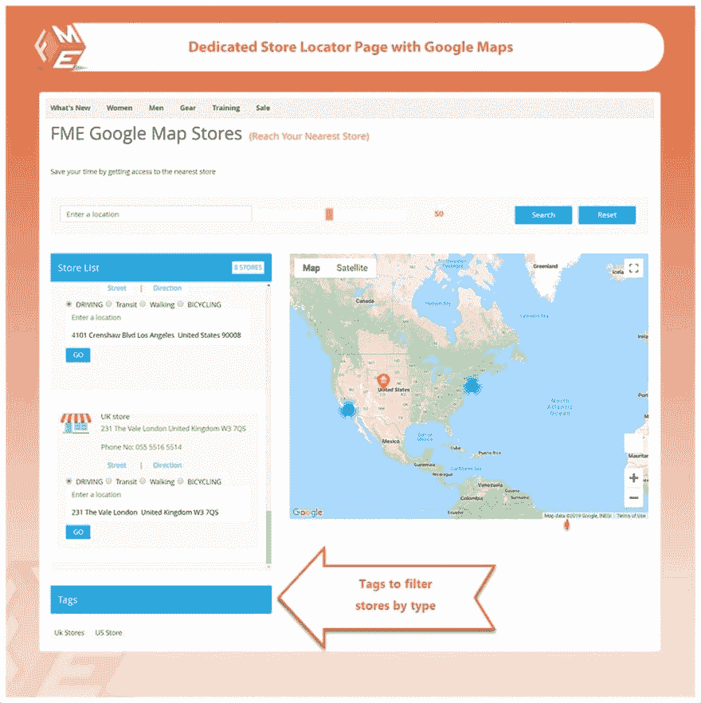
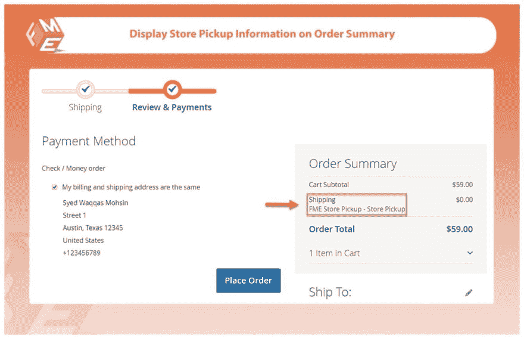
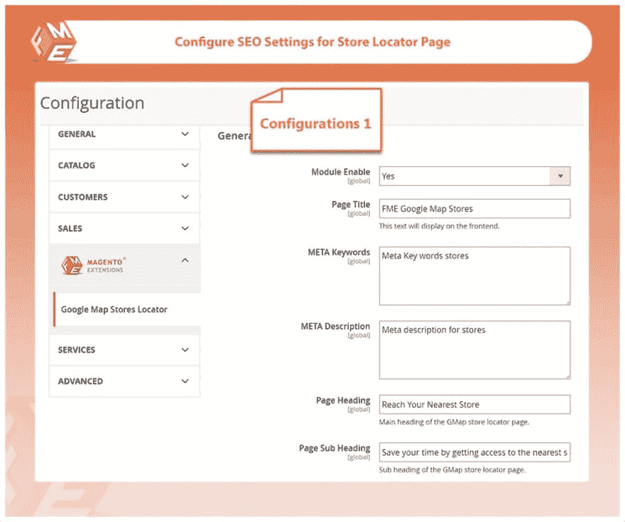

# Magento 2 的商店提货

> 原文：<https://dev.to/alexbry08549483/store-pickup-for-magento-2-4c6m>

Magento 2 商店提货扩展允许您从最近的商店提取您在线订购的产品。通过将商店提货作为一种运输方式，客户可以选择最近的线下商店来提货，从而节省运输时间和成本。

### **启用“商店提货”作为发货方式**

Magento 2 商店提货扩展允许您的客户选择“商店提货”作为送货方式。并且还允许客户:

*   选择最近的商店进行收集
*   设定日期和时间

### **添加无限商店位置**

通过使用这个扩展，你可以创建多个商店和商店，并在谷歌地图上显示它们。您可以在单独的页面上显示位置。此外，您可以从 Magento 1 商店导入位置，并提供以下详细信息:

*   商店设置标题和 URL 键
*   分配到商店视图
*   地址和描述
*   电话、邮政编码和缩放级别
*   城市、国家和地区

### **配置设置**

您可以从后端更改这些配置设置。

*   启用或禁用功能
*   配置元信息
*   添加图像
*   设置默认纬度和经度
*   添加谷歌地图 API 密钥
*   添加谷歌地图标记
*   管理页脚链接
*   设置 URL 标识符

### **强大的关键功能**

1.  允许用户在结账时选择“从商店提货”
2.  允许他们选择最近的商店、日期和时间来领取
3.  使用 CSV 文件导入商店数据
4.  奖励商店定位器扩展功能
5.  在谷歌地图上列出位置的专用商店页面
6.  每个店铺都有单独的登录页面，显示时间表和产品
7.  创建位置标签，让您的客户过滤列表

**完整细节和现场演示-[https://marketplace.magento.com/fme-store-pickup.html](https://marketplace.magento.com/fme-store-pickup.html)**

