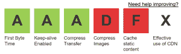
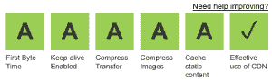

# 在 Umbraco 的网页测试中成绩全 A

> 原文：<https://dev.to/vigilnt/straight-as-in-webpagetest-with-umbraco-586c>

在推出一个新网站之前，我会检查一份清单，以确保一切准备就绪。我的清单中有一项是对照 **WebPagetest** 测试网站。

> WebPagetest 是一个工具，最初是由 [AOL](http://dev.aol.com/) 开发的，供内部使用，2008 年在 BSD 许可下开源。www.webpagetest.org[的在线版本是为了性能社区的利益而运行的，有几家公司和个人在全球提供测试基础设施。](https://www.webpagetest.org/)

该工具针对 6 个主要的性能影响因素测试任何网站，并提供大量的图表和日志，让您充分了解可能会降低您的网站速度的因素。

在这篇文章中，我将提供让你的网站在网页测试中获得 A 的方法。

# 设置

首先，让我们设置一下我们的环境。我们只需要以下内容:

*   Visual Studio 2017
*   Microsoft Azure 帐户

在 Visual Studio 中，让我们创建一个新的空 ASP.NET Web 应用程序项目。然后，我们需要最新最好的 Umbraco NuGet 包(我用的是 7.12.4 版本)。一旦它完成安装，只需启动网站并安装所有默认的 Umbraco。这将引导 Umbraco 和 Starter 网站，我们将用它作为 WebPagetest 的“试验品”。

接下来:发布！我们可以使用发布向导在 Azure 中自动创建新的 WebApp 和 SQL 数据库。在 Azure 中安装 Umbraco 之前，我们需要更改 Web.config，以便再次运行安装向导(我在 Azure 中使用 [Filezilla](https://filezilla-project.org/) 来更改它):

清除 Umbraco 版本号:

```
<add key="umbracoConfigurationStatus" value="" /> 
```

清除 Umbraco 连接字符串:

```
<add name="umbracoDbDSN" connectionString="" providerName="System.Data.SqlClient" /> 
```

有了这些变化，我们就可以开始了。这一次，我们不会使用 Umbraco 安装向导中的默认设置，因为我们想要使用我们刚刚在 Azure 中创建的 SQL 数据库。

# 第一次测试

对于我们的测试，我们将使用入门网站的人员页面。这是我用标准(S0)数据库和基本 WebApp 得到的分数:

[](https://res.cloudinary.com/practicaldev/image/fetch/s--IXGxre_q--/c_limit%2Cf_auto%2Cfl_progressive%2Cq_auto%2Cw_880/https://i2.wp.com/blogit.create.pt/wp-content/uploads/2018/09/first-webpagetest.png%3Fresize%3D300%252C91%26ssl%3D1)

由于这是一个非常小的网站，仅用于演示目的，一半的指标已经被清除！然而，对于较大的网站来说，通常不是这样。出于这个原因，我仍然会提出一些解决方案来提高这些指标的分数。

# 首字节时间

*该测试测量初始 http 请求后第一个字节到达客户端浏览器所需的时间。*

有两个主要因素影响这一结果:

*   服务器电源
*   网页的复杂性(与外部服务的集成，涉及复杂的逻辑等)

### 如何拿 A

缓解这个问题最简单的方法是缓存。你可以看看我的这个老帖子:https://blogit . create . pt/Andre Santos/2016/06/30/Umbraco-and-donut-output-cache/在 um braco 中如何做输出缓存。

# 保活使能

*Keep alive 是一种允许相同的 tcp 连接用于 HTTP 对话的方法，而不是在每个新请求时打开一个新的连接。*

### 如何拿 A

这个设置在 IIS 中是默认激活的，所以，在 Azure WebApps 中也是默认激活的，所以很容易得到 A！

# 压缩传送

在将网页、样式表和 javascripts 发送到浏览器之前，Gzip 会对它们进行压缩。这大大减少了传输时间，因为文件小得多。

### 如何拿 A

只需将此设置添加到您的 Web.config 文件中:

```
<httpCompression dynamicCompressionEnableCpuUsage="0" dynamicCompressionDisableCpuUsage="90" noCompressionForHttp10="false" noCompressionForProxies="false">
    <staticTypes>
        <add mimeType="text/*" enabled="true" />
        <add mimeType="message/*" enabled="true" />
        <add mimeType="application/javascript" enabled="true" />
        <add mimeType="application/font-woff" enabled="true" />
        <add mimeType="application/font-woff2" enabled="true" />
        <add mimeType="application/vnd.ms-fontobject" enabled="true" />
        <add mimeType="application/octet-stream" enabled="true" />
        <add mimeType="*/*" enabled="false" />
    </staticTypes>
    <dynamicTypes>
        <add mimeType="text/*" enabled="true" />
        <add mimeType="message/*" enabled="true" />
        <add mimeType="application/javascript" enabled="true" />
        <add mimeType="*/*" enabled="false" />
    </dynamicTypes>
</httpCompression> 
```

# 压缩图像

*图像压缩是指在不将图像质量降低到不可接受的水平的情况下，最小化图形文件的字节大小。*

### 如何拿 A

在 Umbraco，要在这个年级拿到 A，你需要做两件事:

1.  裁剪每张图片，尽可能使用秘密
2.  使用图像处理器的后处理器插件

在 Umbraco 中裁剪图像很容易:

```
 <div class="employee-grid\_\_item\_\_image" style="background-image: url('@person.Photo.GetCropUrl(width: 323, height: 300, quality: 85)')"></div> 
```

为了使用后处理器插件，你只需要通过 nu get:[https://www.nuget.org/packages/ImageProcessor.安装它 Web.PostProcessor/1.3.1.25](https://www.nuget.org/packages/ImageProcessor.Web.PostProcessor/1.3.1.25)。

# 缓存静态内容

*静态内容是很少变化的内容。因此，它可以缓存在用户的浏览器中，以避免反复下载相同的文件。*

### 如何拿 A

只需设置内容在用户浏览器中过期的时间，并根据需要添加额外的 mime 类型:

```
<staticContent>
    <clientCache cacheControlMode="UseMaxAge" cacheControlMaxAge="7.24:00:00" />
    <remove fileExtension=".air" />
    <mimeMap fileExtension=".air" mimeType="application/vnd.adobe.air-application-installer-package+zip" />
    <remove fileExtension=".svg" />
    <mimeMap fileExtension=".svg" mimeType="image/svg+xml" />
    <remove fileExtension=".woff" />
    <mimeMap fileExtension=".woff" mimeType="application/x-font-woff" />
    <remove fileExtension=".woff2" />
    <mimeMap fileExtension=".woff2" mimeType="application/x-font-woff2" />
    <remove fileExtension=".less" />
    <mimeMap fileExtension=".less" mimeType="text/css" />
    <remove fileExtension=".mp4" />
    <mimeMap fileExtension=".mp4" mimeType="video/mp4" />
    <remove fileExtension=".json" />
    <mimeMap fileExtension=".json" mimeType="application/json" />
</staticContent> 
```

# 有效利用 CDN

*内容交付网络(CDN)是指在地理上分布的一组服务器，它们协同工作以提供互联网内容的快速交付。CDN 允许快速传输加载互联网内容所需的资产，包括 HTML 页面、javascript 文件、样式表、图像和视频。*

### 如何拿 A

在 Umbraco，你可以通过做两件事来达到这最后一个等级:

1.  通过安装此 nuget 包使用 Azure Blob 存储进行媒体存储:[https://github . com/JimBobSquarePants/UmbracoFileSystemProviders。天蓝色](https://github.com/JimBobSquarePants/UmbracoFileSystemProviders.Azure)。
2.  创建一个 Azure CDN，用于通过内容交付网络提供服务。

在创建了 Azure CDN 服务并等待了大约一个小时之后，下面给出了我对它所提供的媒体资产的配置:

```
<?xml version="1.0" encoding="utf-8"?>
<security>
  <services>
    <service name="LocalFileImageService" type="ImageProcessor.Web.Services.LocalFileImageService, ImageProcessor.Web"/>
    <!--Disable the LocalFileImageService and enable this one when using virtual paths. -->
    <service prefix="media/" name="CloudImageService" type="ImageProcessor.Web.Services.CloudImageService, ImageProcessor.Web">
      <settings>
        <setting key="Container" value="media"/>
        <setting key="MaxBytes" value="8194304"/>
        <setting key="Timeout" value="30000"/>
        <setting key="Host" value="https://<umbracositename>.blob.core.windows.net/media"/>
      </settings>
    </service>
  </services>
</security> 
```

```
<?xml version="1.0" encoding="utf-8"?>
<caching currentCache="AzureBlobCache">
  <caches>
    <cache name="AzureBlobCache" type="ImageProcessor.Web.Plugins.AzureBlobCache.AzureBlobCache, ImageProcessor.Web.Plugins.AzureBlobCache" maxDays="365">
      <settings>
        <setting key="CachedStorageAccount" value="DefaultEndpointsProtocol=https;AccountName=<accountname>;AccountKey=<accountkey>;EndpointSuffix=core.windows.net" />
        <setting key="CachedBlobContainer" value="cache" />
        <setting key="UseCachedContainerInUrl" value="false" /> 
        <setting key="SourceStorageAccount" value="DefaultEndpointsProtocol=https;AccountName=<accountname>;AccountKey=<accountkey>;EndpointSuffix=core.windows.net" />
        <setting key="SourceBlobContainer" value="media" />
        <setting key="StreamCachedImage" value="false" />
        <setting key="CachedCDNRoot" value="https://<cdnrootname>.azureedge.net" />
        <setting key="CachedCDNTimeout" value="1000" />
      </settings>
    </cache>
  </caches>
</caching> 
```

# 结论

因此，如果您正确地遵循了这些提示，您将能够运行 WebPagetest 并获得与我相同的结果:

[](https://res.cloudinary.com/practicaldev/image/fetch/s--m1-tSZII--/c_limit%2Cf_auto%2Cfl_progressive%2Cq_auto%2Cw_880/https://i2.wp.com/blogit.create.pt/wp-content/uploads/2018/11/straightAs.png%3Fresize%3D300%252C89%26ssl%3D1)

你可以在这里找到完整的报告:[https://www . web page test . org/result/181127 _ 2A _ bea 6941 DCD 20d 38 ab 54 c 29409 FCA 9363/](https://www.webpagetest.org/result/181127_2A_bea6941dcd20d38ab54c29409fca9363/)。

与 Umbraco 一起在网页测试中获得全优的帖子最先出现在[的博客 IT](https://blogit.create.pt) 上。