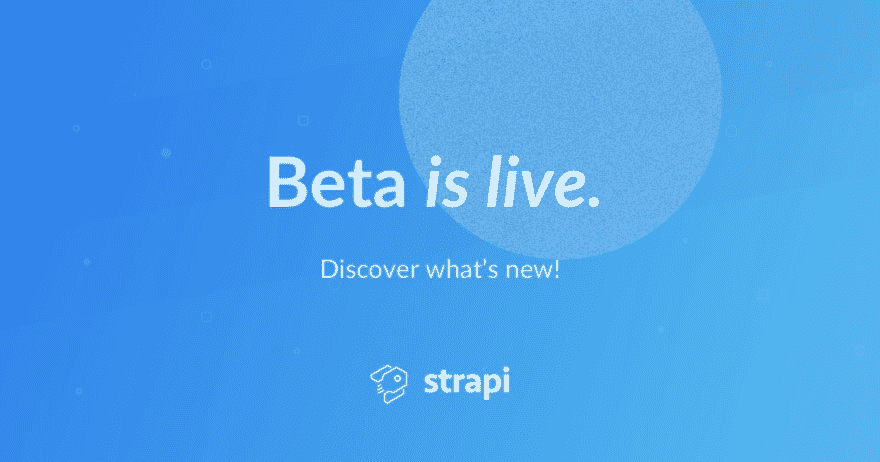
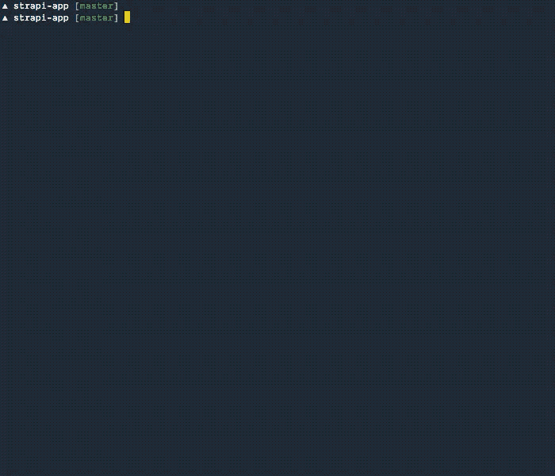
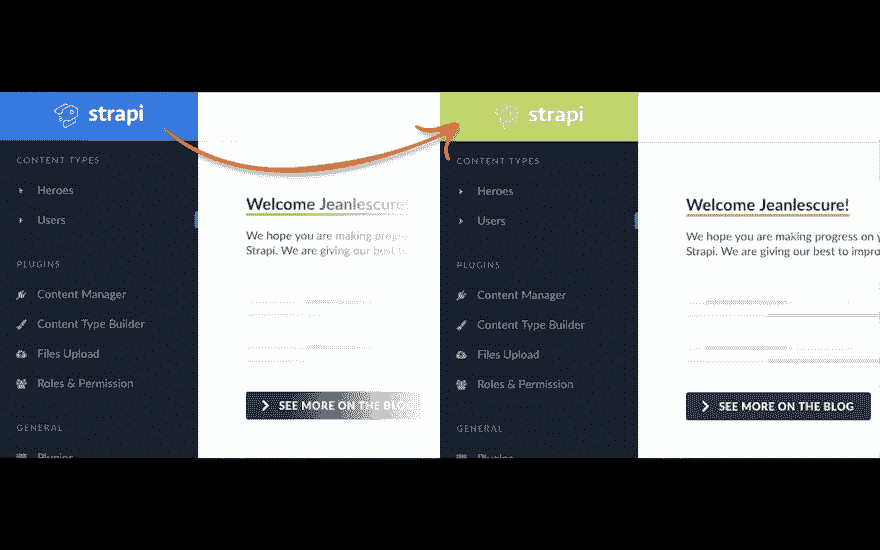

# 斯特拉皮贝塔出来了🎉

> 原文：<https://dev.to/strapi/strapi-beta-is-out-5d38>

[](https://res.cloudinary.com/practicaldev/image/fetch/s--gRRgdfQJ--/c_limit%2Cf_auto%2Cfl_progressive%2Cq_auto%2Cw_880/https://thepracticaldev.s3.amazonaws.com/i/av1862vizb41b5s8a4cz.png)

欢迎来到内容管理的未来！斯特拉皮贝塔终于来了。我们对这次发布感到非常兴奋，这是我们迄今为止最大的一次发布。你们中的许多人指出，标记 alpha 使你们对在生产中使用 Strapi 感到不安全。这已经是过去的事了！感谢每一个人，尤其是团队，感谢所有贡献代码、文档、测试和支持的人。谢谢你。

这是里面的内容:

*   🆙[无缝版本升级](https://blog.strapi.io/strapi-beta-is-out#upgrade)
*   💅[管理用户界面构建流程的全面改进](https://blog.strapi.io/strapi-beta-is-out#build)
*   💪[可靠部署](https://blog.strapi.io/strapi-beta-is-out#deploy)
*   🤹‍♂️ [提高了稳定性](https://blog.strapi.io/strapi-beta-is-out#stability)
*   🎁[新的核心 API](https://blog.strapi.io/strapi-beta-is-out#API)
*   🛤 [更简单的 Monorepo 设置和安装](https://blog.strapi.io/strapi-beta-is-out#monorepo)

请继续阅读，了解我们已经完成的工作和迁移说明。

如果想直接跳转到最新版本的迁移指南，这里是[这里是](https://blog.strapi.io/strapi-beta-is-out#migration)。

#### 斯特拉皮的进化和下一步

Strapi 是最先进的开源 Node.js headless CMS。它使您能够将您的内容传送到您想要的任何地方。

📈稳步增长的采用:Strapi 目前被行业领导者使用，如[法国兴业银行](https://strapi.io/stories/societe-generale-develops-e-training-website-with-strapi)、 [ASOS](https://www.collusion.com/) 、 [IBM](https://www.ibm.com/thought-leadership/institute-business-value) 以及数千家初创公司和[机构](https://strapi.io/stories/openforge-uses-strapi-out-of-the-box-admin-panel-for-their-clients)。行业和开源项目的采用持续增长，每月 npm 下载量超过 36K。2019 年，在 5 个月的时间里，我们已经达到了 2018 年的 npm 下载总数。

👩‍💻繁荣的社区:Strapi 社区最近在 Github 上超过了 200 个贡献者和 14k 个明星。感谢社区，我们现在已经进入了 Javascript 最受欢迎的开源项目的前 100 名！

🛠为未来奠定基础:发布这个测试版花了一些时间，但它真的很重要，因为我们所做的改变将允许未来更容易、更快和更可伸缩的开发。

让我们深入了解一下！

#### 🆙无缝版本升级

迁移到较新的 alpha 版本很困难。我们有很多用户反馈说这甚至是一个障碍:许多文件必须处理，出错的可能性很高。

您现在可以忘记冗长的迁移指南了！测试版的插件现在被当作旧的 npm 包来管理。因此，可以使用简单的 npm 命令升级它们:

对于单个插件:

```
npm install strapi-plugin@beta --save 
```

或者对于全局更新:

[](https://res.cloudinary.com/practicaldev/image/fetch/s--NOQpQB5l--/c_limit%2Cf_auto%2Cfl_progressive%2Cq_66%2Cw_880/https://thepracticaldev.s3.amazonaws.com/i/awc8re31l0r2kz8tftdu.gif)T3】

```
npm install 
```

我们还将核心功能从项目的定制部分分离出来。定制代码现在与核心包分离，这意味着定制代码不会受到包更新的影响。

由于这一点，像 [CodeMod](https://github.com/facebook/codemod) 这样的工具的自动迁移计划使迁移变得更加容易。

#### 💅管理用户界面构建流程的全面改进

在 alpha 版本中，每个插件都是一个独立的 React 应用程序，这导致了许多问题(设置错误、babel polyfill 错误等)。)在管理中加载插件时。

我们决定彻底检查管理面板的构建过程，在用户的计算机上用插件一次本地构建管理面板。构建过程会生成一个可以运行和部署的单页面应用程序。

这个新过程增加了一些开销，但是使得定制管理用户界面和插件用户界面变得非常容易，而不需要做太多事情。

[](https://res.cloudinary.com/practicaldev/image/fetch/s--7AsXoJ3s--/c_limit%2Cf_auto%2Cfl_progressive%2Cq_auto%2Cw_880/https://thepracticaldev.s3.amazonaws.com/i/x9z5o691p9p42xp4nqy5.png) 
*图片由吉恩·莱斯科尔提供*

我们还借此机会改善了 UI 性能和加载时间。

#### 💪可靠的部署

Strapi 项目的全局架构已经被简化。在测试版中，管理面板和插件是简单的 npm 包。使用 npm 或 yarn 使安装更容易。

我们已经清理了安装过程，这意味着从现在开始部署将更加可靠和稳定。

#### 🤹‍♂️提高了稳定性

我们一直致力于在整个 Strapi 中添加相关测试，以提高 GraphQL 和全局稳定性。我们借此机会修复了一些老问题，并特别关注于改进数据库连接器，尤其是关系方面。

#### 🎁新核心 API

这个版本带有一个核心 API，它在你的项目中随处可见。您可以轻松地创建、更新、删除或读取数据库中的任何条目。

```
strapi.services.users.find({ username: "John Doe" }) 
```

新生成的 API 是不可知的，所以如果您从 SQL 切换到 NoSQL，这些 API 仍然可以工作。

#### 🛤mono repo 设置和安装更简单

现在处于测试阶段，向 Strapi 投稿从未如此简单！monorepo 的设置现在进展神速。我们正在充分利用 yarn 工作空间和 [Lerna](https://github.com/lerna/lerna) 的潜力。

#### “我为什么要用 Strapi？”

Strapi 是一个免费的开源的无头 CMS，可以把你的内容传送到你需要的任何地方。

*   保持对数据的控制。有了 Strapi，您可以知道数据存储在哪里，并随时保持完全控制。
*   按照您想要的方式托管和扩展。无论是 AWS，Netlify，Heroku 还是您自己的服务器，托管平台都是您的选择。您可以完全独立地随增长而扩展。
*   选择您喜欢的数据库。Strapi 使用 SQL 和 NoSQL 数据库:MongoDB，PostgresQL，MySQL，MariaDB，SQLite。
*   默认可定制:您可以通过完全定制 API、路由或插件来构建自己的逻辑，以完全满足您的需求。

#### 升级至 Strapi 3.0.0@beta

如果你运行的是`Strapi 3.0.0@alpha.26`，升级到测试版可以通过[一个迁移指南](https://strapi.io/documentation/3.0.0-beta.x/migration-guide/migration-guide-alpha.26-to-beta.html)来帮你完成。

如果您是 Strapi 的新手，请查看[文档](https://strapi.io/documentation/3.0.0-beta.x/getting-started/quick-start.html#_1-install-strapi-globally)中的分步安装指南。

或者，如果你喜欢直接投入，启动一个 Strapi 项目需要 30 秒:

```
npm install strapi@beta -g
strapi new my-project --quickstart
strapi develop 
```

#### 感谢社区

Strapi 是 200 多名社区委员的成果。

这个测试版是我们第一次进行测试。感谢所有测试和报告问题的人，特别向 [DMehaffy](https://github.com/derrickmehaffy) 说声谢谢。

如果 Strapi 为您的日常开发过程带来了效率，请考虑帮助让 Strapi 变得更好。无论您是在开发一个新特性、修复一个 bug、帮助改进文档，还是就您使用 Strapi 所做的某件事情编写一个教程，都有大量的工作需要完成，以完成我们必须完成的使命:允许您以自己想要的方式管理内容。在 [Slack](https://slack.strapi.io/) 和 [Spectrum](https://spectrum.chat/strapi?tab=posts) 上加入我们，在[Open collection](https://opencollective.com/strapi)上支持我们，或者直接跳到 [Github](https://github.com/strapi/strapi) 上。

你有什么问题吗，或者只是想打个招呼？在 [Twitter](https://twitter.com/strapijs) 、 [Slack](https://slack.strapi.io) 、 [Spectrum](https://spectrum.chat/strapi) 、 [Github](https://github.com/strapi/strapi) 上联系我们，或者在下面发表评论。