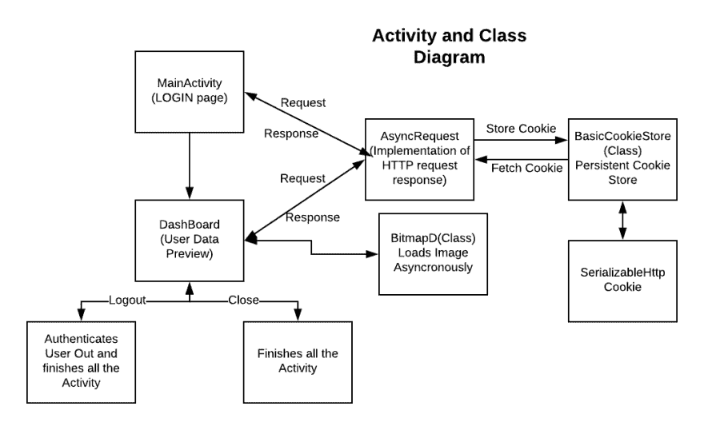

# 捆绑 Django 和 Android 应用程序

> 原文：<https://dev.to/akshaychhajed1998/strapping-django--android-application-e57>

#### 你是否使用 Django 开发了一个 web 应用，并考虑将其扩展到 android 应用？

#### 那你就在完美的地方。

### 我们开始吧！！

### 我们的计划:

1]创建 django web 应用程序:我们将在 Django Web 应用程序中创建基本的用户配置文件机制。

2]创建与 android 通信的 API:我们将创建控制器(Django 视图),它将返回 JSON 响应(将充当 API ),我们将在 Android 应用程序中捕捉这些响应。

3]开发 android 网络应用程序:我们将创建 Android 网络应用程序，它将与 Django API 进行通信。

* * *

###### 注意:-您必须在线部署您的 web 应用程序，这样站点必须是公共可访问的(即，它必须可以从其他设备访问)。

* * *

### 现在让我们执行我们的计划:

1]在 Django 开发基本的学生档案应用程序:

*   通过在终端中键入以下命令来创建 Django 项目(basic _ app):T0

*   在您的项目中创建新的 app student profile:

```
 cd basic_app
   python manage.py startapp StudentProfile
   python manage.py createsuperuser 
```

Enter fullscreen mode Exit fullscreen mode

第一个命令将终端带入当前项目目录。
第二个命令用于创建学生档案应用程序。
第三个命令为管理站点创建超级用户(管理员)。该命令要求输入用户名、电子邮件和密码。

*   我们在某种程度上扩展了基本的用户身份验证模型，通过在 StudentProfile 和用户之间提供一对一的关系来存储特定于学生的其他信息:

```
 #CODE SNIPPET 1
    from django.db import models
    #Create your models here.    
    from django.db import models
    from django.contrib.auth.models import User

    class StudentProfile(models.Model):
        user = models.OneToOneField(User,on_delete=models.CASCADE,primary_key=True)
        student_id = models.CharField(max_length=7,null=False,unique=True,default='')
        profile_pic = models.ImageField(upload_to='profilepic/',null=False,default='')
        mobile_number=models.BigIntegerField(blank=True,default=9999999999)

    def __str__(self):
        return "{}".format(self.student_id) 
```

Enter fullscreen mode Exit fullscreen mode

上面的代码放在 StudentProfile 应用程序的 models.py 中。

*   从代码片段 1 开始，我们存储学生的个人资料图片，因此我们必须在设置中定义 MEDIA _ URL & MEDIA _ ROOT &以及其他一些用于提供静态文件的设置:

```
#CODE SNIPPET 2
#add this lines in settings.py 
STATIC_URL = '/static/'

MEDIA_URL = '/media/'

STATICFILES_DIRS = [os.path.join(BASE_DIR,'assets/static/'),'']

MEDIA_ROOT = os.path.join(BASE_DIR,'assets/') 
```

Enter fullscreen mode Exit fullscreen mode

同样在模板 dict 中的 DIRS 字段在 settings.py 中添加路径:`['assets/static/',]`
同样在 Django Settings.py 中添加“StudentProfile”在 INSTALLED_APPS 的末尾这有助于服务器检测项目中的新应用:

```
INSTALLED_APPS=[ ...,
  ...,
  'StudentProfile',] 
```

Enter fullscreen mode Exit fullscreen mode

*   在项目目录中创建文件夹资产，在资产内部创建 2 个文件夹 static 和 profilepic (static 将提供模板，css、js 和 profilepic 将存储学生的个人资料图片)。

*   一旦我们创建了模型，我们应该在管理网站注册模型，这样我们就可以从管理网站添加删除编辑模型实例:

```
#CODE SNIPPET 3 from .models import StudentProfile
from django.contrib import admin

admin.site.register(StudentProfile) 
```

Enter fullscreen mode Exit fullscreen mode

*   现在，我们将定义控制器(Django Views ),用于如何呈现登录表单以及如何在成功登录后呈现学生信息(我们正在创建非常基本的表单，因为我们的主要目的是创建将与 android 通信的 api):

```
#CODE SNIPPET 4 from django.shortcuts import render,HttpResponse,redirect
from django.contrib.auth import logout,login,authenticate
from .models import StudentProfile
from django.core import serializers
from django.contrib.auth.models import User

# Create your views here. def Login(request):
    if request.method == 'POST':
        user=authenticate(request,username=request.POST.get('username'),password=request.POST.get('password'))
        if user is not None:
            login(request,user)
            return redirect('/display')
        else:
            return HttpResponse("Credentials are Incorrect")
    else:
        return render(request,'html/login.html',{})

def display(request):
    if request.method == 'GET':
        user    = User.objects.filter(pk = request.user.pk)[0]
        profile = StudentProfile.objects.filter(user = request.user.pk)[0]
        return render(request,'html/display.html',{'user':user,'profile':profile})

def Logout(request):
    if request.user.is_authenticated:
        logout(request)
        return redirect('/')
    else:
        return HttpResponse("ERROR:Error Logging Out") 
```

Enter fullscreen mode Exit fullscreen mode

这段代码放在 StudentProfile 的 views.py 中。

解释:-
1]log in:-这个定义检查请求是' POST '还是' GET ',如果是' GET ',那么它将呈现表单以供登录。否则，如果请求是“POST ”,那么它将使用从表单接收的数据，并尝试验证用户。如果凭据正确，则用户已登录，否则会显示错误消息。

2]显示:-一旦用户成功登录，他将被重定向到显示页面，该页面通过呈现 html 来显示他的信息。

3]注销:-该定义将用户注销。

* * *

###### 注意:-我们将只需要改变我们的观点，以创建与 android 应用程序通信的 API。

* * *

*   现在我们将创建 URL(路由器),它将把我们路由到不同的控制器，这些控制器将为我们呈现页面:

```
#CODE SNIPPET 5 from django.contrib import admin
from django.urls import path,include
from django.conf import settings
from django.conf.urls.static import static

urlpatterns = [
    path('admin/', admin.site.urls),
    path('',include('StudentProfile.urls')),
]

    urlpatterns += static(settings.MEDIA_URL, document_root=settings.MEDIA_ROOT) 
```

Enter fullscreen mode Exit fullscreen mode

此代码必须包含在 basic_app urls.py 文件中。

解释:-
1]urlpatterns 定义了用于调用不同的呈现或重定向控制器的 url。
2】include 用于包含所有应用的 URL。
3】我们正在为 MEDIA_ROOT ('assets/') URL 添加 urlpatterns，它将成为 MEDIA_URL ('/media/')。这将显示项目目录中的媒体文件。

```
#CODE SNIPPET 6 from django.contrib import admin
from django.urls import path,include
from .views import Login,display,Logout

urlpatterns = [
    path('',Login),#Calls Login View(Homepage)
    path('display/',display),#Calls display View(After Successful Login )
    path('logout/',Logout),#Controller for logging out ] 
```

Enter fullscreen mode Exit fullscreen mode

此代码必须包含在 StudentProfile 的 urls.py 中。

*   现在我们需要创建将由视图呈现的模板:

```
<!--CODE SNIPPET 7-->
<!DOCTYPE html>
<html>
    <head>
        LOGIN
    </head>

    <body style="font-family:sans-serif;">
        <form method='POST' action=''>
        
        <input type='text' name='username' placeholder='username'>    
        <input type='password' name='password' placeholder='password'>
        <button>SUBMIT</button>
        </form>

    </body>
</html> 
```

Enter fullscreen mode Exit fullscreen mode

这个模板应该存储在资产/静态/html 作为 login.html

```
<!--CODE SNIPPET 8-->

<!DOCTYPE html>
<html>
    <body>
        <p>username:{{user.username}}</p>
        <p>firstname:{{user.first_name}}</p>
        <p>lastname:{{user.last_name}}</p>
        <p>email:{{user.email}}</p>
        <p>student_ID:{{profile.student_id}}</p>
        <p>mobile number:{{profile.mobile_number}}</p>
        
        <form action='/logout' method='GET'><button>LOGOUT</button></form>
    </body>
</html> 
```

Enter fullscreen mode Exit fullscreen mode

这个模板应该存储在资产/静态/html 作为 display.html

### 现在我们完成了我们的 Web 应用程序

2]为 Android 应用程序创建 API:-正如在其中一个注释中，我说过创建 API 非常容易。我们将使用与之前为 web 应用程序创建的相同的控制器，只是我们将有一些小的变化。

*   启动名为 api: `python manage.py startapp api`的新项目
*   表单和登录 API:

```
from django.shortcuts import render,HttpResponse,redirect
from django.contrib.auth import logout,login,authenticate
from StudentProfile.models import StudentProfile
from django.core import serializers
from django.contrib.auth.models import User
from django.middleware.csrf import *

# Create your views here. def Login(request):
    if request.method == 'POST':
        user=authenticate(request,username=request.POST.get('username'),password=request.POST.get('password'))
        if user is not None:
            login(request,user)
            return redirect('/api/display/')
        else:
            return HttpResponse("ERROR:-Credentials are Incorrect")
    else:
        if request.session.is_empty():
            return render(request,'html/api_login_workThrough.html',{})
        authenticate(request)
        print('-------------------')
        print(request.user)
        return redirect('/api/display/')

def display(request):
    if request.method == 'GET':
        user    = User.objects.filter(pk = request.user.pk)[0]
        profile = StudentProfile.objects.filter(user = request.user.pk)[0]
        return HttpResponse(serializers.serialize('json',[user,profile])) 

def Logout(request):
    if request.user.is_authenticated:
        logout(request)
        return redirect('/')
    else:
        return HttpResponse("ERROR:-Error Logging Out") 
```

Enter fullscreen mode Exit fullscreen mode

这段代码应该放在 api/views.py 文件中

解释:-

1]登录:-附加了 url '/api '中有一些小的变化，这是因为现在我们引用了不同的控制器集，我们将使用这些控制器集与应用程序进行通信。
如果请求方法是“GET ”,那么与我们在 web 应用程序中的代码相比，代码会有显著的变化。这是因为一旦我们登录到应用程序，我们没有注销关闭应用程序，它必须为我们打开个人资料页面比一个表格。
我们正在检查 request.session 是否存在，如果存在，我们将直接重定向到个人资料页面，如果不存在，我们将返回包含 csrf 令牌的表单(什么是 csrf 以及它是如何工作的，我们将在后面讨论)。

2]display:-与呈现显示页面相比，我们只是将 JSON 作为 HttpResponse 返回给应用程序(即让控制器作为 REST API 工作)。我们使用 django 自己提供的序列化模型的序列化器库将 django 模型序列化为 JSON。

* * *

###### 注意:-当请求方法为“GET”并且没有与请求相关联的会话对象时，我们正在呈现名为 api_login_workThrough.html 的页面，这是我想到使用 django 的 csrf 机制与我的 android 应用程序一起工作的工作。也许有更好的办法，但我想到了这个简单的主意。我们将在本文后面详细了解这种工作方式。

* * *

*   api_login_workThrough.html 位于 assets/static/html 中，包含:-

```
<form></form> 
```

Enter fullscreen mode Exit fullscreen mode

*   现在我们将为 API 创建 URL(路由器):

```
from django.contrib import admin
from django.urls import path,include
from django.conf import settings
from django.conf.urls.static import static
from .views import *

urlpatterns = [
    path('login/',Login),
    path('display/',display),
    path('logout/',Logout)
] 
```

Enter fullscreen mode Exit fullscreen mode

这段代码包含在 api/urls.py 中

它看起来和 StudentProfile 的 urls.py 一样，实际上是一样的，不同之处在于 basic_app 的 urls.py。

在 basic_app(主项目应用程序)的 urls.py 中，在末尾添加 url 模式:-

```
urlpatterns =[
               ...,
               ...,
               path('api/',include('api')), ] 
```

Enter fullscreen mode Exit fullscreen mode

### 我们为用户学生档案创建了 API。

## 现在让我们开始使用 Android

*   android 应用概述

[](https://res.cloudinary.com/practicaldev/image/fetch/s--wBETmmBg--/c_limit%2Cf_auto%2Cfl_progressive%2Cq_auto%2Cw_880/https://thepracticaldev.s3.amazonaws.com/i/gfst71tm4awyqlkk807f.png)

#### async Request:-请求响应处理器

```
package com.example.workstation.basic;

import android.annotation.TargetApi;
import android.content.Context;
import android.os.Build;
import android.util.Log;
import java.io.DataInputStream;
import java.io.DataOutputStream;
import java.io.IOException;
import java.net.CookieStore;
import java.net.HttpCookie;
import java.net.HttpURLConnection;
import java.net.URI;
import java.net.URISyntaxException;
import java.net.URL;
import java.util.List;
import java.util.Map;
import javax.net.ssl.HttpsURLConnection;

public class AsyncRequest extends Thread
        /* Thread is used to make the request response cycle asynchronous to help preventing the UI from being Unresponsive*/
{
    final String TAG = AsyncRequest.class.getSimpleName();

    final String domain_name;
    BasicCookieStore store;
    /*Basic Cookie Store is Persistent Cookie Store implementation for Android used to store Cookie */
    String ResponseMsg = new String();  //Response message received from (Django)server
    int  ResponseCode;                  //Response code received from server (Code: (2xx for OK),(3xx for Redirects),(4xx for ClientError),(5xx for InternalSerer Error)
    String ResponseBody = new String(); //It is Data Received from Server(HTTP response or File response or JSON response)
    Map<String,List<String>> ResponseHeader;//Response Header Received from Server

    String Url = new String();             //Url to which to send request and response
    String RequestBody = new String();     //Request Body means Data to be sent to Server
    final String RequestType;              //Type of Request(GET,POST)

    AsyncRequest(String requestType,Context context)
    /* Context is accepted for CookieStore to initialize for the Application*/
    {
        RequestType = requestType;
        store=new BasicCookieStore(context);
        domain_name=context.getResources().getString(R.string.domain_name);
    }

    @TargetApi(Build.VERSION_CODES.N)
    @Override
    public void run()
    {
        try
        {
            URL url = new URL(Url);
            URI uri = new URI(Url);
            HttpURLConnection httpconn = (HttpURLConnection) url.openConnection();
            /*HttpURLConnection is the class which establish the connection between client and server and exchange data
            * using HTTP request response cycle.
            * url.openConnection() establishes the connection between client and server */
            httpconn.setInstanceFollowRedirects(false);
            /*Sets whether HTTP redirects (requests with response code 3xx) should be automatically followed by this HttpURLConnection
             instance*/
            HttpsURLConnection.setFollowRedirects(false);
            /*Sets whether HTTP redirects (requests with response code 3xx) should be automatically followed by this class*/
            httpconn.setRequestMethod(RequestType);//set Types of Request
            String S="";
            for(HttpCookie H:store.get(new URI(domain_name)))
                S+=H+"; ";
            httpconn.setRequestProperty("Cookie",S);
            /*retriving the cookie from cookie store and sending back to the server(session_id,csrf_token,etc)*/
            if(RequestType=="POST")
            {
                DataOutputStream output=new DataOutputStream(httpconn.getOutputStream());
                output.writeBytes(RequestBody);
                output.flush();
                output.close();
            }
            /* if the request is POST  then we send data to the server this using output stream received from connection*/

            boolean redirect = false;

            // normally, 3xx is redirect
            int status = httpconn.getResponseCode();
            if (status != HttpURLConnection.HTTP_OK) {              //if request succeds then skip
                if (status == HttpURLConnection.HTTP_MOVED_TEMP
                        || status == HttpURLConnection.HTTP_MOVED_PERM
                        || status == HttpURLConnection.HTTP_SEE_OTHER)//if response code is 3xx then it is redirect request
                    redirect = true;                                  //set redirect to true
            }

            System.out.println("Response Code ... " + status);

            if(redirect) {
                // when response code 3xx then we receive redirect url in header field called "location"
                String newUrl = httpconn.getHeaderField("Location");

                // get the cookie if need, for login
                List<String> cookiesL =httpconn.getHeaderFields().get("set-cookie");
                Log.i(TAG, "run: "+httpconn.getHeaderFields());
                if(cookiesL != null)
                    for(String x:cookiesL)
                        store.add(new URI(domain_name),HttpCookie.parse(x).get(0));

                // open the new connnection again on url recived from location header
                url = new URL(domain_name+newUrl);
                uri = new URI(domain_name+newUrl);
                Log.i(TAG, "run: "+url);
                httpconn.disconnect();
                httpconn = (HttpURLConnection) url.openConnection();
                httpconn.setInstanceFollowRedirects(false);
                HttpURLConnection.setFollowRedirects(false);
                httpconn.setRequestMethod("GET"); //considered that redirect url will be GET request only
                S="";
                for(HttpCookie H:store.get(new URI(domain_name)))
                    S+=H+"; ";
                httpconn.setRequestProperty("Cookie",S);
                Log.i(TAG, "CookiesSession--: "+S);
                /*same as processed for first request*/

            }

            Log.i(TAG, "run: " + httpconn);

            this.ResponseMsg = httpconn.getResponseMessage(); //retriving  response message from httpconn object
            this.ResponseCode = httpconn.getResponseCode();//response code is retrived
            this.ResponseHeader = httpconn.getHeaderFields(); //getting header fields
            byte[] b = new byte[1024 * 1024]; // reserving the memory for responsebody
            int len;
            len = (new DataInputStream(httpconn.getInputStream())).read(b); //reads complete response body from httpconn object
            Log.i(TAG, "run: "+b.toString());
            this.ResponseBody = new String(b, 0, len); //stores in responsebody
            httpconn.disconnect();
        }
        catch(IOException e)
        {
            Log.e(TAG, "run: ",e );
        }
        catch (URISyntaxException e)
        {
            Log.e(TAG, "run: ",e );
        }

    }

    /*Getters and Setters*/

    void setUrl(String Url)
    {
        this.Url=Url;
    }

    void setRequestBody(String RequestBody)
    {
        this.RequestBody=RequestBody;
    }

    String getResponseMsg()
    {
        return ResponseMsg;
    }

    String getResponseBody()
    {
        return ResponseBody;
    }

    Map<String,List<String>> getResponseHeader()
    {
        return ResponseHeader;
    }
} 
```

Enter fullscreen mode Exit fullscreen mode

#### BitmapD:-使用 url 异步加载图像

```
package com.example.workstation.basic;

import android.content.Context;
import android.graphics.Bitmap;
import android.graphics.BitmapFactory;
import android.util.Log;

import java.io.IOException;
import java.io.InputStream;
import java.net.HttpURLConnection;
import java.net.URL;

public class BitmapD extends Thread {

    Bitmap B;
    String Url;

    public void setUrl(String Url)
    {
        this.Url=Url;
    } //Url from which to fetch image

    public void run()
    {
        try {
            Log.e("src",Url);
            URL url = new URL(Url); // converts string url to URL object
            HttpURLConnection connection = (HttpURLConnection) url.openConnection(); //establishes connection between client and server
            connection.setDoInput(true);
            connection.connect();//connection is established
            InputStream input = connection.getInputStream();//retriving input stream to retrive image data
            B= BitmapFactory.decodeStream(input);//convert input received to proper image format depending on header
            Log.e("Bitmap","returned");
        } catch (IOException e) {
            e.printStackTrace();
            Log.e("Exception",e.getMessage());
        }
    }

    public Bitmap getBitmap()
    {
        return B;
    }//getter for fetching bitmap
} 
```

Enter fullscreen mode Exit fullscreen mode

#### BasicCookieStore:-持久性 Cookie 存储实现

该实现可以在以下位置找到: [Gist Repo for cookie store](https://gist.github.com/franmontiel/ed12a2295566b7076161)

这个 git repo 包含我们的应用程序中的两个类，即。BasicCookieStore 和 SeriallizableHttpCookie，第二类支持第一类将 HttpCookie 对象序列化为字符串并存储在 Cookie 存储中。

#### main activity:-为用户登录提供登录页面

```
package com.example.workstation.basic;

import android.content.Intent;
import android.support.v7.app.AppCompatActivity;
import android.os.Bundle;
import android.util.Log;
import android.view.Menu;
import android.view.View;
import android.widget.Button;
import android.widget.EditText;
import android.widget.Toast;

import java.net.CookieStore;
import java.net.HttpCookie;
import java.net.MalformedURLException;
import java.net.URI;
import java.net.URISyntaxException;

public class MainActivity extends AppCompatActivity {

    String domain_name;
    BasicCookieStore store;
    String csrf_token=new String();

    @Override
    protected void onCreate(Bundle savedInstanceState)
    {
        super.onCreate(savedInstanceState);
        setContentView(R.layout.activity_main);

        domain_name=getResources().getString(R.string.domain_name);       //server domain

        store = new BasicCookieStore(this);                             //Creating CookieStore for Application
        AsyncRequest P=new AsyncRequest("GET",this);        //AsyncRequest object to snrd request
        P.setUrl(domain_name+this.getResources().getString(R.string.Login));                                    //url to which to send request
        P.start();                                                              //starting asynchronous process

        try
        {
            P.join();                                                           //procced after process P is completed
        }
        catch (InterruptedException e)
        {
            e.printStackTrace();
        }
        Log.i("FORM:---", "onCreate: "+P.getResponseBody());
        /*remember of csrf work through i told of explaining in android
          once we receive the workthrough file from server we are checking for substring at index 1 to 4 if it is word "form"
          then we are retriving the csrf token from form generated by  tag in template and store it in a variable
          In response header there is field called "set-cookie" which contains cookie to be set we retrive the data and store it in this store
         */
        if(P.getResponseBody().substring(1,5).equals("form"))
        {
            csrf_token = P.getResponseBody().substring(61, 61 + 64);
            Log.i("csrf_token:--", "onCreate: "+csrf_token);
            try {
                store.add(new URI(domain_name), HttpCookie.parse(P.getResponseHeader().get("set-cookie").get(0)).get(0));
            } catch (URISyntaxException e) {
                e.printStackTrace();
            }
        }
        /*then we check if it returns error substring if so then something has went wrong and we recreate the activity
        else
        if workthrough form  and also error is not returned then it implies that the user session was saved in cookie store and hence we directly authenticate
        user to the user data preview
         */
        else
        {
            if(P.getResponseBody().substring(0,5).equals("Error"))
            {
                this.recreate();
            }
            else
            {
                Intent dashBoard = new Intent(this,DashBoard.class); //Explicit intent creation
                this.finish();
                dashBoard.putExtra("displayData",P.getResponseBody());//sending response data to new intent i.e dashboard
                Log.i("JSON:::", "onCreate: "+P.getResponseBody());
                store.loadAllCookies();
                Log.i("VC", "SignIN: "+store.getCookies());
                startActivity(dashBoard);//starting the intent(control goes to dashboard activity)
            }

        }

    }

    // create an action bar button
    @Override
    public boolean onCreateOptionsMenu(Menu menu) {
        return super.onCreateOptionsMenu(menu);
    }

    /* this is function which is triggered when user click on login button*/
    void SignIN(View B) throws MalformedURLException, URISyntaxException, InterruptedException {
        Button b = (Button)B;
        EditText usernameView = (EditText) findViewById(R.id.Email);
        EditText passwordView = (EditText) findViewById(R.id.Password);

        String username = usernameView.getText().toString(); //retriving username from username field
        String password = passwordView.getText().toString(); //retriving password from password field

        if(!username.isEmpty() && !password.isEmpty()) //username and password validations
        {
            b.setClickable(false);
            AsyncRequest P = new AsyncRequest("POST",this); //creating the login request
            P.setUrl(domain_name+this.getResources().getString(R.string.Login));//setting login url
            P.setRequestBody("username="+username+"&password="+password+"&csrfmiddlewaretoken="+csrf_token+"&LOGIN=LOGIN");
            //setting request body it contains(username,password and csrf token which is used for CSRF attack protection by django)
            P.start();//satrting the process
            P.join();//procced after process P is completed
            if(P.getResponseBody().substring(0,5).equals("ERROR"))//if response contains "ERROR" string then recreate activity
            {
                Toast.makeText(this,P.getResponseBody(),Toast.LENGTH_LONG).show();
                usernameView.setText("");
                passwordView.setText("");
                this.recreate();
            }
            else                        //if login is successful then create Dashboard activity
            {
                Intent dashBoard = new Intent(this,DashBoard.class);
                dashBoard.putExtra("displayData",P.getResponseBody());
                store.loadAllCookies();
                this.finish();
                startActivity(dashBoard);
            }

        }

    }

} 
```

Enter fullscreen mode Exit fullscreen mode

```
<?xml version="1.0" encoding="utf-8"?>
<RelativeLayout
    xmlns:android="http://schemas.android.com/apk/res/android"
    xmlns:app="http://schemas.android.com/apk/res-auto"
    xmlns:tools="http://schemas.android.com/tools"
    android:layout_width="match_parent"
    android:layout_height="match_parent"
    tools:context=".MainActivity"
    android:background="@color/colorPrimaryDark">

    <TextView
        android:id="@+id/LOGIN"
        android:layout_width="wrap_content"
        android:layout_height="wrap_content"
        android:layout_above="@id/Email"
        android:text="LOGIN"
        android:textColor="@color/green_intheme"
        android:layout_centerHorizontal="true"
        android:layout_marginBottom="15dp"
        android:fontFamily="serif-monospace"
        android:textSize="35dp"/>

    <EditText
        android:id="@+id/Email"
        android:layout_width="match_parent"
        android:layout_height="30dp"
        android:inputType="textWebEmailAddress"
        android:layout_centerVertical="true"
        android:layout_above="@id/Password"
        android:background="@color/gray_outlook"
        android:layout_marginBottom="10dp"
        android:hint="Email"/>

    <EditText
        android:id="@+id/Password"
        android:layout_width="match_parent"
        android:layout_height="30dp"
        android:inputType="textWebPassword"
        android:layout_centerVertical="true"
        android:layout_marginBottom="10dp"
        android:background="@color/gray_outlook"
        android:hint="Password"/>

    <Button
        android:id="@+id/SignIN"
        android:layout_width="wrap_content"
        android:layout_height="wrap_content"
        android:text="Sign IN"
        android:layout_marginTop="10dp"
        android:layout_below="@id/Password"
        android:background="@color/blue_intheme"
        android:layout_centerHorizontal="true"
        android:textSize="20dp"
        android:onClick="SignIN"
        android:clickable="true"/>

</RelativeLayout> 
```

Enter fullscreen mode Exit fullscreen mode

#### 仪表板:-用户配置文件预览

```
package com.example.workstation.basic;

import android.content.Intent;
import android.graphics.Bitmap;
import android.os.Build;
import android.support.annotation.RequiresApi;
import android.support.v7.app.AppCompatActivity;
import android.os.Bundle;
import android.util.Log;
import android.view.Menu;
import android.view.MenuItem;
import android.widget.ImageView;
import android.widget.RelativeLayout;
import android.widget.TextView;

import org.json.JSONArray;
import org.json.JSONException;
import org.json.JSONObject;

public class DashBoard extends AppCompatActivity {

    boolean flag=true;
    String domain_name;

    @Override
    protected void onCreate(Bundle savedInstanceState) {
        super.onCreate(savedInstanceState);
        setContentView(R.layout.activity_dash_board);

        this.domain_name =this.getResources().getString(R.string.domain_name);

        BitmapD B=new BitmapD();

        Intent DataIntent = getIntent(); //receiving the intent

        JSONArray obj = new JSONArray();
        try {
            obj = new JSONArray(DataIntent.getStringExtra("displayData"));
            //the received response from server was JSON serialized coverting it back to JSON Array
        } catch (JSONException e) {
            e.printStackTrace();
        }
        try {
            Log.i("Json", "SignIN: "+((JSONObject)((JSONObject)obj.get(0)).get("fields")).get("username"));
        } catch (JSONException e) {

            e.printStackTrace();
        }
        //selectiong differnt elements from UI(xml)
        TextView username = (TextView) findViewById(R.id.username);
        TextView firstname = (TextView) findViewById(R.id.firstname);
        TextView lastname = (TextView) findViewById(R.id.lastname);
        TextView email = (TextView) findViewById(R.id.email);
        ImageView I =(ImageView) findViewById(R.id.ProfilePic);

        try
        {
            //setting appropiate value from JSON Array
            username.setText("username : "+((JSONObject)((JSONObject)obj.get(0)).get("fields")).get("username"));
            lastname.setText(""+((JSONObject)((JSONObject)obj.get(0)).get("fields")).get("last_name"));
            firstname.setText(""+((JSONObject)((JSONObject)obj.get(0)).get("fields")).get("first_name"));
            email.setText("Email : "+((JSONObject)((JSONObject)obj.get(0)).get("fields")).get("email"));
            B.setUrl(domain_name+"/media/"+((JSONObject)((JSONObject)obj.get(1)).get("fields")).get("profile_pic"));
            //setting image url to BitmapD object which loads the image on other thread
            B.start();
            B.join();
            Bitmap bm=B.getBitmap();
            I.setImageBitmap(bm);

        } catch (JSONException e) {
            e.printStackTrace();
        } catch (InterruptedException e) {
            e.printStackTrace();
        }

    }

    @Override
    public boolean onCreateOptionsMenu(Menu menu) {
        getMenuInflater().inflate(R.menu.actionbardb, menu);
        return super.onCreateOptionsMenu(menu);
    }

    //triggers on clicking close icon  and finishes activity
    public void Close(MenuItem i)
    {
        this.finish();
    }

    //triggers on clicking logout icon and destroys the current session and finishes activity
    @RequiresApi(api = Build.VERSION_CODES.JELLY_BEAN)
    public void LogOut(MenuItem i) throws InterruptedException {
        AsyncRequest P=new AsyncRequest("GET",this);
        P.setUrl(domain_name+this.getResources().getString(R.string.Logout)); //sends logout request
        P.start();
        P.join();
        this.finish();
    }

} 
```

Enter fullscreen mode Exit fullscreen mode

```
<?xml version="1.0" encoding="utf-8"?>
<RelativeLayout xmlns:android="http://schemas.android.com/apk/res/android"
    xmlns:tools="http://schemas.android.com/tools"
    android:layout_width="match_parent"
    android:layout_height="match_parent"
    tools:context=".DashBoard">

    <LinearLayout
        android:id="@+id/DataLayout"
        android:layout_width="match_parent"
        android:layout_height="fill_parent"
        android:background="@color/colorPrimaryDark"
        android:orientation="vertical">

        <LinearLayout
            android:layout_width="match_parent"
            android:layout_height="wrap_content"
            android:orientation="horizontal">

            <android.support.v7.widget.CardView
                xmlns:card_view="http://schemas.android.com/apk/res-auto"
                android:layout_width="160dp"
                android:layout_height="160dp"
                card_view:cardCornerRadius="80dp"
                card_view:cardBackgroundColor="@color/white"
                card_view:cardElevation="20dp">

                <android.support.v7.widget.CardView
                    xmlns:card_view="http://schemas.android.com/apk/res-auto"
                    android:layout_width="150dp"
                    android:layout_height="150dp"
                    android:layout_margin="5dp"
                    card_view:cardCornerRadius="75dp"
                    card_view:cardBackgroundColor="@color/white"
                    card_view:cardElevation="10dp">

                    <ImageView
                        android:id="@+id/ProfilePic"
                        android:layout_width="150dp"
                        android:layout_height="150dp"/>

                </android.support.v7.widget.CardView>
            </android.support.v7.widget.CardView>

            <LinearLayout
                android:layout_width="fill_parent"
                android:layout_height="match_parent"
                android:orientation="vertical">

                <TextView
                    android:id="@+id/firstname"
                    android:layout_width="match_parent"
                    android:layout_height="30sp"
                    android:textSize="25sp"
                    android:fontFamily="serif-monospace"
                    android:textColor="@color/white" />

                <TextView
                    android:layout_width="match_parent"
                    android:layout_margin="1dp"
                    android:layout_height="1dp"
                    android:background="@color/blue"/>

                <TextView
                    android:id="@+id/lastname"
                    android:layout_width="match_parent"
                    android:layout_height="30sp"
                    android:textSize="25sp"
                    android:fontFamily="serif-monospace"
                    android:textColor="@color/white" />

            </LinearLayout>

        </LinearLayout>

        <TextView
            android:layout_width="match_parent"
            android:layout_margin="1dp"
            android:layout_height="1dp"
            android:background="@color/blue"/>

        <TextView
            android:id="@+id/username"
            android:layout_width="match_parent"
            android:layout_height="30sp"
            android:textSize="25sp"
            android:fontFamily="serif-monospace"
            android:textColor="@color/white" />

        <TextView
            android:layout_width="match_parent"
            android:layout_margin="1dp"
            android:layout_height="1dp"
            android:background="@color/blue"/>

        <TextView
            android:id="@+id/email"
            android:layout_width="match_parent"
            android:layout_height="60sp"
            android:textSize="25sp"
            android:fontFamily="serif-monospace"
            android:textColor="@color/white"/>

        <TextView
            android:layout_width="match_parent"
            android:layout_margin="1dp"
            android:layout_height="1dp"
            android:background="@color/blue"/>

    </LinearLayout>

</RelativeLayout> 
```

Enter fullscreen mode Exit fullscreen mode

唷！！！

哦，就这样。

我们已经完成了我们的教程。我只分享了对理解很重要的代码片段，其余的因为文章太长我都跳过了。我正在链接我的 web 应用程序回购和 android 应用程序回购:

1) [Web 应用回购](https://github.com/AkshayChhajed1998/webapp.git)
2) [Android 应用回购](https://github.com/AkshayChhajed1998/Basic_networkingapp.git)