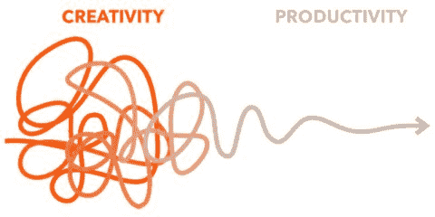

# 战略拖延与软件设计

> 原文：<https://dev.to/remojansen/strategic-procrastination-and-software-design-559m>

我想分享一个简单但引人注目的软件设计和架构技术，它在过去几年里对我非常有效。

前一段时间，我花了一点时间思考我作为一名软件工程师在不同项目中经历的一些成功和失败。我试图从成功和失败中提取精华，试图找到一些我将来可以遵循的原则。我发现这个练习非常有用，它为我提供了一些博客帖子的想法，我计划在未来的某个时候与社区分享这些帖子。在这篇文章中，我想把重点放在一个我喜欢称之为 ***战略拖延*** 的想法上。

战略拖延专家是拿破仑·波拿巴和树懒的混合体。

## 战略拖延

拖延者有一个明确的目标，并且知道如何去实现它，但是他们仍然不会花必要的时间去实现它。拖延者是一个有创造力的人，他能想出一个愿景和计划，但不能付出必要的努力来实现一个想法。

我个人是一个拖延者，在与自己斗争的过程中，我经历了相当多的焦虑和沮丧。幸运的是，这些年来我设法学会了控制自己的拖延习惯。然而，在过去的几年里，我已经把我的拖延管理技能提升到了一个新的水平，我开始利用所谓的战略性拖延。

> 战略性拖延是故意短时间不做你应该做的事情，这样你的潜意识就可以为大规模行动创造新的基础。

这篇博文我已经想了很久了。我知道我正在经历什么，但我无法想出一个词来描述它。幸运的是，我的一位同事在和我聊过我的经历后，向我指出了“战略性拖延”这个术语。

## 战略拖延&软件设计

作为一个开源项目的维护者，我经常收到一些项目用户的功能请求。我通常从与请求特性的用户聊天开始，我发现拖延和避免立即实现特性是非常有益的。我知道一个成功的开源项目的秘密之一是响应性，我建议写一些评论来确认你知道特性请求。然而，推迟一个特性的实现会有一些好处。

有时，其他用户会参与到对话中，这种情况会引发新的未知问题。

收到过于具体的功能请求也很常见。这种特性只有很少的用例，而且它对所有其他用户几乎没有任何价值。相反，它增加了所有其他用户的复杂性。我还发现，当一个特性太具体时，最好避免实现，拖延一段时间。更多的用户加入对话并分享不同的观点，这可以帮助您找到将单一用途功能转换为通用功能的抽象概念。

通常，您希望避免许多单一用途的特性，而支持较少的通用特性。能够预见通用特性并不容易，但是我发现拖延是有帮助的。有时，用户共享多个单一目的的特性请求，您可能想尽快关闭它们，但是如果您拖延，您就给了项目足够的时间来创建其他特性请求，然后您可能能够设想一个通用的特性，它可以一次覆盖多个用例。

我相信我不是唯一一个将拖延作为提炼系统需求的强大工具的开发人员。我曾经参加过 Daniel Rosenwasser(微软的 TypeScript 项目经理)的一次演讲，他解释说，工程团队在能够提出 TypeScript 编译器中被称为“条件类型”的特性之前，经历了数百个用例。该功能一次性解决了数百个问题，而解决方案的总体复杂性远低于许多单一用途功能的总复杂性。

拖延者通常感到焦虑和沮丧，因为他们有愿景，但没有做实现愿景所需的事情。然而，他们的愿景保持不变，他们继续思考这些问题。好消息是，长时间思考特定的话题可以让你的潜意识处理它们，并想出新颖的解决方案。推掉事情可以帮助你**将你平庸的想法提炼为天才的想法**。

拖延是增强你创造力的最好方法之一。

在需求精确之后，当一个特性对我来说有意义时，我会毫不犹豫地去实现它。有时实现非常顺利。然而，其他时候，实现结果比预期的要复杂得多，它需要一些感觉有些错误或不自然的更改。在这种情况下，我发现最好的选择是拖延:停止任务，继续其他任务。

如果你没有取得重大进展，或者感觉自己被困在某个地方，不知道下一步该做什么，那么很可能你的潜意识已经疲劳，你的创造力已经麻痹。策略性拖延的时间到了。

你在做其他的任务，但是之前的任务留在你的脑海里。然后有一天，完全出乎意料地，当你在做别的事情时，你在代码库中看到了启发你的东西。复杂而不自然的实现变成了优雅而简单的解决方案。

其他时候，这些特征源于你的头脑。你有了一个似乎对项目有益的想法，你变得兴奋起来，并立即开始为之努力。我们必须小心这种行为。不要自欺欺人；新功能总是意味着复杂性的增加，真正的用户需求应该证明所有功能的合理性。在某些特定的情况下，最好不要采取行动，尽管为了行动而努力是培养纪律和意志力的好方法。有些情况下，什么都不做可能是有用的。在软件设计的背景下，这表现为***【YAGNI】***原则或者 ***保持简单，愚蠢*** (KISS)原则:

> 总是在你需要的时候实现事情，而不是在你只预见到你需要的时候。
> 
> 大多数系统如果保持简单而不是变得复杂，就会工作得最好。

## 如何策略性拖延

要从拖延中获益，你首先要为它创造合适的条件。你必须让你的头脑有所思考，并为未来富有成效的工作打下坚实的基础。

不要以为这会免除你投入实际工作的责任。这种策略只有在你很少或没有活动的时期和短时间的极端生产力相结合的情况下才有效。

策略性拖延包括在身体和精神方面采取大量的行动。你投入了极度的劳动，从中抽身恢复，让你的潜意识处理所有这些，然后带着新发现的活力投入战斗。

在你开始懈怠之前，记住你需要已经开始做一些事情。需要有一个你已经在努力的愿景或目标；否则，你只是在拖延。

你应该花大部分时间努力，每天做一些让你更接近你想要的结果的事情。

战略拖延的过程看起来如下:

1.  **有愿景**或目标。今天就开始着手，越快越好。

2.  **每天都采取大规模行动**并不断靠近。投入大量的精力和工作。如果你想要非凡的结果，你必须对你的事情着迷。

3.  达到饱和点发挥你的精神力量，感觉你的头脑像海绵一样被吸干了。

4.  **开始战略性拖延**后退并专注于恢复。散步、锻炼、玩耍和放松。不要完全忘记你的工作，但也不要过分专注于它。迅速思考，但不要太用力。

5.  **回去工作**在适当回忆资源后，你又要开始投入工作；否则，你只是在拖延，而不是策略性地拖延。这一部分是必不可少的，也是你创作出最优秀作品的部分。你带着新发现的活力和创造性的洞察力重新进入这个区域，这样你就可以获得荣耀。

战略性拖延可以加快从高强度的生产中恢复过来，并帮助你长期保持进步。

现在，所有这些都需要有所保留。在你开始思考之前:*“哦，我只是在拖延，因为我在等待我的想法发芽到神一样的水平。”不，拖延只有在你不断投入巨大努力的同时偶尔偷懒时才有好处。*

当你只是在分散自己做需要做的事情的注意力时，认为自己富有成效是危险的。另一方面，你可能认为自己很有创造力，但实际上你只是懒惰和懈怠。有策略才能两全其美。

战略性拖延在工作和休闲之间创造了一种轻松的平衡，尽管这不是它的主要目的。核心目标是在促进创造力和复苏的同时最大限度地提高生产率。这是有意识地支持自己不去做某事，这样你就可以在事后把事情做得更好。

你确实应该努力在生活中取得平衡，但这并不意味着你应该保持静止，停滞不前。平衡本身就是一种不断运动的行为。你一直在某种程度上移动并保持完整性。为了进步和扩张，你必须周期性地失去平衡，挣扎一段时间，最终适应新的环境，重新建立你的基础，恢复，再次变得舒适，然后再次冒险前进。战略拖延是这些步骤之间的一个单独的组成部分，将它们粘合在一起。

### 何时拖延

你也应该小心你推迟的任务类型。拖延只会对某些任务有帮助:

*   创造性任务要求你从空白中产生想法。它会引起很多阻力，但是一旦你顺应潮流，你就会创作出你最杰出的作品。要在这个领域成功地拖延，你必须首先进入这个领域，创造一些伟大的东西，然后暂时退出。把它留在你的脑海深处，去散步、冥想或放松，然后在当天晚些时候或第二天回到状态。

*   认知任务要求处理信息或任何让你大脑受伤的事情。这些活动对你的神经网络提出了极高的能量需求。你用你的精神力量把它都烧掉了。但是过多的热量会使东西着火。我不认为把你的大脑皮层烤太久是个好主意。更重要的是，我们的意志力和精神能量是有限的，这意味着我们需要时间来充电。暂时退出，带着新发现的活力重新投入战斗。

### 当不拖延

另一方面，拖延症并不适用于下面的任务。最好马上忘掉它们，以免你宝贵的精神资源浪费在无用的任务上。你拖得越久，他们从你身上消耗的能量就越多。

*   电子邮件、短信、语音邮件无论何时你收到一封期待回复的电子邮件，立即回复它。想想吧。如果你打开了它，那么最好的办法就是立即回复。以后再做意味着你不得不推迟它，继续思考它，重新打开它，也许再拖延一些，然后完成它。你浪费了本可以花在更有意义的事情上的宝贵时间和资源。

*   **次要认知任务**对整体有贡献的微不足道的小片段不需要大量的认知或创造性输出，但仍然需要大量的行动。如果你在这里拖延，那么你就不会有一个坚实的基础。要创造出宏伟的东西，你首先要努力让一个想法产生巨大的火花。

*   承诺、责任、纽带也不要推掉你必须为别人做的事情。很可能它们非常简单——你只是在避免不得不付出额外努力的想法。如果你说，你要帮某人一个忙，那就尽快去做。你不希望这些任务扰乱你的认知空间，也不希望破坏你的人际关系。

*   习惯、行动计划、准备这些活动包括改变一些有害的行为和思维模式。它们还包括你对未来的所有打算。大多数人拖延他们的启示，因此永远不会完成他们想要的。不要只是一个空想家，因为这没有用——成为一个战略行动思想家，渴望伟大，投入大量的努力，并正在这样做。专注于你的目标。

*   你的健康不要拖延你的健康。你的身体是你唯一拥有的东西，也是你最有价值的资产。头脑是你最好的工具，因为它影响你的智力、认知和创造力。运动和营养对两者都是不利的。如果你有脑雾，你将无法集中注意力，如果你的肠道发炎，你也不会快乐。我有很多关于这些话题的文章。

## 策略性拖延的同时做什么？

你做什么和不做什么一样重要。虽然你应该放弃你的工作，但这并不意味着你不应该考虑它。你必须思考和深思，为新的行动创造基础。你花最多时间关注的东西会成长。

*   出去走走，让你的潜意识处理信息。在大自然中这样做是特别有用的，因为自然环境既是抚慰又是治疗。

*   阅读、观看视频和研究你目前正在从事的主题。不要把它当成一件苦差事，而只是把它当成你闲暇时间的一部分。

*   换个角度看；也许你能找到一些有趣的东西。

*   尽可能多地想出解决问题的潜在方法。

*   产生新的想法只是为了它自己。写下任何你感兴趣但同时有助于你更出色工作的事情。从少量开始，每天锻炼肌肉。

*   体育锻炼和运动是很好的认知增强剂。它们使大脑工作更快，增加认知。还有其他活动，如冷水浸泡，热桑拿和抗炎化合物，可以加速恢复和重振身体。

*   放松，保持沉默。让你的身心从之前的紧张工作中恢复过来是很重要的。除了放松什么也别做。躺在你的吊床上，看日落，不要强迫任何事情发生。你必须时不时地完全放开。

把你的问题藏在心里是很重要的。你没有在努力，但是你在思考。

我希望你喜欢这篇文章，并希望它能帮助你。请通过 [@remohjansen](https://twitter.com/RemoHJansen) 在评论或推特上告诉我你的想法。

还有，如果你对函数式编程或者打字稿感兴趣，请查阅我即将出版的书籍 [***带打字稿的动手函数式编程***](http://www.functionaltypescript.com/) 。

