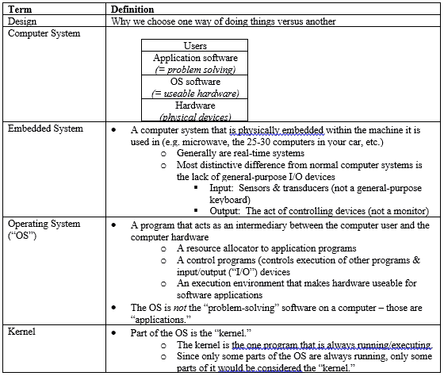

# 通过编写词汇表学习编程

> 原文：<https://dev.to/katiekodes/studying-programming-by-writing-glossaries-3oi4>

虽然我可以理解这句话，“我不知道这 30 个词是什么意思……我觉得要问所有这些词太多了，”但研究生院的一个学习技巧大大提高了我在这些情况下“假装直到我成功”的能力！

最近，我偶然发现了信息量惊人的茱莉亚·埃文斯(Julia Evans)，所以我搜索了播客，看看我是否能以一种对手腕友好的方式从她那里学到更多东西*(耶，洗衣服；嘘，编程)*。

事实证明，她是另一个“除了伤害你的手腕之外做点什么”的程序员，正如我在第 16 集“博客正在运输”中了解到的那样，这是大于代码的起源故事。

但那一集真正引起我注意的是这段对话:

> *   **Jessica:** "As a veteran, I might hear someone say something about joins in PostgreSQL, and I might hear one or two terms that I don't know."
> *   **Julia:** "Right."
> *   **Jessica:** "There are those I can inquire about. It's different to hear eight nouns I don't know. "
> *   **Julia:** "Exactly. Yes, I think this is something that often happens to junior students. They will say, "I don't know what these thirty words mean," like, "It's too much to ask of all of them."

数字 **30** 真的引起了我的注意，因为我以前来过这里，我处理它的方法帮助我“冒名顶替”进入了许多有趣的职业机会。

## Vocab 太多？写词汇表！

当我在研究生院学习“编程 101”和“操作系统 101”的时候，我发现对付令人困惑的材料的最简单的方法就是让**假装我负责为一本教科书编写一个词汇表**，收录每一个我觉得难以理解的单词。

当我在准备“OS 101”期中考试时，我意识到我平均每节课用了 **25** 个词汇*。*

 *这种方法是在我学习“编程 101”的时候出现的，当时我阅读了我们推荐的教科书的第一章，大卫·j·巴恩斯的对象优先于 Java&迈克尔·科林 *( [PDF 此处](https://www.bluej.org/objects-first/chapters/Barnes-Kolling-6e-FM.pdf) )* 。这是我在上课的第一周写的“词汇表”:

| 学期 | 定义 |
| --- | --- |
| 目标 | 一个类的具体实例
*(“我停在车库里的旧车”)*
从类定义中创建(学会写好)
命名:小写 |
| 班级 | 一个类别。

*【汽车】*
命名:首字母大写 |
| 情况 | “对象。”用于强调某一特定阶层的成员 |
| 方法 | "操作"
定义在一个类中，用在一个对象上
对象可以调用其他对象的方法 |
| 调用/呼叫 | 你对一个方法做了什么，与一个对象
(它通常会做一些事情)进行通信 |
| 签名 | 方法的头。提供有关该方法的信息 |
| 参数 | 方法可能需要的附加值 |
| (方法)(参数)(数据)类型 | 什么样的数据可以传递给一个定义在类 *(int，string…甚至“一个 ___ 类的对象”)*中的参数
 |
| (方法)(参数)(数据)名称 | 关于数据含义的提示 |
| (方法)返回类型 | 一个方法返回什么类型的数据
定义在一个类
*("void" = nothing)* |
| 田 | 其中对象在对象内部存储类中定义的数据
 |
| (对象)(字段)(数据)类型 | 什么样的数据可以存储在类中定义的字段
中 |
| 状态 | 一个对象的所有(字段)数据值 |
| 源代码 | 定义一个类有哪些字段和方法，以及当一个方法被调用时会发生什么 |
| 汇编 | 介于保存源代码和用它创建对象之间 |

顺便说一下，《Objects First》是一本**优秀的**书——尤其是它的前几章——用来学习**面向对象编程**。它附带的 IDE BlueJ 确实有助于强化这些概念。

我可能误解了背景故事，但我相信 BlueJ 和 Objects First 是为中学生和高中生设计的，有点像 Scratch 是为孩子设计的，在我看来，它有着相同的“啊哈！”效果如同刮痕。

*(为了证明 Scratch 对成年人有好处，请看[哈佛的 CS 101 系列](https://www.youtube.com/watch?v=5azaK2cBKGw&list=PLhQjrBD2T382eX9-tF75Wa4lmlC7sxNDH)——它完全是从教 18-22 岁的学生开始的，这些学生以他们用 Scratch 跟随复杂材料的能力而闻名。从孩子的工具中学习永远不会太老。)*

我在 OS 101 中的笔记在 Markdown 中格式不太好，所以这里有一张第一周的一些词汇的截图:

## 职业影响

我能理解这种“对所有人都问得太多”的情绪*(这是在播客中说的，作为向那些**几乎没有**比你知道得多的人学习的极好建议的一部分，所以你一次只需要处理几个新单词)*。

另一方面，当你一次被 30 个单词搞得焦头烂额时，如果你有**任何**机会把它们都录下来，以后再研究它们，**就这么做吧**！！

我无法告诉你能够向同事询问系统架构问题对我有多大帮助。

### 增加协作

我通常不为网站*编程(这个博客的顶部导航花了我一周的时间，我仍然没有设法安装标签云)*，但是当我想问我在 web 团队的同事，他们的一个项目可能如何影响流入我编写代码的数据库的数据时，它**帮助**知道 REST 和 SOAP 是在互联网和[HTTP](https://en.wikipedia.org/wiki/Hypertext_Transfer_Protocol)T8】传输数据期间**组织信息的方式。**

我不断地研究和记忆我遇到的每一组“30 个令人困惑的术语”，这对我在“商业用户”和“技术专家”之间转换的能力至关重要

例如，我给一位电力企业用户写了一封电子邮件，揭秘了他们听说正在为 CMS+CRM 开发的“API ”:

> 嗨 __，
> 
> 如果你好奇的话，这是这个“API”的技术架构。
> 
> 你的“XYZZY”系统由三个重要的软件组成，它们总是在地下室的电脑上运行:
> 
> 1.  “数据库管理系统”软件
>     *   这就是我们的报告编写软件和 ETL 软件运行查询的对象，我一直称之为“后端”
>     *   这是我偶尔发送给我们的 DBA 的“SQL”脚本，以便直接修改数据库的内容
> 2.  “网络服务器”软件
>     *   这是说，“谁在那里？!"当网络浏览器响起“咚咚！”对于“xyzzysys.yourwebsite.com”上托管的任何内容。-它可以读取和写入软件#1(数据库)。-它充当您的管理和面向客户的“前端”
> 3.  另一个“网络服务器”软件*(或者可能和#2 一样...TBD)*——新！
>     *   这是什么会说，“谁在那里？!"当我们新的 CMS 软件响起时，“咚咚咚！”对于“xyzzynew.yourwebsite.com”上托管的任何内容。-它可以读取和写入软件#1(数据库)。-它将充当“我们的 web 开发团队的 API ”,以便他们可以构建其他包含来自 XYZZY 数据库的数据的网站。
> 
> 现在我知道了——耶。

我之所以能够写这篇翻译，是因为我能够把 web / server 技术说得足够好，足以询问 web 团队的主管发生了什么，尽管我还不能编写一个健壮、安全的 API 或管理一个公司网站。

### 实际冒名顶替，不征

工作中的非 web 程序员经常高估我的 web 技能，因为当我向我们的 web 团队提问时，我会轻松地抛出 web 词汇。

我有过两个*(非网络团队)*经理，他们认为我知道的足够多，可以在我们的网络团队中工作。

那不是“冒名顶替综合症”…那只是事实😲…🤣🤣🤣*(“嗯，谢谢但是不用了！顶端导航。20 行代码。40 个小时。)*

但是澄清事实并不难，我向你保证:

把球扔进游泳池的深水区很有趣。*